# 個別の値ディメンションのカウント


このユースケースでは、2023年1月に報告された製品名の数を明確に取得する必要があります。

+++ Customer Journey Analytics

製品名の異なる数を報告するには、**[!UICONTROL タイトル]** `Product Name (Count Distinct)`と&#x200B;**[!UICONTROL 外部Id]** `product_name_count_distinct`を含む計算指標をCustomer Journey Analyticsで設定します。

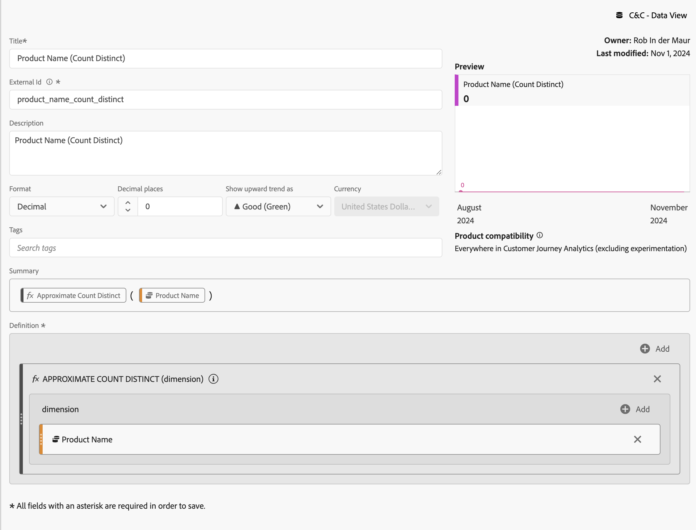

次に、この指標を使用例の例&#x200B;**[!UICONTROL 個別のDimension値をカウント]** パネルで使用できます。

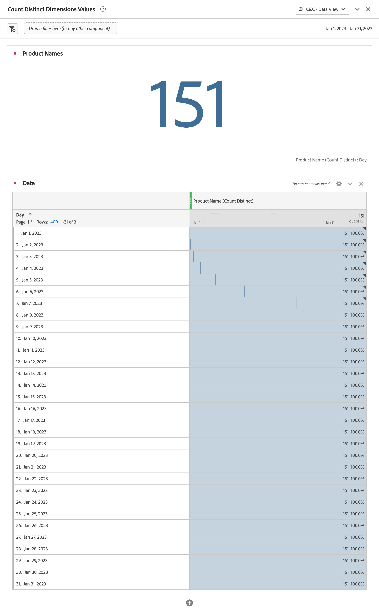

+++

+++ BI ツール

>[!PREREQUISITES]
>
>接続が成功したことを[検証し、データビューを一覧表示でき、このユースケースを試すBI ツールにデータビュー](connect-and-validate.md)を使用していることを確認します。
>

>[!BEGINTABS]

>[!TAB Power BI デスクトップ ]

1. 日付範囲がすべてのビジュアライゼーションに適用されるようにするには、**[!UICONTROL daterangeday]**&#x200B;を&#x200B;**[!UICONTROL データ]** ペインからドラッグ&amp;ドロップして、このページの&#x200B;**[!UICONTROL フィルター]**&#x200B;に移動します。
   1. このページの&#x200B;**[!UICONTROL フィルター]**&#x200B;から&#x200B;**[!UICONTROL daterangeday is （All）]**&#x200B;を選択します。
   1. **[!UICONTROL 詳細フィルタリング]**&#x200B;を&#x200B;**[!UICONTROL フィルタータイプ]**&#x200B;として選択します。
   1. 値&#x200B;]****[!UICONTROL &#x200B;が&#x200B;]**`1/1/2023`**[!UICONTROL &#x200B;および&#x200B;]****[!UICONTROL &#x200B;が&#x200B;]**`2/1/2023`より前の場合に、**[!UICONTROL &#x200B;項目を表示するようにフィルターを定義します。
   1. 「**[!UICONTROL フィルターを適用]**」を選択します。

1. **[!UICONTROL データ]** ペインで、次の操作を行います。
   1. **[!UICONTROL datarangeday]**&#x200B;を選択します。
   1. Customer Journey Analyticsで定義された計算指標である&#x200B;**[!UICONTROL sum cm_product_name_count_distinct]**&#x200B;を選択します。

1. 縦棒グラフを表に変更するには、グラフが選択されていることを確認し、**[!UICONTROL ビジュアライゼーション]** ペインから&#x200B;**[!UICONTROL 表]**&#x200B;を選択します。

   Power BI デスクトップは以下のようになります。

   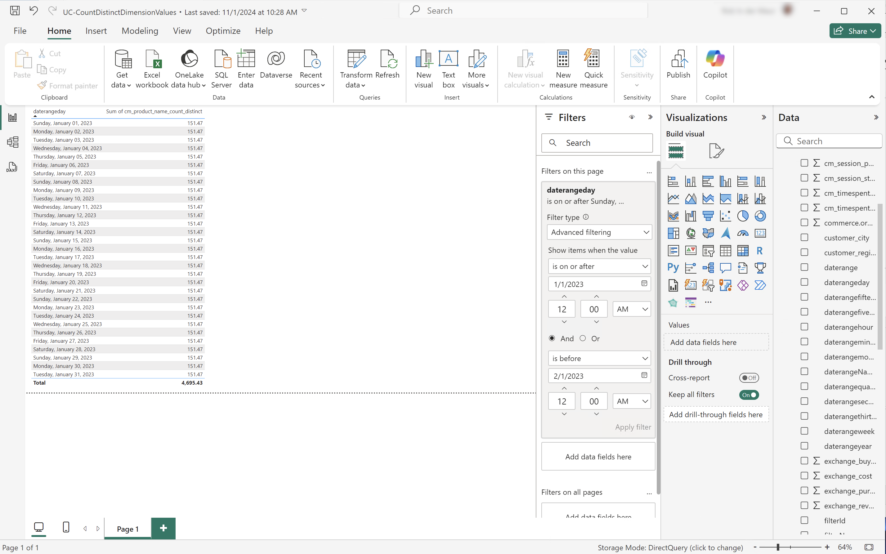

1. テーブルのビジュアライゼーションを選択します。 コンテキストメニューから、**[!UICONTROL Copy]** > **[!UICONTROL Copy visual]**&#x200B;を選択します。
1. **[!UICONTROL ctrl-v]**&#x200B;を使用してビジュアライゼーションを貼り付けます。 ビジュアライゼーションの正確なコピーが元のコピーと重なります。 レポート領域の右に移動します。
1. コピーしたビジュアライゼーションをテーブルからカードに変更するには、**[!UICONTROL ビジュアライゼーション]**&#x200B;から&#x200B;**[!UICONTROL カード]**&#x200B;を選択します。

   Power BI デスクトップは以下のようになります。

   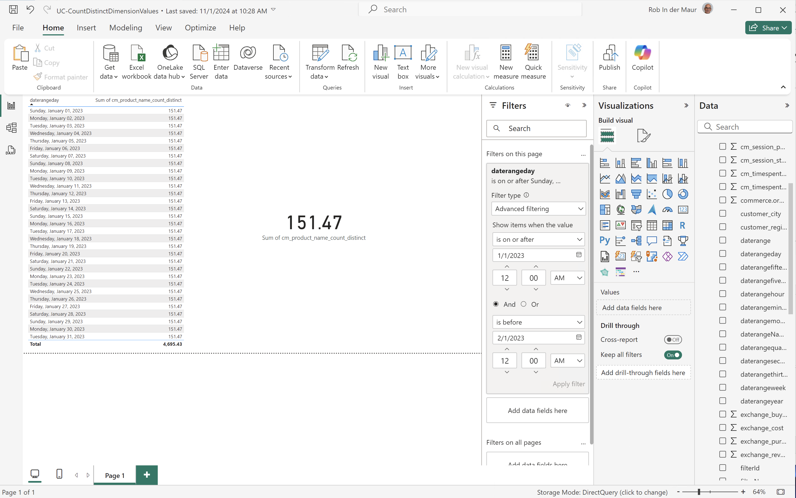

または、Power BIのcount distinct機能を使用することもできます。

1. **[!UICONTROL product_name]** ディメンションを選択します。
1. **[!UICONTROL 列]**&#x200B;の&#x200B;**[!UICONTROL product_name]** ディメンションに&#x200B;**[!UICONTROL Count （Distinct）]**&#x200B;関数を適用します。

   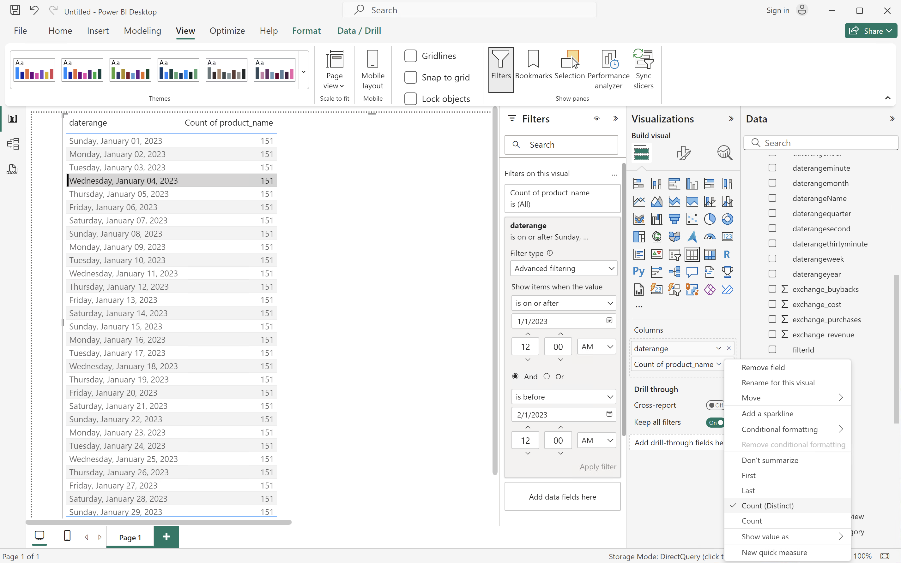


>[!TAB Tableau Desktop]

1. 下部の「**[!UICONTROL シート 1]**」タブを選択して、**[!UICONTROL データソース]**&#x200B;から切り替えます。 **[!UICONTROL シート 1]** ビューで：
   1. **[!UICONTROL Data]** ペインの&#x200B;**[!UICONTROL Tables]** リストから&#x200B;**[!UICONTROL Daterange]** エントリをドラッグし、エントリを&#x200B;**[!UICONTROL Filters]** シェルフにドロップします。
   1. **[!UICONTROL フィルターフィールド \[Daterange\]]** ダイアログで、**[!UICONTROL 日付の範囲]**&#x200B;を選択し、**[!UICONTROL 次>]**&#x200B;を選択します。
   1. **[!UICONTROL フィルター\[Daterange\]]** ダイアログで、**[!UICONTROL 日付の範囲]**&#x200B;を選択し、`01/01/2023` ～ `31/1/2023`を選択します。 **[!UICONTROL 適用]**&#x200B;と&#x200B;**[!UICONTROL OK]**&#x200B;を選択します。
   1. **[!UICONTROL Cm製品名の個数]**&#x200B;を&#x200B;**[!UICONTROL 行]**&#x200B;にドラッグします。 値が&#x200B;**[!UICONTROL SUM （Cm Product Name Count Distinct）]**&#x200B;に変更されます。 このフィールドは、Customer Journey Analyticsで定義した計算指標です。
   1. **[!UICONTROL Daterangeday]**&#x200B;をドラッグし、**[!UICONTROL 列]**&#x200B;の横にドロップします。 **[!UICONTROL Daterangeday]**&#x200B;を選択し、ドロップダウンメニューから&#x200B;**[!UICONTROL Day]**&#x200B;を選択します。
   1. 行のビジュアライゼーションをテーブルに変更するには、**[!UICONTROL 自分を表示]**&#x200B;から&#x200B;**[!UICONTROL テキストテーブル]**&#x200B;を選択します。
   1. ツールバーから「**[!UICONTROL 行と列を入れ替え]**」を選択します。
   1. 「**[!UICONTROL フィット]**」ドロップダウンメニューから「**[!UICONTROL フィット幅]**」を選択します。

      Tableau デスクトップは以下のようになります。

      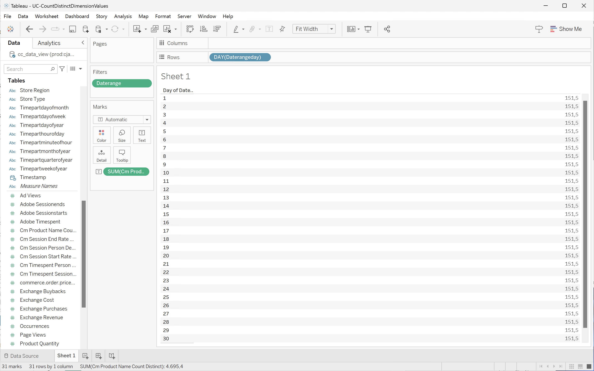

1. 「**[!UICONTROL シート 1]**」タブのコンテキストメニューから「**[!UICONTROL 複製]**」を選択して、2番目のシートを作成します。
1. 「**[!UICONTROL シート 1]**」タブのコンテキストメニューから「**[!UICONTROL 名前を変更]**」を選択して、シートの名前を`Data`に変更します。
1. 「**[!UICONTROL シート 1 （2）]**」タブのコンテキストメニューから「**[!UICONTROL 名前を変更]**」を選択して、シートの名前を`Card`に変更します。

1. **[!UICONTROL Card]** ビューが選択されていることを確認します。
1. **[!UICONTROL DAY （Daterangeday）]**&#x200B;を選択し、ドロップダウンメニューから&#x200B;**[!UICONTROL 月]**&#x200B;を選択します。 値が&#x200B;**[!UICONTROL MONTH （Daterangeday）]**&#x200B;に変更されます。
1. **[!UICONTROL Marks]**&#x200B;で&#x200B;**[!UICONTROL SUM （Cm Product Name Count Distinct）]**&#x200B;を選択し、ドロップダウンメニューから&#x200B;**[!UICONTROL Format]**&#x200B;を選択します。
1. フォントサイズを変更するには、**[!UICONTROL Format SUM （CM Product Name Count Distinct）]** ペインで、**[!UICONTROL Default]**&#x200B;内の&#x200B;**[!UICONTROL Font]**&#x200B;を選択し、フォントサイズとして&#x200B;**[!UICONTROL 72]**&#x200B;を選択します。
1. 番号を整列させるには、**[!UICONTROL 整列]**&#x200B;の横にある&#x200B;**[!UICONTROL 自動]**&#x200B;を選択し、**[!UICONTROL 水平]**&#x200B;を中央揃えに設定します。
1. 整数を使用するには、**[!UICONTROL Numbers]**&#x200B;の横にある&#x200B;**[!UICONTROL 123.456]**&#x200B;を選択し、**[!UICONTROL Number （Custom）]**&#x200B;を選択します。 **[!UICONTROL 小数点以下桁]**&#x200B;を`0`に設定します。

   Tableau デスクトップは以下のようになります。

   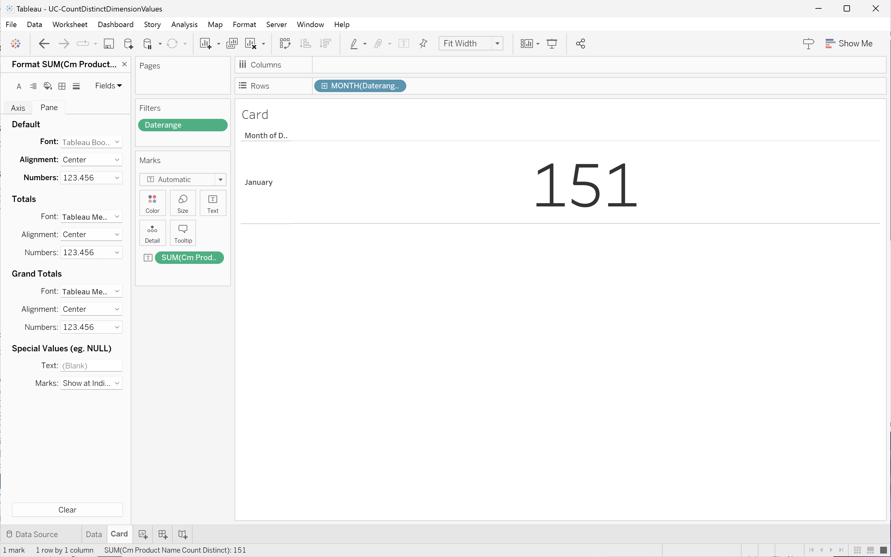

1. 「**[!UICONTROL 新しいダッシュボード]**」タブボタン（下部）を選択して、新しい&#x200B;**[!UICONTROL ダッシュボード 1]** ビューを作成します。 **[!UICONTROL ダッシュボード 1]** ビューで、次の操作を行います。
   1. **[!UICONTROL カード]** シートを&#x200B;**[!UICONTROL シート]** シェルフから&#x200B;**[!UICONTROL ダッシュボード 1]** ビューにドラッグ&amp;ドロップします。このビューには、*シートをここにドロップ*&#x200B;します。
   1. **[!UICONTROL ダッシュボード 1]** ビューの&#x200B;**[!UICONTROL Card]** シートの下にある&#x200B;**[!UICONTROL Sheets]** シェルフから&#x200B;**[!UICONTROL Data]** シートをドラッグ&amp;ドロップします。

   **[!UICONTROL ダッシュボード 1]** ビューは次のようになります。

   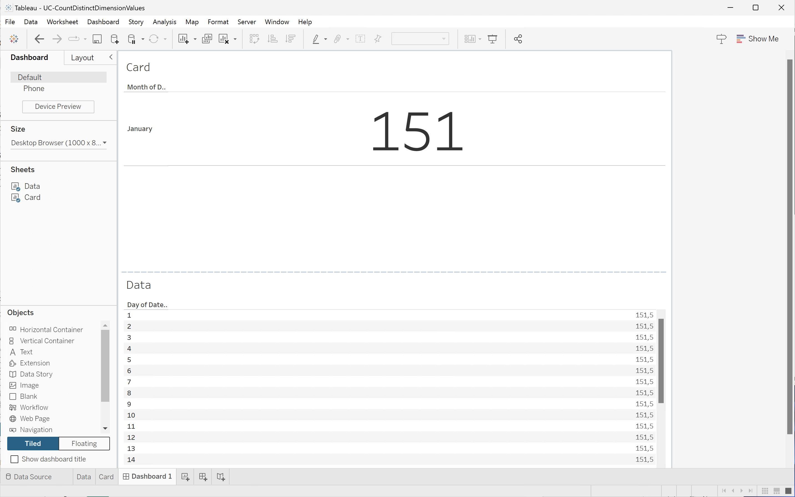


または、Tableau Desktopのcount distinct機能を使用することもできます。

1. **[!UICONTROL Cm製品名数]**&#x200B;ではなく、**[!UICONTROL 製品名]**&#x200B;を使用してください。
1. **[!UICONTROL Measure]** > **[!UICONTROL Count （Distinct）]**&#x200B;を&#x200B;**[!UICONTROL Marks]**&#x200B;の&#x200B;**[!UICONTROL 製品名]**&#x200B;に適用します。

   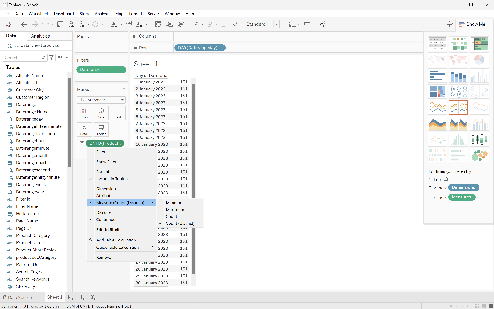


>[!TAB Looker]

1. Lookerの&#x200B;**[!UICONTROL Explore]** インターフェイスで、クリーンな設定が行われていることを確認します。 そうでない場合は、 **[!UICONTROL フィールドとフィルターの削除]**&#x200B;を選択します。
1. 「**[!UICONTROL フィルター]**」の下の「**[!UICONTROL + フィルター]**」を選択します。
1. **[!UICONTROL フィルターを追加]** ダイアログ：
   1. **[!UICONTROL ‣ Cc データビュー]**&#x200B;を選択
   1. フィールドのリストから、**[!UICONTROL }‣ Daterange Date]**、次に&#x200B;**[!UICONTROL Daterange Date]**を選択します。
      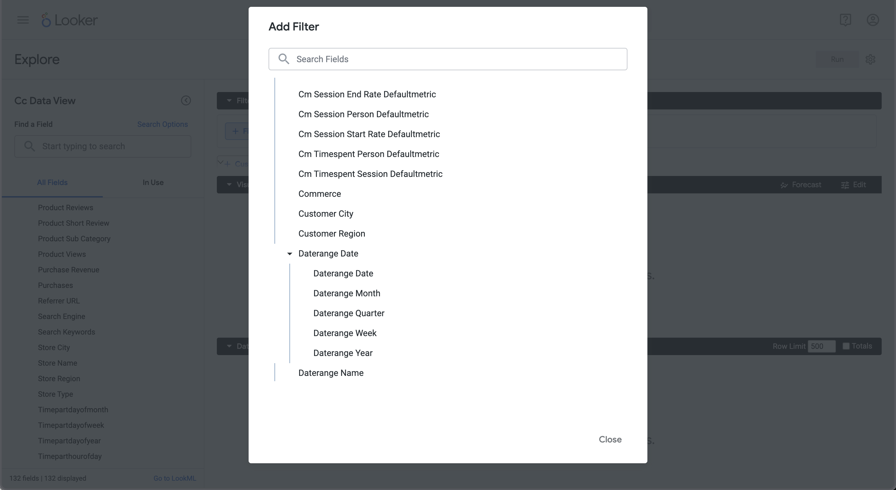
1. **[!UICONTROL Cc データビューの日付変更日]** フィルターを&#x200B;**[!UICONTROL が範囲]** **[!UICONTROL 2023/01/01]** **[!UICONTROL から（前）]** **[!UICONTROL 2023/02/01]**&#x200B;に指定します。
1. 左側のパネルの&#x200B;**[!UICONTROL ‣ Cc データビュー]** セクションから：
   1. **[!UICONTROL Daterange Date]**、次に&#x200B;**[!UICONTROL Date]**&#x200B;を選択します。
   1. **[!UICONTROL 製品名]**&#x200B;の&#x200B;**詳細** コンテキストメニューから&#x200B;**[!UICONTROL 集約‣個数{1⋮を選択します。]**
      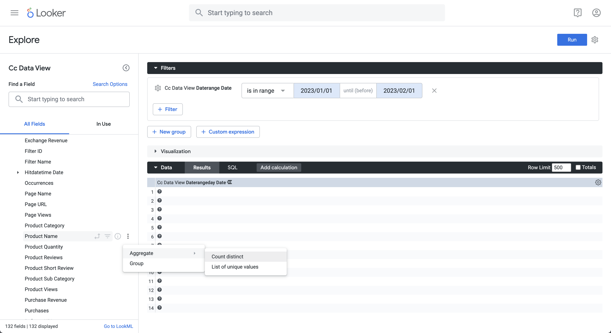
1. **[!UICONTROL 実行]**&#x200B;を選択します。
1. **[!UICONTROL }‣ビジュアライゼーション]**&#x200B;を選択し、ツールバーから6︎⃣を選択して、単一の値ビジュアライゼーションを表示します。

次のようなビジュアライゼーションと表が表示されます。

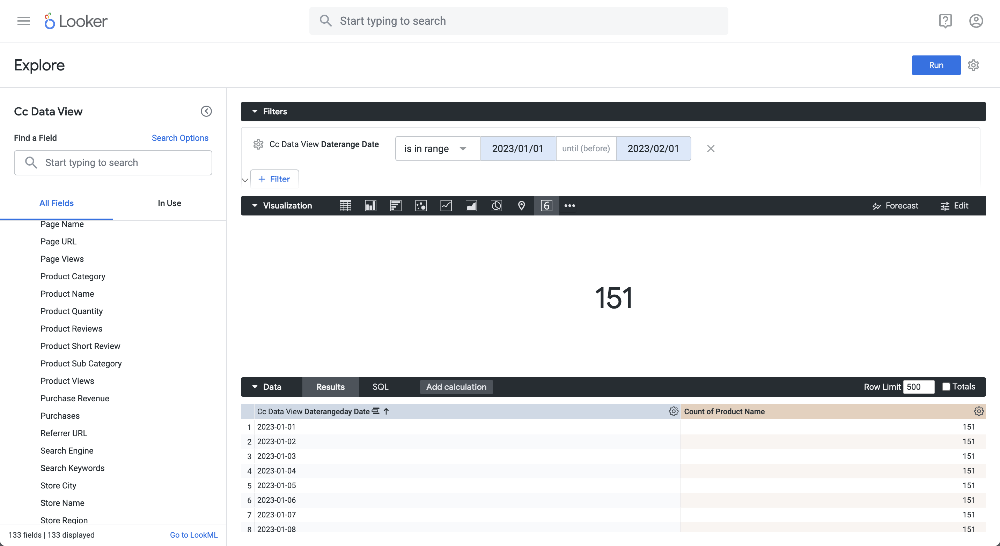


>[!TAB Jupyter Notebook]

1. 新しいセルに次のステートメントを入力します。

   ```
   data = %sql SELECT COUNT(DISTINCT(product_name)) AS `Product Name` \
      FROM cc_data_view \
      WHERE daterange BETWEEN '2023-01-01' AND '2023-02-01';
   display(data)
   ```

1. セルを実行します。 以下のスクリーンショットのような出力が表示されます。

   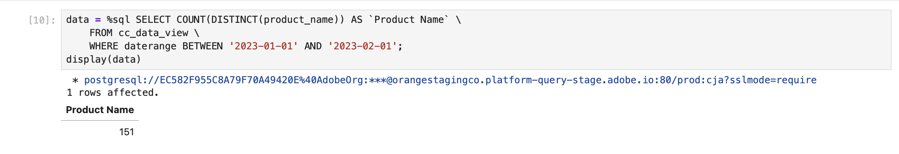


>[!TAB RStudio]

1. 新しいチャンクに次のコードブロックを入力します。

   ```R
   ## Count Distinct
   df <- dv %>%
      filter(daterange >= "2023-01-01" & daterange < "2023-02-01") %>%
      summarise(product_name_count_distinct = n_distinct(product_name))
   print(df)
   ```

1. チャンクを実行します。 以下のスクリーンショットのような出力が表示されます。

   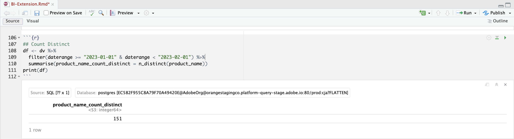


>[!ENDTABS]

+++
