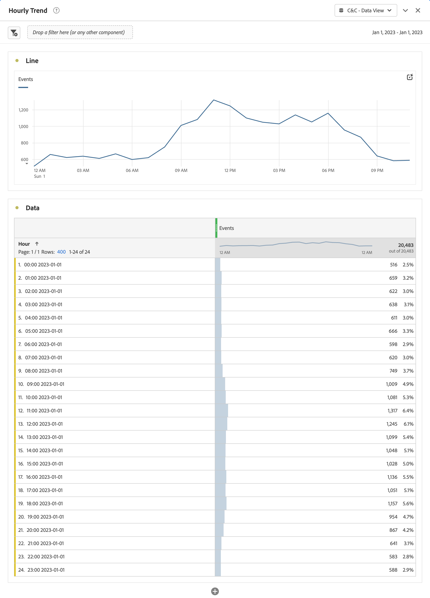
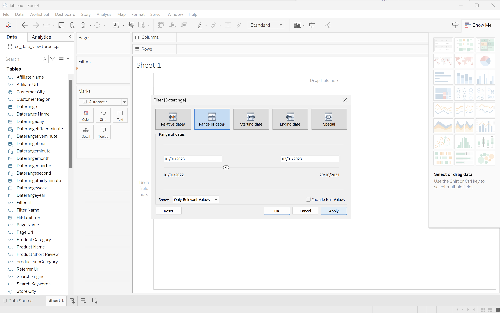
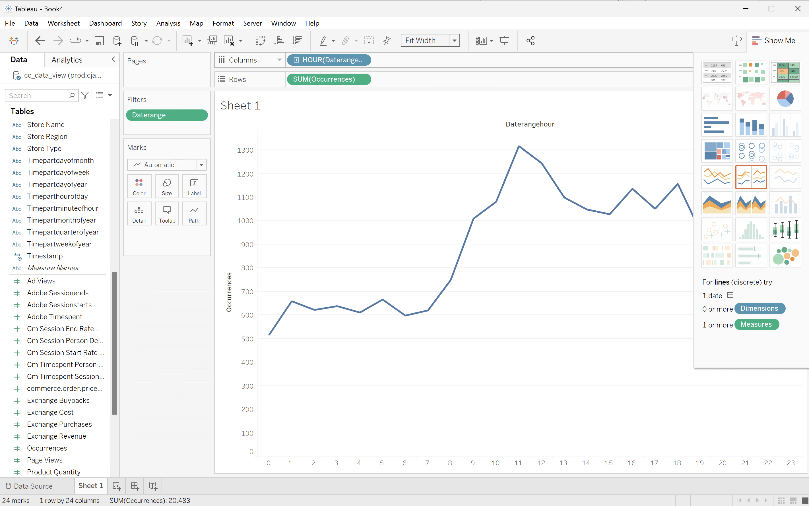
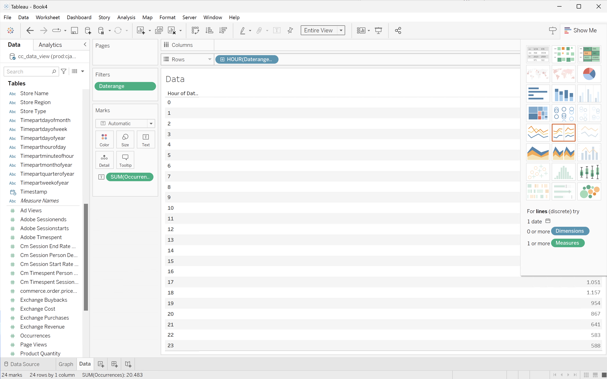
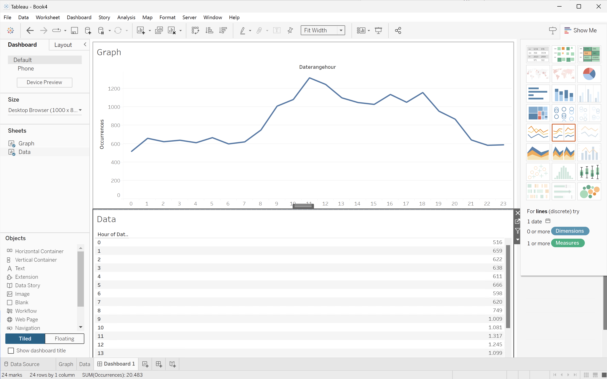
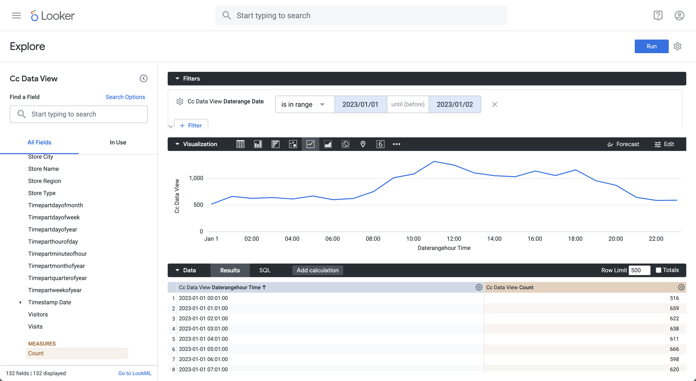
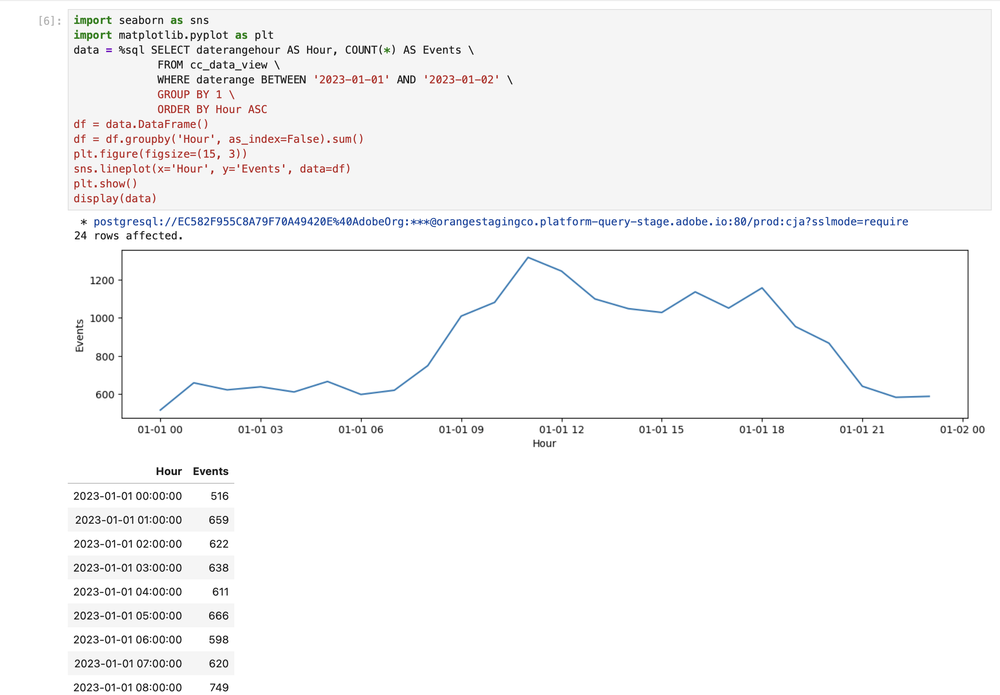
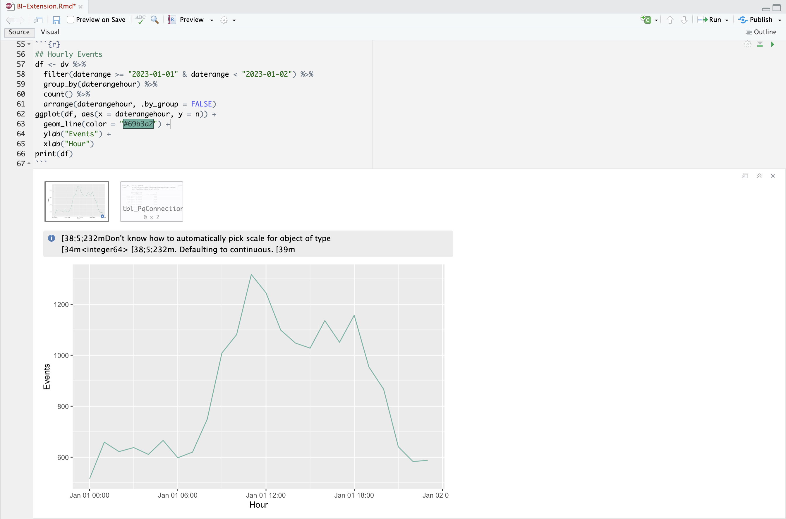

# 時間別トレンド


## 時間別トレンド

この使用例では、2023年1月1日の発生回数（イベント）の時間別トレンドを示すテーブルと簡単な行のビジュアライゼーションを表示します。

+++ Customer Journey Analytics

使用例の&#x200B;**[!UICONTROL 時間別トレンド]** パネルの例：



+++

+++ BI ツール

>[!PREREQUISITES]
>
>接続が成功したことを[検証し、データビューを一覧表示でき、このユースケースを試すBI ツールにデータビュー](connect-and-validate.md)を使用していることを確認します。
>

>[!BEGINTABS]

>[!TAB Power BI デスクトップ ]

 Power BIは&#x200B;**not**&#x200B;が日時フィールドの処理方法を理解していないため、**[!UICONTROL daterangehour]**&#x200B;や&#x200B;**[!UICONTROL daterangeminute]**&#x200B;などのディメンションはサポートされていません。

>[!TAB Tableau Desktop]

1. 下部の「**[!UICONTROL シート 1]**」タブを選択して、**[!UICONTROL データソース]**&#x200B;から切り替えます。 **[!UICONTROL シート 1]** ビューで：
   1. **[!UICONTROL Data]** ペインの&#x200B;**[!UICONTROL Tables]** リストから&#x200B;**[!UICONTROL Daterange]** エントリをドラッグし、エントリを&#x200B;**[!UICONTROL Filters]** シェルフにドロップします。
   1. **[!UICONTROL フィルターフィールド \[Daterange\]]** ダイアログで、**[!UICONTROL 日付の範囲]**&#x200B;を選択し、**[!UICONTROL 次>]**&#x200B;を選択します。
   1. **[!UICONTROL フィルター\[Daterange\]]** ダイアログで、**[!UICONTROL 日付の範囲]**&#x200B;を選択し、`01/01/2023` ～ `02/01/2023`の期間を指定します。

      

   1. **[!UICONTROL Data]** ペインの&#x200B;**[!UICONTROL Tables]** リストから&#x200B;**[!UICONTROL Daterangehour]**&#x200B;をドラッグ&amp;ドロップし、**[!UICONTROL 列]**&#x200B;の横にあるフィールドにエントリをドロップします。
      * **[!UICONTROL Daterangeday]** ドロップダウンメニューから&#x200B;**[!UICONTROL More]** > **[!UICONTROL Hours]**&#x200B;を選択して、値を&#x200B;**[!UICONTROL HOUR （Daterangeday）]**&#x200B;に更新します。
   1. **[!UICONTROL データ]** ペインの&#x200B;**[!UICONTROL テーブル （*メジャー名*）]** リストから&#x200B;**[!UICONTROL 発生回数]**&#x200B;をドラッグ&amp;ドロップし、**[!UICONTROL 行]**&#x200B;の横にあるフィールドにエントリをドロップします。 値は自動的に&#x200B;**[!UICONTROL SUM （Occurrences）]**&#x200B;に変換されます。
   1. ツールバーの「**[!UICONTROL フィット]**」ドロップダウンメニューから「**[!UICONTROL 標準]**」を「**[!UICONTROL ビュー全体]**」に変更します。

      Tableau デスクトップは以下のようになります。

      

1. 「**[!UICONTROL シート 1]**」タブのコンテキストメニューから「**[!UICONTROL 複製]**」を選択して、2番目のシートを作成します。
1. 「**[!UICONTROL シート 1]**」タブのコンテキストメニューから「**[!UICONTROL 名前を変更]**」を選択して、シートの名前を`Graph`に変更します。
1. 「**[!UICONTROL シート 1 （2）]**」タブのコンテキストメニューから「**[!UICONTROL 名前を変更]**」を選択して、シートの名前を`Data`に変更します。
1. **[!UICONTROL Data]** シートが選択されていることを確認します。 **[!UICONTROL データ]** ビューで：
   1. 右上の「**[!UICONTROL 自分を表示]**」を選択し、「**[!UICONTROL テキストテーブル]**」（左上のビジュアライゼーション）を選択して、データビューのコンテンツをテーブルに変更します。
   1. **[!UICONTROL HOUR （Daterangeday）]**&#x200B;を&#x200B;**[!UICONTROL 列]**&#x200B;から&#x200B;**[!UICONTROL 行]**&#x200B;にドラッグします。
   1. ツールバーの「**[!UICONTROL フィット]**」ドロップダウンメニューから「**[!UICONTROL 標準]**」を「**[!UICONTROL ビュー全体]**」に変更します。

      Tableau デスクトップは以下のようになります。

      

1. 「**[!UICONTROL 新しいダッシュボード]**」タブボタン（下部）を選択して、新しい&#x200B;**[!UICONTROL ダッシュボード 1]** ビューを作成します。 **[!UICONTROL ダッシュボード 1]** ビューで、次の操作を行います。
   1. **[!UICONTROL グラフ]** シートを&#x200B;**[!UICONTROL シート]** シェルフから&#x200B;**[!UICONTROL シートをここにドロップ]**&#x200B;する&#x200B;*ダッシュボード 1* ビューにドラッグ&amp;ドロップします。
   1. **[!UICONTROL グラフ]** シートの下の&#x200B;**[!UICONTROL シート]** シェルフから&#x200B;**[!UICONTROL データ]** シートを&#x200B;**[!UICONTROL ダッシュボード 1]** ビューにドラッグ&amp;ドロップします。
   1. ビューで&#x200B;**[!UICONTROL データ]** シートを選択し、**[!UICONTROL ビュー全体]**&#x200B;を&#x200B;**[!UICONTROL 幅を修正]**&#x200B;に変更します。

      **[!UICONTROL ダッシュボード 1]** ビューは次のようになります。

      


>[!TAB Looker]


1. Lookerの&#x200B;**[!UICONTROL Explore]** インターフェイスで、クリーンな設定が行われていることを確認します。 そうでない場合は、 **[!UICONTROL フィールドとフィルターの削除]**&#x200B;を選択します。
1. 「**[!UICONTROL フィルター]**」の下の「**[!UICONTROL + フィルター]**」を選択します。
1. **[!UICONTROL フィルターを追加]** ダイアログ：
   1. **[!UICONTROL ‣ Cc データビュー]**&#x200B;を選択
   1. フィールドのリストから、**[!UICONTROL &rbrace;‣ Daterange Date]**、次に&#x200B;**[!UICONTROL Daterange Date]**&#x200B;を選択します。
      
1. **[!UICONTROL Cc データビューの日付変更日]** フィルターを&#x200B;**[!UICONTROL が範囲]** **[!UICONTROL 2023/01/01]** **[!UICONTROL から（前）]** **[!UICONTROL 2023/01/02]**&#x200B;まで指定します。
1. 左側のパネルの「**[!UICONTROL Cc Data View]**」セクションから，
   1. **[!UICONTROL ディメンション]**&#x200B;のリストから&#x200B;**[!UICONTROL ‣Daterangehour Date]**、次に&#x200B;**[!UICONTROL Time]**&#x200B;を選択します。
   1. 左パネル（下部）の&#x200B;**[!UICONTROL 測定]**&#x200B;の下にある&#x200B;**[!UICONTROL カウント]**&#x200B;を選択します。
1. **[!UICONTROL 実行]**&#x200B;を選択します。
1. 行のビジュアライゼーションを表示するには、**[!UICONTROL ‣ ビジュアライゼーション]**&#x200B;を選択します。

次のようなビジュアライゼーションと表が表示されます。




>[!TAB Jupyter Notebook]

1. 新しいセルに次のステートメントを入力します。

   ```python
   import seaborn as sns
   import matplotlib.pyplot as plt
   data = %sql SELECT daterangehour AS Hour, COUNT(*) AS Events \
               FROM cc_data_view \
               WHERE daterange BETWEEN '2023-01-01' AND '2023-01-02' \
               GROUP BY 1 \
                ORDER BY Hour ASC
   df = data.DataFrame()
   df = df.groupby('Hour', as_index=False).sum()
   plt.figure(figsize=(15, 3))
   sns.lineplot(x='Hour', y='Events', data=df)
   plt.show()
   display(data)
   ```

1. セルを実行します。 以下のスクリーンショットのような出力が表示されます。

   


>[!TAB RStudio]

1. 新しいチャンクに次のコードブロックを入力します。

   ```R
   ## Hourly Events
   df <- dv %>%
      filter(daterange >= "2023-01-01" & daterange < "2023-01-02") %>%
      group_by(daterangehour) %>%
      count() %>%
      arrange(daterangehour, .by_group = FALSE)
   ggplot(df, aes(x = daterangehour, y = n)) +
      geom_line(color = "#69b3a2") +
      ylab("Events") +
      xlab("Hour")
   print(df)
   ```

1. チャンクを実行します。 以下のスクリーンショットのような出力が表示されます。

   

>[!ENDTABS]

+++
