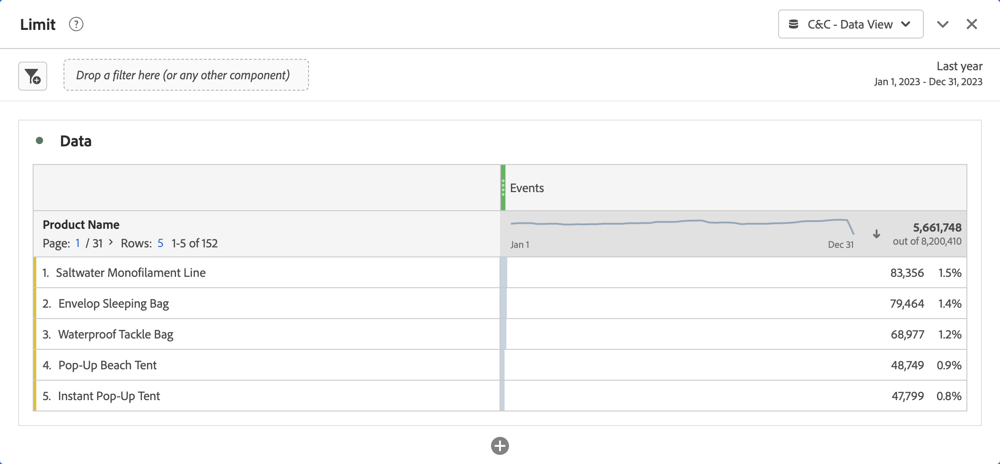
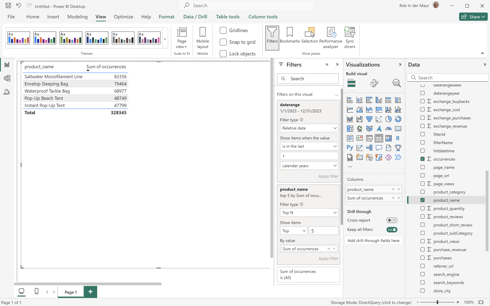
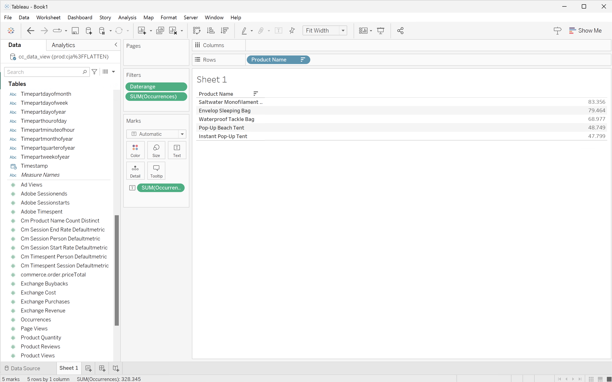
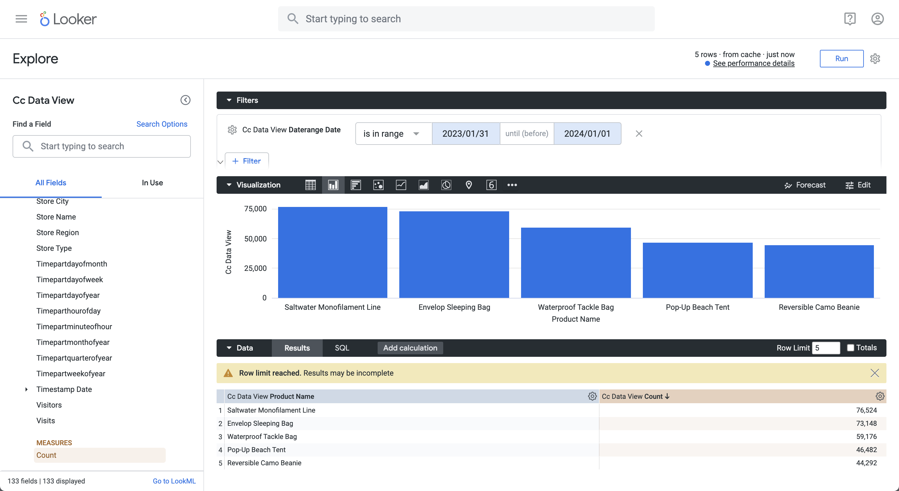
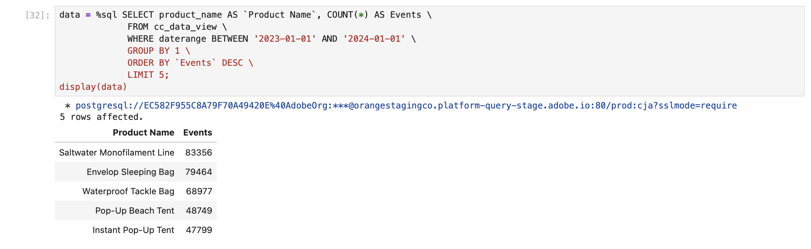
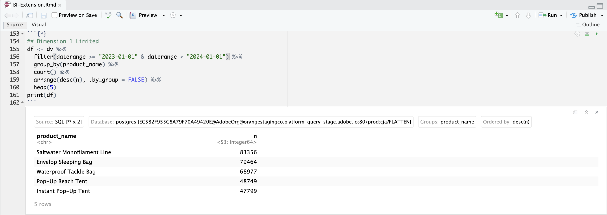

# 制限


このユースケースでは、2023年に発生した製品名の上位5件についてレポートする必要があります。

+++ Customer Journey Analytics

使用例の&#x200B;**[!UICONTROL Limit]** パネルの例：



+++

+++ BI ツール

>[!PREREQUISITES]
>
>接続が成功したことを[検証し、データビューを一覧表示でき、このユースケースを試すBI ツールにデータビュー](connect-and-validate.md)を使用していることを確認します。
>

>[!BEGINTABS]

>[!TAB Power BI デスクトップ ]

1. **[!UICONTROL データ]** ペインで、次の操作を行います。
   1. **[!UICONTROL daterange]**&#x200B;を選択します。
   1. **[!UICONTROL product_name]**&#x200B;を選択します。
   1. **[!UICONTROL 合計回数]**&#x200B;を選択します。

1. **[!UICONTROL フィルター]** ペインで、次の操作を行います。
   1. このビジュアル ]**の**[!UICONTROL  フィルターから&#x200B;**[!UICONTROL daterange is （All）]**&#x200B;を選択します。
   1. **[!UICONTROL 相対日付]**&#x200B;を&#x200B;**[!UICONTROL フィルタータイプ]**&#x200B;として選択します。
   1. 値&#x200B;]****[!UICONTROL &#x200B;が過去&#x200B;]**`1`**[!UICONTROL &#x200B;暦年&#x200B;]**の場合、フィルターを**[!UICONTROL &#x200B;項目を表示するように定義します。
   1. 「**[!UICONTROL フィルターを適用]**」を選択します。
   1. このビジュアル ]**の**[!UICONTROL  フィルターから&#x200B;**[!UICONTROL product_name is （All）]**&#x200B;を選択します。
   1. **[!UICONTROL 上位N]**&#x200B;を&#x200B;**[!UICONTROL フィルタータイプ]**&#x200B;として選択します。
   1. **[!UICONTROL 項目を表示]** **[!UICONTROL 上位]** `5` **[!UICONTROL を値]**&#x200B;で選択します。
   1. **[!UICONTROL データ]** ペインから&#x200B;**[!UICONTROL 合計回数]**&#x200B;をドラッグ&amp;ドロップし、**[!UICONTROL ここにデータフィールドを追加]**&#x200B;します。
   1. 「**[!UICONTROL フィルターを適用]**」を選択します。

1. ビジュアライゼーションペインで、次の操作を行います。
   * を選択して、列からデータレンジを削除します。

   Power BI デスクトップは以下のようになります。

   日付範囲名をフィルターに使用する

BI拡張機能を使用してPower BI Desktopで実行されるクエリに`limit`文が含まれていますが、想定されているものではありません。 上位5件に対する制限は、明示的な製品名の結果を使用してPower BI Desktopによって適用されます。

```sql
select "_"."product_name",
    "_"."a0"
from 
(
    select "rows"."product_name" as "product_name",
        sum("rows"."occurrences") as "a0"
    from 
    (
        select "_"."daterangeName",
            "_"."daterange",
            "_"."filterId",
            "_"."filterName",
            "_"."timestamp",
            "_"."affiliate_name",
            "_"."affiliate_url",
            "_"."commerce.order.priceTotal",
            "_"."customer_city",
            "_"."customer_region",
            "_"."daterangeday",
            "_"."daterangefifteenminute",
            "_"."daterangefiveminute",
            "_"."daterangehour",
            "_"."daterangeminute",
            "_"."daterangemonth",
            "_"."daterangequarter",
            "_"."daterangesecond",
            "_"."daterangethirtyminute",
            "_"."daterangeweek",
            "_"."daterangeyear",
            "_"."hitdatetime",
            "_"."page_name",
            "_"."page_url",
            "_"."product_category",
            "_"."product_name",
            "_"."product_short_review",
            "_"."product_subCategory",
            "_"."referrer_url",
            "_"."search_engine",
            "_"."search_keywords",
            "_"."store_city",
            "_"."store_name",
            "_"."store_region",
            "_"."store_type",
            "_"."timepartdayofmonth",
            "_"."timepartdayofweek",
            "_"."timepartdayofyear",
            "_"."timeparthourofday",
            "_"."timepartminuteofhour",
            "_"."timepartmonthofyear",
            "_"."timepartquarterofyear",
            "_"."timepartweekofyear",
            "_"."cm_session_end_rate_defaultmetric",
            "_"."cm_session_person_defaultmetric",
            "_"."cm_session_start_rate_defaultmetric",
            "_"."cm_timespent_person_defaultmetric",
            "_"."cm_timespent_session_defaultmetric",
            "_"."cm_product_name_count_distinct",
            "_"."ad_views",
            "_"."adobe_sessionends",
            "_"."adobe_sessionstarts",
            "_"."adobe_timespent",
            "_"."exchange_buybacks",
            "_"."exchange_cost",
            "_"."exchange_purchases",
            "_"."exchange_revenue",
            "_"."occurrences",
            "_"."page_views",
            "_"."product_quantity",
            "_"."product_reviews",
            "_"."product_views",
            "_"."purchase_revenue",
            "_"."purchases",
            "_"."visitors",
            "_"."visits"
        from "public"."cc_data_view" "_"
        where (("_"."product_name" in ('Saltwater Monofilament Line', 'Pop-Up Beach Tent', 'Instant Pop-Up Tent', 'Envelop Sleeping Bag', 'Waterproof Tackle Bag')) and "_"."daterange" < date '2024-01-01') and "_"."daterange" >= date '2023-01-01'
    ) "rows"
    group by "product_name"
) "_"
where not "_"."a0" is null
limit 1000001
```

>[!TAB Tableau Desktop]

1. 下部の「**[!UICONTROL シート 1]**」タブを選択して、**[!UICONTROL データソース]**&#x200B;から切り替えます。 **[!UICONTROL シート 1]** ビューで：
   1. **[!UICONTROL フィルター]** シェルフの&#x200B;**[!UICONTROL テーブル]** リストから&#x200B;**[!UICONTROL Daterange]** エントリをドラッグします。
   1. **[!UICONTROL フィルターフィールド \[Daterange\]]** ダイアログで、**[!UICONTROL 日付の範囲]**&#x200B;を選択し、**[!UICONTROL 次>]**&#x200B;を選択します。
   1. **[!UICONTROL フィルター\[Daterange\]]** ダイアログで、**[!UICONTROL 相対日付]**&#x200B;を選択し、**[!UICONTROL 年]**&#x200B;を選択し、**[!UICONTROL 前年]**&#x200B;を選択します。 **[!UICONTROL 適用]**&#x200B;と&#x200B;**[!UICONTROL OK]**&#x200B;を選択します。
   1. **[!UICONTROL 製品名]**&#x200B;を&#x200B;**[!UICONTROL 表]** リストから&#x200B;**[!UICONTROL 行]**&#x200B;にドラッグします。
   1. **[!UICONTROL テーブル]** リストから&#x200B;**[!UICONTROL 発生回数]** エントリをドラッグし、**[!UICONTROL 列]**&#x200B;の横にあるフィールドにエントリをドロップします。 値が&#x200B;**[!UICONTROL SUM （Occurrences）]**&#x200B;に変更されます。
   1. **[!UICONTROL 自分を表示]**&#x200B;から&#x200B;**[!UICONTROL テキストテーブル]**&#x200B;を選択します。
   1. 「**[!UICONTROL フィット]**」ドロップダウンメニューから「**[!UICONTROL フィット幅]**」を選択します。
   1. **[!UICONTROL 行]**&#x200B;の&#x200B;**[!UICONTROL 製品名]**&#x200B;を選択します。 ドロップダウンメニューから「**[!UICONTROL フィルター]**」を選択します。
      1. **[!UICONTROL フィルター\[製品名\]]** ダイアログで、「**[!UICONTROL トップ]**」タブを選択します。
      1. **[!UICONTROL 件のフィールドを選択：]** **[!UICONTROL 上位]** `5` **[!UICONTROL 件の項目]** **[!UICONTROL 合計]**。
      1. **[!UICONTROL 適用]**&#x200B;と&#x200B;**[!UICONTROL OK]**&#x200B;を選択します。

          テーブルが消えることに気付きました。 上位5つの製品名を出現順に選択すると、このフィルターを使用して&#x200B;**not**&#x200B;が正しく機能します。
      1. **[!UICONTROL フィルター]** シェルフで&#x200B;**[!UICONTROL 製品名]**&#x200B;を選択し、ドロップダウンメニューから&#x200B;**[!UICONTROL 削除]**&#x200B;を選択します。 テーブルが再び表示されます。
   1. **[!UICONTROL Marks]** シェルフの&#x200B;**[!UICONTROL SUM （Occurrences）]**&#x200B;を選択します。 ドロップダウンメニューから「**[!UICONTROL フィルター]**」を選択します。
      1. **[!UICONTROL フィルター\[発生件数\]]** ダイアログで、**[!UICONTROL 少なくとも]**&#x200B;を選択します。
      1. 値として`47.799`を入力します。 この値を指定すると、上位5つの項目のみが表に表示されます。 **[!UICONTROL 適用]**&#x200B;と&#x200B;**[!UICONTROL OK]**&#x200B;を選択します。

         Tableau デスクトップは以下のようになります。

         

上に示すように、Tableau Desktopで実行されるこのクエリは、製品名に上位5件の発生回数フィルターを定義する際に失敗します。

```sql
SELECT CAST("cc_data_view"."product_name" AS TEXT) AS "product_name",
  SUM("cc_data_view"."occurrences") AS "sum:occurrences:ok"
FROM "public"."cc_data_view" "cc_data_view"
  INNER JOIN (
  SELECT CAST("cc_data_view"."product_name" AS TEXT) AS "product_name",
    SUM("cc_data_view"."occurrences") AS "$__alias__0"
  FROM "public"."cc_data_view" "cc_data_view"
  GROUP BY 1
  ORDER BY 2 DESC,
    1 ASC
  LIMIT 5
) "t0" ON (CAST("cc_data_view"."product_name" AS TEXT) = "t0"."product_name")
WHERE (("cc_data_view"."daterange" >= (TIMESTAMP '2023-01-01 00:00:00.000')) AND ("cc_data_view"."daterange" < (TIMESTAMP '2024-01-01 00:00:00.000')))
GROUP BY 1
```

Tableau Desktopで実行されるクエリは、発生時に上位5個のフィルターを定義する際に次のように表示されます。 この制限は、クエリおよび適用されたクライアントサイドには表示されません。

```sql
SELECT CAST("cc_data_view"."product_name" AS TEXT) AS "product_name",
  SUM("cc_data_view"."occurrences") AS "sum:occurrences:ok"
FROM "public"."cc_data_view" "cc_data_view"
WHERE (("cc_data_view"."daterange" >= (TIMESTAMP '2023-01-01 00:00:00.000')) AND ("cc_data_view"."daterange" < (TIMESTAMP '2024-01-01 00:00:00.000')))
GROUP BY 1
```

>[!TAB Looker]

1. Lookerの&#x200B;**[!UICONTROL Explore]** インターフェイスで、接続を更新します。 「 **[!UICONTROL キャッシュをクリアして更新]**」を選択します。
1. Lookerの&#x200B;**[!UICONTROL Explore]** インターフェイスで、クリーンな設定が行われていることを確認します。 そうでない場合は、 **[!UICONTROL フィールドとフィルターの削除]**&#x200B;を選択します。
1. 「**[!UICONTROL フィルター]**」の下の「**[!UICONTROL + フィルター]**」を選択します。
1. **[!UICONTROL フィルターを追加]** ダイアログ：
   1. **[!UICONTROL ‣ Cc データビュー]**&#x200B;を選択
   1. フィールドのリストから、**[!UICONTROL }‣ Daterange Date]**、次に&#x200B;**[!UICONTROL Daterange Date]**を選択します。
      
1. **[!UICONTROL Cc データビューの日付変更日]** フィルターを&#x200B;**[!UICONTROL が範囲]** **[!UICONTROL 2023/01/01]** **[!UICONTROL から（前）]** **[!UICONTROL 2024/01/01]**&#x200B;に指定します。
1. 左側のパネルの&#x200B;**[!UICONTROL ‣ Cc データビュー]** セクションから：
   1. **[!UICONTROL 製品名]**&#x200B;を選択します。
   1. 左パネル（下部）の&#x200B;**[!UICONTROL 測定]**&#x200B;の下にある&#x200B;**[!UICONTROL カウント]**&#x200B;を選択します。
1. **[!UICONTROL 購入収益]**&#x200B;列で&#x200B;**[!UICONTROL ↓]** （**[!UICONTROL 降順、並べ替え順序：1]**）を選択していることを確認してください。
1. **[!UICONTROL 購入収益]**&#x200B;列で&#x200B;**[!UICONTROL ↓]** （**[!UICONTROL 降順、並べ替え順序：1]**）を選択していることを確認してください。
1. **[!UICONTROL 実行]**&#x200B;を選択します。
1. 「**[!UICONTROL 」‣ビジュアライゼーション]**&#x200B;を選択します。

次のようなビジュアライゼーションと表が表示されます。



BI拡張機能を使用してLookerで生成されたクエリには`FETCH NEXT 5 ROWS ONLY`が含まれます。これは、LookerとBI拡張機能を使用して制限が実行されることを意味します。

```sql
-- Looker Query Context '{"user_id":6,"history_slug":"a8f3b1ebd5712413ca1ae695090f70db","instance_slug":"71d4667f0b76c0011463658f45c3f7a3"}' 
SELECT
    cc_data_view."product_name"  AS "cc_data_view.product_name",
    COUNT(*) AS "cc_data_view.count"
FROM
    "public"."cc_data_view" AS "cc_data_view"
WHERE ((( cc_data_view."daterange"  ) >= (DATE_TRUNC('day', DATE '2023-01-31')) AND ( cc_data_view."daterange"  ) < (DATE_TRUNC('day', DATE '2024-01-01'))))
GROUP BY
    1
ORDER BY
    2 DESC
FETCH NEXT 5 ROWS ONLY
```


>[!TAB Jupyter Notebook]

1. 新しいセルに次のステートメントを入力します。

   ```python
   data = %sql SELECT product_name AS `Product Name`, COUNT(*) AS Events \
               FROM cc_data_view \
               WHERE daterange BETWEEN '2023-01-01' AND '2023-02-01' \
               GROUP BY 1 \
               ORDER BY `Events` DESC \
               LIMIT 5;
   display(data)
   ```

1. セルを実行します。 以下のスクリーンショットのような出力が表示されます。

   

クエリは、Jupyter Notebookで定義されているBI拡張機能によって実行されます。

>[!TAB RStudio]

1. 新しいチャンクに次のコードブロックを入力します。

   ```R
   ## Dimension 1 Limited
   df <- dv %>%
      filter(daterange >= "2023-01-01" & daterange < "2024-01-01") %>%
      group_by(product_name) %>%
      count() %>%
      arrange(desc(n), .by_group = FALSE) %>%
      head(5)
   print(df)
   ```

1. チャンクを実行します。 以下のスクリーンショットのような出力が表示されます。

   

BI拡張機能を使用してRStudioが生成したクエリには`LIMIT 5`が含まれます。これは、RStudioとBI拡張機能を使用して制限が適用されることを意味します。

```sql
SELECT "product_name", COUNT(*) AS "n"
FROM (
  SELECT "cc_data_view".*
  FROM "cc_data_view"
  WHERE ("daterange" >= '2023-01-01' AND "daterange" < '2024-01-01')
) AS "q01"
GROUP BY "product_name"
ORDER BY "n" DESC
LIMIT 5
```

>[!ENDTABS]

+++
