# 複数ディメンションのランキング


このユースケースでは、2023年の製品カテゴリ内の製品名の購入収益と購入を示すテーブルを表示します。 さらに、いくつかのビジュアライゼーションを使用して、各製品カテゴリ内の製品カテゴリの分布と製品名の貢献度の両方を示します。

+++ Customer Journey Analytics

使用例の&#x200B;**[!UICONTROL 複数のDimension ランク]** パネルの例：

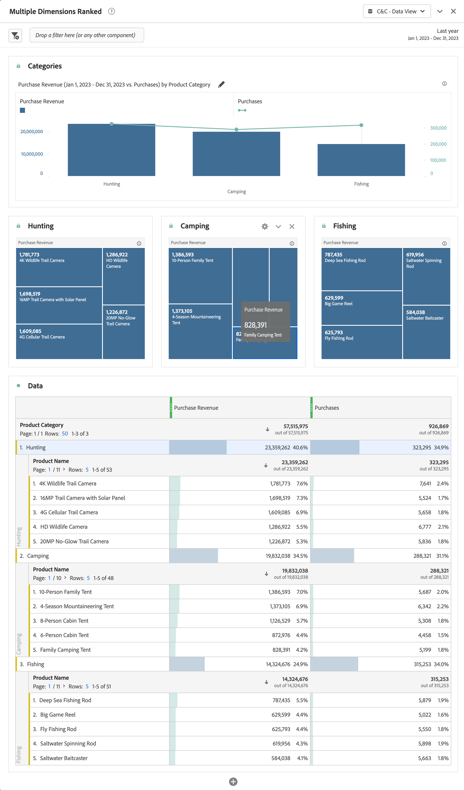

+++

+++ BI ツール

>[!PREREQUISITES]
>
>接続が成功したことを[検証し、データビューを一覧表示でき、このユースケースを試すBI ツールにデータビュー](connect-and-validate.md)を使用していることを確認します。
>

>[!BEGINTABS]

>[!TAB Power BI デスクトップ ]

1. 日付範囲がすべてのビジュアライゼーションに適用されるようにするには、**[!UICONTROL daterangeday]**&#x200B;を&#x200B;**[!UICONTROL Data]** ペインからドラッグ&amp;ドロップして、このページ ]**の**[!UICONTROL  フィルターに追加します。
   1. このページの&#x200B;**[!UICONTROL フィルター]**&#x200B;から&#x200B;**[!UICONTROL daterangeday is （All）]**&#x200B;を選択します。
   1. **[!UICONTROL 相対日付]**&#x200B;を&#x200B;**[!UICONTROL フィルタータイプ]**&#x200B;として選択します。
   1. 値&#x200B;]****[!UICONTROL &#x200B;が過去&#x200B;]**`1`**[!UICONTROL &#x200B;暦年&#x200B;]**の場合、フィルターを**[!UICONTROL &#x200B;項目を表示するように定義します。
   1. 「**[!UICONTROL フィルターを適用]**」を選択します。

1. **[!UICONTROL データ]** ペインで、次の操作を行います。
   1. **[!UICONTROL datarangeday]**&#x200B;を選択します。
   1. **[!UICONTROL product_category]**&#x200B;を選択します。
   1. **[!UICONTROL product_name]**&#x200B;を選択します。
   1. **[!UICONTROL sum purchase_revenue]**&#x200B;を選択
   1. **[!UICONTROL 購入額の合計]**&#x200B;を選択

1. 縦棒グラフを表に変更するには、表が選択されていることを確認し、**[!UICONTROL ビジュアライゼーション]** ペインから&#x200B;**[!UICONTROL マトリックス]**&#x200B;を選択します。
   * **[!UICONTROL 列]**&#x200B;から&#x200B;**[!UICONTROL product_name]**&#x200B;をドラッグし、**[!UICONTROL ビジュアライゼーション]** ペインの&#x200B;**[!UICONTROL 行]**&#x200B;に**[!UICONTROL product_categor]**yの下にフィールドをドロップします。

1. テーブル内に表示される製品の数を制限するには、**[!UICONTROL フィルター]** ペインで&#x200B;**[!UICONTROL product_name is （All）]**&#x200B;を選択します。

   1. 「**[!UICONTROL 高度なフィルタリング]**」を選択します。
   1. **[!UICONTROL フィルターの種類]** **[!UICONTROL 上位N]** **[!UICONTROL 項目を表示]** **[!UICONTROL 上位]** `15` **[!UICONTROL を値]**&#x200B;で選択します。
   1. **[!UICONTROL 購入]**&#x200B;を&#x200B;**[!UICONTROL データ]** ペインから&#x200B;**[!UICONTROL データ フィールドをここに追加]**&#x200B;にドラッグします。
   1. 「**[!UICONTROL フィルターを適用]**」を選択します。

1. 読みやすさを向上させるには、上部メニューから&#x200B;**[!UICONTROL 表示]**&#x200B;を選択し、**[!UICONTROL ページビュー]** > **[!UICONTROL 実際のサイズ]**&#x200B;を選択して、テーブルのビジュアライゼーションのサイズを変更します。

1. テーブル内の各カテゴリを分類するには、製品カテゴリ レベルで&#x200B;**[!UICONTROL +]**&#x200B;を選択します。 Power BI デスクトップは以下のようになります。

   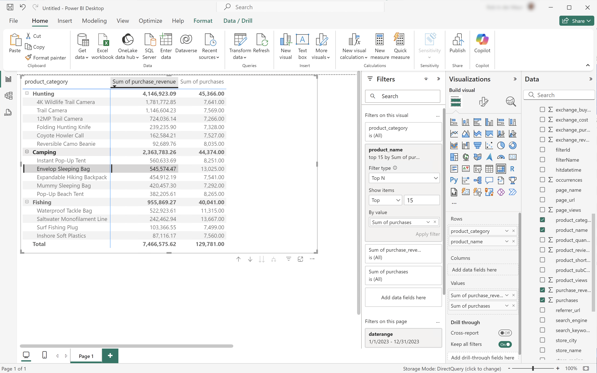

1. 上部メニューから&#x200B;**[!UICONTROL ホーム]**&#x200B;を選択し、**[!UICONTROL 新規ビジュアル]**&#x200B;を選択します。 レポートに新しいビジュアルが追加されます。

1. **[!UICONTROL データ]** ペインで、次の操作を行います。
   1. **[!UICONTROL product_category]**&#x200B;を選択します。
   1. **[!UICONTROL product_name]**&#x200B;を選択します。
   1. **[!UICONTROL purchase_revenue]**&#x200B;を選択します。

1. ビジュアルを変更するには、棒グラフを選択し、**[!UICONTROL ビジュアライゼーション]** ペインから&#x200B;**[!UICONTROL ツリーマップ]**&#x200B;を選択します。
1. **[!UICONTROL product_category]**&#x200B;が&#x200B;**[!UICONTROL Category]**&#x200B;の下に表示され、**[!UICONTROL product_name]**&#x200B;が&#x200B;**[!UICONTROL ビジュアライゼーション]** ペインの&#x200B;**[!UICONTROL Details]**&#x200B;の下に表示されていることを確認します。

   Power BI デスクトップは以下のようになります。

   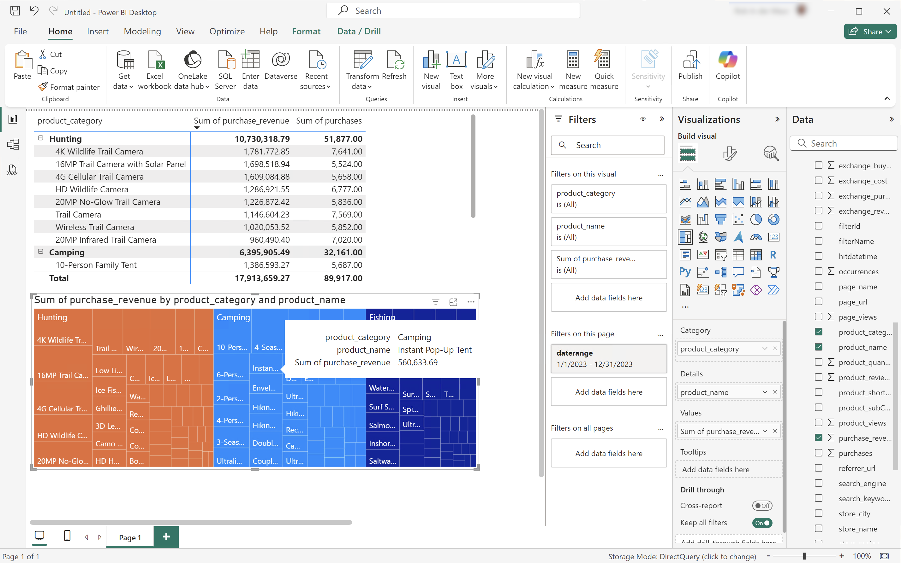

1. 上部メニューから&#x200B;**[!UICONTROL ホーム]**&#x200B;を選択し、**[!UICONTROL 新規ビジュアル]**&#x200B;を選択します。 レポートに新しいビジュアルが追加されます。

1. **[!UICONTROL データ]** ペインで、次の操作を行います。
   1. **[!UICONTROL product_category]**&#x200B;を選択します。
   1. **[!UICONTROL purchase_revenue]**&#x200B;を選択します。
   1. **[!UICONTROL 購入]**&#x200B;を選択します。

1. **[!UICONTROL ビジュアライゼーション]** ペインで、次の操作を行います。
   1. ビジュアライゼーションを変更するには、**[!UICONTROL 折れ線グラフと積み上げ棒グラフ]**&#x200B;を選択します。
   1. **[!UICONTROL sum_of_purchases]**&#x200B;を&#x200B;**[!UICONTROL 列y軸]**&#x200B;から&#x200B;**[!UICONTROL 行y軸]**&#x200B;にドラッグします。

1. レポートで、個々のビジュアライゼーションを切り替えます。

   Power BI デスクトップは以下のようになります。

   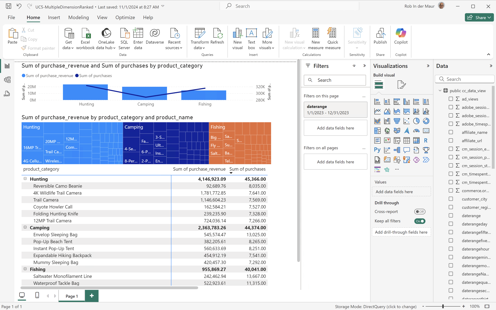


>[!TAB Tableau Desktop]

1. 下部の「**[!UICONTROL シート 1]**」タブを選択して、**[!UICONTROL データソース]**&#x200B;から切り替えます。 **[!UICONTROL シート 1]** ビューで：
   1. **[!UICONTROL Data]** ペインの&#x200B;**[!UICONTROL Tables]** リストから&#x200B;**[!UICONTROL Daterange]** エントリをドラッグし、エントリを&#x200B;**[!UICONTROL Filters]** シェルフにドロップします。
   1. **[!UICONTROL フィルターフィールド \[Daterange\]]** ダイアログで、**[!UICONTROL 日付の範囲]**&#x200B;を選択し、**[!UICONTROL 次>]**&#x200B;を選択します。
   1. **[!UICONTROL フィルター\[Daterange\]]** ダイアログで、**[!UICONTROL 相対日付]**&#x200B;を選択し、**[!UICONTROL 年]**&#x200B;を選択し、**[!UICONTROL 前年]**&#x200B;を指定します。 **[!UICONTROL 適用]**&#x200B;と&#x200B;**[!UICONTROL OK]**&#x200B;を選択します。

      Tableau デスクトップは以下のようになります。

      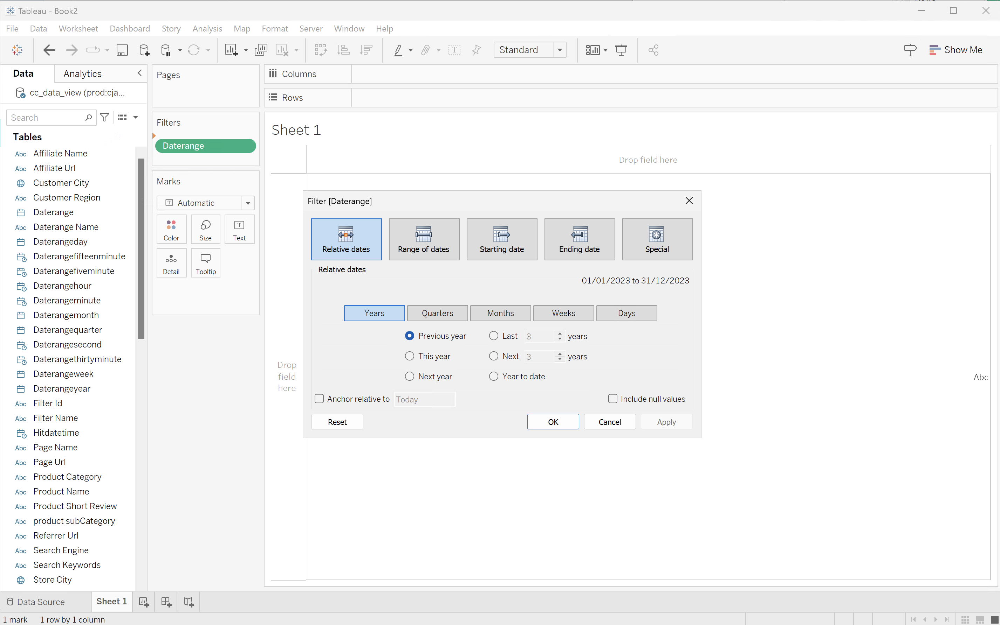

   1. **[!UICONTROL 製品カテゴリ]**&#x200B;をドラッグし、**[!UICONTROL 列]**&#x200B;の横にドロップします。
   1. **[!UICONTROL 購入収益]**&#x200B;をドラッグし、**[!UICONTROL 行]**&#x200B;の横にドロップします。 値が&#x200B;**[!UICONTROL SUM （購入収益）]**&#x200B;に変更されます。
   1. 購入をドラッグして、**[!UICONTROL 行]**&#x200B;の横にドロップします。 値が&#x200B;**[!UICONTROL SUM （Purchases）]**&#x200B;に変更されます。
   1. **[!UICONTROL SUM （Purchases）]**&#x200B;を選択し、ドロップダウンメニューから&#x200B;**[!UICONTROL デュアル軸]**&#x200B;を選択します。
   1. **[!UICONTROL Marks]**&#x200B;の&#x200B;**[!UICONTROL SUM （Purchases）]**&#x200B;を選択し、ドロップダウンメニューから&#x200B;**[!UICONTROL Line]**&#x200B;を選択します。
   1. **[!UICONTROL Marks]**&#x200B;の&#x200B;**[!UICONTROL SUM （Purchase Revenue）]**&#x200B;を選択し、ドロップダウンメニューから&#x200B;**[!UICONTROL Bar]**&#x200B;を選択します。
   1. **[!UICONTROL フィット]** メニューから&#x200B;**[!UICONTROL ビュー全体]**&#x200B;を選択します。
   1. グラフで「**[!UICONTROL 購入収益]**」タイトルを選択し、購入収益が昇順になっていることを確認します。

      Tableau デスクトップは以下のようになります。

      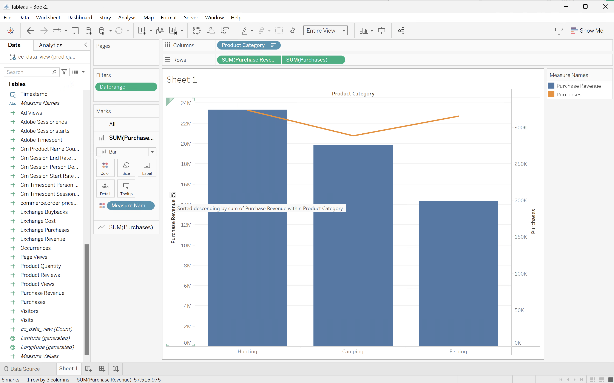

1. 現在の&#x200B;**[!UICONTROL シート 1]** シートの名前を`Category`に変更します。
1. **[!UICONTROL 新しいワークシート]**&#x200B;を選択して新しいシートを作成し、名前を`Data`に変更します。

   1. **[!UICONTROL Data]** ペインの&#x200B;**[!UICONTROL Tables]** リストから&#x200B;**[!UICONTROL Daterange]** エントリをドラッグし、エントリを&#x200B;**[!UICONTROL Filters]** シェルフにドロップします。
   1. **[!UICONTROL フィルターフィールド \[Daterange\]]** ダイアログで、**[!UICONTROL 日付の範囲]**&#x200B;を選択し、**[!UICONTROL 次>]**&#x200B;を選択します。
   1. **[!UICONTROL フィルター\[Daterange\]]** ダイアログで、**[!UICONTROL 相対日付]**&#x200B;を選択し、**[!UICONTROL 年]**&#x200B;を選択し、**[!UICONTROL 前年]**&#x200B;を指定します。 **[!UICONTROL 適用]**&#x200B;と&#x200B;**[!UICONTROL OK]**&#x200B;を選択します。
   1. **[!UICONTROL 購入収益]**&#x200B;を&#x200B;**[!UICONTROL データ]** ペインから&#x200B;**[!UICONTROL 列]**&#x200B;にドラッグします。 値が&#x200B;**[!UICONTROL SUM （購入収益）]**&#x200B;に変更されます。
   1. **[!UICONTROL 購入]**&#x200B;を&#x200B;**[!UICONTROL データ]** ペインから&#x200B;**[!UICONTROL 列]**&#x200B;へ、**[!UICONTROL 購入収益]**&#x200B;の横にドラッグします。 値が&#x200B;**[!UICONTROL SUM （Purchases）]**&#x200B;に変更されます。
   1. **[!UICONTROL 製品カテゴリ]**&#x200B;を&#x200B;**[!UICONTROL データ]** ペインから&#x200B;**[!UICONTROL 行]**&#x200B;にドラッグします。
   1. **[!UICONTROL 製品名]**&#x200B;を&#x200B;**[!UICONTROL データ]** ペインから&#x200B;**[!UICONTROL 行]**、次に&#x200B;**[!UICONTROL 製品カテゴリ]**&#x200B;にドラッグします。
   1. 2つの横棒を表に変更するには、**[!UICONTROL 自分を表示]**&#x200B;から&#x200B;**[!UICONTROL テキストテーブル]**&#x200B;を選択します。
   1. 製品数を制限するには、**[!UICONTROL 測定値]**&#x200B;で「**[!UICONTROL 購入]**」を選択します。 ドロップダウンメニューから、**[!UICONTROL フィルター]**&#x200B;を選択します。
   1. **[!UICONTROL フィルター\[購入\]]** ダイアログで、**[!UICONTROL 少なくとも]**&#x200B;を選択し、`7000`と入力します。 **[!UICONTROL 適用]**&#x200B;と&#x200B;**[!UICONTROL OK]**&#x200B;を選択します。
   1. 「]**Fit Width]**」ドロップダウンメニューから「**[!UICONTROL Fit Width**[!UICONTROL 」を選択します。

      Tableau デスクトップは以下のようになります。

      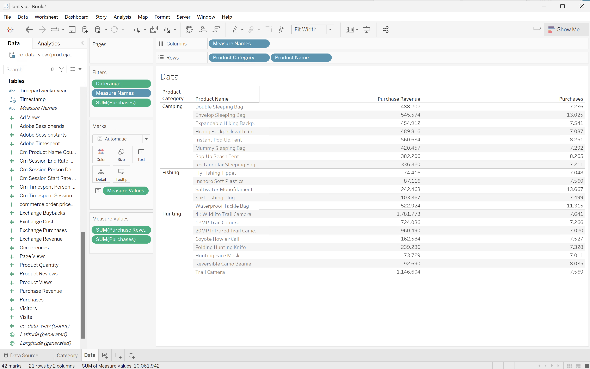

1. **[!UICONTROL 新しいワークシート]**&#x200B;を選択して新しいシートを作成し、名前を&#x200B;**[!UICONTROL ツリーマップ]**&#x200B;に変更します。
   1. **[!UICONTROL Data]** ペインの&#x200B;**[!UICONTROL Tables]** リストから&#x200B;**[!UICONTROL Daterange]** エントリをドラッグし、エントリを&#x200B;**[!UICONTROL Filters]** シェルフにドロップします。
   1. **[!UICONTROL フィルターフィールド \[Daterange\]]** ダイアログで、**[!UICONTROL 日付の範囲]**&#x200B;を選択し、**[!UICONTROL 次>]**&#x200B;を選択します。
   1. **[!UICONTROL フィルター\[Daterange\]]** ダイアログで、**[!UICONTROL 相対日付]**&#x200B;を選択し、**[!UICONTROL 年]**&#x200B;を選択し、**[!UICONTROL 前年]**&#x200B;を指定します。 **[!UICONTROL 適用]**&#x200B;と&#x200B;**[!UICONTROL OK]**&#x200B;を選択します。
   1. **[!UICONTROL 購入収益]**&#x200B;を&#x200B;**[!UICONTROL データ]** ペインから&#x200B;**[!UICONTROL 行]**&#x200B;にドラッグします。 値が&#x200B;**[!UICONTROL SUM （購入収益）]**&#x200B;に変更されます。
   1. **[!UICONTROL 購入]**&#x200B;を&#x200B;**[!UICONTROL データ]** ペインから&#x200B;**[!UICONTROL 行]**&#x200B;へ、**[!UICONTROL 購入収益]**&#x200B;の横にドラッグします。 値が&#x200B;**[!UICONTROL SUM （Purchases）]**&#x200B;に変更されます。
   1. **[!UICONTROL 製品カテゴリ]**&#x200B;を&#x200B;**[!UICONTROL データ]** ペインから&#x200B;**[!UICONTROL 列]**&#x200B;にドラッグします。
   1. **[!UICONTROL 製品名]**&#x200B;を&#x200B;**[!UICONTROL データ]** ペインから&#x200B;**[!UICONTROL 列]**&#x200B;にドラッグします。
   1. 2つの縦棒グラフをツリーマップに変更するには、**[!UICONTROL 自分を表示]**&#x200B;から&#x200B;**[!UICONTROL ツリーマップ]**&#x200B;を選択します。
   1. 製品数を制限するには、**[!UICONTROL 測定値]**&#x200B;で「**[!UICONTROL 購入]**」を選択します。 ドロップダウンメニューから、**[!UICONTROL フィルター]**&#x200B;を選択します。
   1. **[!UICONTROL フィルター\[購入\]]** ダイアログで、**[!UICONTROL 少なくとも]**&#x200B;を選択し、`7000`と入力します。 **[!UICONTROL 適用]**&#x200B;と&#x200B;**[!UICONTROL OK]**&#x200B;を選択します。
   1. 「**[!UICONTROL フィット]**」ドロップダウンメニューから「**[!UICONTROL フィット幅]**」を選択します。

      Tableau デスクトップは以下のようになります。

      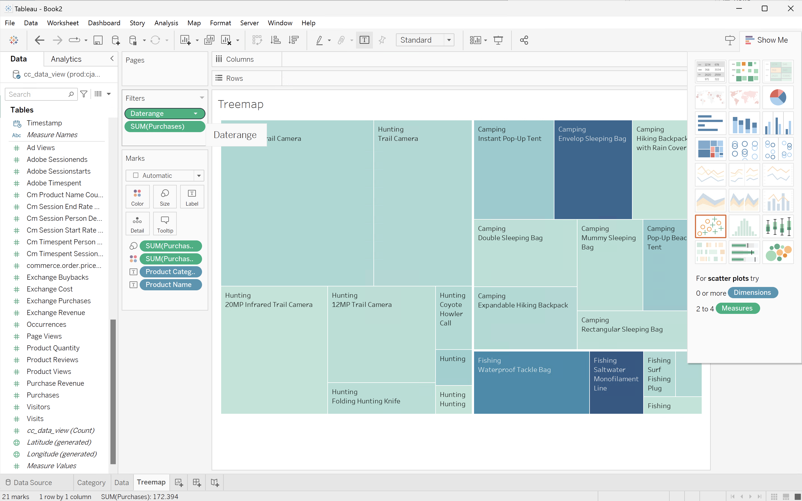

1. 「**[!UICONTROL 新しいダッシュボード]**」タブボタン（下部）を選択して、新しい&#x200B;**[!UICONTROL ダッシュボード 1]** ビューを作成します。 **[!UICONTROL ダッシュボード 1]** ビューで、次の操作を行います。
   1. **[!UICONTROL カテゴリー]** シートを&#x200B;**[!UICONTROL シート]** シェルフから&#x200B;**[!UICONTROL ダッシュボード 1]** ビューにドラッグ&amp;ドロップします。このビューには、*シートをここにドロップ*&#x200B;します。
   1. **[!UICONTROL ダッシュボード 1]** ビューの&#x200B;**[!UICONTROL カテゴリー]** シートの下にある&#x200B;**[!UICONTROL シート]**&#x200B;棚から&#x200B;**[!UICONTROL ツリーマップ]** シートをドラッグ&amp;ドロップします。
   1. **[!UICONTROL ダッシュボード 1]** ビューの&#x200B;**[!UICONTROL ツリーマップ]** シートの下にある&#x200B;**[!UICONTROL シート]** シェルフから&#x200B;**[!UICONTROL データ]** シートをドラッグ&amp;ドロップします。
   1. ビュー内の各シートのサイズを変更します。

   **[!UICONTROL ダッシュボード 1]** ビューは次のようになります。

   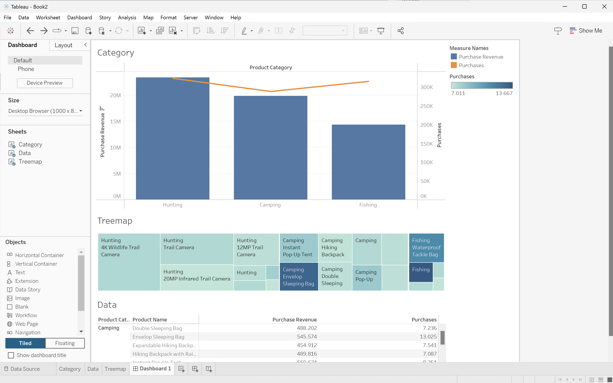


>[!TAB Looker]

1. Lookerの&#x200B;**[!UICONTROL Explore]** インターフェイスで、クリーンな設定が行われていることを確認します。 そうでない場合は、 **[!UICONTROL フィールドとフィルターの削除]**&#x200B;を選択します。
1. 「**[!UICONTROL フィルター]**」の下の「**[!UICONTROL + フィルター]**」を選択します。
1. **[!UICONTROL フィルターを追加]** ダイアログ：
   1. **[!UICONTROL ‣ Cc データビュー]**&#x200B;を選択
   1. フィールドのリストから、**[!UICONTROL }‣ Daterange Date]**、次に&#x200B;**[!UICONTROL Daterange Date]**を選択します。
      
1. **[!UICONTROL Cc データビューの日付変更日]** フィルターを&#x200B;**[!UICONTROL が範囲]** **[!UICONTROL 2023/01/01]** **[!UICONTROL から（前）]** **[!UICONTROL 2024/01/01]**&#x200B;に指定します。
1. 左側のパネルの&#x200B;**[!UICONTROL ‣ Cc データビュー]** セクションから：
   1. **[!UICONTROL 製品カテゴリ]**&#x200B;を選択します。
   1. **[!UICONTROL 製品名]**&#x200B;を選択します。
1. 左側のパネルの&#x200B;**[!UICONTROL ‣カスタムフィールド]** セクションから：
   1. 「**[!UICONTROL + Add]**」ドロップダウンメニューから「**[!UICONTROL Custom Measure]**」を選択します。
   1. **[!UICONTROL カスタムメジャーを作成]** ダイアログで、次の操作を行います。
      1. **[!UICONTROL フィールドから**[!UICONTROL &#x200B;購入収益&#x200B;]**を選択して]** ドロップダウンメニューを測定します。
      1. 「**[!UICONTROL Measure type]**」ドロップダウンメニューから「**[!UICONTROL Sum]**」を選択します。
      1. **[!UICONTROL 名前]**&#x200B;のカスタムフィールド名を入力してください。 例：`Sum of Purchase Revenue`。
      1. 「**[!UICONTROL フィールドの詳細]**」タブを選択します。
      1. **[!UICONTROL 形式]** ドロップダウンメニューから&#x200B;**[!UICONTROL 小数点]**&#x200B;を選択し、`0`が&#x200B;**[!UICONTROL 小数点]**に入力されていることを確認します。
         
      1. 「**[!UICONTROL 保存]**」を選択します。
   1. 「**[!UICONTROL + Add]**」ドロップダウンメニューから「**[!UICONTROL Custom Measure]**」をもう一度選択します。 **[!UICONTROL カスタム]**&#x200B;測定を作成ダイアログで、次の操作を行います。
      1. **[!UICONTROL フィールドから**[!UICONTROL &#x200B;購入&#x200B;]**を選択して]** ドロップダウンメニューを測定します。
      1. 「**[!UICONTROL Measure type]**」ドロップダウンメニューから「**[!UICONTROL Sum]**」を選択します。
      1. **[!UICONTROL 名前]**&#x200B;のカスタムフィールド名を入力してください。 例：`Sum of Purchases`。
      1. 「**[!UICONTROL フィールドの詳細]**」タブを選択します。
      1. **[!UICONTROL 形式]** ドロップダウンメニューから&#x200B;**[!UICONTROL 小数点]**&#x200B;を選択し、`0`が&#x200B;**[!UICONTROL 小数点]**&#x200B;に入力されていることを確認します。
      1. 「**[!UICONTROL 保存]**」を選択します。
   1. 両方のフィールドがデータビューに自動的に追加されます。
1. **[!UICONTROL フィルター]** セクションで、**[!UICONTROL + フィルター]**&#x200B;を選択します。 **[!UICONTROL フィルターを追加]** ダイアログで。 **[!UICONTROL ‣カスタムフィールド]**&#x200B;を選択してから、**[!UICONTROL 購入収益]**&#x200B;を選択します。
1. 「**[!UICONTROL は>]**」を選択し、`800000`と入力して結果を制限します。
1. **[!UICONTROL 実行]**&#x200B;を選択します。
1. 行のビジュアライゼーションを表示するには、**[!UICONTROL ‣ ビジュアライゼーション]**&#x200B;を選択します。
1. **[!UICONTROL ビジュアライゼーション]**&#x200B;の&#x200B;**[!UICONTROL 編集]**&#x200B;を選択して、ビジュアライゼーションを更新します。 ポップアップダイアログで以下を行います。
   1. 「**[!UICONTROL プロット]**」タブを選択します。
   1. 下にスクロールして、**[!UICONTROL チャート設定の編集]**&#x200B;を選択します。
   1. 以下のスクリーンショットのように、**[!UICONTROL グラフ設定（上書き）]**&#x200B;のJSONを変更し、**[!UICONTROL プレビュー]**&#x200B;を選択します。

      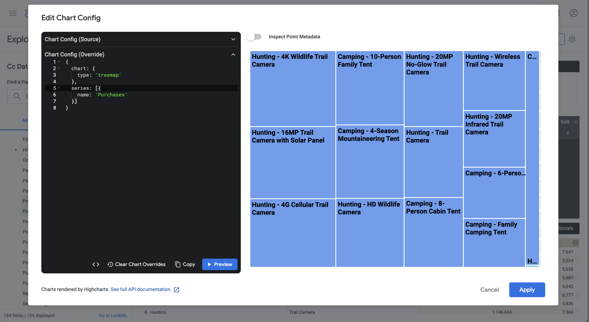

   1. 「**[!UICONTROL 適用]**」を選択します。
   1. **[!UICONTROL 編集]**&#x200B;の横にあるを選択して、ポップアップダイアログを非表示にします

次のようなビジュアライゼーションと表が表示されます。

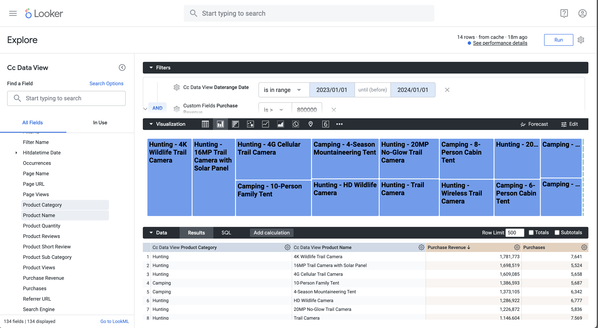


>[!TAB Jupyter Notebook]

1. 新しいセルに次のステートメントを入力します。

   ```
   import seaborn as sns
   import matplotlib.pyplot as plt
   data = %sql SELECT product_category AS `Product Category`, product_name AS `Product Name`, SUM(purchase_revenue) AS `Purchase Revenue`, SUM(purchases) AS `Purchases` \
               FROM cc_data_view \
               WHERE daterange BETWEEN '2023-01-01' AND '2024-01-01' \
               GROUP BY 1, 2 \
               ORDER BY `Purchase Revenue` DESC \
               LIMIT 10;
   df = data.DataFrame()
   df = df.groupby(['Product Category', 'Product Name'], as_index=False).sum()
   plt.figure(figsize=(8, 8))
   sns.scatterplot(x='Product Category', y='Product Name', size='Purchase Revenue', sizes=(10, 200), hue='Purchases', palette='husl', data=df)
   plt.show()
   display(data)
   ```

1. セルを実行します。 以下のスクリーンショットのような出力が表示されます。

   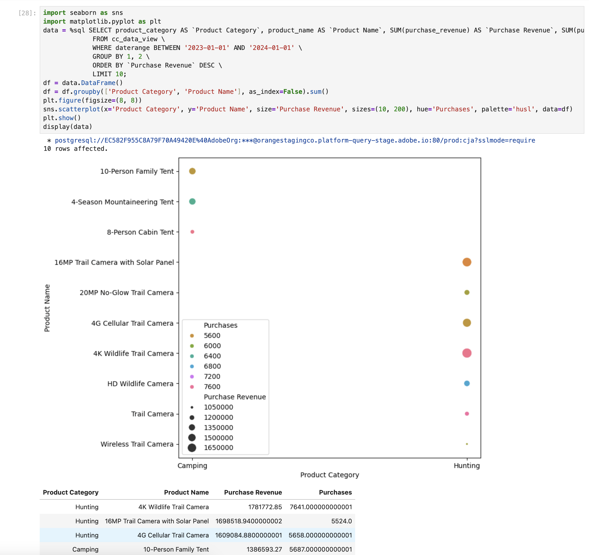


>[!TAB RStudio]

1. 新しいチャンクに次のコードブロックを入力します。

   ```R
   ## Multiple dimensions ranked
   df <- dv %>%
      filter(daterange >= "2023-01-01" & daterange < "2024-01-01") %>%
      group_by(product_category, product_name) %>%
      summarise(purchase_revenue = sum(purchase_revenue), purchases = sum(purchases), .groups = "keep") %>%
      arrange(desc(purchase_revenue), .by_group = FALSE)
   print(df)
   ```

1. チャンクを実行します。 以下のスクリーンショットのような出力が表示されます。

   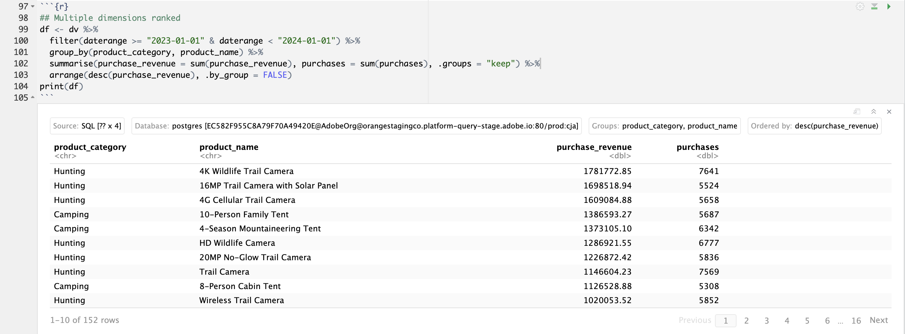


>[!ENDTABS]

+++
