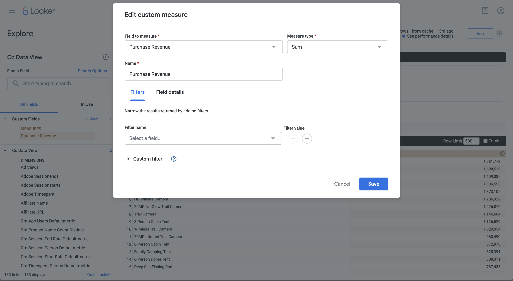

# ランク付けされた単一ディメンション


このユースケースでは、2023 年を超える製品名の購入および購入売上高を示すテーブルとシンプルな棒ビジュアライゼーションを表示します。

+++ Customer Journey Analytics

ユースケースの例 **[!UICONTROL 単一のDimensionのランク付け]** パネルは次のとおりです。


+++

+++ BI ツール

>[!PREREQUISITES]
>
>このユースケースを試す BI ツールについて、[ 接続に成功し、データビューをリストし、データビューを使用できる ](connect-and-validate.md) ことを検証したことを確認します。
>

>[!BEGINTABS]

>[!TAB Power BI デスクトップ ]

1. **[!UICONTROL データ]** ペインで、次の操作を行います。
   1. **[!UICONTROL daterange]** を選択します。
   1. **[!UICONTROL product_name]** を選択します。
   1. **[!UICONTROL sum purchase_revenue]** を選択します。
   1. 「**[!UICONTROL 購入を合計]**」を選択します。

   選択した要素の列ヘッダーのみを表示する空のテーブルが表示されます。 視認性を高めるには、ビジュアライゼーションを拡大します。

1. **[!UICONTROL フィルター]** パネルで、次の操作を行います。

   1. **[!UICONTROL このビジュアルのフィルター]** から **[!UICONTROL daterange is （すべて）]** を選択します。
   1. **[!UICONTROL フィルタータイプ]** として **[!UICONTROL 相対日付]** を選択します。
   1. フィルターを定義して **[!UICONTROL 値が過去]** **[!UICONTROL 暦年]** に含まれる場合に項目を表示 `1`**[!UICONTROL します]**。
   1. 「**[!UICONTROL フィルターを適用]**」を選択します。

   適用した **[!UICONTROL daterange]** フィルターを使用して更新されたテーブルが表示されます。

1. **[!UICONTROL ビジュアライゼーション]** パネルで、

   1.  を使用して **[!UICONTROL Daterange]** を **[!UICONTROL Columns]** から削除します。
   1. **[!UICONTROL 購入の合計]** を **[!UICONTROL 列]** の **[!UICONTROL 購入の合計]** の下にドラッグ&amp;ドロップします。

1. テーブル ビジュアライゼーションで、次の操作を行います。

   1. **[!UICONTROL purchase_revenue の合計]** を選択すると、商品名を降順で並べ替えることができます。 Power BI デスクトップは次のようになります。

   

1. **[!UICONTROL フィルター]** パネルで、次の操作を行います。

   1. **[!UICONTROL product_name is （All）]** を選択します。
   1. **[!UICONTROL フィルタータイプ]** を **[!UICONTROL 上位 N]** に設定します。
   1. フィルターを定義して **[!UICONTROL 項目を表示]****[!UICONTROL 上位]**`10`**[!UICONTROL 値]** にします。
   1. **[!UICONTROL purchase_revenue]** を **[!UICONTROL By value]** **[!UICONTROL ここにデータフィールドを追加]** にドラッグ&amp;ドロップします。
   1. 「**[!UICONTROL フィルターを適用]**」を選択します。

   Analysis Workspaceのフリーフォームテーブルビジュアライゼーションと同期して、購入売上高の値で更新されたテーブルが表示されます。

1. **[!UICONTROL ビジュアライゼーション]** パネルで、

   1. **[!UICONTROL 折れ線グラフおよび積み重ね柱状グラフ]** ビジュアライゼーションを選択します。

   折れ線グラフおよび積み重ね柱状グラフビジュアライゼーションは、テーブルを置き換え、テーブルと同じデータを使用します。

1. **[!UICONTROL 購入]** を **[!UICONTROL ビジュアライゼーション]** ペインの **[!UICONTROL 線の Y 軸]** にドラッグ&amp;ドロップします。

   折れ線グラフと積み重ね柱状グラフが更新されます。 Power BI デスクトップは次のようになります。

   

1. 折れ線グラフおよび積み重ね柱状グラフのビジュアライゼーションで：

   1.  を選択します。
   1. コンテキストメニューから「**[!UICONTROL テーブルとして表示]**」を選択します。

   メインビューが更新され、折れ線グラフのビジュアライゼーションとテーブルの両方が表示されます。

   

>[!TAB Tableau Desktop]

1. 下部にある「**[!UICONTROL シート 1]**」タブを選択して、「**[!UICONTROL データソース]**」から切り替えます。 **[!UICONTROL シート 1]** ビューで、次の操作を行います。
   1. **[!UICONTROL データ]** ペインの **[!UICONTROL テーブル]** リストから **[!UICONTROL Daterange]** エントリをドラッグし、**[!UICONTROL フィルター]** シェルフにドロップします。
   1. **[!UICONTROL フィルターフィールド\[Daterange\]]** ダイアログで **[!UICONTROL 日付範囲]** を選択して **[!UICONTROL 次へ >]** を選択します。
   1. **[!UICONTROL フィルター\[Daterange\]]** ダイアログで **[!UICONTROL 日付範囲]** を選択し、`01/01/2023` ～ `31/12/2023` の期間を指定します。 **[!UICONTROL 適用]** および **[!UICONTROL OK]** を選択します。

      

   1. **[!UICONTROL データ]** ペインの **[!UICONTROL テーブル]** リストから **[!UICONTROL 製品名]** をドラッグ&amp;ドロップし、**[!UICONTROL 行]** の横のフィールドにエントリをドロップします。
   1. **[!UICONTROL データ]** ペインの **[!UICONTROL テーブル（*メジャー名*）]** リストから **[!UICONTROL 購入]** をドラッグ&amp;ドロップし、**[!UICONTROL 行]** の横のフィールドにエントリをドロップします。 値は自動的に **[!UICONTROL SUM （Purchases）]** に変換されます。
   1. **[!UICONTROL データ]** ペインの **[!UICONTROL テーブル（*メジャー名*）]** リストから **[!UICONTROL 購入収益]** をドラッグ&amp;ドロップし、**[!UICONTROL 列]** の横のフィールドにエントリをドロップして、**[!UICONTROL SUM （購入）]** から左にドロップします。 値は **[!UICONTROL SUM （Purchase Revenue）]** に自動変換されます。
   1. 両方のグラフを降順で並べ替えるには、**[!UICONTROL 購買収益]** タイトルにポインタを合わせて、並べ替えアイコンを選択します。
   1. グラフのエントリ数を制限するには、**[!UICONTROL 行]** で **[!UICONTROL SUM （Purchase Revenue）]** を選択し、ドロップダウンメニューから **[!UICONTROL フィルター]** を選択します。
   1. **[!UICONTROL フィルター\[Purchase Revenue\]]** ダイアログで **[!UICONTROL 値の範囲]** を選択し、適切な値を入力します。 例：`1,000,000`～`2,000,000` **[!UICONTROL 適用]** および **[!UICONTROL OK]** を選択します。
   1. 2 つの棒グラフを 2 つの組み合わせのグラフに変換するには、「**[!UICONTROL 行]**」で「合計 **[!UICONTROL 購入）]** を選択し、ドロップダウンメニューから「**[!UICONTROL 二重軸]**」を選択します。 棒グラフは散布図に変換されます。
   1. 散布図を棒グラフに変更するには、次の手順に従います。
      1. **[!UICONTROL マーク]** エリアで **[!UICONTROL SUM （Purchases）]** を選択し、ドロップダウンメニューから **[!UICONTROL 線]** を選択します。
      1. **[!UICONTROL マーク]** エリアで **[!UICONTROL SUM （Purchase Revenue）]** を選択し、ドロップダウンメニューから **[!UICONTROL 棒グラフ]** を選択します。

   Tableau Desktop は次のようになります。

   

1. [**[!UICONTROL シート 1]**] タブの右クリック メニューから **[!UICONTROL 複製]** を選択し、2 番目のシートを作成します。
1. [**[!UICONTROL シート 1]**] タブの右クリック メニューから **[!UICONTROL 名前変更]** を選択して、シートの名前を `Data` に変更します。
1. **[!UICONTROL シート 1 （2）]** タブの右クリック メニューから **[!UICONTROL 名前変更]** を選択して、シートの名前を `Graph` に変更します。
1. **[!UICONTROL データ]** シートが選択されていることを確認します。
   1. 右上の **[!UICONTROL 表示]** を選択し、**[!UICONTROL テキストテーブル]** （左上のビジュアライゼーション）を選択して、2 つのグラフのコンテンツをテーブルに変更します。
   1. 購買収益を降順で並べ替えるには、テーブルの **[!UICONTROL 購買収益]** にポインタを合わせて  を選択します。
   1. **[!UICONTROL フィット]** ドロップダウンメニューから **[!UICONTROL ビュー全体]** を選択します。

   Tableau Desktop は次のようになります。

   

1. **[!UICONTROL 新規ダッシュボード]**」タブボタン（下部）を選択して、新しい **[!UICONTROL ダッシュボード 1]** ビューを作成します。 **[!UICONTROL ダッシュボード 1]** ビューで、次の操作を行います。
   1. **[!UICONTROL Sheets]** シェルフから **[!UICONTROL Graph]** シートを **[!UICONTROL Dashboard 1]** ビュー（「シートをここにドロップ *」と表示されているビュー* にドラッグ&amp;ドロップします。
   1. **[!UICONTROL データ]** シートを、**[!UICONTROL グラフ]** シートの下にある **[!UICONTROL シート]** シェルフから **[!UICONTROL ダッシュボード 1]** ビューにドラッグ&amp;ドロップします。
   1. ビューで **[!UICONTROL データ]** シートを選択し、**[!UICONTROL ビュー全体]** を **[!UICONTROL 固定幅]** に変更します。

   **[!UICONTROL ダッシュボード 1]** ビューは次のようになります。

   


>[!TAB Looker]

1. Looker の **[!UICONTROL 探索]** インターフェイスで、クリーンな設定ができていることを確認します。 そうでない場合は、「**[!UICONTROL フィールドとフィルターを削除]**」を選択します。
1. **[!UICONTROL フィルター]** の下の「**[!UICONTROL + フィルター]** を選択します。
1. **[!UICONTROL フィルターを追加]** ダイアログで、次の手順を実行します。
   1. 「**[!UICONTROL ‣ Cc データビュー」を選択します]**
   1. フィールドのリストから、「**[!UICONTROL ‣Daterange Date」を選択し]** 「**[!UICONTROL Daterange Date]**」を選択します。
      
1. **[!UICONTROL CC データビュー日付範囲]** フィルターを **[!UICONTROL 範囲内]** **[!UICONTROL 2023/01/01]****[!UICONTROL 前）まで]** **[!UICONTROL 2024/01/01]** として指定します。
1. 左側のパネルの「**[!UICONTROL ‣ Cc データビュー]**」セクションで、「**[!UICONTROL 製品名]**」を選択します。
1. 左パネルの「**[!UICONTROL ‣カスタムフィールド]**」セクションから：
   1. 「**[!UICONTROL +追加]**」ドロップダウンメニューから「**[!UICONTROL カスタム測定]**」を選択します。
   1. **[!UICONTROL カスタム測定を作成]** ダイアログで、次の手順を実行します。
      1. **[!UICONTROL 測定するフィールド]** ドロップダウンメニューから **[!UICONTROL 購入売上高]** を選択します。
      1. **[!UICONTROL 測定タイプ]** ドロップダウンメニューから **[!UICONTROL 合計]** を選択します。
      1. **[!UICONTROL 名前]** のカスタムフィールド名を入力します。 例：`Purchase Revenue`。
      1. **[!UICONTROL フィールドの詳細]** タブを選択します。
      1. **[!UICONTROL 形式]** ドロップダウンメニューから「**[!UICONTROL 小数]**」を選択し、「`0` 小数 **[!UICONTROL 」]** 入力されていることを確認します。
         
      1. 「**[!UICONTROL 保存]**」を選択します。
   1. 「**[!UICONTROL +追加]**」ドロップダウンメニューから **[!UICONTROL カスタム測定]** をもう一度選択します。 **[!UICONTROL カスタムを作成]** メジャーダイアログで、
      1. **[!UICONTROL 測定するフィールド]** ドロップダウンメニューから **[!UICONTROL 購入]** を選択します。
      1. **[!UICONTROL 測定タイプ]** ドロップダウンメニューから **[!UICONTROL 合計]** を選択します。
      1. **[!UICONTROL 名前]** のカスタムフィールド名を入力します。 例：`Sum of Purchases`。
      1. **[!UICONTROL フィールドの詳細]** タブを選択します。
      1. **[!UICONTROL 形式]** ドロップダウンメニューから「**[!UICONTROL 小数]**」を選択し、「`0` 小数 **[!UICONTROL 」]** 入力されていることを確認します。
      1. 「**[!UICONTROL 保存]**」を選択します。
   1. 両方のフィールドがデータビューに自動的に追加されます。
1. 別の **[!UICONTROL フィルター]** を追加する場合は「**[!UICONTROL + フィルター]** を選択し、データを制限する場合は「制限」を選択します。
1. **[!UICONTROL フィルターを追加]** ダイアログで、「**[!UICONTROL ‣カスタムフィールド]**」を選択し、「**[!UICONTROL 購入収益]**」を選択します。
1. 適切な選択を行い、提案された値を入力します。これにより、フィルターの **[!UICONTROL が]** 次を含む `1000000` **** AND`2000000` になります。
1. 「**[!UICONTROL 実行]**」を選択します。
1. 「**[!UICONTROL ‣ビジュアライゼーション]**」を選択して、折れ線グラフのビジュアライゼーションを表示します。
1. **[!UICONTROL ビジュアライゼーション]** の「**[!UICONTROL 編集]**」を選択して、ビジュアライゼーションを更新します。 ポップアップダイアログで以下を行います。
   1. 「**[!UICONTROL シリーズ]** タブを選択します。
   1. 下にスクロールして **[!UICONTROL 購入]** を表示し、**[!UICONTROL タイプ]** を **[!UICONTROL 行]** に変更します。
   1. 「**[!UICONTROL Y]**」タブを選択します。
   1. **[!UICONTROL 左側の 1]** コンテナから **[!UICONTROL 購入]** を **[!UICONTROL *ここにシリーズをドラッグして新しい左軸を作成&#x200B;*]**にドラッグします。 このアクションにより、**[!UICONTROL  左 2 ]**コンテナが作成されます。
      
   1.  の横にある **[!UICONTROL CrossSize75]** を選択して、ポップアップダイアログを非表示にします

以下に示すようなビジュアライゼーションとテーブルが表示されます。


>[!TAB Jupyter Notebook]

1. 新しいセルに次のステートメントを入力します。

   ```
   import seaborn as sns
   import matplotlib.pyplot as plt
   data = %sql SELECT product_name AS `Product Name`, SUM(purchase_revenue) AS `Purchase Revenue`, SUM(purchases) AS `Purchases` \
               FROM cc_data_view \
               WHERE daterange BETWEEN '2023-01-01' AND '2024-01-01' \
               GROUP BY 1 \
               LIMIT 10;
   df = data.DataFrame()
   df = df.groupby('Product Name', as_index=False).sum()
   plt.figure(figsize=(15, 3))
   sns.barplot(x='Purchase Revenue', y='Product Name', data=df)
   plt.show()
   display(data)
   ```

1. セルを実行します。 以下のスクリーンショットのような出力が表示されます。

   


>[!TAB RStudio]

1. 新しいチャンクで、` ```{r} ` と ` ``` ` の間に次のステートメントを入力します。

   ```R
   library(tidyr)
   
   ## Single dimension ranked
   df <- dv %>%
      filter(daterange >= "2023-01-01" & daterange < "2024-01-01") %>%
      group_by(product_name) %>%
      summarise(purchase_revenue = sum(purchase_revenue), purchases = sum(purchases)) %>%
      arrange(product_name, .by_group = FALSE)
   dfV <- df %>%
      head(5)
   ggplot(dfV, aes(x = purchase_revenue, y = product_name)) +
      geom_col(position = "dodge") +
      geom_text(aes(label = purchase_revenue), vjust = -0.5)
   print(df)
   ```

1. チャンクを実行します。 以下のスクリーンショットのような出力が表示されます。

   

>[!ENDTABS]

+++

