# 単一ディメンションのランク


このユースケースでは、2023年の製品名の購入と購入の収益を示すテーブルとシンプルな棒グラフを表示します。

+++ Customer Journey Analytics

使用例の&#x200B;**[!UICONTROL Single Dimension Ranked]** パネルの例：

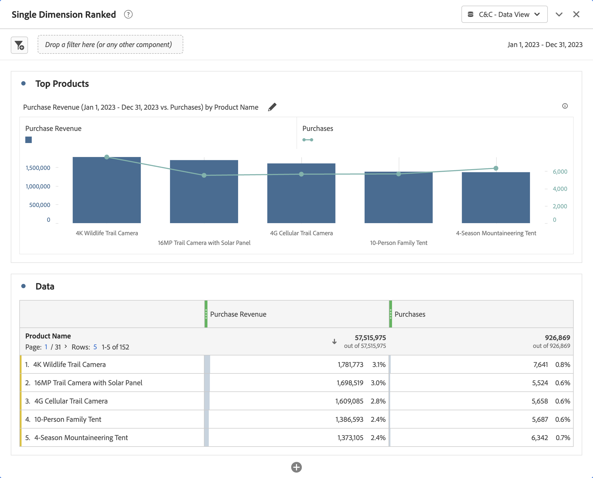

+++

+++ BI ツール

>[!PREREQUISITES]
>
>接続が成功したことを[検証し、データビューを一覧表示でき、このユースケースを試すBI ツールにデータビュー](connect-and-validate.md)を使用していることを確認します。
>

>[!BEGINTABS]

>[!TAB Power BI デスクトップ ]

1. **[!UICONTROL データ]** ペインで、次の操作を行います。
   1. **[!UICONTROL daterange]**&#x200B;を選択します。
   1. **[!UICONTROL product_name]**&#x200B;を選択します。
   1. **[!UICONTROL sum purchase_revenue]**&#x200B;を選択します。
   1. **[!UICONTROL 購入額の合計]**&#x200B;を選択します。

   選択した要素の列ヘッダーのみを表示する空のテーブルが表示されます。 可視性を高めるには、ビジュアライゼーションを拡大します。

1. **[!UICONTROL フィルター]** ペインで、次の操作を行います。

   1. このビジュアル **の** フィルターから&#x200B;**[!UICONTROL daterange is （All）]**&#x200B;を選択します。
   1. **[!UICONTROL 相対日付]**&#x200B;を&#x200B;**[!UICONTROL フィルタータイプ]**&#x200B;として選択します。
   1. 値&#x200B;**&#x200B;**&#x200B;[!UICONTROL &#x200B;が過去&#x200B;]&#x200B;**`1`**&#x200B;[!UICONTROL &#x200B;暦年&#x200B;]&#x200B;**の場合、フィルターを**&#x200B;項目を表示するように定義します。
   1. 「**[!UICONTROL フィルターを適用]**」を選択します。

   適用された&#x200B;**[!UICONTROL daterange]** フィルターでテーブルが更新されます。

1. **[!UICONTROL ビジュアライゼーション]** ペインで、次の操作を行います。

   1. を使用して、**[!UICONTROL 列]**&#x200B;から&#x200B;**[!UICONTROL daterange]**&#x200B;を削除します。
   1. **[!UICONTROL 列]**&#x200B;の「**[!UICONTROL 購入額の合計]**」の下に「**[!UICONTROL 購入額の合計]**」をドラッグ&amp;ドロップします。

1. テーブルのビジュアライゼーション上：

   1. **[!UICONTROL 購入収益の合計]**&#x200B;を選択して、購入収益の降順で製品名を並べ替えます。 Power BI デスクトップは以下のようになります。

   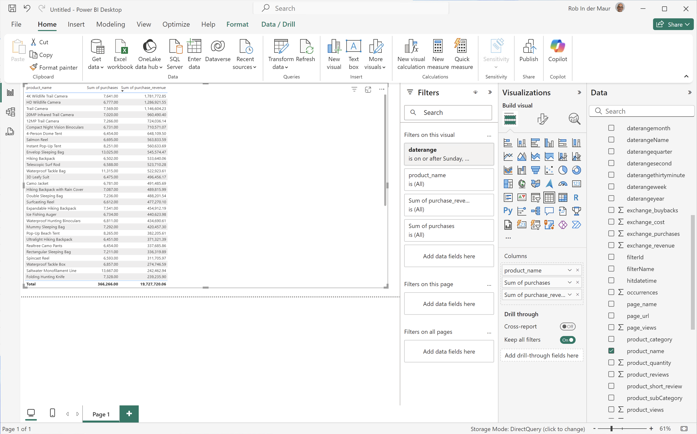

1. **[!UICONTROL フィルター]** ペインで、次の操作を行います。

   1. 「**[!UICONTROL product_name is （All）]**」を選択します。
   1. **[!UICONTROL Filter type]**&#x200B;を&#x200B;**[!UICONTROL Top N]**&#x200B;に設定します。
   1. フィルターを&#x200B;**[!UICONTROL 項目を表示]** **[!UICONTROL 上位]** `10` **[!UICONTROL 値]**&#x200B;に定義します。
   1. **[!UICONTROL purchase_revenue]**&#x200B;を&#x200B;**[!UICONTROL By value]** **[!UICONTROL ここにデータフィールドを追加]**&#x200B;にドラッグ&amp;ドロップします。
   1. 「**[!UICONTROL フィルターを適用]**」を選択します。

   Analysis Workspaceのフリーフォームテーブルのビジュアライゼーションに同期して、購入売上の値で更新されたテーブルが表示されます。

1. **[!UICONTROL ビジュアライゼーション]** ペインで、次の操作を行います。

   1. **[!UICONTROL 折れ線グラフと積み重ね棒グラフ]**&#x200B;のビジュアライゼーションを選択します。

   折れ線グラフと積み重ね棒グラフのビジュアライゼーションは、表と同じデータを使用している間に表を置き換えます。

1. **[!UICONTROL 購入]**&#x200B;を&#x200B;**[!UICONTROL ビジュアライゼーション]** ペインの&#x200B;**[!UICONTROL 行のY軸]**&#x200B;にドラッグ&amp;ドロップします。

   折れ線グラフと積み上げ棒グラフが更新されます。 Power BI デスクトップは以下のようになります。

   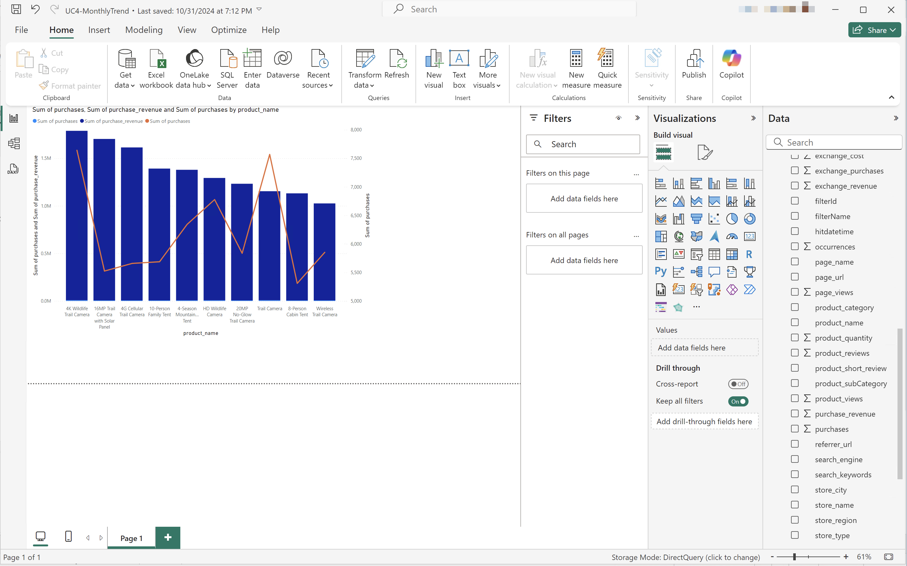

1. 折れ線グラフと積み重ね棒グラフのビジュアライゼーション：

   1. を選択します。
   1. コンテキストメニューから、**[!UICONTROL テーブルとして表示]**&#x200B;を選択します。

   メインビューが更新され、行のビジュアライゼーションと表の両方が表示されます。

   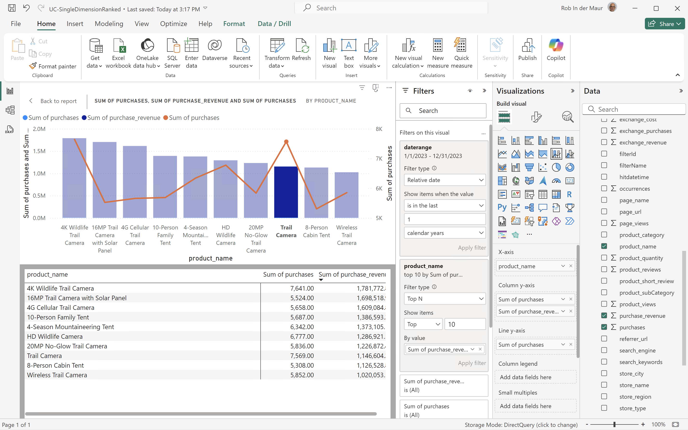

>[!TAB Tableau Desktop]

1. 下部の「**[!UICONTROL シート 1]**」タブを選択して、**[!UICONTROL データソース]**&#x200B;から切り替えます。 **[!UICONTROL シート 1]** ビューで：
   1. **[!UICONTROL Data]** ペインの&#x200B;**[!UICONTROL Tables]** リストから&#x200B;**[!UICONTROL Daterange]** エントリをドラッグし、エントリを&#x200B;**[!UICONTROL Filters]** シェルフにドロップします。
   1. **[!UICONTROL フィルターフィールド \[Daterange\]]** ダイアログで、**[!UICONTROL 日付の範囲]**&#x200B;を選択し、**[!UICONTROL 次>]**&#x200B;を選択します。
   1. **[!UICONTROL フィルター\[Daterange\]]** ダイアログで、**[!UICONTROL 日付の範囲]**&#x200B;を選択し、`01/01/2023` ～ `31/12/2023`の期間を指定します。 **[!UICONTROL 適用]**&#x200B;と&#x200B;**[!UICONTROL OK]**&#x200B;を選択します。

      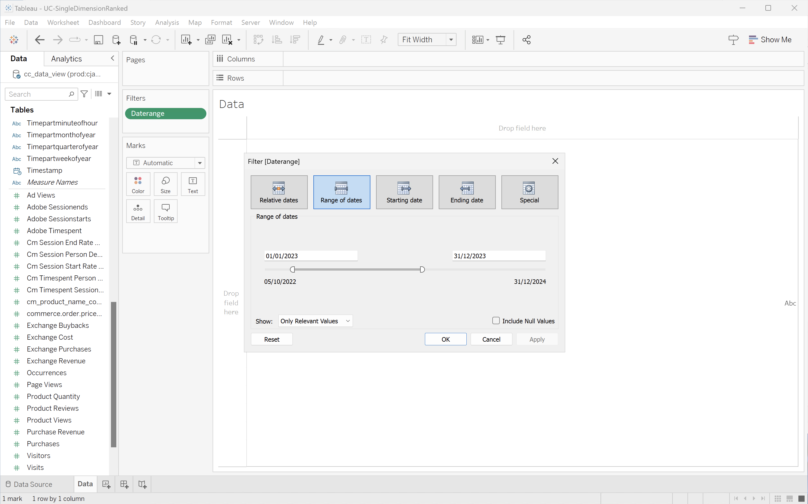

   1. **[!UICONTROL データ]** ペインの&#x200B;**[!UICONTROL テーブル]** リストから&#x200B;**[!UICONTROL 製品名]**&#x200B;をドラッグ&amp;ドロップし、**[!UICONTROL 行]**&#x200B;の横にあるフィールドにエントリをドロップします。
   1. **[!UICONTROL データ]** ペインの&#x200B;**[!UICONTROL テーブル （*メジャー名*）]** リストから&#x200B;**[!UICONTROL 購入]**&#x200B;をドラッグ&amp;ドロップし、**[!UICONTROL 行]**&#x200B;の横にあるフィールドにエントリをドロップします。 値は自動的に&#x200B;**[!UICONTROL SUM （Purchases）]**&#x200B;に変換されます。
   1. **[!UICONTROL データ]** ペインの&#x200B;**[!UICONTROL テーブル （*メジャー名*）]** リストから&#x200B;**[!UICONTROL 購入収益]**&#x200B;をドラッグ&amp;ドロップし、**[!UICONTROL 列]**&#x200B;の横にあるフィールドのエントリをドロップし、**[!UICONTROL SUM （購入）]**&#x200B;から左に移動します。 値は自動的に&#x200B;**[!UICONTROL SUM （購入収益）]**&#x200B;に変換されます。
   1. 両方のチャートを購入収益の降順で並べ替えるには、**[!UICONTROL 購入収益]** タイトルにカーソルを合わせて並べ替えアイコンを選択します。
   1. グラフのエントリ数を制限するには、**[!UICONTROL 行]**&#x200B;の&#x200B;**[!UICONTROL SUM （購入収益）]**&#x200B;を選択し、ドロップダウンメニューから&#x200B;**[!UICONTROL フィルター]**&#x200B;を選択します。
   1. **[!UICONTROL フィルター\[購入収益\]]** ダイアログで、**[!UICONTROL 値の範囲]**&#x200B;を選択し、適切な値を入力します。 例：`1,000,000` - `2,000,000`。 **[!UICONTROL 適用]**&#x200B;と&#x200B;**[!UICONTROL OK]**&#x200B;を選択します。
   1. 2つの棒グラフを2つの組み合わせグラフに変換するには、**[!UICONTROL 行]**&#x200B;の&#x200B;**[!UICONTROL SUM （購入）]**&#x200B;を選択し、ドロップダウンメニューから&#x200B;**[!UICONTROL デュアル軸]**&#x200B;を選択します。 棒グラフは散布図に変換されます。
   1. 散布図を棒グラフに変更するには：
      1. **[!UICONTROL マーク]**&#x200B;領域の&#x200B;**[!UICONTROL SUM （購入）]**&#x200B;を選択し、ドロップダウンメニューから&#x200B;**[!UICONTROL 行]**&#x200B;を選択します。
      1. **[!UICONTROL マーク]**&#x200B;領域の&#x200B;**[!UICONTROL SUM （購入収益）]**&#x200B;を選択し、ドロップダウンメニューから&#x200B;**[!UICONTROL バー]**&#x200B;を選択します。

   Tableau デスクトップは以下のようになります。

   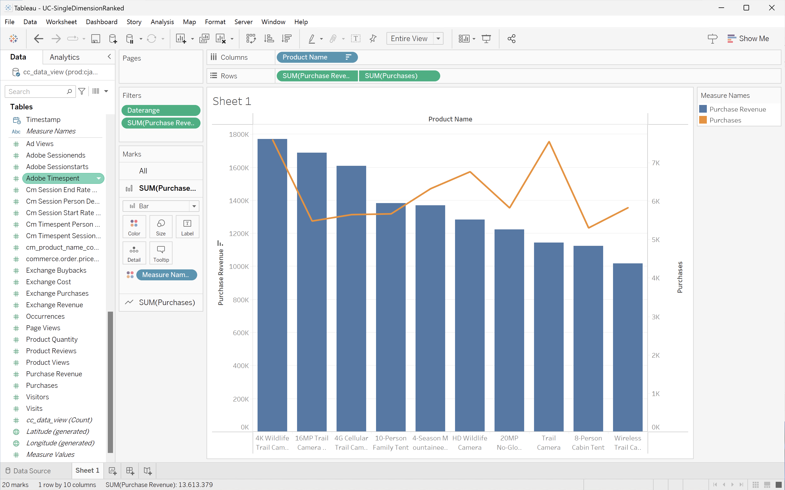

1. 「**[!UICONTROL シート 1]**」タブのコンテキストメニューから「**[!UICONTROL 複製]**」を選択して、2番目のシートを作成します。
1. 「**[!UICONTROL シート 1]**」タブのコンテキストメニューから「**[!UICONTROL 名前を変更]**」を選択して、シートの名前を`Data`に変更します。
1. 「**[!UICONTROL シート 1 （2）]**」タブのコンテキストメニューから「**[!UICONTROL 名前を変更]**」を選択して、シートの名前を`Graph`に変更します。
1. **[!UICONTROL Data]** シートが選択されていることを確認します。
   1. 右上の&#x200B;**[!UICONTROL 表示]**&#x200B;を選択し、**[!UICONTROL テキストテーブル]** （左上のビジュアライゼーション）を選択して、2つのグラフの内容をテーブルに変更します。
   1. 購買収益を降順で注文するには、テーブルの&#x200B;**[!UICONTROL 購入収益]**&#x200B;にカーソルを合わせ、を選択します。
   1. 「**[!UICONTROL フィット]**」ドロップダウンメニューから「**[!UICONTROL ビュー全体]**」を選択します。

   Tableau デスクトップは以下のようになります。

   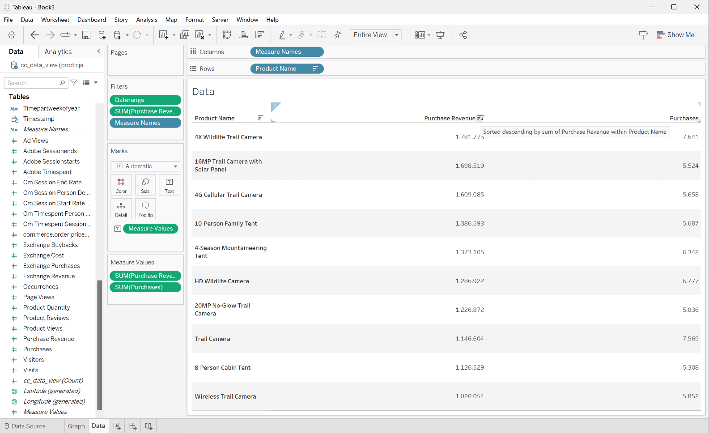

1. 「**[!UICONTROL 新しいダッシュボード]**」タブボタン（下部）を選択して、新しい&#x200B;**[!UICONTROL ダッシュボード 1]** ビューを作成します。 **[!UICONTROL ダッシュボード 1]** ビューで、次の操作を行います。
   1. **[!UICONTROL グラフ]** シートを&#x200B;**[!UICONTROL シート]** シェルフから&#x200B;*シートをここにドロップ*&#x200B;する&#x200B;**[!UICONTROL ダッシュボード 1]** ビューにドラッグ&amp;ドロップします。
   1. **[!UICONTROL グラフ]** シートの下の&#x200B;**[!UICONTROL シート]** シェルフから&#x200B;**[!UICONTROL データ]** シートを&#x200B;**[!UICONTROL ダッシュボード 1]** ビューにドラッグ&amp;ドロップします。
   1. ビューで&#x200B;**[!UICONTROL データ]** シートを選択し、**[!UICONTROL ビュー全体]**&#x200B;を&#x200B;**[!UICONTROL 幅を修正]**&#x200B;に変更します。

   **[!UICONTROL ダッシュボード 1]** ビューは次のようになります。

   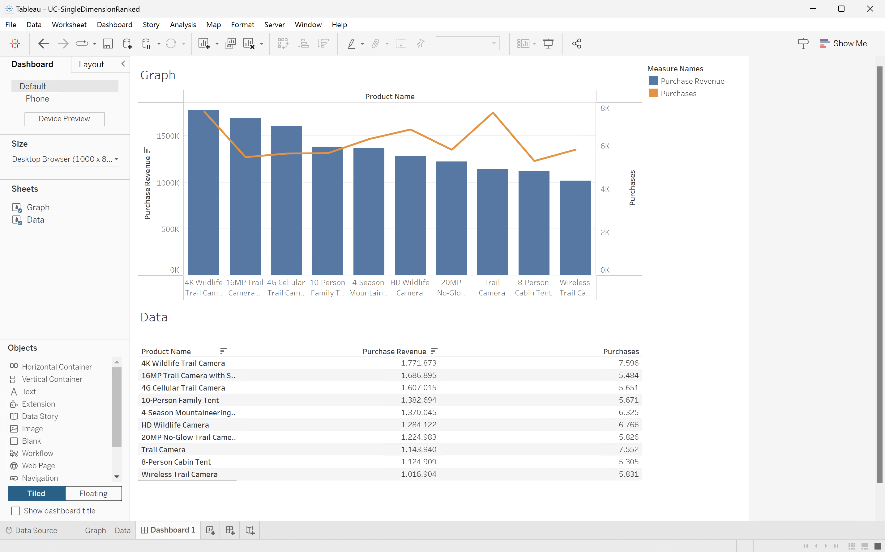


>[!TAB Looker]

1. Lookerの&#x200B;**[!UICONTROL Explore]** インターフェイスで、クリーンな設定が行われていることを確認します。 そうでない場合は、 **[!UICONTROL フィールドとフィルターの削除]**&#x200B;を選択します。
1. 「**[!UICONTROL フィルター]**」の下の「**[!UICONTROL + フィルター]**」を選択します。
1. **[!UICONTROL フィルターを追加]** ダイアログ：
   1. **[!UICONTROL ‣ Cc データビュー]**&#x200B;を選択
   1. フィールドのリストから、**[!UICONTROL &rbrace;‣ Daterange Date]**、次に&#x200B;**[!UICONTROL Daterange Date]**&#x200B;を選択します。
      
1. **[!UICONTROL Cc データビューの日付変更日]** フィルターを&#x200B;**[!UICONTROL が範囲]** **[!UICONTROL 2023/01/01]** **[!UICONTROL から（前）]** **[!UICONTROL 2024/01/01]**&#x200B;に指定します。
1. 左側のパネルの&#x200B;**[!UICONTROL ‣ Cc データビュー]** セクションから、**[!UICONTROL 製品名]**&#x200B;を選択します。
1. 左側のパネルの&#x200B;**[!UICONTROL ‣カスタムフィールド]** セクションから：
   1. 「**[!UICONTROL + Add]**」ドロップダウンメニューから「**[!UICONTROL Custom Measure]**」を選択します。
   1. **[!UICONTROL カスタムメジャーを作成]** ダイアログで、次の操作を行います。
      1. **[!UICONTROL フィールドから**&#x200B;[!UICONTROL &#x200B;購入収益&#x200B;]&#x200B;**を選択して]** ドロップダウンメニューを測定します。
      1. 「**[!UICONTROL Measure type]**」ドロップダウンメニューから「**[!UICONTROL Sum]**」を選択します。
      1. **[!UICONTROL 名前]**&#x200B;のカスタムフィールド名を入力してください。 例：`Purchase Revenue`。
      1. 「**[!UICONTROL フィールドの詳細]**」タブを選択します。
      1. **[!UICONTROL 形式]** ドロップダウンメニューから&#x200B;**[!UICONTROL 小数点]**&#x200B;を選択し、`0`が&#x200B;**[!UICONTROL 小数点]**&#x200B;に入力されていることを確認します。
         
      1. 「**[!UICONTROL 保存]**」を選択します。
   1. 「**[!UICONTROL + Add]**」ドロップダウンメニューから「**[!UICONTROL Custom Measure]**」をもう一度選択します。 **[!UICONTROL カスタム]**&#x200B;測定を作成ダイアログで、次の操作を行います。
      1. **[!UICONTROL フィールドから**&#x200B;[!UICONTROL &#x200B;購入&#x200B;]&#x200B;**を選択して]** ドロップダウンメニューを測定します。
      1. 「**[!UICONTROL Measure type]**」ドロップダウンメニューから「**[!UICONTROL Sum]**」を選択します。
      1. **[!UICONTROL 名前]**&#x200B;のカスタムフィールド名を入力してください。 例：`Sum of Purchases`。
      1. 「**[!UICONTROL フィールドの詳細]**」タブを選択します。
      1. **[!UICONTROL 形式]** ドロップダウンメニューから&#x200B;**[!UICONTROL 小数点]**&#x200B;を選択し、`0`が&#x200B;**[!UICONTROL 小数点]**&#x200B;に入力されていることを確認します。
      1. 「**[!UICONTROL 保存]**」を選択します。
   1. 両方のフィールドがデータビューに自動的に追加されます。
1. **[!UICONTROL + フィルター]**&#x200B;を選択して、別の&#x200B;**[!UICONTROL フィルター]**&#x200B;を追加し、データを制限します。
1. **[!UICONTROL フィルターを追加]** ダイアログで、**[!UICONTROL ‣カスタムフィールド]**&#x200B;を選択し、**[!UICONTROL 購入収益]**&#x200B;を選択します。
1. 適切な選択を行い、提案された値を入力します。これにより、フィルターの読み取り&#x200B;**[!UICONTROL は]**&#x200B;個の`1000000`個の&#x200B;**[!UICONTROL と]**&#x200B;個の`2000000`の間になります。
1. **[!UICONTROL 実行]**&#x200B;を選択します。
1. 行のビジュアライゼーションを表示するには、**[!UICONTROL ‣ ビジュアライゼーション]**&#x200B;を選択します。
1. **[!UICONTROL ビジュアライゼーション]**&#x200B;の&#x200B;**[!UICONTROL 編集]**&#x200B;を選択して、ビジュアライゼーションを更新します。 ポップアップダイアログで以下を行います。
   1. 「**[!UICONTROL シリーズ]**」タブを選択します。
   1. 下にスクロールして&#x200B;**[!UICONTROL 購入履歴]**&#x200B;を表示し、**[!UICONTROL 種類]**&#x200B;を&#x200B;**[!UICONTROL 行]**&#x200B;に変更します。
   1. 「**[!UICONTROL Y]**」タブを選択します。
   1. **[!UICONTROL 購入]**&#x200B;を&#x200B;**[!UICONTROL 左1]** コンテナから&#x200B;**[!UICONTROL *シリーズをここにドラッグして、新しい左軸&#x200B;*]**&#x200B;を作成します。 このアクションにより、**[!UICONTROL &#x200B;左2 &#x200B;]**&#x200B;コンテナが作成されます。
      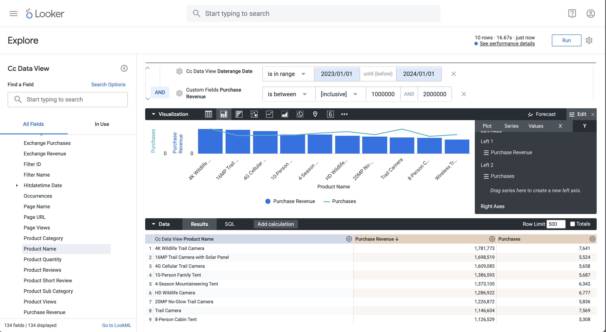
   1. **[!UICONTROL 編集]**&#x200B;の横にあるを選択して、ポップアップダイアログを非表示にします

次のようなビジュアライゼーションと表が表示されます。

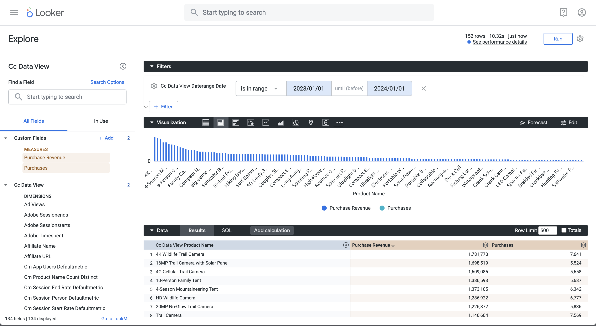


>[!TAB Jupyter Notebook]

1. 新しいセルに次のステートメントを入力します。

   ```
   import seaborn as sns
   import matplotlib.pyplot as plt
   data = %sql SELECT product_name AS `Product Name`, SUM(purchase_revenue) AS `Purchase Revenue`, SUM(purchases) AS `Purchases` \
               FROM cc_data_view \
               WHERE daterange BETWEEN '2023-01-01' AND '2024-01-01' \
               GROUP BY 1 \
               LIMIT 10;
   df = data.DataFrame()
   df = df.groupby('Product Name', as_index=False).sum()
   plt.figure(figsize=(15, 3))
   sns.barplot(x='Purchase Revenue', y='Product Name', data=df)
   plt.show()
   display(data)
   ```

1. セルを実行します。 以下のスクリーンショットのような出力が表示されます。

   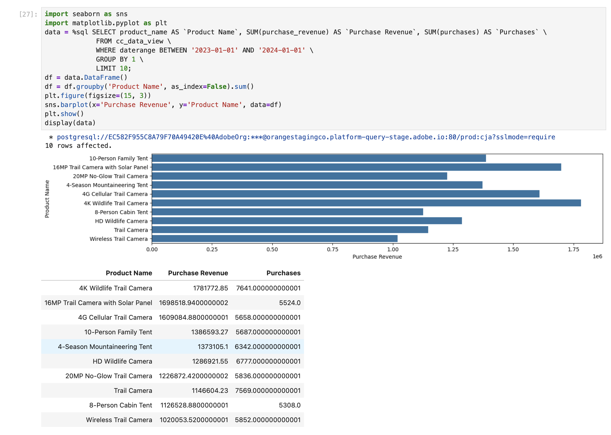


>[!TAB RStudio]

1. 新しいチャンクに次のコードブロックを入力します。

   ```R
   library(tidyr)
   
   ## Single dimension ranked
   df <- dv %>%
      filter(daterange >= "2023-01-01" & daterange < "2024-01-01") %>%
      group_by(product_name) %>%
      summarise(purchase_revenue = sum(purchase_revenue), purchases = sum(purchases)) %>%
      arrange(product_name, .by_group = FALSE)
   dfV <- df %>%
      head(5)
   ggplot(dfV, aes(x = purchase_revenue, y = product_name)) +
      geom_col(position = "dodge") +
      geom_text(aes(label = purchase_revenue), vjust = -0.5)
   print(df)
   ```

1. チャンクを実行します。 以下のスクリーンショットのような出力が表示されます。

   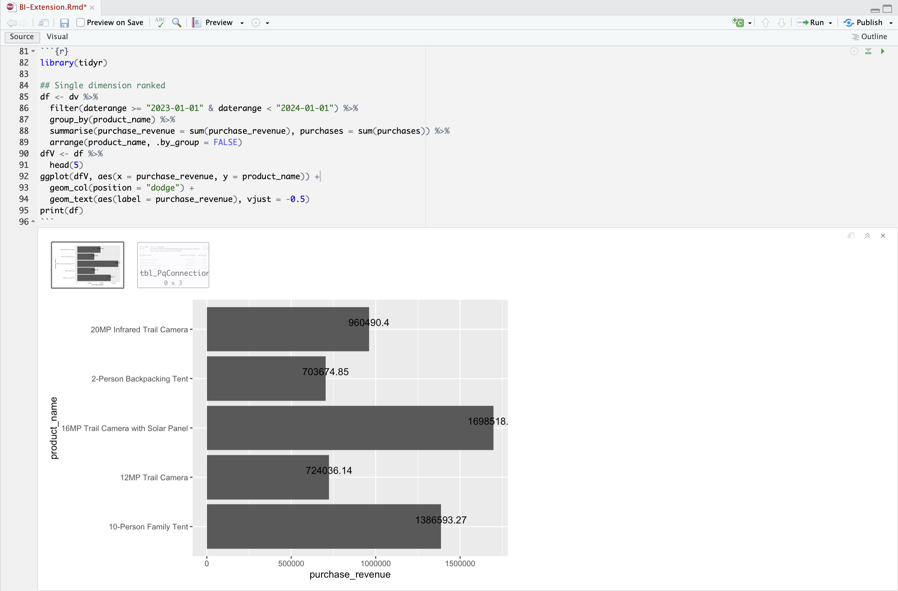

>[!ENDTABS]

+++
