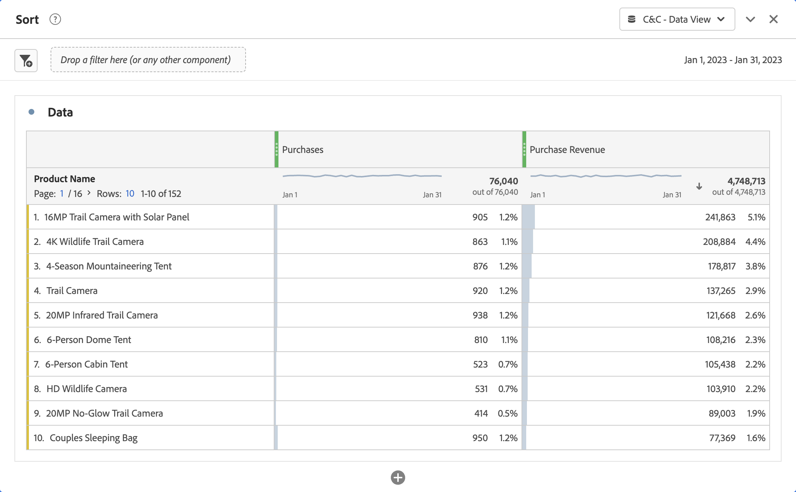
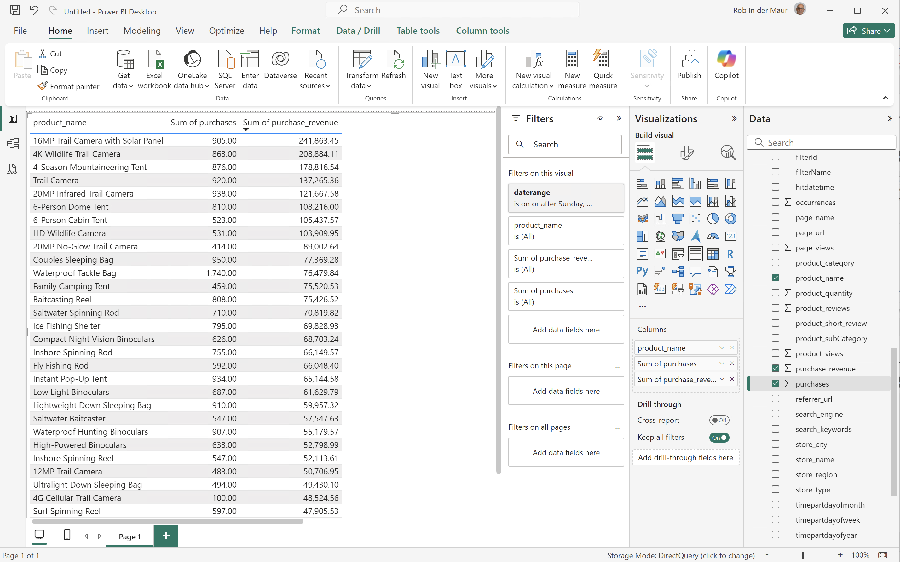
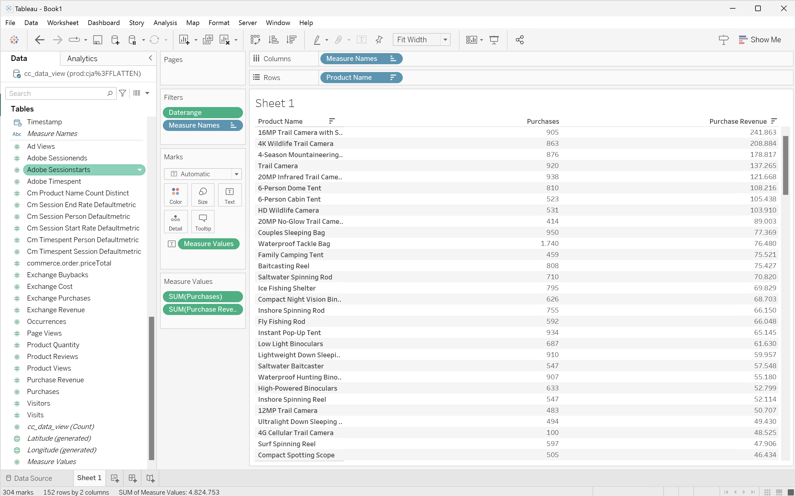
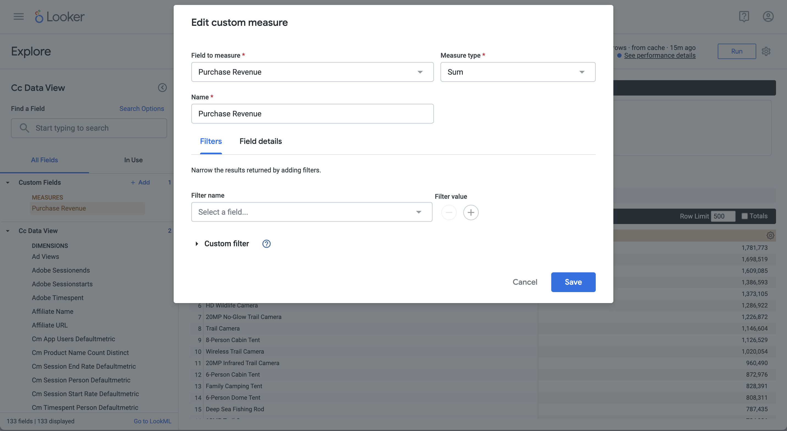
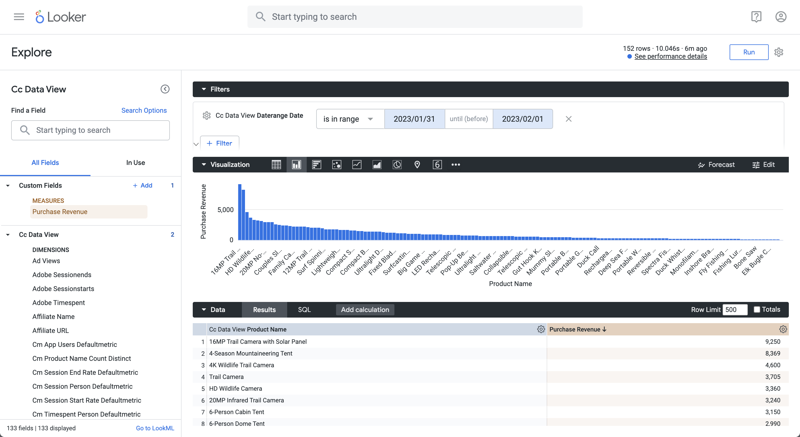
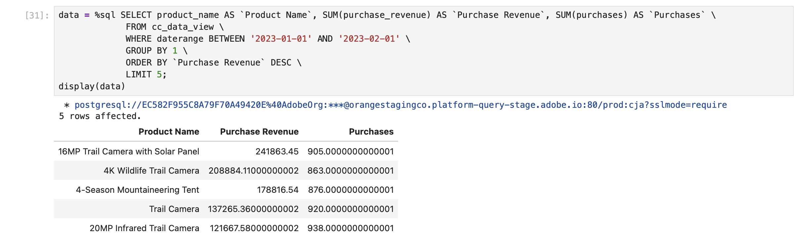
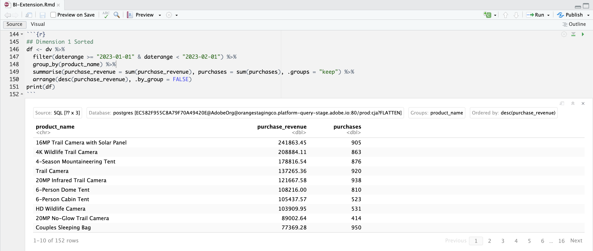

# 並べ替え


このユースケースでは、2023年1月の購入収益と製品名の購入を、購入収益の降順で並べ替えてレポートする必要があります。

+++ Customer Journey Analytics

使用例の&#x200B;**[!UICONTROL 並べ替え]** パネルの例：



+++

+++ BI ツール

>[!PREREQUISITES]
>
>接続が成功したことを[検証し、データビューを一覧表示でき、このユースケースを試すBI ツールにデータビュー](connect-and-validate.md)を使用していることを確認します。
>

>[!BEGINTABS]

>[!TAB Power BI デスクトップ ]

1. **[!UICONTROL データ]** ペインで、次の操作を行います。
   1. **[!UICONTROL daterange]**&#x200B;を選択します。
   1. **[!UICONTROL product_namr]**&#x200B;を選択します。
   1. **[!UICONTROL sum purchase_revenue]**&#x200B;を選択します。
   1. **[!UICONTROL 購入額の合計]**&#x200B;を選択します。

1. **[!UICONTROL フィルター]** ペインで、次の操作を行います。
   1. このビジュアル ]**の**[!UICONTROL  フィルターから&#x200B;**[!UICONTROL daterange is （All）]**&#x200B;を選択します。
   1. **[!UICONTROL 詳細フィルタリング]**&#x200B;を&#x200B;**[!UICONTROL フィルタータイプ]**&#x200B;として選択します。
   1. 値&#x200B;]****[!UICONTROL &#x200B;が&#x200B;]**`1/1/2023`**[!UICONTROL &#x200B;および&#x200B;]****[!UICONTROL &#x200B;が&#x200B;]**`2/1/2023`より前の場合に、**[!UICONTROL &#x200B;項目を表示するようにフィルターを定義します。

1. ビジュアライゼーションペインで、次の操作を行います。
   1. を選択して、列からデータレンジを削除します。
   1. **[!UICONTROL 購入額の合計]**&#x200B;を&#x200B;**[!UICONTROL 列]**&#x200B;項目の一番下にドラッグします。

1. レポートで、**[!UICONTROL 購入収益の合計]**&#x200B;を選択して、購入収益の降順でテーブルを並べ替えます。

   Power BI デスクトップは以下のようになります。

   日付範囲名をフィルターに使用する

BI拡張機能を使用してPower BI Desktopで実行されるクエリに`sort` ステートメントが含まれていません。 `sort` ステートメントがないことは、並べ替えがクライアントサイドで実行されることを意味します。

```sql
select "_"."product_name",
    "_"."a0",
    "_"."a1"
from 
(
    select "rows"."product_name" as "product_name",
        sum("rows"."purchases") as "a0",
        sum("rows"."purchase_revenue") as "a1"
    from 
    (
        select "_"."daterangeName",
            "_"."daterange",
            "_"."filterId",
            "_"."filterName",
            "_"."timestamp",
            "_"."affiliate_name",
            "_"."affiliate_url",
            "_"."commerce.order.priceTotal",
            "_"."customer_city",
            "_"."customer_region",
            "_"."daterangeday",
            "_"."daterangefifteenminute",
            "_"."daterangefiveminute",
            "_"."daterangehour",
            "_"."daterangeminute",
            "_"."daterangemonth",
            "_"."daterangequarter",
            "_"."daterangesecond",
            "_"."daterangethirtyminute",
            "_"."daterangeweek",
            "_"."daterangeyear",
            "_"."hitdatetime",
            "_"."page_name",
            "_"."page_url",
            "_"."product_category",
            "_"."product_name",
            "_"."product_short_review",
            "_"."product_subCategory",
            "_"."referrer_url",
            "_"."search_engine",
            "_"."search_keywords",
            "_"."store_city",
            "_"."store_name",
            "_"."store_region",
            "_"."store_type",
            "_"."timepartdayofmonth",
            "_"."timepartdayofweek",
            "_"."timepartdayofyear",
            "_"."timeparthourofday",
            "_"."timepartminuteofhour",
            "_"."timepartmonthofyear",
            "_"."timepartquarterofyear",
            "_"."timepartweekofyear",
            "_"."cm_session_end_rate_defaultmetric",
            "_"."cm_session_person_defaultmetric",
            "_"."cm_session_start_rate_defaultmetric",
            "_"."cm_timespent_person_defaultmetric",
            "_"."cm_timespent_session_defaultmetric",
            "_"."cm_product_name_count_distinct",
            "_"."ad_views",
            "_"."adobe_sessionends",
            "_"."adobe_sessionstarts",
            "_"."adobe_timespent",
            "_"."exchange_buybacks",
            "_"."exchange_cost",
            "_"."exchange_purchases",
            "_"."exchange_revenue",
            "_"."occurrences",
            "_"."page_views",
            "_"."product_quantity",
            "_"."product_reviews",
            "_"."product_views",
            "_"."purchase_revenue",
            "_"."purchases",
            "_"."visitors",
            "_"."visits"
        from "public"."cc_data_view" "_"
        where "_"."daterange" < date '2023-02-01' and "_"."daterange" >= date '2023-01-01'
    ) "rows"
    group by "product_name"
) "_"
where not "_"."a0" is null or not "_"."a1" is null
limit 1000001
```


>[!TAB Tableau Desktop]

1. 下部の「**[!UICONTROL シート 1]**」タブを選択して、**[!UICONTROL データソース]**&#x200B;から切り替えます。 **[!UICONTROL シート 1]** ビューで：
   1. **[!UICONTROL フィルター]** シェルフの&#x200B;**[!UICONTROL テーブル]** リストから&#x200B;**[!UICONTROL Daterange]** エントリをドラッグします。
   1. **[!UICONTROL フィルターフィールド \[Daterange\]]** ダイアログで、**[!UICONTROL 日付の範囲]**&#x200B;を選択し、**[!UICONTROL 次>]**&#x200B;を選択します。
   1. **[!UICONTROL フィルター\[Daterange\]]** ダイアログで、**[!UICONTROL 日付の範囲]**&#x200B;を選択し、`01/01/2023` ～ `1/2/2023`を選択します。 **[!UICONTROL 適用]**&#x200B;と&#x200B;**[!UICONTROL OK]**&#x200B;を選択します。
   1. **[!UICONTROL 製品名]**&#x200B;を&#x200B;**[!UICONTROL 表]** リストからドラッグし、**[!UICONTROL 行]**&#x200B;の横にあるフィールドにエントリをドロップします。
   1. **[!UICONTROL 購入]** エントリを&#x200B;**[!UICONTROL 表]** リストからドラッグし、**[!UICONTROL 列]**&#x200B;の横にあるフィールドにエントリをドロップします。 値が&#x200B;**[!UICONTROL SUM （Purchases）]**&#x200B;に変更されます。
   1. **[!UICONTROL 購入収益]** エントリを&#x200B;**[!UICONTROL 表]** リストからドラッグし、**[!UICONTROL 列]**&#x200B;の横、**[!UICONTROL 合計（購入）]**&#x200B;の横のフィールドにエントリをドロップします。 値が&#x200B;**[!UICONTROL SUM （購入収益）]**&#x200B;に変更されます。
   1. **[!UICONTROL 自分を表示]**&#x200B;から&#x200B;**[!UICONTROL テキストテーブル]**&#x200B;を選択します。
   1. 「**[!UICONTROL フィット]**」ドロップダウンメニューから「**[!UICONTROL フィット幅]**」を選択します。
   1. **[!UICONTROL 購入収益]**&#x200B;列ヘッダーを選択し、この列のテーブルを降順で並べ替えます。

      Tableau デスクトップは以下のようになります。

      

BI拡張機能を使用してTableau Desktopで実行されるクエリには、`sort` ステートメントが含まれていません。 この`sort`文が存在しないということは、並べ替えがクライアントサイドで実行されることを意味します。

```sql
SELECT CAST("cc_data_view"."product_name" AS TEXT) AS "product_name",
  SUM("cc_data_view"."occurrences") AS "sum:occurrences:ok",
  SUM("cc_data_view"."purchase_revenue") AS "sum:purchase_revenue:ok",
  SUM("cc_data_view"."purchases") AS "sum:purchases:ok"
FROM "public"."cc_data_view" "cc_data_view"
WHERE (("cc_data_view"."daterange" >= (DATE '2023-01-01')) AND ("cc_data_view"."daterange" <= (DATE '2023-02-01')))
GROUP BY 1
```

>[!TAB Looker]

1. Lookerの&#x200B;**[!UICONTROL Explore]** インターフェイスで、接続を更新します。 「 **[!UICONTROL キャッシュをクリアして更新]**」を選択します。
1. Lookerの&#x200B;**[!UICONTROL Explore]** インターフェイスで、クリーンな設定が行われていることを確認します。 そうでない場合は、 **[!UICONTROL フィールドとフィルターの削除]**&#x200B;を選択します。
1. 「**[!UICONTROL フィルター]**」の下の「**[!UICONTROL + フィルター]**」を選択します。
1. **[!UICONTROL フィルターを追加]** ダイアログ：
   1. **[!UICONTROL ‣ Cc データビュー]**&#x200B;を選択
   1. フィールドのリストから、**[!UICONTROL }‣ Daterange Date]**、次に&#x200B;**[!UICONTROL Daterange Date]**を選択します。
      
1. **[!UICONTROL Cc データビューの日付変更日]** フィルターを&#x200B;**[!UICONTROL が範囲]** **[!UICONTROL 2023/01/01]** **[!UICONTROL から（前）]** **[!UICONTROL 2023/02/01]**&#x200B;に指定します。
1. 左側のパネルの&#x200B;**[!UICONTROL ‣ Cc データビュー]** セクションから、**[!UICONTROL 製品名]**&#x200B;を選択します。
1. 左側のパネルの&#x200B;**[!UICONTROL ‣カスタムフィールド]** セクションから：
   1. 「**[!UICONTROL + Add]**」ドロップダウンメニューから「**[!UICONTROL Custom Measure]**」を選択します。
   1. **[!UICONTROL カスタムメジャーを作成]** ダイアログで、次の操作を行います。
      1. **[!UICONTROL フィールドから**[!UICONTROL &#x200B;購入収益&#x200B;]**を選択して]** ドロップダウンメニューを測定します。
      1. 「**[!UICONTROL Measure type]**」ドロップダウンメニューから「**[!UICONTROL Sum]**」を選択します。
      1. **[!UICONTROL 名前]**&#x200B;のカスタムフィールド名を入力してください。 例：`Sum of Purchase Revenue`。
      1. 「**[!UICONTROL フィールドの詳細]**」タブを選択します。
      1. **[!UICONTROL 形式]** ドロップダウンメニューから&#x200B;**[!UICONTROL 小数点]**&#x200B;を選択し、`0`が&#x200B;**[!UICONTROL 小数点]**に入力されていることを確認します。
         
      1. 「**[!UICONTROL 保存]**」を選択します。
1. **[!UICONTROL 購入収益]**&#x200B;列で&#x200B;**[!UICONTROL ↓]** （**[!UICONTROL 降順、並べ替え順序：1]**）を選択していることを確認してください。
1. **[!UICONTROL 実行]**&#x200B;を選択します。
1. 「**[!UICONTROL 」‣ビジュアライゼーション]**&#x200B;を選択します。

次のようなビジュアライゼーションと表が表示されます。




BI拡張機能を使用してLookerで生成されたクエリには`ORDER BY`が含まれます。これは、並べ替えがLookerとBI拡張機能を使用して実行されることを意味します。

```sql
-- Looker Query Context '{"user_id":6,"history_slug":"fc83573987b999306eaf6e1a3f2cde70","instance_slug":"71d4667f0b76c0011463658f45c3f7a3"}' 
SELECT
    cc_data_view."product_name"  AS "cc_data_view.product_name",
    COALESCE(SUM(CAST(( cc_data_view."purchase_revenue"  ) AS DOUBLE PRECISION)), 0) AS "purchase_revenue"
FROM
    "public"."cc_data_view" AS "cc_data_view"
WHERE ((( cc_data_view."daterange"  ) >= (DATE_TRUNC('day', DATE '2024-01-31')) AND ( cc_data_view."daterange"  ) < (DATE_TRUNC('day', DATE '2023-02-01'))))
GROUP BY
    1
ORDER BY
    2 DESC
FETCH NEXT 500 ROWS ONLY
```


>[!TAB Jupyter Notebook]

1. 新しいセルに次のステートメントを入力します。

   ```python
   data = %sql SELECT product_name AS `Product Name`, SUM(purchase_revenue) AS `Purchase Revenue`, SUM(purchases) AS `Purchases` \
               FROM cc_data_view \
               WHERE daterange BETWEEN '2023-01-01' AND '2023-02-01' \
               GROUP BY 1 \
               ORDER BY `Purchase Revenue` DESC \
               LIMIT 5;
   display(data)
   ```

1. セルを実行します。 以下のスクリーンショットのような出力が表示されます。

   

クエリは、Jupyter Notebookで定義されているBI拡張機能によって実行されます。


>[!TAB RStudio]

1. 新しいチャンクに次のコードブロックを入力します。

   ```R
   ## Dimension 1 Sorted
   df <- dv %>%
      filter(daterange >= "2023-01-01" & daterange < "2023-02-01") %>%
      group_by(product_name) %>%
      summarise(purchase_revenue = sum(purchase_revenue), purchases = sum(purchases), .groups = "keep") %>%
      arrange(desc(purchase_revenue), .by_group = FALSE)
   print(df)
   ```

1. チャンクを実行します。 以下のスクリーンショットのような出力が表示されます。

   

BI拡張機能を使用してRStudioが生成したクエリには`ORDER BY`が含まれます。これは、注文がRStudioおよびBI拡張機能を通じて適用されることを意味します。

```sql
SELECT
  "product_name",
  SUM("purchase_revenue") AS "purchase_revenue",
  SUM("purchases") AS "purchases"
FROM (
  SELECT "cc_data_view".*
  FROM "cc_data_view"
  WHERE ("daterange" >= '2023-01-01' AND "daterange" < '2023-02-01')
) AS "q01"
GROUP BY "product_name"
ORDER BY "purchase_revenue" DESC
LIMIT 1000
```

>[!ENDTABS]

+++
