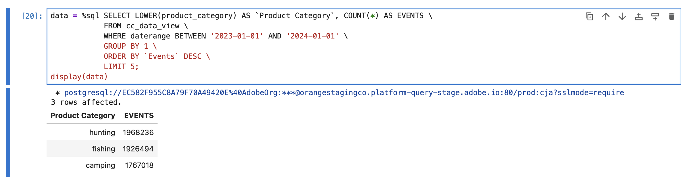

# 変換


様々な BI ツールによる、ディメンション、指標、フィルター、計算指標、日付範囲などのCustomer Journey Analytics オブジェクトの変換を理解します。

+++ Customer Journey Analytics

Customer Journey Analyticsでは、データセットのコンポーネントを [ ディメンション ](/help/data-views/data-views.md) および [ 指標 ](/help/components/dimensions/overview.md) として公開する方法を [ データビュー ](/help/components/apply-create-metrics.md) で定義します。 このディメンションと指標の定義は、BI 拡張機能を使用して BI ツールに公開されます。
[ フィルター ](/help/components/segments/seg-overview.md)、[ 計算指標 ](/help/components/calc-metrics/calc-metr-overview.md)、[ 日付範囲 ](/help/components/date-ranges/overview.md) などのコンポーネントをWorkspace プロジェクトの一部として使用します。 これらのコンポーネントは、BI 拡張機能を使用して BI ツールにも公開されます。

+++

+++ BI ツール

>[!PREREQUISITES]
>
>このユースケースを試す BI ツールについて、[ 接続に成功し、データビューをリストし、データビューを使用できる ](connect-and-validate.md) ことを検証したことを確認します。
>

>[!BEGINTABS]

>[!TAB Power BI デスクトップ ]

Customer Journey Analytics オブジェクトは「**[!UICONTROL データ]**」ペインで使用でき、Power BI Desktop で選択したテーブルから取得されます。 例えば、**[!UICONTROL public.cc_data_view]** と指定します。 テーブルの名前は、Customer Journey Analyticsのデータビューに対して定義した外部 ID と同じです。 例えば、**[!UICONTROL タイトル]**`C&C - Data View` と **[!UICONTROL 外部 ID]**`cc_data_view` のデータビューなどです。

**寸法**
Customer Journey Analytics内のディメンションは、[!UICONTROL  コンポーネント ID] で識別されます。 [!UICONTROL  コンポーネント ID] は、Customer Journey Analytics データビューで定義されます。 例えば、Customer Journey Analyticsのディメンション **[!UICONTROL 製品名]** には、Power BI Desktop のディメンションの名前である [!UICONTROL  コンポーネント ID]**[!UICONTROL product_name]** が含まれています。
**[!UICONTROL 日]**、**[!UICONTROL 週]**、**[!UICONTROL 月]** など、Customer Journey Analyticsの日付範囲ディメンションは、**[!UICONTROL daterangeday]**、**[!UICONTROL daterangeweek]**、**[!UICONTROL daterangemonth]** などの形式で使用できます。

**指標**
Customer Journey Analyticsの指標は、[!UICONTROL  コンポーネント ID] で識別されます。 [!UICONTROL  コンポーネント ID] は、Customer Journey Analytics データビューで定義されます。 例えば、Customer Journey Analyticsの **[!UICONTROL 購入売上高]** 指標には、Power BI Desktop の指標の名前である [!UICONTROL  コンポーネント ID]**[!UICONTROL purchase_revenue]** があります。 **[!UICONTROL ∑]** は指標を示します。 任意のビジュアライゼーションで指標を使用すると、指標の名前が **[!UICONTROL 合計 *指標&#x200B;*]**に変更されます。

**フィルター**
Customer Journey Analyticsで定義したフィルターは、「**[!UICONTROL filterName]**」フィールドの一部として使用できます。 Power BI Desktop で **[!UICONTROL filterName]** フィールドを使用すると、使用するフィルターを指定できます。

**計算指標**
Customer Journey Analyticsで定義した計算指標は、計算指標に対して定義した [!UICONTROL  外部 ID] によって識別されます。 例えば、計算指標 **[!UICONTROL Product Name （Count Distinct）]** は [!UICONTROL External ID] **[!UICONTROL product_name_count_distinct]** を持ち、Power BI Desktop では**[!UICONTROL cm_product_name_count_distinct]**t と表示されます。

**日付範囲**
Customer Journey Analyticsで定義する日付範囲は、「**[!UICONTROL daterangeName]**」フィールドの一部として使用できます。 **[!UICONTROL daterangeName]** フィールドを使用する場合は、使用する日付範囲を指定できます。

**カスタム変換**
Power BI Desktop は、[Data Analysis Expressions （DAX） ](https://learn.microsoft.com/en-us/dax/dax-overview) を使用したカスタム変換機能を提供します。 例えば、商品名が小文字の [ 単一のディメンションのランク付け ](#single-dimension-ranked) ユースケースを実行するとします。

1. レポート表示で、棒グラフ ビジュアライゼーションを選択します。
1. データ・ペインで **[!UICONTROL product_name]** を選択します。
1. ツールバーの **[!UICONTROL 新しい列]** を選択します。
1. 式エディターで、`product_name_lower` のように `product_name_lower = LOWER('public.cc_data_view[product_name])` という名前の新しい列を定義します。
   
1. **[!UICONTROL product_name]** 列ではなく、必ず **[!UICONTROL Data]** ペインの新しい **[!UICONTROL product_name_lower]** 列を選択してください。
1. テーブルビジュアライゼーションの **[!UICONTROL 詳細]** から  を選択します。

   Power BI デスクトップは次のようになります。
   

カスタム変換の結果、SQL クエリが更新されます。 以下の SQL の例で、`lower` 関数の使用を参照してください。

```sql
select "_"."product_name_lower",
    "_"."a0",
    "_"."a1"
from 
(
    select "rows"."product_name_lower" as "product_name_lower",
        sum("rows"."purchases") as "a0",
        sum("rows"."purchase_revenue") as "a1"
    from 
    (
        select "_"."daterange" as "daterange",
            "_"."product_name" as "product_name",
            "_"."purchase_revenue" as "purchase_revenue",
            "_"."purchases" as "purchases",
            lower("_"."product_name") as "product_name_lower"
        from 
        (
            select "_"."daterange",
                "_"."product_name",
                "_"."purchase_revenue",
                "_"."purchases"
            from 
            (
                select "daterange",
                    "product_name",
                    "purchase_revenue",
                    "purchases"
                from "public"."cc_data_view" "$Table"
            ) "_"
            where ("_"."daterange" < date '2024-01-01' and "_"."daterange" >= date '2023-01-01') and ("_"."product_name" in ('4G Cellular Trail Camera', '4K Wildlife Trail Camera', 'Wireless Trail Camera', '8-Person Cabin Tent', '20MP No-Glow Trail Camera', 'HD Wildlife Camera', '4-Season Mountaineering Tent', 'Trail Camera', '16MP Trail Camera with Solar Panel', '10-Person Family Tent'))
        ) "_"
    ) "rows"
    group by "product_name_lower"
) "_"
where not "_"."a0" is null or not "_"."a1" is null
limit 1000001
```

>[!TAB Tableau Desktop]

Customer Journey Analytics オブジェクトは、シートで作業する際に **[!UICONTROL データ]** 側のバーで使用できます。 およびは、Tableau の **[!UICONTROL データソース]** ページの一部として選択したテーブルから取得されます。 例えば、**[!UICONTROL cc_data_view]** と指定します。 テーブルの名前は、Customer Journey Analyticsのデータビューに対して定義した外部 ID と同じです。 例えば、**[!UICONTROL タイトル]**`C&C - Data View` と **[!UICONTROL 外部 ID]**`cc_data_view` のデータビューなどです。

**寸法**
Customer Journey Analytics内のディメンションは、[!UICONTROL  コンポーネント名 ] で識別されます。 [!UICONTROL  コンポーネント名 ] は、Customer Journey Analytics データビューで定義されます。 例えば、Customer Journey Analyticsのディメンション **[!UICONTROL 製品名]** には、Tableau のディメンションの名前である [!UICONTROL  コンポーネント名 ]**[!UICONTROL 製品名]** が含まれています。 すべてのディメンションは、**[!UICONTROL Abc]** で識別されます。
**[!UICONTROL 日]**、**[!UICONTROL 週]**、**[!UICONTROL 月]** など、Customer Journey Analyticsの日付範囲ディメンションは、**[!UICONTROL Daterangeday]**、**[!UICONTROL Daterangeweek]**、**[!UICONTROL Daterangemonth]** などの形式で使用できます。 日付範囲次元を使用する場合は、ドロップダウンメニューから日付範囲次元に適用する日付または時間の適切な定義を選択する必要があります。 例えば、**[!UICONTROL Year]**、**[!UICONTROL Quarter]**、**[!UICONTROL Month]**、**[!UICONTROL Day]** などです。

**指標**
Customer Journey Analyticsの指標は、[!UICONTROL  コンポーネント名 ] で識別されます。 [!UICONTROL  コンポーネント名 ] は、Customer Journey Analytics データビューで定義されます。 例えば、Customer Journey Analyticsの **[!UICONTROL 購入売上高]** 指標には、Tableau の指標の名前である [!UICONTROL  コンポーネント名 ] **[!UICONTROL 購入売上高]** があります。 すべての指標は、**[!UICONTROL #]** によって識別されます。 任意のビジュアライゼーションで指標を使用すると、指標の名前が **[!UICONTROL Sum （*metric*）]** に変更されます。

**フィルター**
Customer Journey Analyticsで定義したフィルターは、「**[!UICONTROL フィルター名]** フィールドの一部として使用できます。 Tableau で「**[!UICONTROL フィルター名]**」フィールドを使用する場合、使用するフィルターを指定できます。

**計算指標**
Customer Journey Analyticsで定義した計算指標は、計算指標に対して定義した [!UICONTROL  タイトル ] によって識別されます。 例えば、計算指標 **[!UICONTROL 製品名（Count Distinct）]** は [!UICONTROL  タイトル ]**[!UICONTROL 製品名（Count Distinct）]** を持ち、Tableau では **[!UICONTROL Cm 製品名の Count Distinct]** と表示されます。

**日付範囲**
Customer Journey Analyticsで定義した日付範囲は、「**[!UICONTROL Daterange Name]**」フィールドの一部として使用できます。 **[!UICONTROL Daterange Name]** フィールドを使用する場合は、使用する日付範囲を指定できます。

**カスタム変換**
Tableau Desktop は、[ 計算フィールド ](https://help.tableau.com/current/pro/desktop/en-us/calculations_calculatedfields_create.htm) を使用したカスタム変換機能を提供します。 例えば、商品名が小文字の [ 単一のディメンションのランク付け ](#single-dimension-ranked) ユースケースを実行するとします。

1. メインメニューから **[!UICONTROL 分析]**/**[!UICONTROL 計算フィールドを作成]** を選択します。
   1. 関数 **[!UICONTROL を使用して]** 小文字の製品名 `LOWER([Product Name])` を定義します。
      
   1. **[!UICONTROL OK]** を選択します。
1. **[!UICONTROL データ]** シートを選択します。
   1. **[!UICONTROL テーブル]** から **[!UICONTROL 小文字の製品名]** をドラッグし、**[!UICONTROL 行]** の横のフィールドにエントリをドロップします。
   1. **[!UICONTROL 製品名]** を **[!UICONTROL 行]** から削除します。
1. **[!UICONTROL ダッシュボード 1]** ビューを選択します。

Tableau Desktop は次のようになります。


カスタム変換の結果、SQL クエリが更新されます。 以下の SQL の例で、`LOWER` 関数の使用を参照してください。

```sql
SELECT LOWER(CAST(CAST("cc_data_view"."product_name" AS TEXT) AS TEXT)) AS "Calculation_1562467608097775616",
  SUM("cc_data_view"."purchase_revenue") AS "sum:purchase_revenue:ok",
  SUM("cc_data_view"."purchases") AS "sum:purchases:ok"
FROM "public"."cc_data_view" "cc_data_view"
WHERE (("cc_data_view"."daterange" >= (DATE '2023-01-01')) AND ("cc_data_view"."daterange" <= (DATE '2023-12-31')))
GROUP BY 1
HAVING ((SUM("cc_data_view"."purchase_revenue") >= 999999.99999998999) AND (SUM("cc_data_view"."purchase_revenue") <= 2000000.00000002))
```

>[!TAB Looker]

Customer Journey Analytics オブジェクトは、**[!UICONTROL 参照]** インターフェイスで使用できます。 およびは、Looker での接続、プロジェクト、モデルの設定の一環として取得されます。 例えば、**[!UICONTROL cc_data_view]** と指定します。 ビューの名前は、Customer Journey Analyticsのデータビューに対して定義した外部 ID と同じです。 例えば、**[!UICONTROL タイトル]**`C&C - Data View` と **[!UICONTROL 外部 ID]**`cc_data_view` のデータビューなどです。

**寸法**
Customer Journey Analyticsのディメンションは、{Cc データビュー **[!UICONTROL の左パネルに]** 2}DIMENSION **[!UICONTROL として表示されます。]**&#x200B;ディメンションは、Customer Journey Analytics データビューで定義されます。 例えば、Customer Journey Analyticsのディメンション **[!UICONTROL Product Name]** には、Looker のディメンションの名前である **[!UICONTROL DIMENSION]****[!UICONTROL Product Name]** が含まれています。
**[!UICONTROL 日]**、**[!UICONTROL 週]**、**[!UICONTROL 月]** など、Customer Journey Analyticsの日付範囲ディメンションは、**[!UICONTROL Daterangeday 日]**、**[!UICONTROL Daterangeweek 日]**、**[!UICONTROL Daterangemonth 日]** などの形式で使用できます。  日付範囲ディメンションを使用する場合は、日付または時間の適切な定義を選択する必要があります。 例えば、**[!UICONTROL Year]**、**[!UICONTROL Quarter]**、**[!UICONTROL Month]**、**[!UICONTROL Date]** などです。

**指標**
Customer Journey Analyticsの指標は、{Cc データビュー **[!UICONTROL の左レールに]** 2}DIMENSION **[!UICONTROL として表示されます。]**&#x200B;例えば、Customer Journey Analyticsの **[!UICONTROL 購入売上高]** 指標には **[!UICONTROL DIMENSION]****[!UICONTROL 購入売上高]** があります。 実際にを指標として使用するには、上記の例に示すようにカスタム測定フィールドを作成するか、ディメンションにショートカットを使用します。 例えば、「**[!UICONTROL ⋮]**」を選択し、「**[!UICONTROL 集計]**」を選択したあと、「**[!UICONTROL 合計]**」を選択します。

**フィルター**
Customer Journey Analyticsで定義したフィルターは、「**[!UICONTROL フィルター名]** フィールドの一部として使用できます。 Looker で **[!UICONTROL フィルター名]** フィールドを使用する場合、使用するフィルターを指定できます。

**計算指標**
Customer Journey Analyticsで定義した計算指標は、計算指標に対して定義した [!UICONTROL  タイトル ] によって識別されます。 例えば、計算指標 **[!UICONTROL 製品名（個別カウント）]** は [!UICONTROL  タイトル ]**[!UICONTROL 製品名（個別カウント）を持ち]** Looker では **[!UICONTROL Cm 製品名カウント個別カウント]** として表示されます。

**日付範囲**
Customer Journey Analyticsで定義した日付範囲は、「**[!UICONTROL Daterange Name]**」フィールドの一部として使用できます。 **[!UICONTROL Daterange Name]** フィールドを使用する場合は、使用する日付範囲を指定できます。

**カスタム変換**
前述のように、Looker では、カスタムフィールドビルダーを使用してカスタム変換機能を提供しています。 例えば、商品名が小文字の [ 単一のディメンションのランク付け ](#single-dimension-ranked) ユースケースを実行するとします。

1. 左パネルの「**[!UICONTROL ‣カスタムフィールド]**」セクションから：
   1. **[!UICONTROL +追加]** ドロップダウンメニューから **[!UICONTROL カスタムDimension]** を選択します。
   1. `lower(${cc_data_view.product_name})` 式 **[!UICONTROL テキスト領域に]** を入力します。 `Product Name` を入力し始めると、正しい構文で支援されます。
      
   1. `product name` 名前 **[!UICONTROL として]** と入力します。
   1. 「**[!UICONTROL 保存]**」を選択します。

次のようなテーブルが表示されます。


カスタム変換の結果、SQL クエリが更新されます。 以下の SQL の例で、`LOWER` 関数の使用を参照してください。

```sql
SELECT
    LOWER((cc_data_view."product_name")) AS "product_name",
    COALESCE(SUM(CAST(( cc_data_view."purchase_revenue"  ) AS DOUBLE PRECISION)), 0) AS "sum_of_purchase_revenue",
    COALESCE(SUM(CAST(( cc_data_view."purchases"  ) AS DOUBLE PRECISION)), 0) AS "sum_of_purchases"
FROM public.cc_data_view  AS cc_data_view
WHERE ((( cc_data_view."daterange"  ) >= (DATE_TRUNC('day', DATE '2023-01-01')) AND ( cc_data_view."daterange"  ) < (DATE_TRUNC('day', DATE '2024-01-01'))))
GROUP BY
    1
ORDER BY
    2 DESC
FETCH NEXT 500 ROWS ONLY
```

>[!TAB Jupyter Notebook]

Customer Journey Analytics オブジェクト （ディメンション、指標、フィルター、計算指標、日付範囲）は、作成する Embedded SQL クエリの一部として使用できます。 前述の例を参照してください。

**カスタム変換**

1. 新しいセルに次のステートメントを入力します。

   ```python
   data = %sql SELECT LOWER(product_category) AS `Product Category`, COUNT(*) AS EVENTS \
               FROM cc_data_view \
               WHERE daterange BETWEEN '2023-01-01' AND '2024-01-01' \
               GROUP BY 1 \
               ORDER BY `Events` DESC \
               LIMIT 5;
   display(data)
   ```

1. セルを実行します。 以下のスクリーンショットのような出力が表示されます。

   

クエリは、Jupyter Notebook で定義されているように、BI 拡張機能によって実行されます。

>[!TAB RStudio]

Customer Journey Analytics コンポーネント（ディメンション、指標、フィルター、計算指標、日付範囲）は、R 言語の同様の名前付きオブジェクトとして使用できます。 コンポーネントを使用してコンポーネントを参照します。前述の例を参照してください。

**カスタム変換**

1. 新しいチャンクで、` ```{r} ` と ` ``` ` の間に次のステートメントを入力します。

   ```R
   df <- dv %>%
      filter(daterange >= "2023-01-01" & daterange <= "2024-01-01") %>%
      mutate(d2=lower(product_category)) %>%
      group_by(d2) %>%
      count() %>%
      arrange(d2, .by_group = FALSE)
   print(df)
   ```

1. チャンクを実行します。 以下のスクリーンショットのような出力が表示されます。

   

RStudio が BI 拡張機能を使用して生成するクエリには `lower` が含まれています。これは、カスタム変換が RStudio と BI 拡張機能によって実行されることを意味します。

```sql
SELECT "d2", COUNT(*) AS "n"
FROM (
  SELECT "cc_data_view".*, lower("product_category") AS "d2"
  FROM "cc_data_view"
  WHERE ("daterange" >= '2023-01-01' AND "daterange" <= '2024-01-01')
) AS "q01"
GROUP BY "d2"
ORDER BY "d2"
LIMIT 1000
```

>[!ENDTABS]

+++

