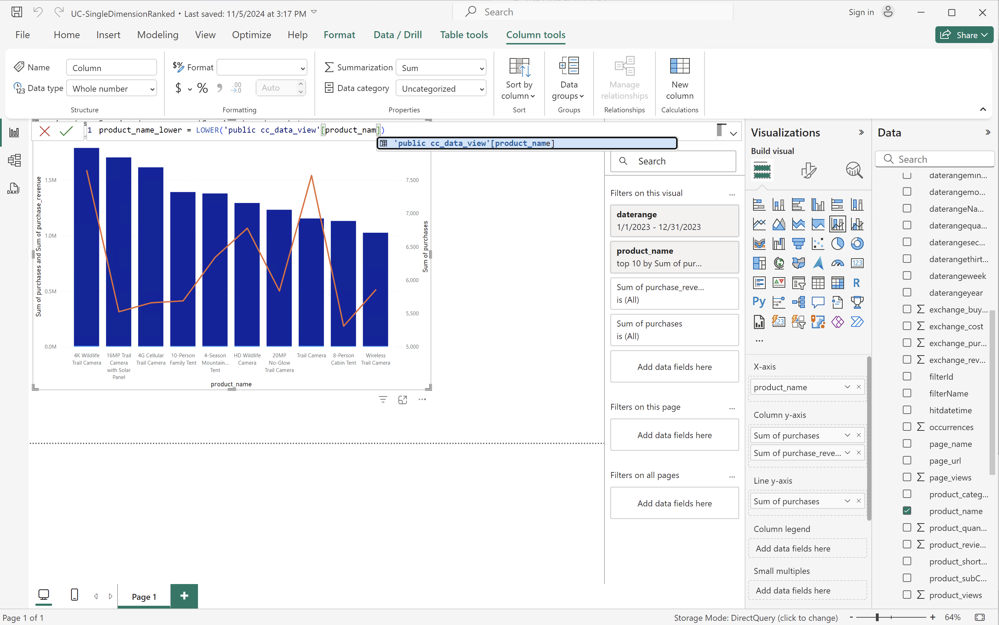
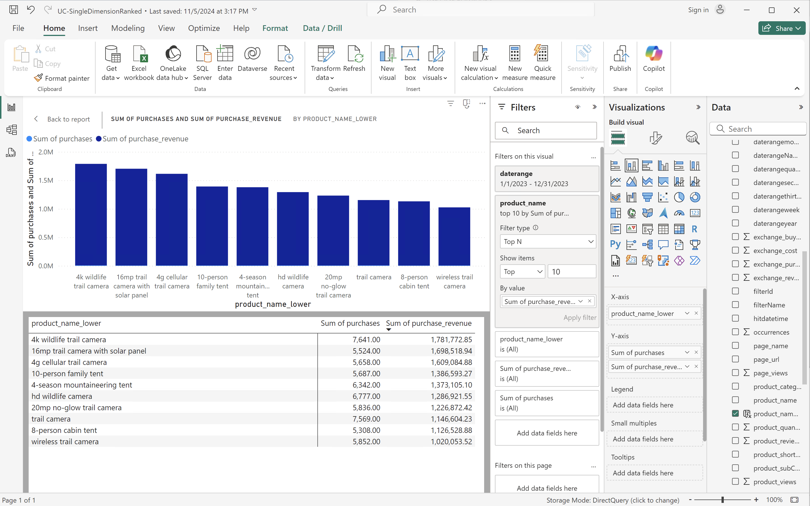
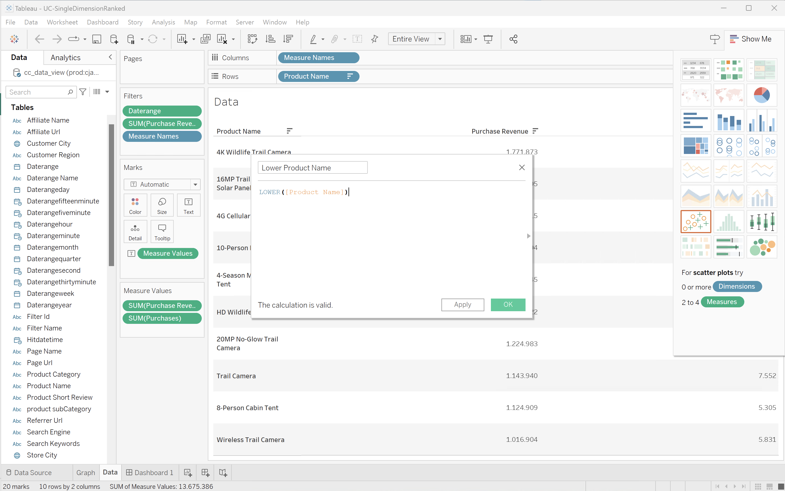
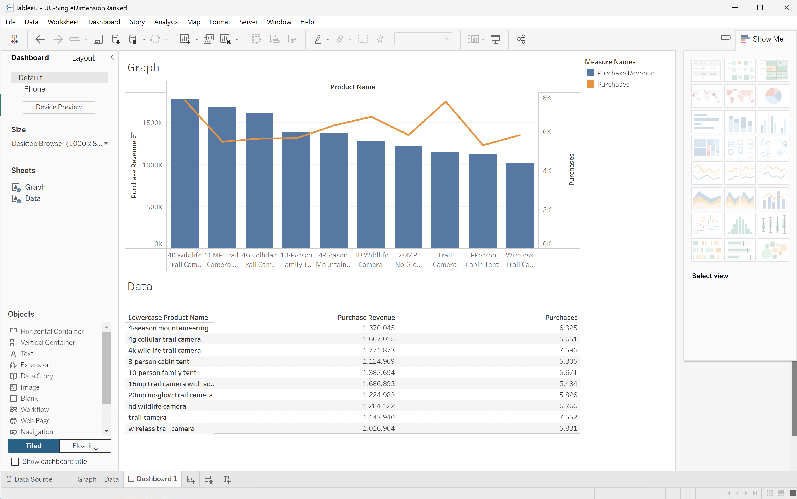
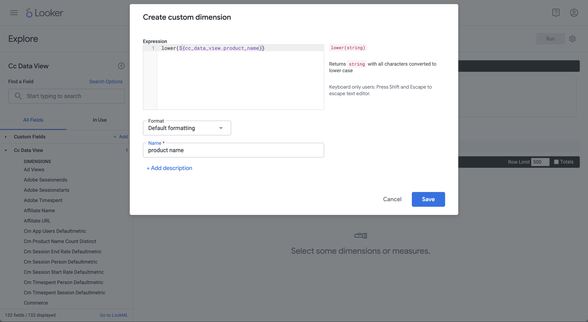
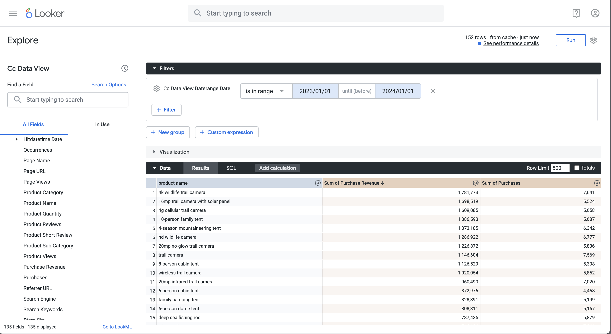
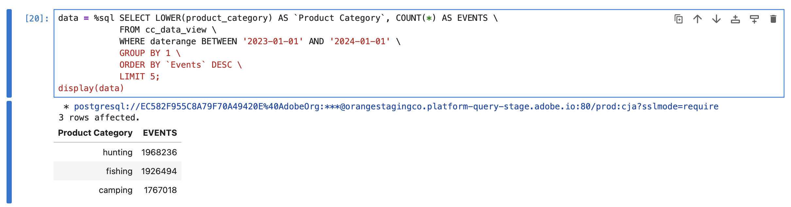
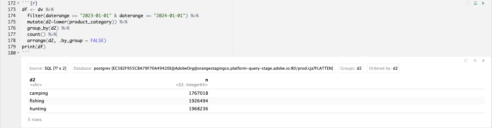

# 変形


さまざまなBI ツールを使用して、ディメンション、指標、フィルター、計算指標、日付範囲などのCustomer Journey Analyticsオブジェクトの変換を把握する必要があります。

+++ Customer Journey Analytics

Customer Journey Analyticsでは、[ データビュー](/help/data-views/data-views.md)で、データセットのコンポーネントを[ ディメンション ](/help/components/dimensions/overview.md)および[指標](/help/components/apply-create-metrics.md)として表示する方法を定義します。 ディメンションと指標のその定義は、BI拡張機能を使用してBI ツールに公開されます。
Workspace プロジェクトの一部として、[ フィルター](/help/components/segments/seg-overview.md)、[計算指標](/help/components/calc-metrics/calc-metr-overview.md)、[日付範囲](/help/components/date-ranges/overview.md)などのコンポーネントを使用します。 これらのコンポーネントは、BI拡張機能を使用してBI ツールにも公開されます。

+++

+++ BI ツール

>[!PREREQUISITES]
>
>接続が成功したことを[検証し、データビューを一覧表示でき、このユースケースを試すBI ツールにデータビュー](connect-and-validate.md)を使用していることを確認します。
>

>[!BEGINTABS]

>[!TAB Power BI デスクトップ ]

Customer Journey Analytics オブジェクトは&#x200B;**[!UICONTROL Data]** ペインで使用でき、Power BI デスクトップで選択したテーブルから取得されます。 例：**[!UICONTROL public.cc_data_view]**。 テーブルの名前は、Customer Journey Analyticsでデータビューに定義した外部IDと同じです。 例えば、**[!UICONTROL タイトル]** `C&C - Data View`および&#x200B;**[!UICONTROL 外部ID]** `cc_data_view`のデータビューです。

**ディメンション**
Customer Journey Analyticsのディメンションは、[!UICONTROL  コンポーネント ID]によって識別されます。 [!UICONTROL  コンポーネント ID]は、Customer Journey Analytics データビューで定義されています。 例えば、Customer Journey Analyticsのディメンション **[!UICONTROL Product Name]**&#x200B;には、[!UICONTROL  コンポーネント ID] **[!UICONTROL product_name]**があり、これはPower BI Desktopのディメンションの名前です。
**[!UICONTROL Day]**、**[!UICONTROL Week]**、**[!UICONTROL Month]**&#x200B;など、Customer Journey Analyticsの日付範囲ディメンションは、**[!UICONTROL daterangeday]**、**[!UICONTROL daterangeweek]**、**[!UICONTROL daterangemonth]**&#x200B;などとして利用できます。

**指標**
Customer Journey Analyticsの指標は、[!UICONTROL  コンポーネント ID]によって識別されます。 [!UICONTROL  コンポーネント ID]は、Customer Journey Analytics データビューで定義されています。 例えば、Customer Journey Analyticsの指標&#x200B;**[!UICONTROL 購入収益]**&#x200B;には、[!UICONTROL  コンポーネント ID] **[!UICONTROL 購入収益]**&#x200B;があり、これはPower BI デスクトップの指標の名前です。 **[!UICONTROL ∑]**&#x200B;は指標を示します。 任意のビジュアライゼーションで指標を使用すると、指標の名前は&#x200B;**[!UICONTROL 指標&#x200B;*の&#x200B;*]**合計に変更されます。

**フィルター**
Customer Journey Analyticsで定義したフィルターは、**[!UICONTROL filterName]** フィールドの一部として使用できます。 Power BI デスクトップで&#x200B;**[!UICONTROL filterName]** フィールドを使用する場合は、使用するフィルターを指定できます。

**計算指標**
Customer Journey Analyticsで定義した計算指標は、計算指標に対して定義した[!UICONTROL 外部ID]によって識別されます。 例えば、計算指標&#x200B;**[!UICONTROL Product Name （Count Distinct）]**&#x200B;には[!UICONTROL 外部ID] **[!UICONTROL product_name_count_distinct]**&#x200B;があり、Power BI デスクトップでは**[!UICONTROL cm_product_name_count_distinc]**tと表示されます。

**日付範囲**
Customer Journey Analyticsで定義した日付範囲は、**[!UICONTROL daterangeName]** フィールドの一部として使用できます。 **[!UICONTROL daterangeName]** フィールドを使用する場合は、使用する日付範囲を指定できます。

**カスタム変換**
Power BI Desktopは、[Data Analysis Expressions （DAX） ](https://learn.microsoft.com/en-us/dax/dax-overview)を使用してカスタム変換機能を提供します。 例として、製品名が小文字でランク付けされた[単一ディメンション ](#single-dimension-ranked)のユースケースを実行します。

1. レポートビューで、棒グラフのビジュアライゼーションを選択します。
1. データパネルで「**[!UICONTROL product_name]**」を選択します。
1. ツールバーで「**[!UICONTROL 新しい列]**」を選択します。
1. 式エディターで、`product_name_lower`のように、`product_name_lower = LOWER('public.cc_data_view[product_name])`という名前の新しい列を定義します。
   
1. **[!UICONTROL product_name]**&#x200B;列ではなく、**[!UICONTROL Data]** ペインで新しい&#x200B;**[!UICONTROL product_name_lower]**&#x200B;列を選択してください。
1. テーブル ビジュアライゼーションの&#x200B;**[!UICONTROL More]**&#x200B;からを選択します。

   Power BI デスクトップは以下のようになります。
   

カスタム変換により、SQL クエリが更新されます。 次のSQLの例の`lower`関数の使用を参照してください。

```sql
select "_"."product_name_lower",
    "_"."a0",
    "_"."a1"
from 
(
    select "rows"."product_name_lower" as "product_name_lower",
        sum("rows"."purchases") as "a0",
        sum("rows"."purchase_revenue") as "a1"
    from 
    (
        select "_"."daterange" as "daterange",
            "_"."product_name" as "product_name",
            "_"."purchase_revenue" as "purchase_revenue",
            "_"."purchases" as "purchases",
            lower("_"."product_name") as "product_name_lower"
        from 
        (
            select "_"."daterange",
                "_"."product_name",
                "_"."purchase_revenue",
                "_"."purchases"
            from 
            (
                select "daterange",
                    "product_name",
                    "purchase_revenue",
                    "purchases"
                from "public"."cc_data_view" "$Table"
            ) "_"
            where ("_"."daterange" < date '2024-01-01' and "_"."daterange" >= date '2023-01-01') and ("_"."product_name" in ('4G Cellular Trail Camera', '4K Wildlife Trail Camera', 'Wireless Trail Camera', '8-Person Cabin Tent', '20MP No-Glow Trail Camera', 'HD Wildlife Camera', '4-Season Mountaineering Tent', 'Trail Camera', '16MP Trail Camera with Solar Panel', '10-Person Family Tent'))
        ) "_"
    ) "rows"
    group by "product_name_lower"
) "_"
where not "_"."a0" is null or not "_"."a1" is null
limit 1000001
```

>[!TAB Tableau Desktop]

Customer Journey Analytics オブジェクトは、シートで作業するときはいつでも&#x200B;**[!UICONTROL Data]** サイドバーで使用できます。 は、Tableauの&#x200B;**[!UICONTROL データソース]** ページの一部として選択したテーブルから取得されます。 例：**[!UICONTROL cc_data_view]**。 テーブルの名前は、Customer Journey Analyticsでデータビューに定義した外部IDと同じです。 例えば、**[!UICONTROL タイトル]** `C&C - Data View`および&#x200B;**[!UICONTROL 外部ID]** `cc_data_view`のデータビューです。

**ディメンション**
Customer Journey Analyticsのディメンションは、[!UICONTROL  コンポーネント名]によって識別されます。 [!UICONTROL  コンポーネント名]は、Customer Journey Analytics データビューで定義されています。 例えば、Customer Journey Analyticsのディメンション **[!UICONTROL 製品名]**&#x200B;には、[!UICONTROL  コンポーネント名] **[!UICONTROL 製品名]**&#x200B;があり、これはTableauのディメンションの名前です。 すべてのディメンションは&#x200B;**[!UICONTROL Abc]**によって識別されます。
**[!UICONTROL 日]**、**[!UICONTROL 週]**、**[!UICONTROL 月]**&#x200B;など、Customer Journey Analyticsの日付範囲ディメンションは、**[!UICONTROL Daterangeday]**、**[!UICONTROL Daterangeweek]**、**[!UICONTROL Daterangemonth]**&#x200B;などとして利用できます。 日付範囲ディメンションを使用する場合、ドロップダウンメニューから、その日付範囲ディメンションに適用する適切な日付または時刻の定義を選択する必要があります。 例：**[!UICONTROL 年]**、**[!UICONTROL 四半期]**、**[!UICONTROL 月]**、**[!UICONTROL 日]**。

**指標**
Customer Journey Analyticsの指標は、[!UICONTROL  コンポーネント名]によって識別されます。 [!UICONTROL  コンポーネント名]は、Customer Journey Analytics データビューで定義されています。 例えば、Customer Journey Analyticsの指標&#x200B;**[!UICONTROL 購入収益]**&#x200B;には、[!UICONTROL  コンポーネント名] **[!UICONTROL 購入収益]**&#x200B;があり、これはTableauの指標の名前です。 すべての指標は&#x200B;**[!UICONTROL #]**&#x200B;によって識別されます。 任意のビジュアライゼーションで指標を使用すると、指標の名前は&#x200B;**[!UICONTROL 合計（*指標*）]**&#x200B;に変更されます。

**フィルター**
Customer Journey Analyticsで定義したフィルターは、**[!UICONTROL フィルター名]** フィールドの一部として使用できます。 Tableauで&#x200B;**[!UICONTROL フィルター名]** フィールドを使用する場合は、使用するフィルターを指定できます。

**計算指標**
Customer Journey Analyticsで定義した計算指標は、計算指標に対して定義した[!UICONTROL  タイトル ]によって識別されます。 例えば、計算指標&#x200B;**[!UICONTROL Product Name （Count Distinct）]**&#x200B;には[!UICONTROL Title] **[!UICONTROL Product Name （Count Distinct）]**&#x200B;があり、Tableauでは&#x200B;**[!UICONTROL Cm Product Name Count Distinct]**&#x200B;と表示されます。

**日付範囲**
Customer Journey Analyticsで定義した日付範囲は、**[!UICONTROL Daterange Name]** フィールドの一部として使用できます。 **[!UICONTROL Daterange Name]** フィールドを使用する場合は、使用する日付範囲を指定できます。

**カスタム変換**
Tableau Desktopは、[計算フィールド ](https://help.tableau.com/current/pro/desktop/en-us/calculations_calculatedfields_create.htm)を使用してカスタム変換機能を提供します。 例として、製品名が小文字でランク付けされた[単一ディメンション ](#single-dimension-ranked)のユースケースを実行します。

1. メインメニューから&#x200B;**[!UICONTROL 分析]** > **[!UICONTROL 計算フィールドの作成]**&#x200B;を選択します。
   1. 関数&#x200B;**[!UICONTROL を使用して、]**&#x200B;製品名`LOWER([Product Name])`を小文字で定義します。
      
   1. **[!UICONTROL OK]**&#x200B;を選択します。
1. **[!UICONTROL データ]** シートを選択します。
   1. **[!UICONTROL 小文字の製品名]**&#x200B;を&#x200B;**[!UICONTROL 表]**&#x200B;からドラッグし、**[!UICONTROL 行]**&#x200B;の横のフィールドにエントリをドロップします。
   1. **[!UICONTROL 行]**&#x200B;から&#x200B;**[!UICONTROL 製品名]**&#x200B;を削除します。
1. 「**[!UICONTROL ダッシュボード 1]**」ビューを選択します。

Tableau デスクトップは以下のようになります。

変換後の

カスタム変換によって、SQL クエリが更新されます。 次のSQLの例の`LOWER`関数の使用を参照してください。

```sql
SELECT LOWER(CAST(CAST("cc_data_view"."product_name" AS TEXT) AS TEXT)) AS "Calculation_1562467608097775616",
  SUM("cc_data_view"."purchase_revenue") AS "sum:purchase_revenue:ok",
  SUM("cc_data_view"."purchases") AS "sum:purchases:ok"
FROM "public"."cc_data_view" "cc_data_view"
WHERE (("cc_data_view"."daterange" >= (DATE '2023-01-01')) AND ("cc_data_view"."daterange" <= (DATE '2023-12-31')))
GROUP BY 1
HAVING ((SUM("cc_data_view"."purchase_revenue") >= 999999.99999998999) AND (SUM("cc_data_view"."purchase_revenue") <= 2000000.00000002))
```

>[!TAB Looker]

Customer Journey Analytics オブジェクトは、**[!UICONTROL Explore]** インターフェイスで使用できます。 そして、Lookerで接続、プロジェクト、モデルを設定する一環として取得されます。 例：**[!UICONTROL cc_data_view]**。 ビューの名前は、Customer Journey Analyticsでデータビューに定義した外部IDと同じです。 例えば、**[!UICONTROL タイトル]** `C&C - Data View`および&#x200B;**[!UICONTROL 外部ID]** `cc_data_view`のデータビューです。

**ディメンション**
Customer Journey Analyticsのディメンションは、**[!UICONTROL Cc データビュー]**&#x200B;の左側のパネルに&#x200B;**[!UICONTROL DIMENSION]**&#x200B;として表示されます。 ディメンションは、Customer Journey Analytics データビューで定義されます。 例えば、Customer Journey Analyticsのディメンション **[!UICONTROL Product Name]**&#x200B;には、**[!UICONTROL DIMENSION]** **[!UICONTROL Product Name]**があり、これはLookerのディメンションの名前です。
**[!UICONTROL 日]**、**[!UICONTROL 週]**、**[!UICONTROL 月]**&#x200B;など、Customer Journey Analyticsの日付範囲ディメンションは、**[!UICONTROL Daterangeday Date]**、**[!UICONTROL Daterangeweek Date]**、**[!UICONTROL Daterangemonth Date]**&#x200B;などとして利用できます。  日付範囲ディメンションを使用する場合は、適切な日付または時刻の定義を選択する必要があります。 例：**[!UICONTROL 年]**、**[!UICONTROL 四半期]**、**[!UICONTROL 月]**、**[!UICONTROL 日付]**。

**指標**
Customer Journey Analyticsの指標は、**[!UICONTROL Cc データビュー]**&#x200B;の左側のパネルに&#x200B;**[!UICONTROL DIMENSION]**&#x200B;として表示されます。 例えば、Customer Journey Analyticsの指標&#x200B;**[!UICONTROL 購入収益]**&#x200B;には&#x200B;**[!UICONTROL DIMENSION]** **[!UICONTROL 購入収益]**&#x200B;があります。 実際に指標として使用するには、上記の例に示すようにカスタムメジャーフィールドを作成するか、ディメンションのショートカットを使用します。 例：**[!UICONTROL ⋮]**、**[!UICONTROL 集計]**&#x200B;を選択し、**[!UICONTROL 合計]**&#x200B;を選択します。

**フィルター**
Customer Journey Analyticsで定義したフィルターは、**[!UICONTROL フィルター名]** フィールドの一部として使用できます。 Lookerで&#x200B;**[!UICONTROL フィルター名]** フィールドを使用する場合は、使用するフィルターを指定できます。

**計算指標**
Customer Journey Analyticsで定義した計算指標は、計算指標に対して定義した[!UICONTROL  タイトル ]によって識別されます。 例えば、計算指標&#x200B;**[!UICONTROL Product Name （Count Distinct）]**&#x200B;には[!UICONTROL Title] **[!UICONTROL Product Name （Count Distinct）]**&#x200B;があり、Lookerでは&#x200B;**[!UICONTROL Cm Product Name Count Distinct]**&#x200B;と表示されます。

**日付範囲**
Customer Journey Analyticsで定義した日付範囲は、**[!UICONTROL Daterange Name]** フィールドの一部として使用できます。 **[!UICONTROL Daterange Name]** フィールドを使用する場合は、使用する日付範囲を指定できます。

**カスタム変換**
Lookerは、上に示すように、カスタムフィールドビルダーを使用してカスタム変換機能を提供します。 例として、製品名が小文字でランク付けされた[単一ディメンション ](#single-dimension-ranked)のユースケースを実行します。

1. 左側のパネルの&#x200B;**[!UICONTROL ‣カスタムフィールド]** セクションから：
   1. 「**[!UICONTROL + Add]**」ドロップダウンメニューから「**[!UICONTROL カスタムDimension]**」を選択します。
   1. `lower(${cc_data_view.product_name})`式&#x200B;**[!UICONTROL テキスト領域に]**&#x200B;と入力します。 `Product Name`を入力し始めると、正しい構文がサポートされます。
      
   1. `product name`を&#x200B;**[!UICONTROL 名前]**&#x200B;として入力します。
   1. 「**[!UICONTROL 保存]**」を選択します。

次のような表が表示されます。




カスタム変換によって、SQL クエリが更新されます。 次のSQLの例の`LOWER`関数の使用を参照してください。

```sql
SELECT
    LOWER((cc_data_view."product_name")) AS "product_name",
    COALESCE(SUM(CAST(( cc_data_view."purchase_revenue"  ) AS DOUBLE PRECISION)), 0) AS "sum_of_purchase_revenue",
    COALESCE(SUM(CAST(( cc_data_view."purchases"  ) AS DOUBLE PRECISION)), 0) AS "sum_of_purchases"
FROM public.cc_data_view  AS cc_data_view
WHERE ((( cc_data_view."daterange"  ) >= (DATE_TRUNC('day', DATE '2023-01-01')) AND ( cc_data_view."daterange"  ) < (DATE_TRUNC('day', DATE '2024-01-01'))))
GROUP BY
    1
ORDER BY
    2 DESC
FETCH NEXT 500 ROWS ONLY
```

>[!TAB Jupyter Notebook]

Customer Journey Analytics オブジェクト（ディメンション、指標、フィルター、計算指標、日付範囲）は、構築する組み込みSQL クエリの一部として使用できます。 前の例を参照してください。

**カスタム変換**

1. 新しいセルに次のステートメントを入力します。

   ```python
   data = %sql SELECT LOWER(product_category) AS `Product Category`, COUNT(*) AS EVENTS \
               FROM cc_data_view \
               WHERE daterange BETWEEN '2023-01-01' AND '2024-01-01' \
               GROUP BY 1 \
               ORDER BY `Events` DESC \
               LIMIT 5;
   display(data)
   ```

1. セルを実行します。 以下のスクリーンショットのような出力が表示されます。

   

クエリは、Jupyter Notebookで定義されているBI拡張機能によって実行されます。

>[!TAB RStudio]

Customer Journey Analyticsのコンポーネント（ディメンション、指標、フィルター、計算指標、日付範囲）は、R言語で同様の名前付きオブジェクトとして使用できます。 コンポーネントを使用するコンポーネントを参照してください。前の例を参照してください。

**カスタム変換**

1. 新しいチャンクに次のコードブロックを入力します。

   ```R
   df <- dv %>%
      filter(daterange >= "2023-01-01" & daterange <= "2024-01-01") %>%
      mutate(d2=lower(product_category)) %>%
      group_by(d2) %>%
      count() %>%
      arrange(d2, .by_group = FALSE)
   print(df)
   ```

1. チャンクを実行します。 以下のスクリーンショットのような出力が表示されます。

   

BI拡張機能を使用してRStudioが生成したクエリには`lower`が含まれます。これは、カスタム変換がRStudioおよびBI拡張機能によって実行されることを意味します。

```sql
SELECT "d2", COUNT(*) AS "n"
FROM (
  SELECT "cc_data_view".*, lower("product_category") AS "d2"
  FROM "cc_data_view"
  WHERE ("daterange" >= '2023-01-01' AND "daterange" <= '2024-01-01')
) AS "q01"
GROUP BY "d2"
ORDER BY "d2"
LIMIT 1000
```

>[!ENDTABS]

+++
