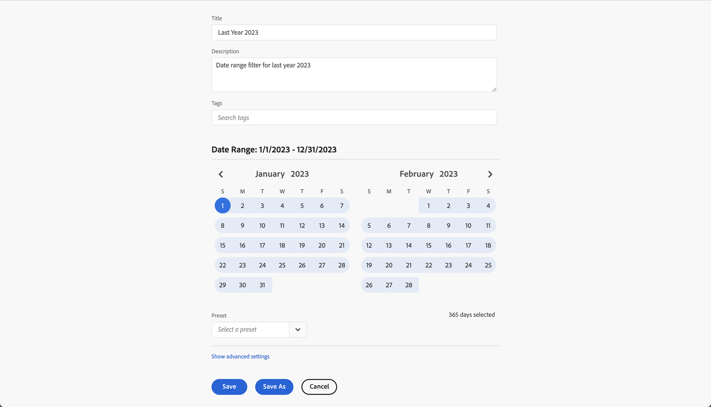
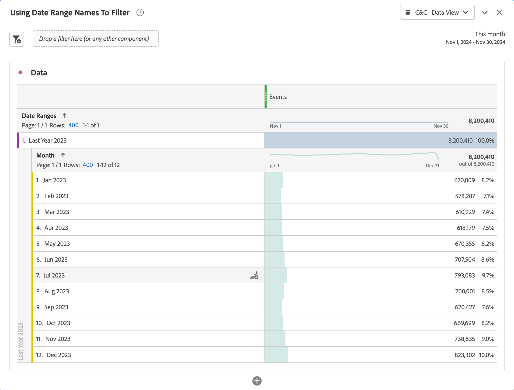
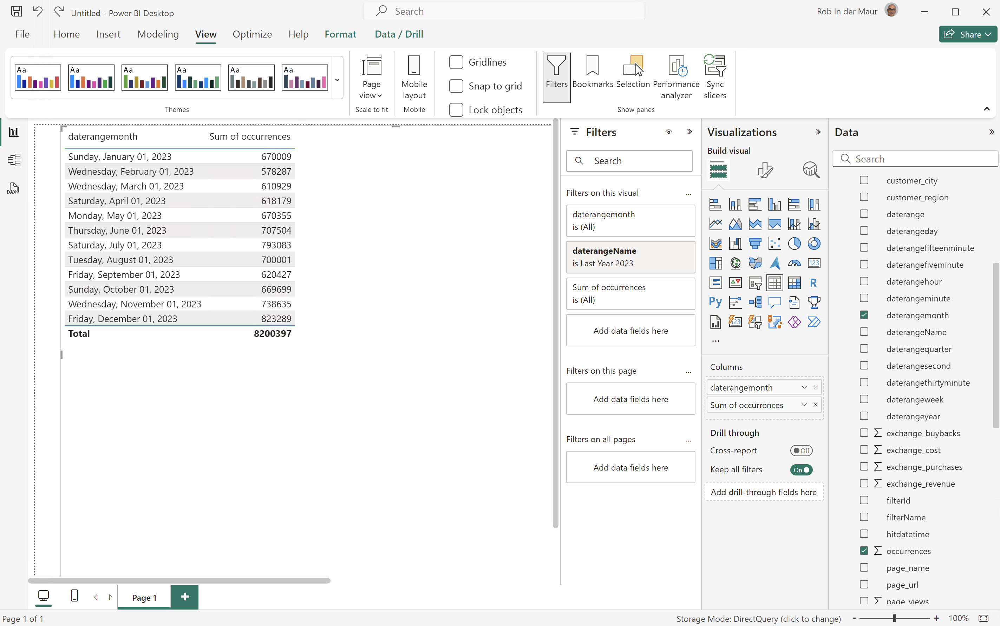
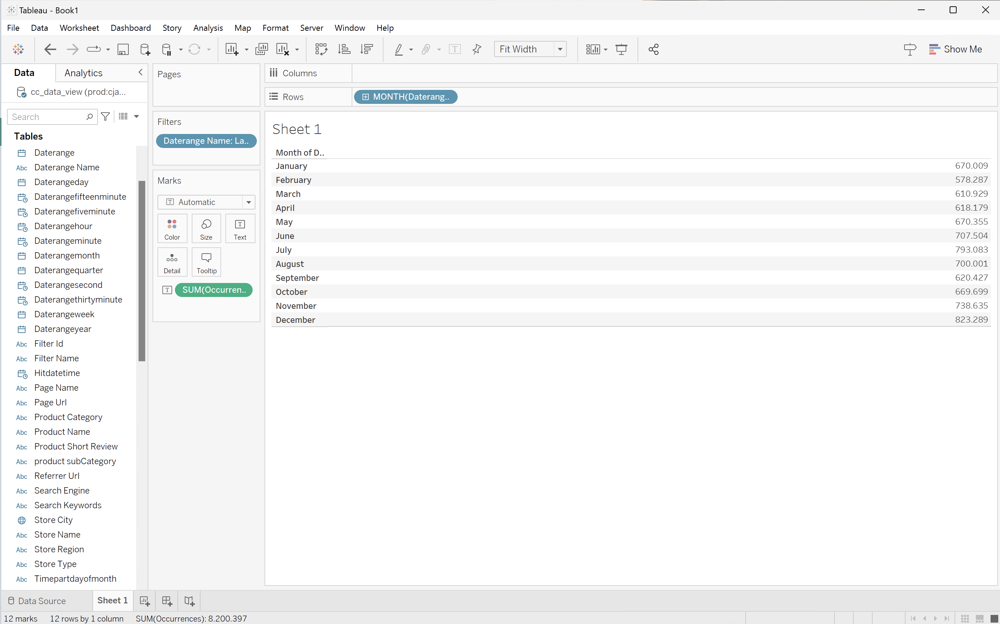
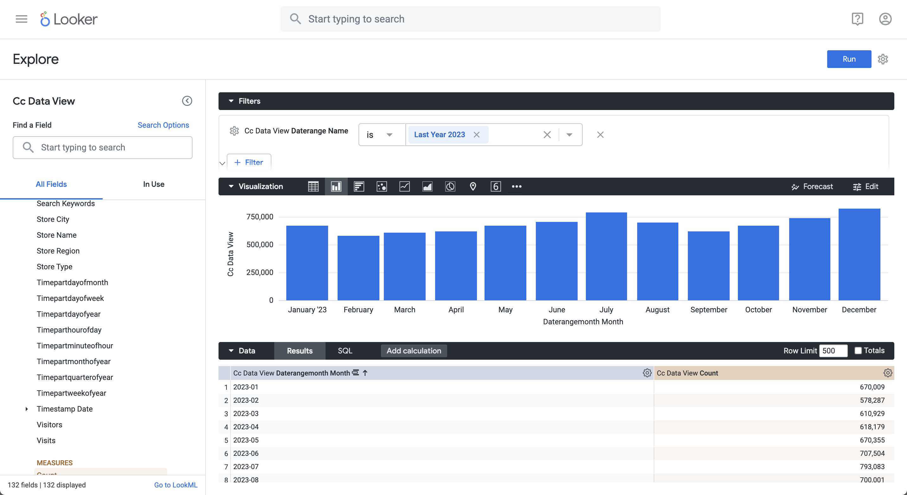
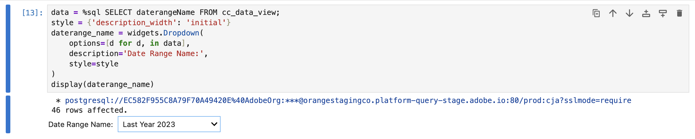
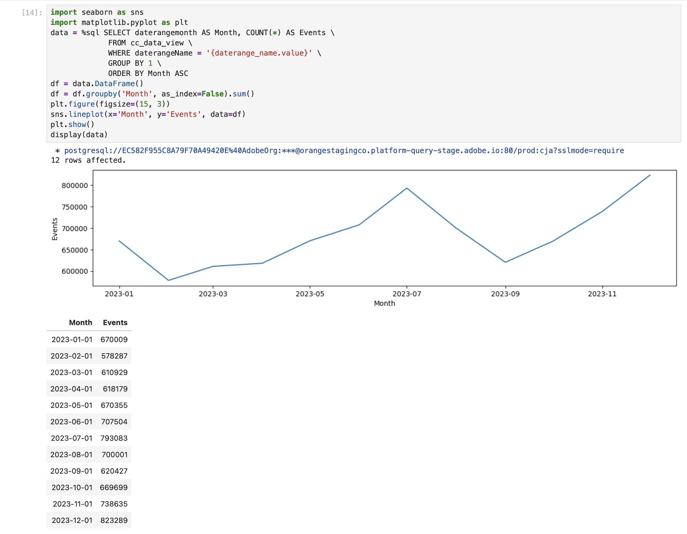
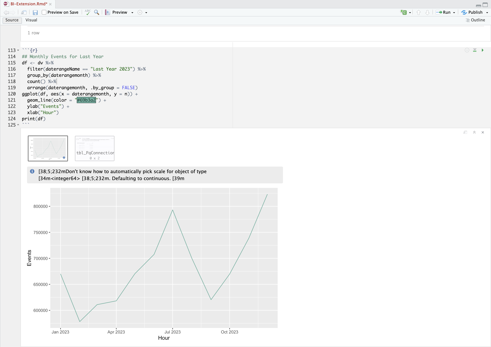

# フィルターに日付範囲名を使用する

この使用例では、Customer Journey Analyticsで定義した日付範囲を使用して、過去1年間の発生件数（イベント）をフィルタリングおよびレポートします。

+++ Customer Journey Analytics

日付範囲を使用してレポートを作成するには、**[!UICONTROL タイトル]** `Last Year 2023`の日付範囲をCustomer Journey Analyticsで設定します。



次に、その日付範囲を例&#x200B;**[!UICONTROL 使用日付範囲の名前をフィルターに使用]** パネルで使用例に使用できます。



フリーフォームテーブルのビジュアライゼーションで定義された日付範囲が、パネルに適用される日付範囲を上書きすることに注意してください。

+++

+++ BI ツール

>[!PREREQUISITES]
>
>接続が成功したことを[検証し、データビューを一覧表示でき、このユースケースを試すBI ツールにデータビュー](connect-and-validate.md)を使用していることを確認します。
>

>[!BEGINTABS]

>[!TAB Power BI デスクトップ ]

1. **[!UICONTROL データ]** ペインで、次の操作を行います。
   1. **[!UICONTROL daterangemonth]**&#x200B;を選択します。
   1. **[!UICONTROL daterangeName]**&#x200B;を選択します。
   1. **[!UICONTROL 合計回数]**&#x200B;を選択します。

   ビジュアルに「**[!UICONTROL このビジュアルのデータ取得中にエラーが発生しました]**」と表示されます。

1. **[!UICONTROL フィルター]** ペインで、次の操作を行います。

   1. このビジュアル **の** フィルターから&#x200B;**[!UICONTROL daterangeName is （All）]**&#x200B;を選択します。
   1. **[!UICONTROL 基本フィルタリング]**&#x200B;を&#x200B;**[!UICONTROL フィルタータイプ]**&#x200B;として選択します。
   1. 「**[!UICONTROL 検索]**」フィールドの下で、「**[!UICONTROL 昨年2023]**」を選択します。これは、Customer Journey Analyticsで定義された日付範囲の名前です。
   1. を選択して、**[!UICONTROL 列]**&#x200B;から&#x200B;**[!UICONTROL daterangeName]**&#x200B;を削除します。

   適用された&#x200B;**[!UICONTROL daterangeName]** フィルターでテーブルが更新されます。 Power BI デスクトップは以下のようになります。

   日付範囲名をフィルターに使用する

>[!TAB Tableau Desktop]

1. 下部の「**[!UICONTROL シート 1]**」タブを選択して、**[!UICONTROL データソース]**&#x200B;から切り替えます。 **[!UICONTROL シート 1]** ビューで：
   1. **[!UICONTROL フィルター]** シェルフの&#x200B;**[!UICONTROL テーブル]** リストから&#x200B;**[!UICONTROL データレンジ名]** エントリをドラッグします。
   1. **[!UICONTROL フィルター\[Daterange Name\]]** ダイアログで、**[!UICONTROL リストから選択]**&#x200B;が選択されていることを確認し、リストから&#x200B;**[!UICONTROL 昨年2023]**&#x200B;を選択します。 **[!UICONTROL 適用]**&#x200B;と&#x200B;**[!UICONTROL OK]**&#x200B;を選択します。
   1. **[!UICONTROL Daterangemonth]** エントリを&#x200B;**[!UICONTROL テーブル]** リストからドラッグし、**[!UICONTROL 行]**&#x200B;の横にあるフィールドにエントリをドロップします。 **[!UICONTROL Daterangemonth]**&#x200B;を選択し、**[!UICONTROL 月]**&#x200B;を選択します。 値が&#x200B;**[!UICONTROL MONTH （Daterangemonth）]**&#x200B;に変更されます。
   1. **[!UICONTROL テーブル]** リストから&#x200B;**[!UICONTROL 発生回数]** エントリをドラッグし、**[!UICONTROL 列]**&#x200B;の横にあるフィールドにエントリをドロップします。 値が&#x200B;**[!UICONTROL SUM （Occurrences）]**&#x200B;に変更されます。
   1. **[!UICONTROL 自分を表示]**&#x200B;から&#x200B;**[!UICONTROL テキストテーブル]**&#x200B;を選択します。
   1. ツールバーから「**[!UICONTROL 行と列を入れ替え]**」を選択します。
   1. 「**[!UICONTROL フィット]**」ドロップダウンメニューから「**[!UICONTROL フィット幅]**」を選択します。

      Tableau デスクトップは以下のようになります。

      

>[!TAB Looker]

1. Lookerの&#x200B;**[!UICONTROL Explore]** インターフェイスで、クリーンな設定が行われていることを確認します。 そうでない場合は、 **[!UICONTROL フィールドとフィルターの削除]**&#x200B;を選択します。
1. 「**[!UICONTROL フィルター]**」の下の「**[!UICONTROL + フィルター]**」を選択します。
1. **[!UICONTROL フィルターを追加]** ダイアログ：
   1. **[!UICONTROL ‣ Cc データビュー]**&#x200B;を選択
   1. フィールドのリストから、**[!UICONTROL &rbrace;‣ Daterange Name]**&#x200B;を選択します。
1. **[!UICONTROL Cc データビューのデータレンジ名]** フィルターを&#x200B;**[!UICONTROL is]**&#x200B;として指定し、値のリストから&#x200B;**[!UICONTROL 昨年2023]**&#x200B;を選択します。
1. 左側のパネルの&#x200B;**[!UICONTROL ‣ Cc データビュー]** セクションから：
   1. **[!UICONTROL Daterange Month]**&#x200B;を選択してから、**[!UICONTROL Month]**&#x200B;を選択します。
   1. 左パネル（下部）の&#x200B;**[!UICONTROL 測定]**&#x200B;の下にある&#x200B;**[!UICONTROL カウント]**&#x200B;を選択します。
1. **[!UICONTROL 実行]**&#x200B;を選択します。
1. 「**[!UICONTROL 」‣ビジュアライゼーション]**&#x200B;を選択します。

次のようなビジュアライゼーションと表が表示されます。




>[!TAB Jupyter Notebook]

1. 新しいセルに次のステートメントを入力します。

   ```python
   data = %sql SELECT daterangeName FROM cc_data_view;
   style = {'description_width': 'initial'}
   daterange_name = widgets.Dropdown(
      options=[d for d, in data],
      description='Date Range Name:',
      style=style
   )
   display(daterange_name)
   ```

1. セルを実行します。 以下のスクリーンショットのような出力が表示されます。

   

1. ドロップダウンメニューから「**[!UICONTROL 釣り製品]**」を選択します。

1. 新しいセルに次のステートメントを入力します。

   ```python
   import seaborn as sns
   import matplotlib.pyplot as plt
   data = %sql SELECT daterangemonth AS Month, COUNT(*) AS Events \
               FROM cc_data_view \
               WHERE daterangeName = '{daterange_name.value}' \
               GROUP BY 1 \
               ORDER BY Month ASC
   df = data.DataFrame()
   df = df.groupby('Month', as_index=False).sum()
   plt.figure(figsize=(15, 3))
   sns.lineplot(x='Month', y='Events', data=df)
   plt.show()
   display(data)
   ```

1. セルを実行します。 以下のスクリーンショットのような出力が表示されます。

   


>[!TAB RStudio]

1. 新しいチャンクに次のコードブロックを入力します。 適切な日付範囲名を使用していることを確認してください。 例：`Last Year 2023`。

   ```R
   ## Monthly Events for Last Year
   df <- dv %>%
      filter(daterangeName == "Last Year 2023") %>%
      group_by(daterangemonth) %>%
      count() %>%
      arrange(daterangemonth, .by_group = FALSE)
   ggplot(df, aes(x = daterangemonth, y = n)) +
      geom_line(color = "#69b3a2") +
      ylab("Events") +
      xlab("Hour")
   print(df)
   ```

1. チャンクを実行します。 以下のスクリーンショットのような出力が表示されます。

   

>[!ENDTABS]

+++

