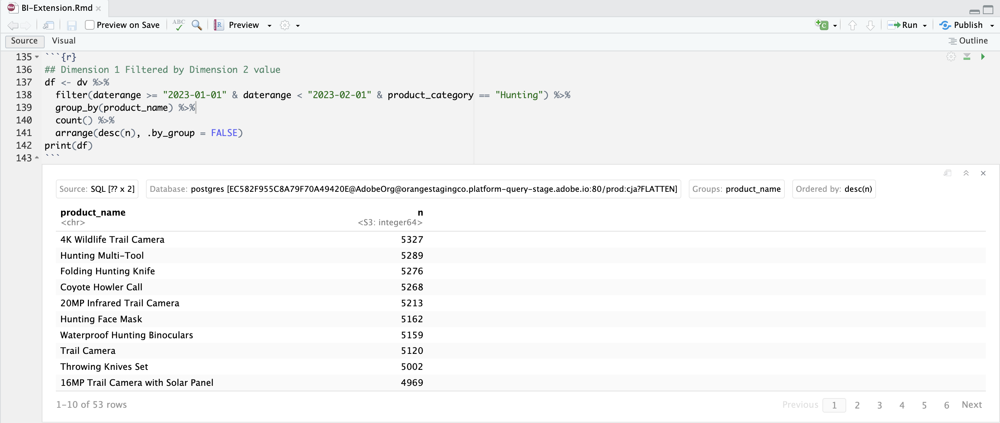

# ディメンション値を使用したセグメント化

**[!UICONTROL 製品カテゴリ]** の動的な **[!UICONTROL ハンティング]** 値を使用して、ハンティングカテゴリから商品をセグメント化します。 または、商品カテゴリ値の動的取得をサポートしていない BI ツールの場合、Customer Journey Analyticsで、ハンティング商品カテゴリからの商品に関するセグメントを持つ新しいセグメントを作成します。
次に、新しいセグメントを使用して、2023 年 1 月のハンティングカテゴリの製品の製品名と発生件数（イベント）についてレポートします。

+++ Customer Journey Analytics

Customer Journey Analyticsで **[!UICONTROL タイトル]** を使用して新しいセグメント `Hunting Products` 作成します。


次に、使用例の **[!UICONTROL Dimension値を使用してフィルターを適用]** パネルでそのセグメントを使用できます。


+++

+++ BI ツール

>[!PREREQUISITES]
>
>このユースケースを試す BI ツールについて、[&#x200B; 接続に成功し、データビューをリストし、データビューを使用できる &#x200B;](connect-and-validate.md) ことを検証したことを確認します。
>

>[!BEGINTABS]

>[!TAB Power BI デスクトップ ]

1. メニューから **[!UICONTROL ホーム]** を選択し、ツールバーから **[!UICONTROL 更新]** を選択します。 Customer Journey Analyticsで定義した新しいフィルターを取得するには、連携を更新する必要があります。

1. **[!UICONTROL データ]** ペインで、次の操作を行います。
   1. **[!UICONTROL daterange]** を選択します。
   1. **[!UICONTROL product_category]** を選択します。
   1. **[!UICONTROL product_name]** を選択します。
   1. **[!UICONTROL 発生件数の合計]** を選択します。

**[!UICONTROL このビジュアルのデータ取得エラー]** と表示されるビジュアライゼーションが表示されます。

1. **[!UICONTROL フィルター]** パネルで、次の操作を行います。
   1. **[!UICONTROL このビジュアルのフィルター]** から **[!UICONTROL filterName is （All）]** を選択します。
   1. **[!UICONTROL フィルタータイプ]** として **[!UICONTROL 基本フィルタリング]** を選択します。
   1. **[!UICONTROL このビジュアルのフィルター]** から **[!UICONTROL daterange is （すべて）]** を選択します。
   1. **[!UICONTROL フィルタータイプ]** として「**[!UICONTROL 詳細フィルタリング]**」を選択します。
   1. **[!UICONTROL 値が次の値の場合に項目を表示]**&#x200B;**[!UICONTROL が次の値以上の場合に項目を表示]**`1/1/2023`**[!UICONTROL および]**&#x200B;**[!UICONTROL が次の値の前]**`2/1/2023` のフィルターを定義してください。
   1. **[!UICONTROL product_category]** の **[!UICONTROL フィルタータイプ]** として **[!UICONTROL 基本フィルター]** を選択し、使用可能な値のリストから **[!UICONTROL ハンティング]** を選択します。
   1.  を選択して、**[!UICONTROL filterName]** を **[!UICONTROL Columns]** から削除します。
   1.  を選択して **[!UICONTROL Daterange]** を **[!UICONTROL Columns]** から削除します。

   適用した **[!UICONTROL product_category]** フィルターで更新されたテーブルが表示されます。 Power BI デスクトップは次のようになります。

   


>[!TAB Tableau Desktop]

Tableau Desktop は、Customer Journey Analyticsからの動的な商品カテゴリのリストの取得をサポートしていません。 代わりに、このユースケースでは、新しく作成した **[!UICONTROL ハンティング商品]** のフィルターを使用し、フィルター名条件を使用します。

1. **[!UICONTROL データSource]** ビューの **[!UICONTROL データ]** の下で、**[!UICONTROL cc_data_view （prod:cja%3FFLATTEN）]** のコンテキストメニューから **[!UICONTROL 更新]** を選択します。 Customer Journey Analyticsで定義した新しいフィルターを取得するには、連携を更新する必要があります。
1. 下部にある「**[!UICONTROL シート 1]**」タブを選択して、「**[!UICONTROL データソース]**」から切り替えます。 **[!UICONTROL シート 1]** ビューで、次の操作を行います。
   1. **[!UICONTROL フィルター]** シェルフの **[!UICONTROL テーブル]** リストから **[!UICONTROL フィルター名]** エントリをドラッグします。
   1. **[!UICONTROL フィルター\[ フィルター名\]]** ダイアログで **[!UICONTROL リストから選択]** が選択されていることを確認し、リストから **[!UICONTROL ハンティング製品]** を選択します。 **[!UICONTROL 適用]** および **[!UICONTROL OK]** を選択します。
   1. **[!UICONTROL フィルター]** シェルフの **[!UICONTROL テーブル]** リストから **[!UICONTROL Daterange]** エントリをドラッグします。
   1. **[!UICONTROL フィルターフィールド \[Daterange\]]** ダイアログで **[!UICONTROL 日付範囲]** を選択して **[!UICONTROL 次へ >]** を選択します。
   1. **[!UICONTROL フィルター\[Daterange\]]** ダイアログで **[!UICONTROL 日付範囲]** を選択し、`01/01/2023` - `1/2/2023` を選択します。 **[!UICONTROL 適用]** および **[!UICONTROL OK]** を選択します。
   1. **[!UICONTROL テーブル]** リストから **[!UICONTROL 製品名]** を **[!UICONTROL 行]** にドラッグします。
   1. **[!UICONTROL テーブル]** リストから **[!UICONTROL 発生件数]** エントリをドラッグし、**[!UICONTROL 列]** の横のフィールドにドロップします。 値が「**[!UICONTROL SUM （発生件数）]**」に変わります。
   1. **[!UICONTROL 表示]** から **[!UICONTROL テキストテーブル]** を選択します。
   1. **[!UICONTROL フィット]** ドロップダウンメニューから **[!UICONTROL フィット幅]** を選択します。

      Tableau Desktop は次のようになります。

      

>[!TAB Looker]

1. 1 で。 Looker の **[!UICONTROL 探索]** インターフェイスで、接続を更新します。 「**[!UICONTROL キャッシュのクリアと更新]**」を選択します。
1. Looker の **[!UICONTROL 探索]** インターフェイスで、クリーンな設定ができていることを確認します。 そうでない場合は、「**[!UICONTROL フィールドとフィルターを削除]**」を選択します。
1. **[!UICONTROL フィルター]** の下の「**[!UICONTROL + フィルター]** を選択します。
1. **[!UICONTROL フィルターを追加]** ダイアログで、次の手順を実行します。
   1. 「**[!UICONTROL ‣ Cc データビュー」を選択します]**
   1. フィールドのリストから、「**[!UICONTROL ‣Daterange Date」を選択し]** 「**[!UICONTROL Daterange Date]**」を選択します。
      
1. **[!UICONTROL CC データビュー日付範囲]** フィルターを **[!UICONTROL 範囲内]** **[!UICONTROL 2023/01/01]**&#x200B;**[!UICONTROL 前）まで]** **[!UICONTROL 2023/02/01]** として指定します。
1. **[!UICONTROL フィルター]** の下の「**[!UICONTROL + フィルター]** を選択して、別のフィルターを追加します。
1. **[!UICONTROL フィルターを追加]** ダイアログで、次の手順を実行します。
   1. 「**[!UICONTROL ‣ Cc データビュー」を選択します]**
   1. フィールドのリストから、「**[!UICONTROL ‣製品カテゴリ]**」を選択します。
1. フィルターの選択として **[!UICONTROL is]** を使用していることを確認します。

 Lookes で **[!UICONTROL 製品カテゴリ]** の可能な値のリストが表示されない。


>[!TAB Jupyter Notebook]

1. 新しいセルに次のステートメントを入力します。

   ```python
   data = %sql SELECT DISTINCT product_category FROM cc_data_view WHERE daterange BETWEEN '2023-01-01' AND '2024-01-01';
   style = {'description_width': 'initial'}
   category_filter = widgets.Dropdown(
      options=[d for d, in data],
      description='Product Category:',
      style=style
   )
   display(category_filter)
   ```

1. セルを実行します。 以下のスクリーンショットのような出力が表示されます。

   

1. ドロップダウンメニューから **[!UICONTROL ハンティング]** を選択します。

1. 新しいセルに次のステートメントを入力します。

   ```python
   import seaborn as sns
   import matplotlib.pyplot as plt
   data = %sql SELECT product_name AS `Product Name`, COUNT(*) AS Events \
               FROM cc_data_view \
               WHERE daterange BETWEEN '2023-01-01' AND '2023-02-01' \
               AND product_category = '{category_filter.value}' \
               GROUP BY 1 \
               ORDER BY Events DESC \
               LIMIT 10;
   df = data.DataFrame()
   df = df.groupby('Product Name', as_index=False).sum()
   plt.figure(figsize=(15, 3))
   sns.barplot(x='Events', y='Product Name', data=df)
   plt.show()
   display(data)
   ```

1. セルを実行します。 以下のスクリーンショットのような出力が表示されます。

   


>[!TAB RStudio]

1. 新しいチャンクで、` ` ``{r} ` と ` `` ` ` の間に次のステートメントを入力します。 適切なカテゴリを使用していることを確認します。 例：`Hunting`。

   ```R
   ## Dimension 1 Filtered by Dimension 2 value
   df <- dv %>%
      filter(daterange >= "2023-01-01" & daterange < "2023-02-01" & product_category == "Hunting") %>%
      group_by(product_name) %>%
      count() %>%
      arrange(desc(n), .by_group = FALSE)
   print(df)
   ```

1. チャンクを実行します。 以下のスクリーンショットのような出力が表示されます。

   

>[!ENDTABS]

+++

