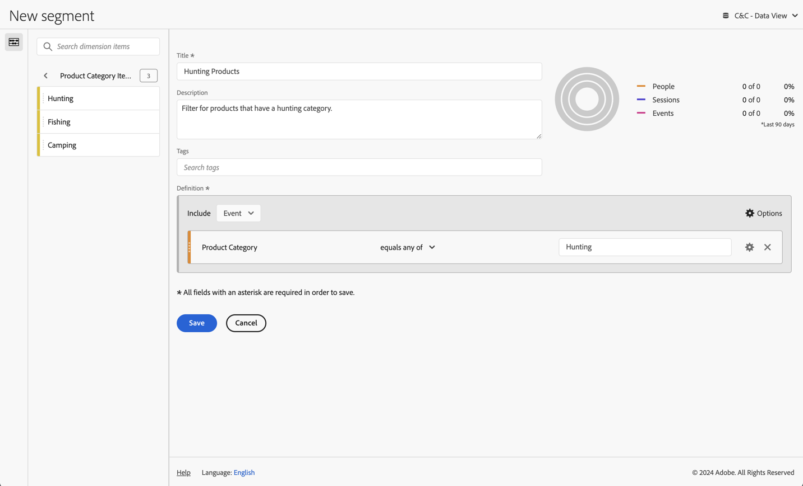
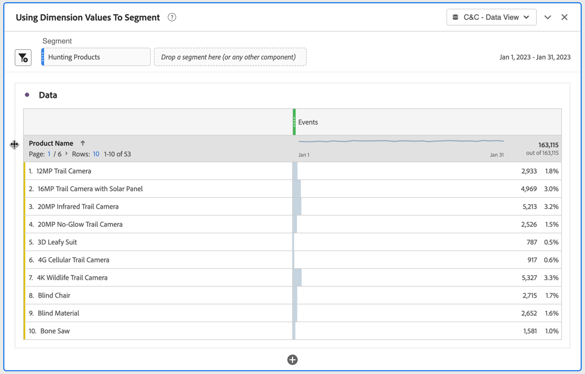
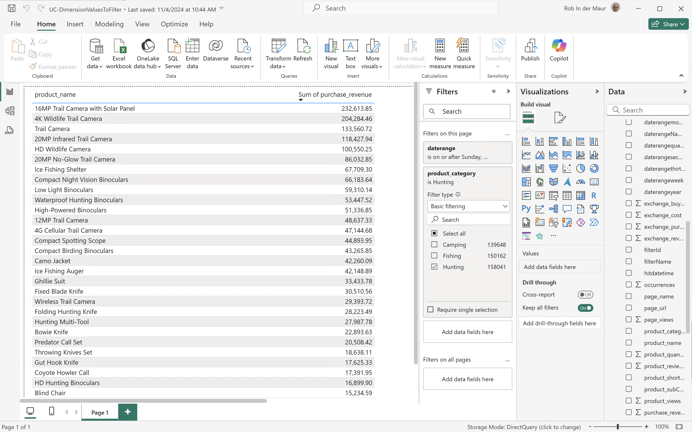
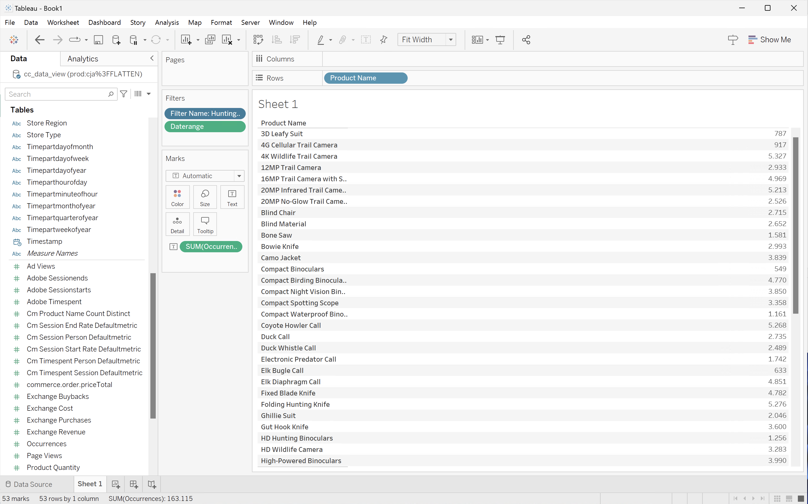
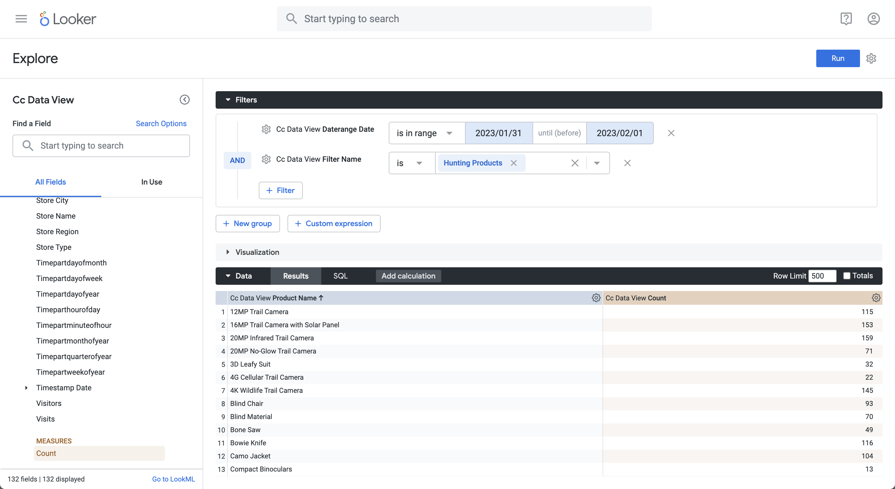
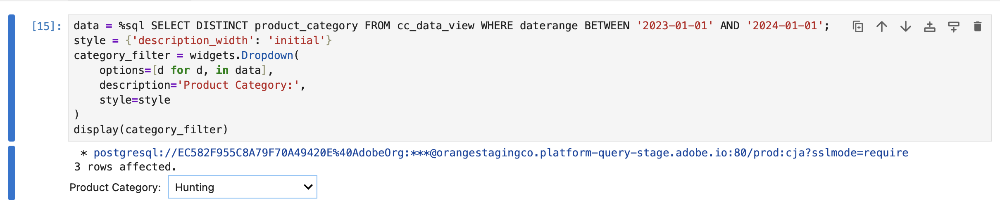
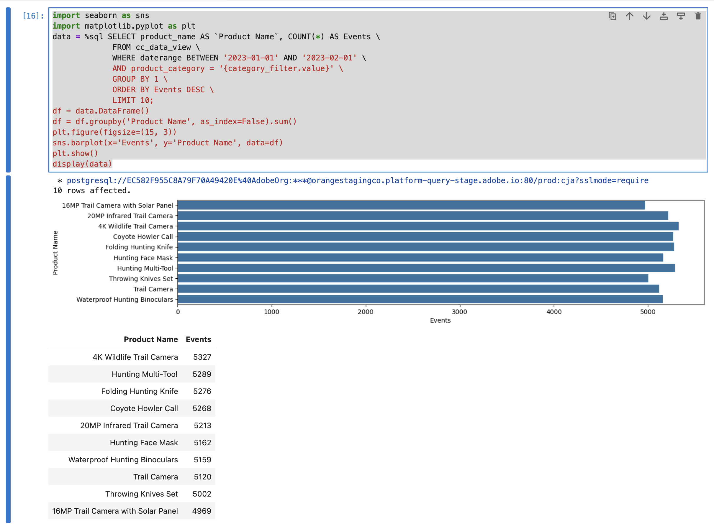
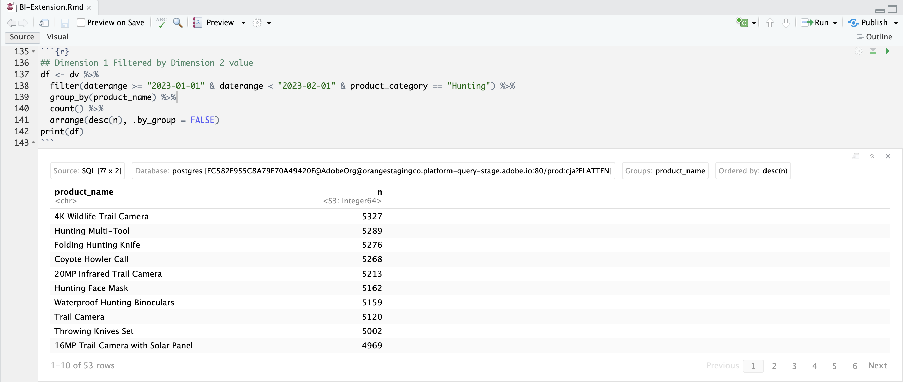

# ディメンション値を使用したセグメント化

**[!UICONTROL 製品カテゴリ]**&#x200B;の動的な&#x200B;**[!UICONTROL ハンティング]**&#x200B;値を使用して、ハンティング カテゴリから製品をセグメント化します。 または、商品カテゴリ値の動的な取得をサポートしないBI ツールの場合は、Customer Journey Analyticsで、ハンティング商品カテゴリの商品をセグメント化する新しいセグメントを作成します。
次に、新しいセグメントを使用して、2023年1月のハンティングカテゴリの製品の製品名と出現件数（イベント）をレポートします。

+++ Customer Journey Analytics

Customer Journey Analyticsで&#x200B;**[!UICONTROL タイトル]** `Hunting Products`を使用して新しいセグメントを作成します。

を作成します

次に、このセグメントを使用例の&#x200B;**[!UICONTROL Dimension値を使用したフィルター]** パネルで使用できます。



+++

+++ BI ツール

>[!PREREQUISITES]
>
>接続が成功したことを[検証し、データビューを一覧表示でき、このユースケースを試すBI ツールにデータビュー](connect-and-validate.md)を使用していることを確認します。
>

>[!BEGINTABS]

>[!TAB Power BI デスクトップ ]

1. メニューから「**[!UICONTROL ホーム]**」を選択し、ツールバーから「**[!UICONTROL 更新]**」を選択します。 Customer Journey Analyticsで定義した新しいフィルターを選択するには、接続を更新する必要があります。

1. **[!UICONTROL データ]** ペインで、次の操作を行います。
   1. **[!UICONTROL daterange]**&#x200B;を選択します。
   1. **[!UICONTROL product_category]**&#x200B;を選択します。
   1. **[!UICONTROL product_name]**&#x200B;を選択します。
   1. **[!UICONTROL 合計回数]**&#x200B;を選択します。

ビジュアルに「**[!UICONTROL このビジュアルのデータ取得中にエラーが発生しました]**」と表示されます。

1. **[!UICONTROL フィルター]** ペインで、次の操作を行います。
   1. このビジュアル **の** フィルターから&#x200B;**[!UICONTROL filterName is （All）]**&#x200B;を選択します。
   1. **[!UICONTROL 基本フィルタリング]**&#x200B;を&#x200B;**[!UICONTROL フィルタータイプ]**&#x200B;として選択します。
   1. このビジュアル **の** フィルターから&#x200B;**[!UICONTROL daterange is （All）]**&#x200B;を選択します。
   1. **[!UICONTROL 詳細フィルタリング]**&#x200B;を&#x200B;**[!UICONTROL フィルタータイプ]**&#x200B;として選択します。
   1. 値&#x200B;**&#x200B;**&#x200B;[!UICONTROL &#x200B;が&#x200B;]&#x200B;**`1/1/2023`**&#x200B;[!UICONTROL &#x200B;および&#x200B;]&#x200B;**&#x200B;**&#x200B;[!UICONTROL &#x200B;が&#x200B;]&#x200B;**`2/1/2023`より前の場合に、**&#x200B;項目を表示するようにフィルターを定義します。
   1. **[!UICONTROL product_category]**&#x200B;の&#x200B;**[!UICONTROL Filter type]**&#x200B;として&#x200B;**[!UICONTROL 基本フィルター]**&#x200B;を選択し、使用可能な値のリストから&#x200B;**[!UICONTROL Hunting]**&#x200B;を選択します。
   1. を選択して、**[!UICONTROL 列]**&#x200B;から&#x200B;**[!UICONTROL filterName]**&#x200B;を削除します。
   1. を選択して、**[!UICONTROL 列]**&#x200B;から&#x200B;**[!UICONTROL daterange]**&#x200B;を削除します。

   適用された&#x200B;**[!UICONTROL product_category]** フィルターでテーブルが更新されます。 Power BI デスクトップは以下のようになります。

   日付範囲名をフィルターに使用する


>[!TAB Tableau Desktop]

 Tableau Desktopは、Customer Journey Analyticsからの商品カテゴリの動的リストの取得をサポートしていません。 代わりに、この使用例では、**[!UICONTROL Hunting Products]**&#x200B;に対して新しく作成したフィルターを使用し、フィルター名の条件を使用します。

1. **[!UICONTROL cc_data_view （prod:cja%3FFLATTEN）]**&#x200B;のコンテキストメニューの&#x200B;**[!UICONTROL Data]**&#x200B;の下にある&#x200B;**[!UICONTROL Data Source]** ビューで、**[!UICONTROL Refresh]**&#x200B;を選択します。 Customer Journey Analyticsで定義した新しいフィルターを選択するには、接続を更新する必要があります。
1. 下部の「**[!UICONTROL シート 1]**」タブを選択して、**[!UICONTROL データソース]**&#x200B;から切り替えます。 **[!UICONTROL シート 1]** ビューで：
   1. **[!UICONTROL フィルター]** シェルフの&#x200B;**[!UICONTROL テーブル]** リストから&#x200B;**[!UICONTROL フィルター名]** エントリをドラッグします。
   1. **[!UICONTROL フィルター\[ フィルター名\]]** ダイアログで、**[!UICONTROL リストから選択]**&#x200B;が選択されていることを確認し、リストから&#x200B;**[!UICONTROL ハンティング製品]**&#x200B;を選択します。 **[!UICONTROL 適用]**&#x200B;と&#x200B;**[!UICONTROL OK]**&#x200B;を選択します。
   1. **[!UICONTROL フィルター]** シェルフの&#x200B;**[!UICONTROL テーブル]** リストから&#x200B;**[!UICONTROL Daterange]** エントリをドラッグします。
   1. **[!UICONTROL フィルターフィールド \[Daterange\]]** ダイアログで、**[!UICONTROL 日付の範囲]**&#x200B;を選択し、**[!UICONTROL 次>]**&#x200B;を選択します。
   1. **[!UICONTROL フィルター\[Daterange\]]** ダイアログで、**[!UICONTROL 日付の範囲]**&#x200B;を選択し、`01/01/2023` ～ `1/2/2023`を選択します。 **[!UICONTROL 適用]**&#x200B;と&#x200B;**[!UICONTROL OK]**&#x200B;を選択します。
   1. **[!UICONTROL 製品名]**&#x200B;を&#x200B;**[!UICONTROL 表]** リストから&#x200B;**[!UICONTROL 行]**&#x200B;にドラッグします。
   1. **[!UICONTROL テーブル]** リストから&#x200B;**[!UICONTROL 発生回数]** エントリをドラッグし、**[!UICONTROL 列]**&#x200B;の横にあるフィールドにエントリをドロップします。 値が&#x200B;**[!UICONTROL SUM （Occurrences）]**&#x200B;に変更されます。
   1. **[!UICONTROL 自分を表示]**&#x200B;から&#x200B;**[!UICONTROL テキストテーブル]**&#x200B;を選択します。
   1. 「**[!UICONTROL フィット]**」ドロップダウンメニューから「**[!UICONTROL フィット幅]**」を選択します。

      Tableau デスクトップは以下のようになります。

      

>[!TAB Looker]

1. 「1」の。 Lookerの&#x200B;**[!UICONTROL Explore]** インターフェイスで、接続を更新します。 「 **[!UICONTROL キャッシュをクリアして更新]**」を選択します。
1. Lookerの&#x200B;**[!UICONTROL Explore]** インターフェイスで、クリーンな設定が行われていることを確認します。 そうでない場合は、 **[!UICONTROL フィールドとフィルターの削除]**&#x200B;を選択します。
1. 「**[!UICONTROL フィルター]**」の下の「**[!UICONTROL + フィルター]**」を選択します。
1. **[!UICONTROL フィルターを追加]** ダイアログ：
   1. **[!UICONTROL ‣ Cc データビュー]**&#x200B;を選択
   1. フィールドのリストから、**[!UICONTROL &rbrace;‣ Daterange Date]**、次に&#x200B;**[!UICONTROL Daterange Date]**&#x200B;を選択します。
      
1. **[!UICONTROL Cc データビューの日付変更日]** フィルターを&#x200B;**[!UICONTROL が範囲]** **[!UICONTROL 2023/01/01]** **[!UICONTROL から（前）]** **[!UICONTROL 2023/02/01]**&#x200B;に指定します。
1. 「**[!UICONTROL フィルター]**」の下の「**[!UICONTROL + フィルター]**」を選択して、別のフィルターを追加します。
1. **[!UICONTROL フィルターを追加]** ダイアログ：
   1. **[!UICONTROL ‣ Cc データビュー]**&#x200B;を選択
   1. フィールドのリストから、**[!UICONTROL &rbrace;‣製品カテゴリ]**&#x200B;を選択します。
1. フィルターの選択範囲として&#x200B;**[!UICONTROL is]**&#x200B;を指定します。

のルックは、**[!UICONTROL 製品カテゴリ]**&#x200B;の可能な値のリストを表示しません。




>[!TAB Jupyter Notebook]

1. 新しいセルに次のステートメントを入力します。

   ```python
   data = %sql SELECT DISTINCT product_category FROM cc_data_view WHERE daterange BETWEEN '2023-01-01' AND '2024-01-01';
   style = {'description_width': 'initial'}
   category_filter = widgets.Dropdown(
      options=[d for d, in data],
      description='Product Category:',
      style=style
   )
   display(category_filter)
   ```

1. セルを実行します。 以下のスクリーンショットのような出力が表示されます。

   

1. ドロップダウンメニューから「**[!UICONTROL 狩り]**」を選択します。

1. 新しいセルに次のステートメントを入力します。

   ```python
   import seaborn as sns
   import matplotlib.pyplot as plt
   data = %sql SELECT product_name AS `Product Name`, COUNT(*) AS Events \
               FROM cc_data_view \
               WHERE daterange BETWEEN '2023-01-01' AND '2023-02-01' \
               AND product_category = '{category_filter.value}' \
               GROUP BY 1 \
               ORDER BY Events DESC \
               LIMIT 10;
   df = data.DataFrame()
   df = df.groupby('Product Name', as_index=False).sum()
   plt.figure(figsize=(15, 3))
   sns.barplot(x='Events', y='Product Name', data=df)
   plt.show()
   display(data)
   ```

1. セルを実行します。 以下のスクリーンショットのような出力が表示されます。

   


>[!TAB RStudio]

1. 新しいチャンクに次のコードブロックを入力します。 適切なカテゴリーを使用していることを確認してください。 例：`Hunting`。

   ```R
   ## Dimension 1 Filtered by Dimension 2 value
   df <- dv %>%
      filter(daterange >= "2023-01-01" & daterange < "2023-02-01" & product_category == "Hunting") %>%
      group_by(product_name) %>%
      count() %>%
      arrange(desc(n), .by_group = FALSE)
   print(df)
   ```

1. チャンクを実行します。 以下のスクリーンショットのような出力が表示されます。

   

>[!ENDTABS]

+++
