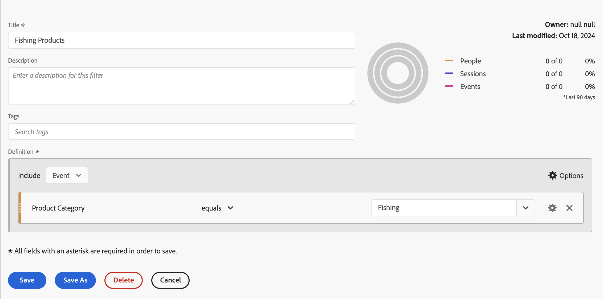
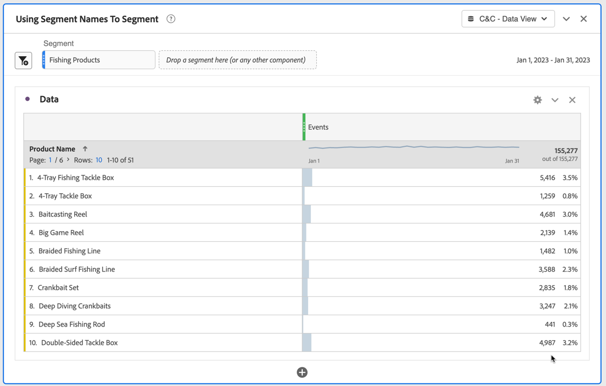
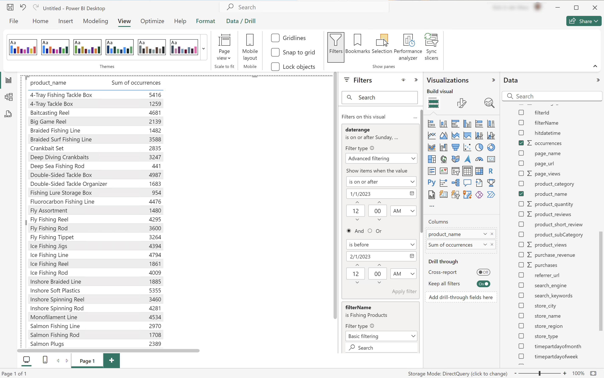
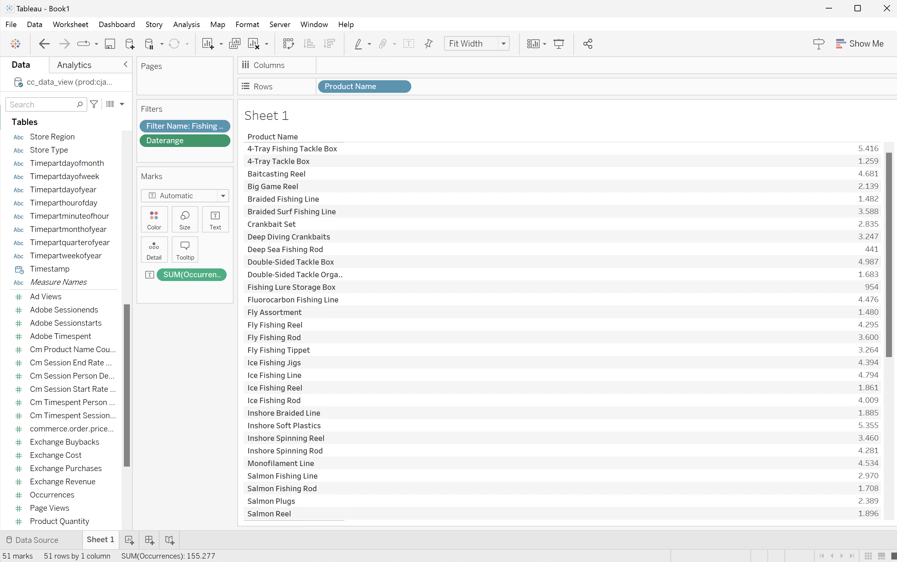
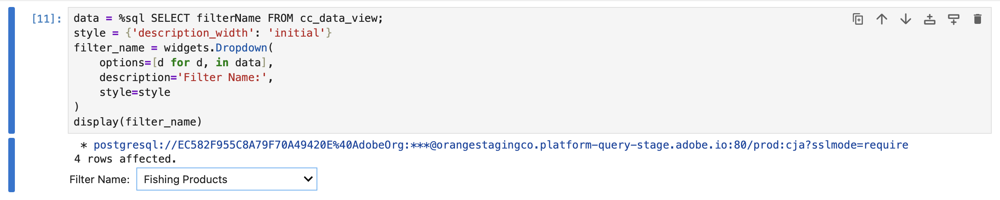
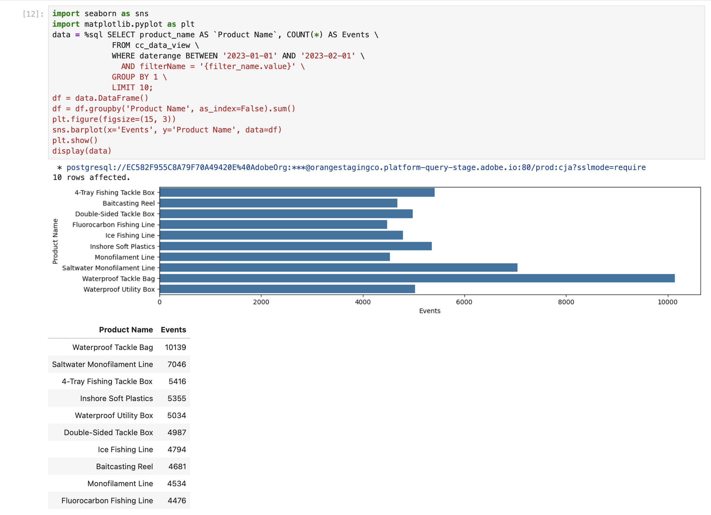
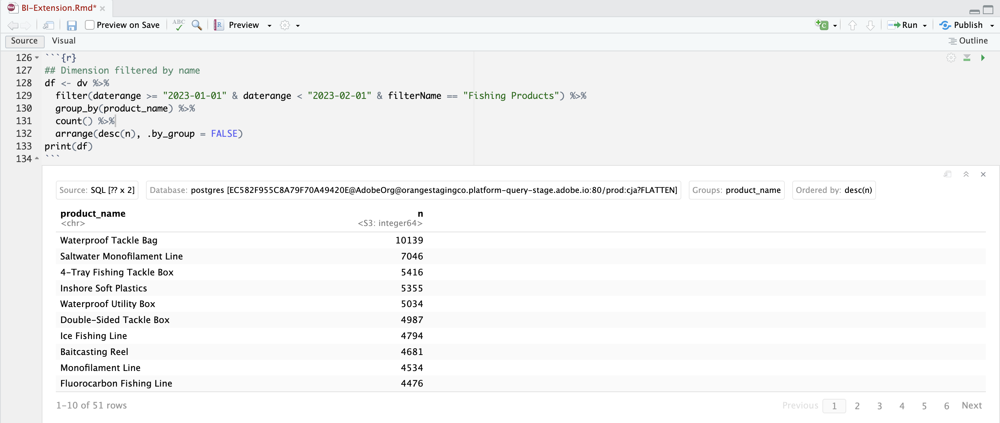

# セグメント名を使用してセグメント化する

この使用例では、Customer Journey Analyticsで定義した釣り用品カテゴリに既存のセグメントを使用します。 2023年1月の製品名と発生件数（イベント）をセグメント化してレポートします。

+++ Customer Journey Analytics

Customer Journey Analyticsで使用するセグメントを調べます。



次に、このセグメントを使用例の&#x200B;**[!UICONTROL セグメント名を使用してセグメント]** パネルに適用できます。



+++

+++ BI ツール

>[!PREREQUISITES]
>
>接続が成功したことを[検証し、データビューを一覧表示でき、このユースケースを試すBI ツールにデータビュー](connect-and-validate.md)を使用していることを確認します。
>

>[!BEGINTABS]

>[!TAB Power BI デスクトップ ]

1. **[!UICONTROL データ]** ペインで、次の操作を行います。
   1. **[!UICONTROL daterange]**&#x200B;を選択します。
   1. **[!UICONTROL filterName]**&#x200B;を選択します。
   1. **[!UICONTROL product_name]**&#x200B;を選択します。
   1. **[!UICONTROL 合計回数]**&#x200B;を選択します。

ビジュアルに「**[!UICONTROL このビジュアルのデータ取得中にエラーが発生しました]**」と表示されます。

1. **[!UICONTROL フィルター]** ペインで、次の操作を行います。

   1. このビジュアル **[!UICONTROL の]** フィルターから&#x200B;**[!UICONTROL filterName is （All）]**&#x200B;を選択します。
   1. **[!UICONTROL 基本フィルタリング]**&#x200B;を&#x200B;**[!UICONTROL フィルタータイプ]**&#x200B;として選択します。
   1. **[!UICONTROL 検索]** フィールドの下で、**[!UICONTROL 釣り商品]**&#x200B;を選択します。これは、Customer Journey Analyticsで定義されている既存のフィルターの名前です。
   1. このビジュアル **[!UICONTROL の]** フィルターから&#x200B;**[!UICONTROL daterange is （All）]**&#x200B;を選択します。
   1. **[!UICONTROL 詳細フィルタリング]**&#x200B;を&#x200B;**[!UICONTROL フィルタータイプ]**&#x200B;として選択します。
   1. 値&#x200B;****&#x200B;が&#x200B;**** `1/1/2023`および&#x200B;****&#x200B;が&#x200B;****&#x200B;より前の場合に、`2/1/2023`項目を表示するようにフィルターを定義します。
   1. を選択して、**[!UICONTROL 列]**&#x200B;から&#x200B;**[!UICONTROL filterName]**&#x200B;を削除します。
   1. を選択して、**[!UICONTROL 列]**&#x200B;から&#x200B;**[!UICONTROL daterange]**&#x200B;を削除します。

   適用された&#x200B;**[!UICONTROL filterName]** フィルターでテーブルが更新されます。 Power BI デスクトップは以下のようになります。

   日付範囲名をフィルターに使用する


>[!TAB Tableau Desktop]

1. 下部の「**[!UICONTROL シート 1]**」タブを選択して、**[!UICONTROL データソース]**&#x200B;から切り替えます。 **[!UICONTROL シート 1]** ビューで：
   1. **[!UICONTROL フィルター]** シェルフの&#x200B;**[!UICONTROL テーブル]** リストから&#x200B;**[!UICONTROL フィルター名]** エントリをドラッグします。
   1. **[!UICONTROL フィルター\[ フィルター名\]]** ダイアログで、**[!UICONTROL リストから選択]**&#x200B;が選択されていることを確認し、リストから&#x200B;**[!UICONTROL 漁具]**&#x200B;を選択します。 **[!UICONTROL 適用]**&#x200B;と&#x200B;**[!UICONTROL OK]**&#x200B;を選択します。
   1. **[!UICONTROL フィルター]** シェルフの&#x200B;**[!UICONTROL テーブル]** リストから&#x200B;**[!UICONTROL Daterange]** エントリをドラッグします。
   1. **[!UICONTROL フィルターフィールド \[Daterange\]]** ダイアログで、**[!UICONTROL 日付の範囲]**&#x200B;を選択し、**[!UICONTROL 次>]**&#x200B;を選択します。
   1. **[!UICONTROL フィルター\[Daterang\]]** ダイアログで、**[!UICONTROL 日付の範囲]**&#x200B;を選択し、`01/01/2023` ～ `01/02/2023`を選択します。 **[!UICONTROL 適用]**&#x200B;と&#x200B;**[!UICONTROL OK]**&#x200B;を選択します。
   1. **[!UICONTROL 製品名]**&#x200B;を&#x200B;**[!UICONTROL 表]** リストから&#x200B;**[!UICONTROL 行]**&#x200B;にドラッグします。
   1. **[!UICONTROL テーブル]** リストから&#x200B;**[!UICONTROL 発生回数]** エントリをドラッグし、**[!UICONTROL 列]**&#x200B;の横にあるフィールドにエントリをドロップします。 値が&#x200B;**[!UICONTROL SUM （Occurrences）]**&#x200B;に変更されます。
   1. **[!UICONTROL 自分を表示]**&#x200B;から&#x200B;**[!UICONTROL テキストテーブル]**&#x200B;を選択します。
   1. 「**[!UICONTROL フィット]**」ドロップダウンメニューから「**[!UICONTROL フィット幅]**」を選択します。

      Tableau デスクトップは以下のようになります。

      

>[!TAB Looker]

1. Lookerの&#x200B;**[!UICONTROL Explore]** インターフェイスで、クリーンな設定が行われていることを確認します。 そうでない場合は、 **[!UICONTROL フィールドとフィルターの削除]**&#x200B;を選択します。
1. 「**[!UICONTROL フィルター]**」の下の「**[!UICONTROL + フィルター]**」を選択します。
1. **[!UICONTROL フィルターを追加]** ダイアログ：
   1. **[!UICONTROL ‣ Cc データビュー]**&#x200B;を選択
   1. フィールドのリストから、**[!UICONTROL }‣ Daterange Date]**、次に&#x200B;**[!UICONTROL Daterange Date]**を選択します。
      
1. **[!UICONTROL Cc データビューの日付変更日]** フィルターを&#x200B;**[!UICONTROL が範囲]** **[!UICONTROL 2023/01/01]** **[!UICONTROL から（前）]** **[!UICONTROL 2023/02/01]**&#x200B;に指定します。
1. 「**[!UICONTROL フィルター]**」の下の「**[!UICONTROL + フィルター]**」を選択して、別のフィルターを追加します。
1. **[!UICONTROL フィルターを追加]** ダイアログ：
   1. **[!UICONTROL ‣ Cc データビュー]**&#x200B;を選択
   1. フィールドのリストから、**[!UICONTROL ‣ フィルター名]**&#x200B;を選択します。
1. フィルターの選択範囲を&#x200B;**[!UICONTROL が]**&#x200B;であることを確認します。
1. 使用可能な値のリストから&#x200B;**[!UICONTROL 釣り製品]**&#x200B;を選択します。
1. 左側のパネルの&#x200B;**[!UICONTROL ‣ Cc データビュー]** セクションから：
   1. **[!UICONTROL 製品名]**&#x200B;を選択します。
   1. 左パネル（下部）の&#x200B;**[!UICONTROL 測定]**&#x200B;の下にある&#x200B;**[!UICONTROL カウント]**&#x200B;を選択します。
1. **[!UICONTROL 実行]**&#x200B;を選択します。
1. 「**[!UICONTROL 」‣ビジュアライゼーション]**&#x200B;を選択します。

次のようなビジュアライゼーションと表が表示されます。


>[!TAB Jupyter Notebook]

1. 新しいセルに次のステートメントを入力します。

   ```python
   data = %sql SELECT filterName FROM cc_data_view;
   style = {'description_width': 'initial'}
   filter_name = widgets.Dropdown(
      options=[d for d, in data],
      description='Filter Name:',
      style=style
   )
   display(filter_name)
   ```

1. セルを実行します。 以下のスクリーンショットのような出力が表示されます。

   

1. ドロップダウンメニューから「**[!UICONTROL 釣り製品]**」を選択します。

1. 新しいセルに次のステートメントを入力します。

   ```python
   import seaborn as sns
   import matplotlib.pyplot as plt
   data = %sql SELECT product_name AS `Product Name`, COUNT(*) AS Events \
               FROM cc_data_view \
               WHERE daterange BETWEEN '2023-01-01' AND '2023-02-01' \
                  AND filterName = '{filter_name.value}' \
               GROUP BY 1 \
               LIMIT 10;
   df = data.DataFrame()
   df = df.groupby('Product Name', as_index=False).sum()
   plt.figure(figsize=(15, 3))
   sns.barplot(x='Events', y='Product Name', data=df)
   plt.show()
   display(data)
   ```

1. セルを実行します。 以下のスクリーンショットのような出力が表示されます。

   


>[!TAB RStudio]

1. 新しいチャンクに次のコードブロックを入力します。 適切なフィルター名を使用してください。 例：`Fishing Products`。

   ```R
   ## Dimension filtered by name
   df <- dv %>%
      filter(daterange >= "2023-01-01" & daterange < "2023-02-01" & filterName == "Fishing Products") %>%
      group_by(product_name) %>%
      count() %>%
      arrange(desc(n), .by_group = FALSE)
   print(df)
   ```

1. チャンクを実行します。 以下のスクリーンショットのような出力が表示されます。

   


>[!ENDTABS]

+++
