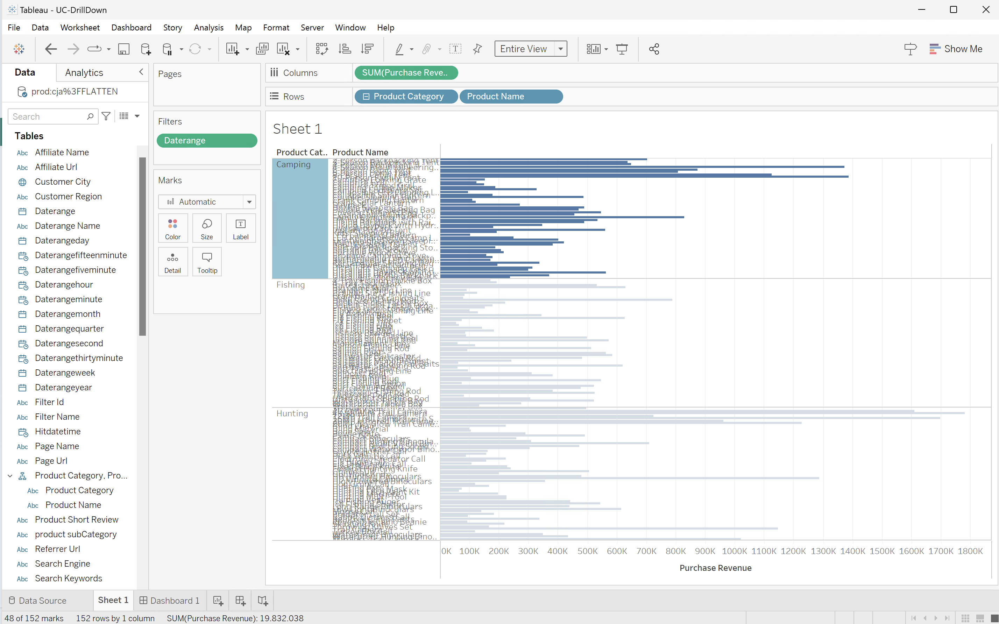

# ビジュアライゼーション


Customer Journey Analyticsで使用可能なビジュアライゼーションが、BI ツールで使用可能なビジュアライゼーションを使用して同様に作成される方法を理解します。

+++ Customer Journey Analytics

Customer Journey Analyticsには多数のビジュアライゼーションがあります。 使用可能なすべてのビジュアライゼーションの概要と概要については、[ ビジュアライゼーション ](/help/analysis-workspace/visualizations/freeform-analysis-visualizations.md) を参照してください。

+++

+++ BI ツール

>[!BEGINTABS]

>[!TAB Power BI デスクトップ ]

## 比較

ほとんどのCustomer Journey Analyticsのビジュアライゼーションでは、Power BI Desktop は同等のエクスペリエンスを提供します。 以下の表を参照してください。

| アイコン | Customer Journey Analyticsのビジュアライゼーション | Power BI デスクトップビジュアライゼーション |
| :---: | --- | ---|
|  | [面グラフ](/help/analysis-workspace/visualizations/area.md) | [ 面グラフ、積み重ね面グラフ、100% 面グラフ ](https://learn.microsoft.com/en-us/power-bi/visuals/power-bi-visualization-types-for-reports-and-q-and-a#area-charts-basic-layered-and-stacked) |
|  | [棒グラフ](/help/analysis-workspace/visualizations/bar.md) | [ 集合縦棒グラフ ](https://learn.microsoft.com/en-us/power-bi/visuals/power-bi-visualization-types-for-reports-and-q-and-a#bar-and-column-charts) |
|  | [積み重ね棒グラフ](/help/analysis-workspace/visualizations/bar.md) | [ 積み重ね柱状グラフおよび 100% 積み重ね柱状グラフ ](https://learn.microsoft.com/en-us/power-bi/visuals/power-bi-visualization-types-for-reports-and-q-and-a#bar-and-column-charts) |
| </p> | [ブレット](/help/analysis-workspace/visualizations/bullet-graph.md) |  |
|  | [コホートテーブル](/help/analysis-workspace/visualizations/cohort-table/cohort-analysis.md) |  |
|  | [コンボ](/help/analysis-workspace/visualizations/combo-charts.md) | [ 折れ線グラフおよび積み重ね柱状グラフおよび折れ線グラフおよび集合柱状グラフ ](https://learn.microsoft.com/en-us/power-bi/visuals/power-bi-visualization-types-for-reports-and-q-and-a#combo-charts) |
|  | [ドーナツ](/help/analysis-workspace/visualizations/donut.md) | [ ドーナツグラフ ](https://learn.microsoft.com/en-us/power-bi/visuals/power-bi-visualization-types-for-reports-and-q-and-a#doughnut-charts) |
|  | [フォールアウト](/help/analysis-workspace/visualizations/fallout/fallout-flow.md) | [Funnel](https://learn.microsoft.com/en-us/power-bi/visuals/power-bi-visualization-types-for-reports-and-q-and-a#funnel-charts)。 |
|  | [フロー](/help/analysis-workspace/visualizations/c-flow/flow.md) | 分解ツリー？ |
| </p> | [フリーフォームテーブル](/help/analysis-workspace/visualizations/freeform-table/freeform-table.md) | [Table](https://learn.microsoft.com/en-us/power-bi/visuals/power-bi-visualization-types-for-reports-and-q-and-a#tables) および [Matrix](https://learn.microsoft.com/en-us/power-bi/visuals/power-bi-visualization-types-for-reports-and-q-and-a#matrix) |
|  | [ヒストグラム](/help/analysis-workspace/visualizations/histogram.md) |  |
|  | [横棒グラフ](/help/analysis-workspace/visualizations/horizontal-bar.md) | [ 集合棒グラフ ](https://learn.microsoft.com/en-us/power-bi/visuals/power-bi-visualization-types-for-reports-and-q-and-a#bar-and-column-charts) |
|  | [積み重ね横棒グラフ](/help/analysis-workspace/visualizations/horizontal-bar.md) | [ 積み重ね棒グラフおよび 100% 積み重ね棒グラフ ](https://learn.microsoft.com/en-us/power-bi/visuals/power-bi-visualization-types-for-reports-and-q-and-a#bar-and-column-charts) |
|  | [ジャーニーキャンバス](/help/analysis-workspace/visualizations/journey-canvas/journey-canvas.md) | [ 分解ツリー ](https://learn.microsoft.com/en-us/power-bi/visuals/power-bi-visualization-types-for-reports-and-q-and-a#decomposition-tree) |
|  | [主要指標の概要](/help/analysis-workspace/visualizations/key-metric.md) |  |
|  | [折れ線グラフ](/help/analysis-workspace/visualizations/line.md) | [ 折れ線グラフ ](https://learn.microsoft.com/en-us/power-bi/visuals/power-bi-visualization-types-for-reports-and-q-and-a#line-charts) |
|  | [散布図](/help/analysis-workspace/visualizations/scatterplot.md) | [ 散布図 ](https://learn.microsoft.com/en-us/power-bi/visuals/power-bi-visualization-types-for-reports-and-q-and-a#scatter) |
|  | [セクションヘッダー](/help/analysis-workspace/visualizations/section-header.md) | [ テキストボックス ](https://learn.microsoft.com/en-us/power-bi/paginated-reports/report-design/textbox/add-move-or-delete-a-text-box-report-builder-and-service) |
|  | [変更の概要](/help/analysis-workspace/visualizations/summary-number-change.md) | [ カード ](https://learn.microsoft.com/en-us/power-bi/visuals/power-bi-visualization-types-for-reports-and-q-and-a#cards) |
| </p> | [数値の概要](/help/analysis-workspace/visualizations/summary-number-change.md) | [ カード ](https://learn.microsoft.com/en-us/power-bi/visuals/power-bi-visualization-types-for-reports-and-q-and-a#cards) |
|  | [テキスト](/help/analysis-workspace/visualizations/text.md) | [ テキストボックス ](https://learn.microsoft.com/en-us/power-bi/paginated-reports/report-design/textbox/add-move-or-delete-a-text-box-report-builder-and-service) |
|  | [ツリーマップ](/help/analysis-workspace/visualizations/treemap.md)<p> | [ツリーマップ](https://learn.microsoft.com/en-us/power-bi/visuals/power-bi-visualization-types-for-reports-and-q-and-a#treemaps) |
|  | [ベン図](/help/analysis-workspace/visualizations/venn.md) | |


## ドリルダウン

Power BIでは、特定のビジュアライゼーションの詳細を調べる [ ドリルモード ](https://learn.microsoft.com/en-us/power-bi/consumer/end-user-drill) をサポートしています。 次の例では、製品カテゴリの購入売上高を分析します。 製品カテゴリを表すバーのコンテキストメニューから、「**[!UICONTROL ドリルダウン]**」を選択できます。


ドリルダウンすると、選択した製品カテゴリ内の製品の購入売上高でビジュアライゼーションが更新されます。


ドリルダウンすると、`WHERE` 句を使用する次の SQL クエリが生成されます。

```sql
select "_"."product_category" as "c25",
    "_"."product_name" as "c26",
    "_"."a0" as "a0"
from 
(
    select "_"."product_category",
        "_"."product_name",
        "_"."a0"
    from 
    (
        select "_"."product_category",
            "_"."product_name",
            "_"."a0"
        from 
        (
            select "rows"."product_category" as "product_category",
                "rows"."product_name" as "product_name",
                sum("rows"."purchase_revenue") as "a0"
            from 
            (
                select "_"."product_category",
                    "_"."product_name",
                    "_"."purchase_revenue"
                from "public"."cc_data_view" "_"
                where ("_"."daterange" >= date '2023-01-01' and "_"."product_category" = 'Fishing') and "_"."daterange" < date '2024-01-01'
            ) "rows"
            group by "product_category",
                "product_name"
        ) "_"
        where not "_"."a0" is null
    ) "_"
) "_"
order by "_"."product_category",
        "_"."product_name"
limit 1001
```

>[!TAB Tableau Desktop]

## 比較

ほとんどのCustomer Journey Analyticsのビジュアライゼーションでは、Tableau Desktop は同等のエクスペリエンスを提供します。 以下の表を参照してください。

| アイコン | Customer Journey Analyticsのビジュアライゼーション | Power BI デスクトップビジュアライゼーション |
| :---: | --- | ---|
|  | [面グラフ](/help/analysis-workspace/visualizations/area.md) | [ 面グラフ ](https://help.tableau.com/current/pro/desktop/en-us/qs_area_charts.htm) |
|  | [棒グラフ](/help/analysis-workspace/visualizations/bar.md) | [ 棒グラフ ](https://help.tableau.com/current/pro/desktop/en-us/buildexamples_bar.htm) |
|  | [積み重ね棒グラフ](/help/analysis-workspace/visualizations/bar.md) |  |
| </p> | [ブレット](/help/analysis-workspace/visualizations/bullet-graph.md) | [ ブレットグラフ ](https://help.tableau.com/current/pro/desktop/en-us/qs_bullet_graphs.htm) |
|  | [コホートテーブル](/help/analysis-workspace/visualizations/cohort-table/cohort-analysis.md) |  |
|  | [コンボ](/help/analysis-workspace/visualizations/combo-charts.md) | [ 複合グラフ ](https://help.tableau.com/current/pro/desktop/en-us/qs_combo_charts.htm) |
|  | [ドーナツ](/help/analysis-workspace/visualizations/donut.md) | |
|  | [フォールアウト](/help/analysis-workspace/visualizations/fallout/fallout-flow.md) | |
|  | [フロー](/help/analysis-workspace/visualizations/c-flow/flow.md) |  |
| </p> | [フリーフォームテーブル](/help/analysis-workspace/visualizations/freeform-table/freeform-table.md) | [ テキスト テーブル ](https://help.tableau.com/current/pro/desktop/en-us/buildexamples_text.htm) |
|  | [ヒストグラム](/help/analysis-workspace/visualizations/histogram.md) | [ヒストグラム](https://help.tableau.com/current/pro/desktop/en-us/buildexamples_histogram.htm) |
|  | [横棒グラフ](/help/analysis-workspace/visualizations/horizontal-bar.md) | [ 棒グラフ ](https://help.tableau.com/current/pro/desktop/en-us/buildexamples_bar.htm) |
|  | [積み重ね横棒グラフ](/help/analysis-workspace/visualizations/horizontal-bar.md) | [ 棒グラフ ](https://help.tableau.com/current/pro/desktop/en-us/buildexamples_bar.htm) |
|  | [ジャーニーキャンバス](/help/analysis-workspace/visualizations/journey-canvas/journey-canvas.md) | |
|  | [主要指標の概要](/help/analysis-workspace/visualizations/key-metric.md) |  |
|  | [折れ線グラフ](/help/analysis-workspace/visualizations/line.md) | [ 折れ線グラフ ](https://help.tableau.com/current/pro/desktop/en-us/buildexamples_line.htm) |
|  | [散布図](/help/analysis-workspace/visualizations/scatterplot.md) | [散布図](https://help.tableau.com/current/pro/desktop/en-us/buildexamples_scatter.htm) |
|  | [セクションヘッダー](/help/analysis-workspace/visualizations/section-header.md) |  |
|  | [変更の概要](/help/analysis-workspace/visualizations/summary-number-change.md) | |
| </p> | [数値の概要](/help/analysis-workspace/visualizations/summary-number-change.md) | |
|  | [テキスト](/help/analysis-workspace/visualizations/text.md) | |
|  | [ツリーマップ](/help/analysis-workspace/visualizations/treemap.md)<p> | [ツリーマップ](https://help.tableau.com/current/pro/desktop/en-us/buildexamples_treemap.htm) |
|  | [ベン図](/help/analysis-workspace/visualizations/venn.md) | |


## ドリルダウン

Tableau は [ ドリルモード ](https://learn.microsoft.com/en-us/power-bi/consumer/end-user-drill) から [ 階層 ](https://help.tableau.com/current/pro/desktop/en-us/qs_hierarchies.htm) までサポートしています。 次の例では、**[!UICONTROL テーブル]** 内の **[!UICONTROL 製品名]** フィールドを選択して階層を作成し、**[!UICONTROL 製品カテゴリ]** の上にドラッグします。 次に、製品カテゴリを表すバーのコンテキストメニューから、「**[!UICONTROL + ドリルダウン]**」を選択します。


ドリルダウンすると、選択した製品カテゴリ内の製品の購入売上高でビジュアライゼーションが更新されます。


ドリルダウンの結果、GROUP BY 句を使用する次の SQL 問合せが生成されます。

```sql
SELECT CAST("cc_data_view"."product_category" AS TEXT) AS "product_category",
  CAST("cc_data_view"."product_name" AS TEXT) AS "product_name",
  SUM("cc_data_view"."purchase_revenue") AS "sum:purchase_revenue:ok"
FROM "public"."cc_data_view" "cc_data_view"
WHERE (("cc_data_view"."daterange" >= (TIMESTAMP '2023-01-01 00:00:00.000')) AND ("cc_data_view"."daterange" < (TIMESTAMP '2024-01-01 00:00:00.000')))
GROUP BY 1,
  2
```

クエリでは、選択した製品カテゴリに結果が制限 **されません**。選択した製品カテゴリが表示されるのはビジュアライゼーションのみです。



または、あるビジュアルが別のビジュアルでの選択の結果であるドリルダウン・ダッシュボードを作成することもできます。 次の例では、**[!UICONTROL 製品カテゴリ]** ビジュアライゼーションをフィルターとして使用して、**[!UICONTROL 製品名]** テーブルを更新しています。 このビジュアライゼーションフィルターはクライアント専用であり、追加の SQL クエリは生成されません。


>[!TAB Looker]

## 比較

ほとんどのCustomer Journey Analyticsのビジュアライゼーションでは、Looker は同等のエクスペリエンスを提供します。 以下の表を参照してください。

| アイコン | Customer Journey Analyticsのビジュアライゼーション | Power BI デスクトップビジュアライゼーション |
| :---: | --- | ---|
|  | [面グラフ](/help/analysis-workspace/visualizations/area.md) | [ 面グラフ ](https://cloud.google.com/looker/docs/area-options) |
|  | [棒グラフ](/help/analysis-workspace/visualizations/bar.md) | [ 棒グラフ ](https://cloud.google.com/looker/docs/bar-options) |
|  | [積み重ね棒グラフ](/help/analysis-workspace/visualizations/bar.md) | [ 棒グラフ ](https://cloud.google.com/looker/docs/bar-options) |
| </p> | [ブレット](/help/analysis-workspace/visualizations/bullet-graph.md) | [ ブレットグラフ ](https://cloud.google.com/looker/docs/bullet-chart) |
|  | [コホートテーブル](/help/analysis-workspace/visualizations/cohort-table/cohort-analysis.md) |  |
|  | [コンボ](/help/analysis-workspace/visualizations/combo-charts.md) | [ ビジュアライゼーションのカスタマイズ ](https://cloud.google.com/looker/docs/creating-visualizations#customizing_visualizations_with_chart_settings) |
|  | [ドーナツ](/help/analysis-workspace/visualizations/donut.md) | [ドーナツ](https://cloud.google.com/looker/docs/donut-multiples-options) |
|  | [フォールアウト](/help/analysis-workspace/visualizations/fallout/fallout-flow.md) | [ファネル](https://cloud.google.com/looker/docs/funnel-options) |
|  | [フロー](/help/analysis-workspace/visualizations/c-flow/flow.md) | [ サンキー ](https://cloud.google.com/looker/docs/sankey) |
| </p> | [フリーフォームテーブル](/help/analysis-workspace/visualizations/freeform-table/freeform-table.md) | [テーブル](https://cloud.google.com/looker/docs/table-options) |
|  | [ヒストグラム](/help/analysis-workspace/visualizations/histogram.md) | |
|  | [横棒グラフ](/help/analysis-workspace/visualizations/horizontal-bar.md) | [ 棒グラフ ](https://cloud.google.com/looker/docs/bar-options) |
|  | [積み重ね横棒グラフ](/help/analysis-workspace/visualizations/horizontal-bar.md) | [ 棒グラフ ](https://cloud.google.com/looker/docs/bar-options) |
|  | [ジャーニーキャンバス](/help/analysis-workspace/visualizations/journey-canvas/journey-canvas.md) |  |
|  | [主要指標の概要](/help/analysis-workspace/visualizations/key-metric.md) |  |
|  | [折れ線グラフ](/help/analysis-workspace/visualizations/line.md) | [ 折れ線グラフ ](https://cloud.google.com/looker/docs/line-options) |
|  | [散布図](/help/analysis-workspace/visualizations/scatterplot.md) | [散布図](https://cloud.google.com/looker/docs/scatter-options) |
|  | [セクションヘッダー](/help/analysis-workspace/visualizations/section-header.md) |  |
|  | [変更の概要](/help/analysis-workspace/visualizations/summary-number-change.md) | [ 単一値 ](https://cloud.google.com/looker/docs/single-value-options) |
| </p> | [数値の概要](/help/analysis-workspace/visualizations/summary-number-change.md) | [ 単一値 ](https://cloud.google.com/looker/docs/single-value-options) |
|  | [テキスト](/help/analysis-workspace/visualizations/text.md) | [ 単一値 ](https://cloud.google.com/looker/docs/single-value-options) |
|  | [ツリーマップ](/help/analysis-workspace/visualizations/treemap.md) | [ツリーマップ](https://cloud.google.com/looker/docs/treemap) |
|  | [ ベン図 ](/help/analysis-workspace/visualizations/venn.md) | [ ベン図 ](https://cloud.google.com/looker/docs/venn) |

>[!TAB Jupyter Notebook]

matplotlib への状態ベースのインターフェイスである **matplotlib.pyplot** のビジュアライゼーション機能の比較は、この記事の目的を超えています。 インスピレーションと [matplotlib.pyplot](https://matplotlib.org/3.5.3/api/_as_gen/matplotlib.pyplot.html) ドキュメントについては、上記の例を参照してください。


>[!TAB RStudio]

R のデータビジュアライゼーションパッケージである **ggplot2** のビジュアライゼーション機能の比較は、この記事の目的を超えています。 インスピレーションと [ggplot2](https://ggplot2.tidyverse.org/articles/ggplot2.html) のドキュメントについては、上記の例を参照してください。

>[!ENDTABS]

+++
