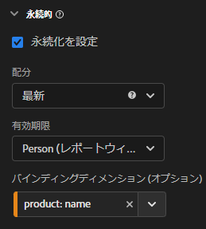
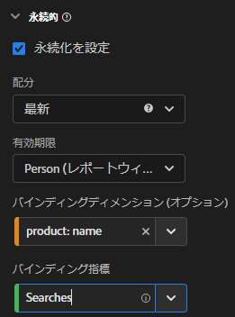
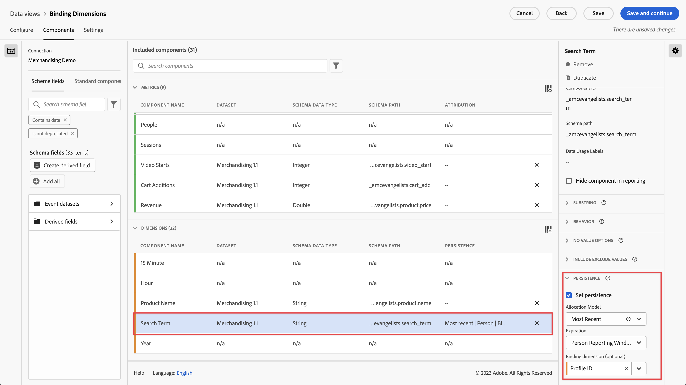

# バインディングディメンションと指標の使用

Customer Journey Analytics には、設定されたヒットの後でディメンション値を保持する方法がいくつか用意されています。 アドビが提供する永続性メソッドの 1 つにバインディングがあります。 以前のバージョンの Adobe Analyticsでは、この概念はマーチャンダイジングと呼ばれていました。

バインディングディメンションはトップレベルのイベントデータで使用できますが、この概念は[オブジェクトの配列](/help/use-cases/object-arrays.md)を操作する際に最も適しています。 特定のイベントのすべての属性にディメンションを適用しなくても、オブジェクト配列の一部にディメンションを関連付けることができます。 例えば、検索語句をイベント全体にバインドしなくても、買い物かごオブジェクト配列内の 1 つの製品に、検索語句を関連付けることができます。

## 例 1：バインディングディメンションを使用して追加の製品属性を購入に関連付ける

オブジェクト配列内のディメンション項目を別のディメンションにバインドできます。 連結ディメンション項目が表示されると、Customer Journey Analyticsは連結ディメンションを呼び出し、イベントに含めます。 次のカスタマージャーニーについて考えてみましょう。

1. 訪問者が洗濯機の製品ページを閲覧します。

   ```json
   {
       "PersonID": "1",
       "product": [
           {
               "name": "Washing Machine 2000",
               "color": "white",
               "type": "front loader",
           },
       ],
       "timestamp": 1534219229
   }
   ```

1. その後、訪問者が乾燥機の製品ページを閲覧します。

   ```json
   {
       "PersonID": "1",
       "product": [
           {
               "name": "Dryer 2000",
               "color": "neon orange",
           },
       ],
       "timestamp": 1534219502
   }
   ```

1. 最終的に購入します。 各商品の色は購入イベントには含まれていませんでした。

   ```json
   {
       "PersonID": "1",
       "orders": 1,
       "product": [
           {
               "name": "Washing Machine 2000",
               "price": 1600,
           },
           {
               "name": "Dryer 2000",
               "price": 499
           }
       ],
       "timestamp": 1534219768
   }
   ```

バインディングディメンションのないカラーで売上高を確認したかった場合でも、ディメンション `product.color` が保持され、クレジットが乾燥機のカラーに誤って関連付けられます。

| product.color | 売上高 |
| --- | --- |
| ネオンオレンジ | 2099 |

**[!UICONTROL データビュー]**&#x200B;に移動し、[!DNL Product Color] ディメンションを[!DNL Product Name]にバインドします。



この永続性モデルを設定すると、製品カラーが設定されるたびに、Customer Journey Analyticsは製品名をメモします。 その人物の後続のイベントで同じ製品名を認識すると、製品カラーも同様に持ち込まれます。 製品カラーを製品名にバインドする場合、同じデータは次のようになります。

| product.color | 売上高 |
| --- | --- |
| 白 | 1600 |
| ネオンオレンジ | 499 |

## 例2：バインディング指標を使用して検索語を商品の購入に結び付ける

Adobe Analyticsで最も一般的なマーチャンダイジング手法のひとつは、検索語を商品にバインドし、各検索語に適切な商品のクレジットを割り当てることです。 次のカスタマージャーニーについて考えてみましょう。

1. 訪問者がサイトにアクセスし、`boxing gloves`を検索します。 検索指標の値が 1 だけ増分され、上位 3 つの検索結果が表示されます。

   ```json
   {
       "PersonID": "1",
       "page_name": "Search results",
       "search": "1",
       "search_term": "boxing gloves",
       "product": [
           {
               "name": "Beginner gloves",
           },
           {
               "name": "Tier 3 gloves",
           },
           {
               "name": "Professional gloves",
           }
       ]
   }
   ```

2. 気に入った手袋を見つけて、買い物かごに追加します。

   ```json
   {
       "PersonID": "1",
       "page_name": "Shopping cart",
       "cart_add": "1",
       "product": [
           {
               "name": "Tier 3 gloves",
           }
       ]
   }
   ```

3. 次に、訪問者は`tennis racket`を検索します。 検索指標の値が 1 だけ増分され、上位 3 つの検索結果が表示されます。

   ```json
   {
       "PersonID": "1",
       "page_name": "Search results",
       "search": "1",
       "search_term": "tennis racket",
       "product": [
           {
               "name": "Shock absorb racket",
           },
           {
               "name": "Women's open racket",
           },
           {
               "name": "Extreme racket",
           }
       ]
   }
   ```

4. 気に入ったラケットを見つけて、それを買い物かごに追加します。

   ```json
   {
       "PersonID": "1",
       "page_name": "Shopping cart",
       "cart_add": "1",
       "product": [
           {
               "name": "Tier 3 gloves",
           },
           {
               "name": "Shock absorb racket",
           }
       ]
   }
   ```

5. 訪問者は`shoes`を3回検索します。 検索指標の値が 1 だけ増分され、上位 3 つの検索結果が表示されます。

   ```json
   {
       "PersonID": "1",
       "page_name": "Search results",
       "search": "1",
       "search_term": "shoes",
       "product": [
           {
               "name": "Men's walking shoes",
           },
           {
               "name": "Tennis shoes",
           },
           {
               "name": "Skate shoes",
           }
       ]
   }
   ```

6. 気に入った靴を見つけて買い物かごに追加します。

   ```json
   {
       "PersonID": "1",
       "page_name": "Shopping cart",
       "cart_add": "1",
       "product": [
           {
               "name": "Tier 3 gloves",
           },
           {
               "name": "Shock absorb racket",
           },
           {
               "name": "Skate shoes",
           }
       ]
   }
   ```

7. 訪問者はチェックアウトプロセスを経て、これら 3 つのアイテムを購入します。

   ```json
   {
       "PersonID": "1",
       "page_name": "Thank you for your purchase",
       "purchase": "1",
       "product": [
           {
               "name": "Tier 3 gloves",
               "price": "89.99"
           },
           {
               "name": "Shock absorb racket",
               "price": "34.99"
           },
           {
               "name": "Skate shoes",
               "price": "79.99"
           }
       ]
   }
   ```

検索語句を伴うバインディングディメンションを含まない配分モデルを使用する場合、3 つの製品すべてが売上高を 1 つの検索語句のみに関連付けます。 例えば、検索語句ディメンションで[!UICONTROL Original]の割り当てを使用した場合：

| search_term | 売上高 |
| --- | --- |
| ボクシング手袋 | $204.97 |

検索語句ディメンションで[!UICONTROL 最新]の割り当てを使用した場合、3つの製品はすべて、引き続き1つの検索語句に収益を関連付けます。

| search_term | 売上高 |
| --- | --- |
| 靴 | $204.97 |

この例では、1人の人物のみを使用していますが、異なる検索を行う多くの人物が、検索語を異なる商品に誤って関連付ける可能性があります。 複数の人が異なるものを検索すると、実際に最高の検索結果が何であるかを判断するのが難しくなります。

[!DNL Searches]指標が存在するたびに[!DNL Search Term]を[!DNL Product Name]にバインドして、検索語句を収益に正しく関連付けることができるようになりました。



Analysis Workspace では、結果のレポートは次のようになります。

| search_term | 売上高 |
| --- | --- |
| ボクシング手袋 | $89.99 |
| テニスラケット | $34.99 |
| 靴 | $79.99 |

Customer Journey Analyticsは、選択したディメンションとバインディングディメンションの間の関係を自動的に検出します。 選択したディメンションが上位レベルにあるときに、バインディングディメンションがオブジェクト配列にある場合は、バインディング指標が必要です。 バインディング指標は、バインディングディメンションのトリガーとして機能するので、バインディング指標が存在するイベントに対してのみバインドされます。 上記の例では、検索結果ページには常に検索語句ディメンションと検索指標が含まれます。

検索語句ディメンションをこの永続性モデルに設定すると、次のロジックが実行されます。

* 検索語句ディメンションが設定されている場合は、製品名が存在するかどうかを確認します。
* 製品名がない場合は、何もしません。
* 製品名が存在する場合は、検索指標が存在するかどうかを確認します。
* 検索指標がない場合は、何もしません。
* 検索指標がある場合は、そのイベントで検索語句をすべての製品名にバインドします。 そのイベントの商品名と同じレベルにコピーされます。 この例では、`product.search_term`として扱われます。
* 後続のイベントで同じ製品名が見られた場合、バインドされた検索語句はそのイベントにも繰り越されます。

## 例 3：ビデオ検索語句をユーザープロファイルにバインドする

検索語句をユーザープロファイルにバインドすると、プロファイル間の永続性を完全に分離したままにすることができます。 例えば、組織でストリーミングサービスを実行している場合に、包括的なアカウントに複数のプロファイルを割り当てることができます。 訪問者には、未成年プロファイルと成人プロファイルがあります。

1. アカウントが未成年プロファイルでログインし、子供向けのテレビ番組を検索します。 なお、`"ProfileID"` は未成年プロファイルを表す `2` になっています。

   ```json
   {
       "PersonID": "7078",
       "ProfileID": "2",
       "Searches": "1",
       "search_term": "kids show"
   }
   ```

1. 「Orangey」という番組を見つけて、子供が視聴できるように再生します。

   ```json
   {
       "PersonID": "7078",
       "ProfileID": "2",
       "ShowName": "Orangey",
       "VideoStarts": "1"
   }
   ```

1. その夜遅く、親は自分のプロファイルに切り替えて、視聴する成人向けコンテンツを検索します。 `"ProfileID"` は、成人プロファイルを表す `1` になっています。 両方のプロファイルは同じアカウントに属し、同じ `"PersonID"` で表されます。

   ```json
   {
       "PersonID": "7078",
       "ProfileID": "1",
       "Searches": "1",
       "search_term": "grownup movie"
   }
   ```

1. 「Analytics After Hours」という番組を見つけて、夜に視聴します。

   ```json
   {
       "PersonID": "7078",
       "ProfileID": "1",
       "ShowName": "Analytics After Hours",
       "VideoStarts": "1"
   }
   ```

1. 翌日、続いて子供向け番組の「Orangey」を視聴します。 既に番組を認識しているので、検索する必要はありません。

   ```json
   {
       "PersonID": "7078",
       "ProfileID": "2",
       "ShowName": "Orangey",
       "VideoStarts": "1"
   }
   ```

ユーザーの有効期限付きの最新の配分を使用する場合、`grownup movie` の検索語は、子供向け番組の最後の視聴に関連付けられます。

| 検索語句 | 動画の開始 |
| --- | --- |
| 成人向け映画 | 2 |
| 子供向け番組 | 1 |

ただし、`search_term` を `ProfileID` にバインドすると、各プロファイルの検索は専用のプロファイルに分離され、検索対象となった正しい番組に関連付けられます。



Analysis Workspaceは、他のプロファイルからの検索を考慮せずに、Orangeyの2番目のエピソードを検索語`kids show`に関連付けています。

| 検索語句 | 動画の開始 |
| --- | --- |
| 子供向け番組 | 2 |
| 成人向け映画 | 1 |

## 例 4：小売設定での参照動作と検索動作を比較評価する

以前のイベントで設定したディメンションに値をバインドできます。 バインディングディメンションを含む変数を設定する場合、Customer Journey Analyticsは永続値を考慮します。 この動作が望ましくない場合は、バインディングディメンションの永続性設定を調整できます。 次の例について考えてみます。この例では、`product_finding_method` がイベントに設定されたあと、後続のイベントで「買い物かごへの追加」指標にバインドされています。

1. 訪問者が `camera` を検索します。 このページでは製品が設定されていません。

   ```json
   {
       "search_term": "camera",
       "product_finding_method": "search"
   }
   ```

1. 気に入ったカメラをクリックして、それを買い物かごに追加します。

   ```json
   {
       "Product": [
           {
               "name": "DSLR Camera"
           }
       ],
       "CartAdd": "1"
   }
   ```

1. 次に、訪問者は、検索を行わずに、男性用ベルトのカテゴリを閲覧します。 このページでは製品が設定されていません。

   ```json
   {
       "category": "Men's belts",
       "product_finding_method": "browse"
   }
   ```

1. 気に入ったベルトをクリックして、それを買い物かごに追加します。

   ```json
   {
       "Product": [
           {
               "name": "Ratchet belt"
           }
       ],
       "CartAdd": "1"
   }
   ```

1. 訪問者はチェックアウトプロセスを経て、これら 2 つの商品を購入します。

   ```json
   {
       "Product": [
           {
               "name": "DSLR Camera",
               "price": "399.99"
           },
           {
               "name": "Ratchet belt",
               "price": "19.99"
           }
       ],
       "Purchase": "1"
   }
   ```

永続性がバインディングディメンションなしで最新の配分に設定されている場合、$419.98 の売上高はすべて「`browse`」検索方法に関連付けられます。

| 製品の検索方法 | 売上高 |
| --- | --- |
| 閲覧 | 419.98 |

永続性がバインディングディメンションなしで元の配分を使用して設定されている場合、$419.98 の売上高はすべて「`search`」検索方法に関連付けられます。

| 製品の検索方法 | 売上高 |
| --- | --- |
| 検索 | 419.98 |

ただし、`product_finding_method` を「買い物かごへの追加」指標にバインドすると、結果のレポートでは各製品が正しい検索方法に関連付けられます。

| 製品の検索方法 | 売上高 |
| --- | --- |
| 検索 | 399.99 |
| 閲覧 | 19.99 |


>[!MORELIKETHIS]
>
>データビュー[&#128279;](https://experienceleague.adobe.com/docs/customer-journey-analytics-learn/tutorials/data-views/binding-dimensions-in-data-views.html) チュートリアルの バインディングディメンション。
