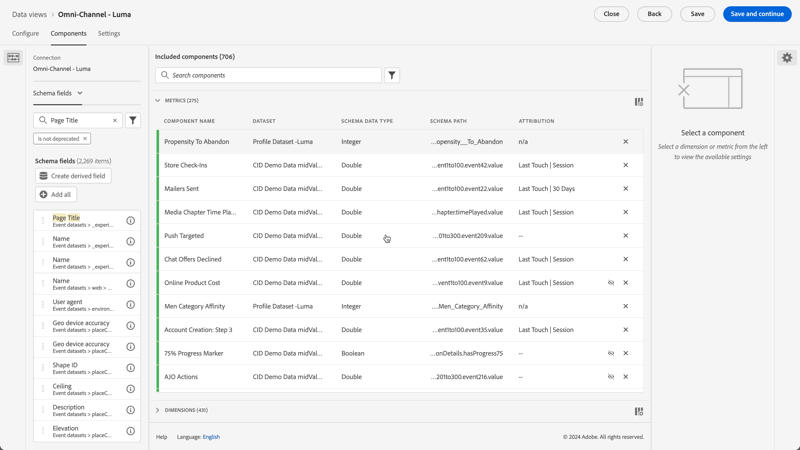
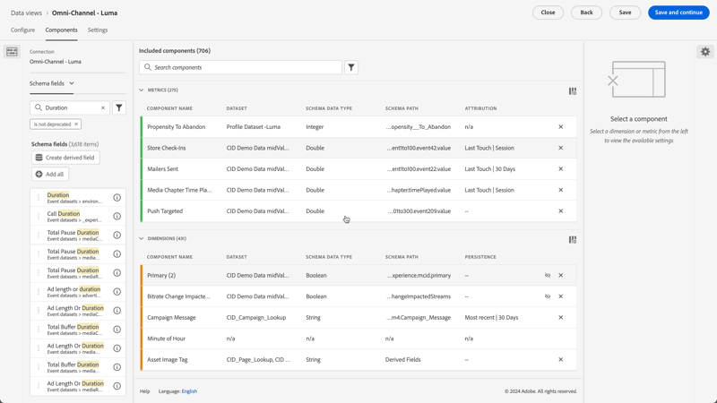
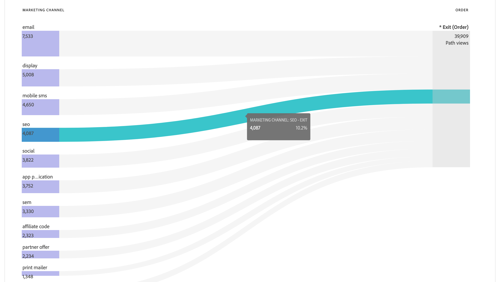
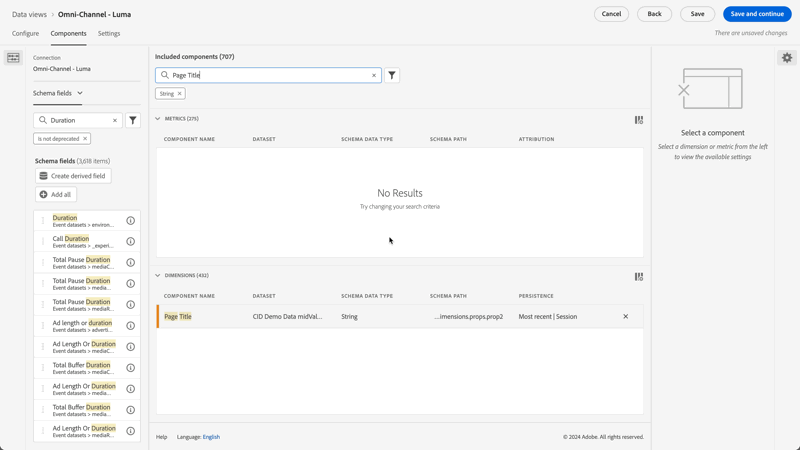
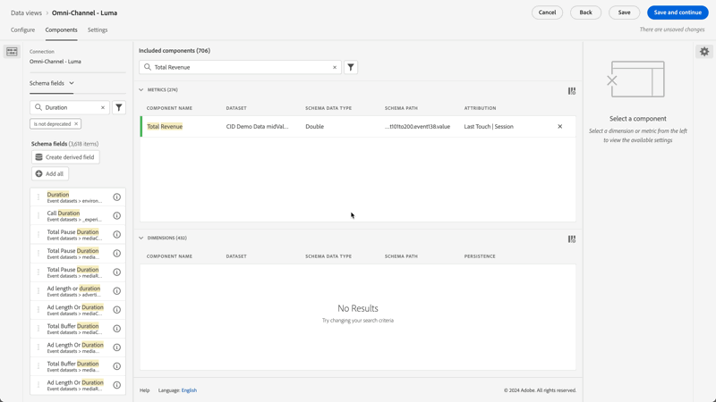

# データビューのユースケース

これらのユースケースは、Customer Journey Analyticsのデータビューの柔軟性とパワーを示しています。

## ディメンションのバインド指標の使用

詳しくは、[ バインディングディメンション指標を使用](binding-dimensions-metrics.md)の使用例を参照してください。

## 概要データの使用

詳しくは、[概要データの使用](summary-data.md) ユースケースを参照してください。

## BI 拡張機能のユースケース

Customer Journey Analytics BI拡張機能を使用して多くのユースケースを実現する方法については、[BI拡張機能のユースケース ](bi-extension-usecases.md)を参照してください。

## 文字列スキーマフィールドからの指標の作成 {#string}

例えば、データビューを作成する際に、文字列である[!UICONTROL  ページタイトル ] スキーマフィールドから[!UICONTROL 注文]指標を作成できます。

1. **[!UICONTROL コンポーネント]** タブで、**[!UICONTROL ページタイトル]**&#x200B;を[!UICONTROL 含まれるコンポーネント ]の下の&#x200B;**[!UICONTROL 指標]** セクションにドラッグします。
1. ドラッグした指標をハイライト表示し、上の&#x200B;**[!UICONTROL コンポーネント設定]**&#x200B;で`Orders`という名前に変更します
1. 「**[!UICONTROL 値を含める/除外]**」セクションを開き、以下を指定します。
   1. **[!UICONTROL 値を含めたり除外したりする設定]**&#x200B;を有効にします。
   1. **[!UICONTROL Match]**&#x200B;からすべての条件を満たす&#x200B;]**場合は、**[!UICONTROL &#x200B;を選択します。
   1. `confirmation`を指定してください。 **[!UICONTROL page_title]**&#x200B;のテキストは、このページが注文に関連していることを示します。 これらの条件が満たされているすべてのページタイトルを確認した後、各インスタンスに`1`がカウントされます。 結果は新しい指標です（計算指標ではありません）。 値を含める/除外した指標は、他の指標を使用できるあらゆる場所で使用できます。 これらの指標は、アトリビューションやセグメントなど、標準的な指標を使用できるあらゆるチャネルで活用できます。

   {width=100%}
1. [!UICONTROL セッション]を[!UICONTROL ルックバックウィンドウ]として、[!UICONTROL ラストタッチ]など、この指標のアトリビューションモデルをさらに指定できます。
同じフィールドから別の[!UICONTROL 受注]指標を作成し、別のアトリビューションモデルを指定することもできます。 [!UICONTROL  ファーストタッチ ]、別の[!UICONTROL  ルックバックウィンドウ ] （例：[!UICONTROL 30日間]）など。

また、ディメンションである人物IDを指標として使用して、自社の人物IDの数を決定する例もあります。

## 整数をディメンションとして使用 {#integers}

以前は、Customer Journey Analyticsでは整数は指標として自動的に扱われていました。 現在は、数値（Adobe Analytics のカスタムイベントを含む）をディメンションとして扱うことができます。 次に例を示します。

1. **[!UICONTROL 期間]**&#x200B;整数を[!UICONTROL 含まれるコンポーネント ]の下の&#x200B;**[!UICONTROL ディメンション]** セクションにドラッグします。
1. これで、「**[!UICONTROL 値のグループ化]**」を追加して、このディメンションをグループ化してレポートに表示できます。 バケットを使用しない場合、このディメンションの各インスタンスはWorkspace レポートに行項目として表示されます。
   {width=100%}

## 数値次元をフロー図の指標として使用する {#numeric}

数値ディメンションを使用して、[!UICONTROL  フロー] ビジュアライゼーションに指標を取り込むことができます。

1. データビューの「[コンポーネント](https://experienceleague.adobe.com/ja/docs/analytics-platform/using/cja-dataviews/create-dataview) 」タブで、[!UICONTROL マーケティングチャネル]スキーマフィールドを「[!UICONTROL 含まれるコンポーネント]」の下の「[!UICONTROL 指標]」領域にドラッグします。
2. ワークスペースレポートでは、このフローは、[!UICONTROL マーケティングチャネル]が[!UICONTROL 注文]に進むことを示します。

## サブイベントフィルタリングを実行 {#sub-event}

この機能は、特に配列ベースのフィールドに適用できます。 含める/除外の機能では、サブイベントレベルでフィルタリングできますが、セグメントビルダーで構築されたセグメントでは、イベントレベルでのセグメント化のみが可能です。 データビューで含める/除外を使用してサブイベントフィルタリングを実行し、イベントレベルでセグメント内の新しい指標/ディメンションを参照できます。

例えば、データビューの「含める/除外」機能を使用して、売上が50 ドル以上の製品のみに焦点を当てます。 したがって、50 ドルの製品の購入と25 ドルの製品の購入を含む注文がある場合、含める/除外の機能は、注文全体ではなく25 ドルの製品の購入を削除します。

1. データビュー「[コンポーネント](https://experienceleague.adobe.com/ja/docs/analytics-platform/using/cja-dataviews/create-dataview) 」タブで、「**[!UICONTROL 売上高]**」スキーマフィールドを「[!UICONTROL 含まれるコンポーネント]」の下の「**[!UICONTROL 指標]**」領域にドラッグします。
1. 指標を選択し、右側で次の設定を行います。
a. **[!UICONTROL 形式]**&#x200B;で、**[!UICONTROL 通貨]**を選択します。
b. **[!UICONTROL 通貨]**&#x200B;で、**[!UICONTROL 米ドル]**を選択します。
c. **[!UICONTROL 値を含める/除外]**&#x200B;で、**[!UICONTROL 値を含める/除外する]**の横にあるチェックボックスを選択します。
d. **[!UICONTROL Match]**&#x200B;で、すべての条件が満たされている場合は&#x200B;**[!UICONTROL を選択します]**。
e. **[!UICONTROL 条件]**&#x200B;で、**[!UICONTROL が]**以上であることを選択します。
f. 値として`50`を指定します。

これらの新しい設定では、値の大きい売上高のみを表示し、50 ドルを下回るものはすべて除外できます。

## [!UICONTROL 値なしオプション ]設定を使用する {#no-value}

レポートのディメンションに「未指定」を期待するようにユーザーをトレーニングするのに時間を費やしている可能性があります。 データビューのディメンションのデフォルトは&#x200B;*値なし*&#x200B;です。 ただし、値をレポートしない方法をディメンションごとに指定できます。 ディメンション コンポーネントの&#x200B;**[!UICONTROL 値なし]** オプションを参照してください。

{width=100%}

## アトリビューション設定が異なる複数の指標を作成する {#attribution}

右上の&#x200B;**[!UICONTROL 重複]**&#x200B;機能を使用して、**[!UICONTROL ファーストタッチ]**、**[!UICONTROL ラストタッチ]**、**[!UICONTROL アルゴリズム]**&#x200B;など、異なるアトリビューション設定を持つ合計収益指標の数を作成します。

`Total Revenue (Algorithmic)`などの違いを反映するために、各指標の名前を変更することを忘れないでください

{width=100%}

その他のデータビューの設定について詳しくは、「[データビューの作成](/help/data-views/create-dataview.md)」を参照してください。
データビューの概念的な概要については、「[データビューの概要](/help/data-views/data-views.md)」を参照してください。

## 新しいセッションと戻りセッションのレポート {#new-repeat}

セッションが実際にユーザーの最初のセッションかリターンセッションかを判断できます。 このデータビュー用に定義したレポートウィンドウと13か月間のルックバックウィンドウに基づきます。 このレポートを使用すると、次のような情報を確認できます。

* 注文件数の何パーセントが新規セッションまたは再来訪セッションから来るものなのか。

* 任意のマーケティングチャネルまたは特定のキャンペーンについて、初めてのユーザーと再来訪ユーザーのどちらをターゲティングしているのか。 この選択によって、コンバージョン率にどのような影響があるか。

1 つのディメンションと 2 つの指標を利用することで、レポートの評価が容易になります。

* [ セッションタイプ ](https://experienceleague.adobe.com/en/docs/analytics-platform/using/cja-dataviews/component-reference) – このディメンションには、次の2つの値があります：[!UICONTROL 新規]と[!UICONTROL 戻り]。 [!UICONTROL 新規]行項目には、ユーザーが定義した最初のセッションであると判断されたセッションのすべての動作（つまり、このディメンションに対する指標）が含まれます。 その他すべては、[!UICONTROL 再来訪]行項目に含まれます（すべてがセッションに属すると仮定）。 指標がセッションに含まれていない場合は、このディメンションの「該当なし」バケットに入ります。

* [初回セッション ](https://experienceleague.adobe.com/en/docs/analytics-platform/using/cja-dataviews/component-reference)。 初回セッション指標は、レポートウィンドウ内で定義されたユーザーの最初のセッションとして定義されます。

* [ リターンセッション ](https://experienceleague.adobe.com/en/docs/analytics-platform/using/cja-dataviews/component-reference) リターンセッション指標は、ユーザーの初回セッション以外のセッションの数です。—>

コンポーネントにアクセスするには：

1. データビューエディターに移動します。
1. 「**[!UICONTROL コンポーネント]**」タブを選択し、左側のパネルから「**[!UICONTROL 標準コンポーネント]**」を選択します。
1. **[!UICONTROL セッションタイプ]**、**[!UICONTROL 初回セッション]**、**[!UICONTROL セッションを返す]** コンポーネントをデータビューにドラッグします。

新しいセッションはほとんど常に正確に報告されます。 唯一の例外は次のとおりです。

* 13 か月間のルックバックウィンドウの前に最初のセッションが発生した場合。  このセッションは無視されます。
* セッションがルックバックウィンドウとレポートウィンドウの両方にまたがる場合。 例えば、2022年6月1日から2022年6月15日までの期間にレポートを実行します。 ルックバックウィンドウは、2021年5月1日から2022年5月31日までです。 セッションが2022年5月30日に開始され、2022年6月1日に終了した場合、セッションはルックバックウィンドウに含まれます。 また、レポートウィンドウ内のすべてのセッションは、リターンセッションとしてカウントされます。

## 日付と日時の機能の使用 {#date}

Adobe Experience Platform のスキーマには、[!UICONTROL 日付]および[!UICONTROL 日時]フィールドが含まれます。 Customer Journey Analytics データビューでは、これらのフィールドがサポートされるようになりました。 これらのフィールドをディメンションとしてデータビューにドラッグする際に、[形式](/help/data-views/component-settings/format.md)を指定できます。 この形式設定は、レポートでのフィールドの表示方法を決定します。 次に例を示します。

* 日付形式で「**[!UICONTROL 日]**」を「**[!UICONTROL 年、月、日]**」の形式で選択した場合、レポートの出力例は、2022年8月23日となります。

* 日時形式で、**[!UICONTROL 時間:Minute]**&#x200B;という形式で&#x200B;**[!UICONTROL 分の日]**&#x200B;を選択すると、出力は20:20のようになります。

1900年1月1日より後の日付（1970年1月1日を除く）と2000年1月1日より後の日付時刻の値はサポートされています。:00:

### 日付と日時の使用例

* 日付：旅行会社は、旅行の出発日をデータのフィールドとして収集します。 会社は、最も人気のある出発日を把握するために、収集したすべての出発日の[!UICONTROL 曜日]を比較するレポートを作成したいと考えています。 会社は、年[!UICONTROL か月]に対して同じことを行いたいと考えています。

* 日時：小売企業は、実店舗でのPOS （販売時点情報管理）購入ごとに時間を収集します。 1か月にわたって、会社は最も忙しいショッピング期間を[!UICONTROL 日の時間]までに把握したいと考えています。

>[!MORELIKETHIS]
>
>[形式コンポーネント設定の日付と日時](/help/data-views/component-settings/format.md)
>

