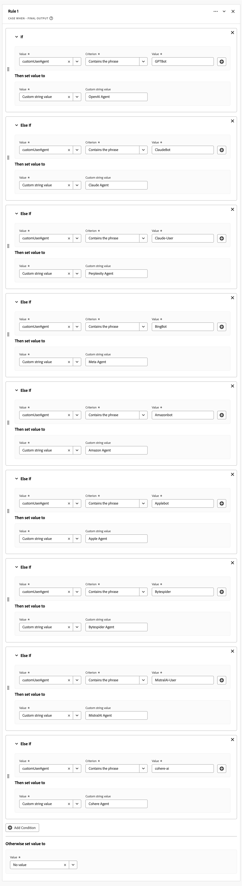
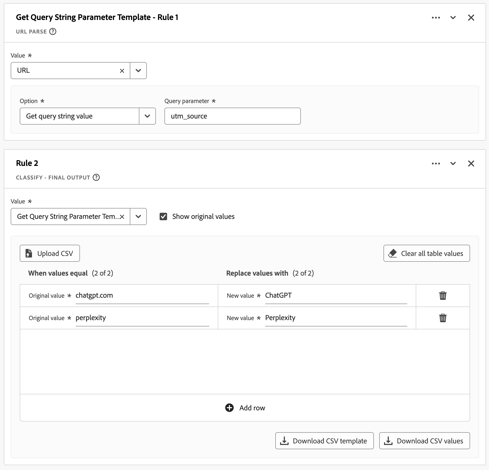
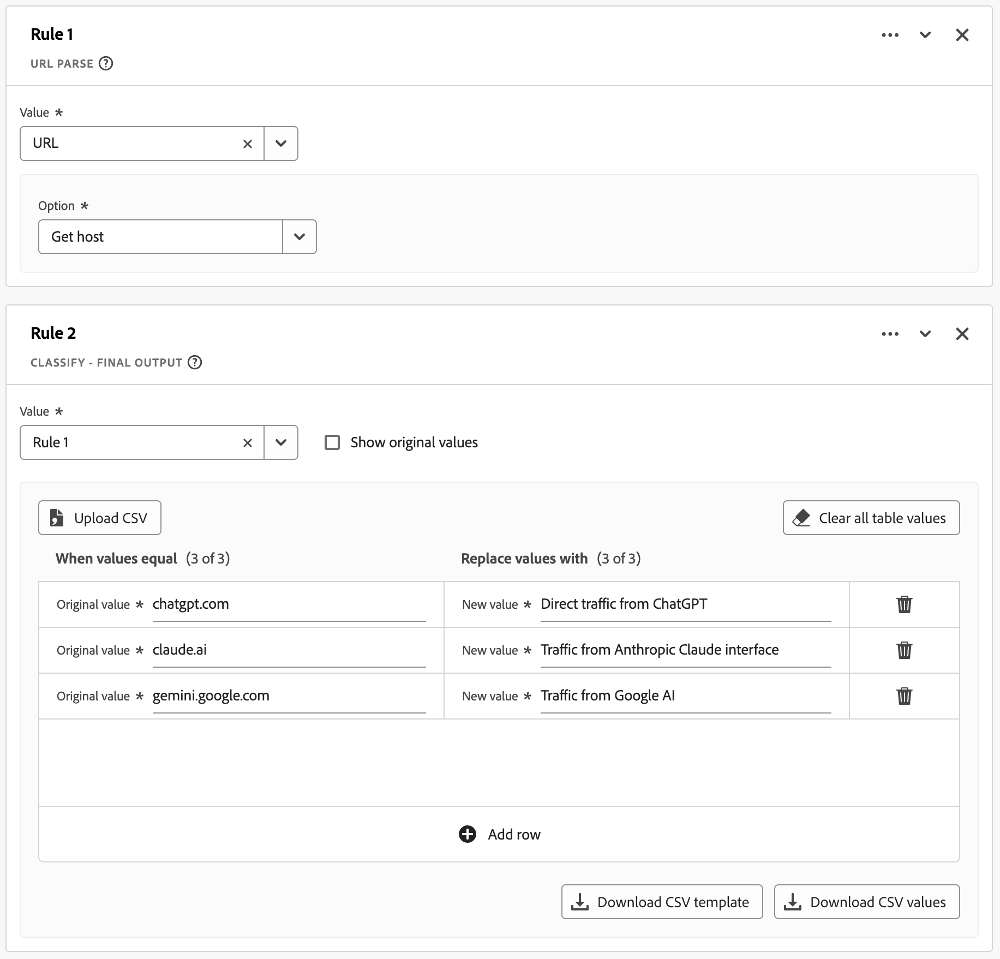
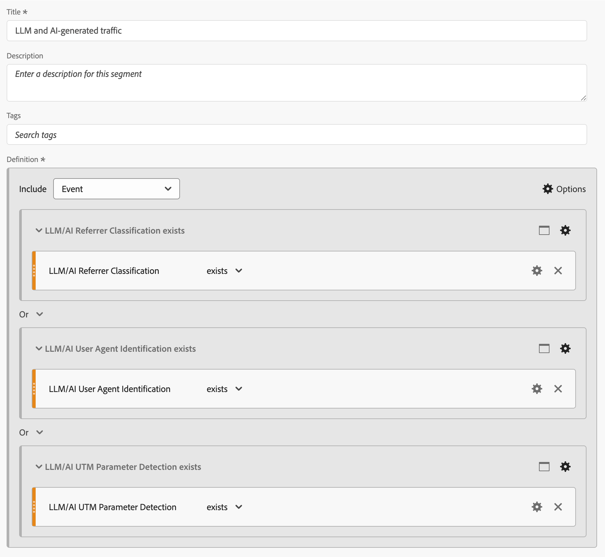
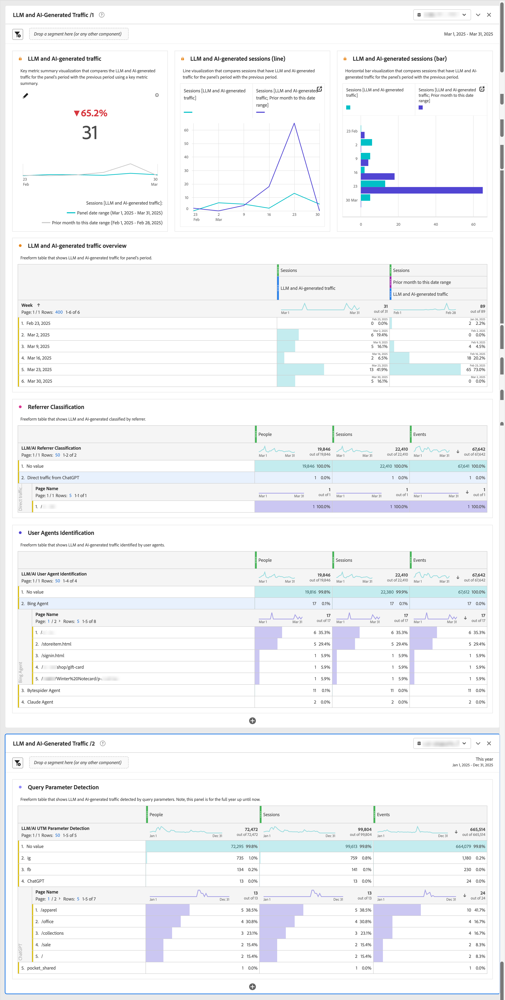

# LLM および AI 生成トラフィックのレポート

このユースケースでは、Customer Journey Analyticsの派生フィールド機能を基盤として使用して、LLM （大規模言語モデル）とAI生成トラフィックについてレポートする方法を解説します。

>[!NOTE]
>
>[検出方法](#detection-methods)、[検出シグネチャ &#x200B;](#detection-signatures)および[実装戦略](#implementation)の有効性は、特定のデータ収集方法、Experience Platform データセットのカバレッジ、およびCustomer Journey Analyticsの実装によって異なります。 テクノロジー環境、データガバナンスポリシー、導入アプローチによって、成果は異なる場合があります。 Experience Edgeを使用する場合は、生のユーザーエージェント文字列を記録するか、デバイス情報を収集するかを選択する必要があります。
>

## 検出方法

LLMおよびAI生成トラフィックを検出するには、次の点を区別します。

* **LLM web クローラー**：トレーニングと検索用のデータを収集する拡張生成（RAG）。
* **AI エージェント**：人間に代わってタスクを実行するインターフェイスとして機能します。 AI エージェントは、web分析のトラッキング方法を回避するAPIを介したやり取りを好みます。 それでも、AIが生成したトラフィックの大部分は、web サイトを通じて分析することができます。

LLMとAI生成のトラフィックを識別および監視するための3つの一般的なコア検出方法は次のとおりです。

* **ユーザーエージェント ID**: サーバーにリクエストが行われると、HTTP User-Agent ヘッダーが抽出され、既知のAI web クローラーとエージェントパターンに対して分析されます。 このサーバーサイドのメソッドは、HTTP ヘッダーへのアクセスを必要とし、データ収集レイヤーで実装される場合に最も効果的です。
* **リファラー分類**: HTTP リファラーヘッダーには、現在のリクエストにリンクされている以前のweb ページのURLが含まれています。 このヘッダーは、オーディエンスがChatGPTやPerplexityなどのweb インターフェイスからサイトにクリックしたタイミングを明らかにします。
* **クエリパラメーター検出**: AI サービスは、URL パラメーター（特にUTM パラメーター）をリンクに追加できます。 これらのパラメーターはURLに保持され、標準的な分析実装を通じて検出できるため、クライアントサイドのトラッキングシナリオでも、これらのURL パラメーターを重要な指標として使用できます。

次の表に、さまざまなLLMおよびAI インタラクションシナリオに対して検出方法を使用する方法を示します。

| シナリオ | ユーザーエージェントの識別 | リファラー分類 | クエリパラメータ検出 |
|---|---|---|---|
| **モデルのトレーニング** | エージェント （`GPTBot`、`ClaudeBot`など）は、サーバーサイドのロギングが実装されている場合に識別できます。 | 分類は不可能です。 トレーニング中にAIweb クローラーがリファラーを生成することはない。 | 検出は不可能です。 AIweb クローラーはトレーニング中にパラメーターを追加しません。 |
| **エージェント閲覧** | エージェント （`ChatGPT-User`, `claude-web`）は、サーバーサイドのログでヘッダーをキャプチャするときに識別できます。 | エージェントがAI インターフェイスからリファラーの保持を使用して移動する場合、分類は可能です。 | AI サービスがトラッキングパラメーターを追加すると、検出が可能になることもあります。 |
| **クエリに回答するための拡張生成（RAG）の取得** | エージェント （`OAI-SearchBot`, `PerplexityBot`）は、サーバーサイドのログで識別できます。 | RAG操作はしばしばリファラーメカニズムをバイパスするため、通常は分類は不可能である。 | AI プロバイダーが特別に実装していない限り、検出することはほとんどありません。 |
| **ユーザーが**&#x200B;をクリック | エージェントを識別できません。 AI エージェントは通常のユーザーエージェントとして表示されます。 | ユーザーがAI インターフェイス （[chatgpt.com](https://chatgpt.com)、[claude.ai](https://claude.ai)など）のリンクをクリックすると、分類が可能になります。 | AI サービスがUTM パラメーターをアウトバウンドリンクに追加すると、検出が可能になります。 |
| **トラフィックの可視化条件** | エージェントを識別するには、Customer Journey Analyticsとのサーバーサイドのログ統合またはサーバーサイドのタグ付けが必要です。 | 分類は、AI プラットフォームのリファラーポリシーと適切なHTTP ヘッダー送信によって異なります。 | 検出には、リダイレクトと適切なURL パラメーター収集によるパラメーターの保存が必要です。 |

### 課題

LLMとAI エージェントは、デジタルプロパティを利用する際に、複雑で進化する行動を示します。 これらのテクノロジーは、プラットフォームやバージョン間で一貫性がなく動作します。 こうした一貫性の欠如は、データ担当者にとって特有の課題をもたらします。 行動パターンは大きく異なり、使用される特定のAI プラットフォーム、バージョン、インタラクションモードによって異なります。 この運用上の多様性により、標準的な分析フレームワーク内で、LLMとAI生成トラフィックを追跡および分類する取り組みが複雑化します。 これらのインタラクションの複雑な性質と急速な進化を組み合わせることで、データの整合性を維持するための詳細な検出および分類方法が必要になります。

* **部分的なデータ収集**：一部の新しいAI エージェントは、限定的なJavaScriptを実行するため、クライアントサイド実装のAnalytics データが不完全になります。 その結果、一部のインタラクションは追跡されますが、他のインタラクションは見逃されます。
* **一貫性のないセッションデータ**:AI エージェントがJavaScriptを実行する場合、セッションまたはページタイプによって異なる場合があります。 この違いにより、クライアントサイドの実装のために、Customer Journey Analyticsで断片化されたユーザージャーニーが作成されます。
* **検出の課題**：部分的なトラッキングでは、特定のタッチポイントがAnalyticsに表示されない可能性があるため、検出が信頼性を失います。

## 署名の検出

2025年8月現在、以下の具体的なシグナルを検出方法ごとに特定できます。

### ユーザーエージェントの識別

<table>
<thead>
<tr>
<th>Web クローラー</th>
<th>ユーザーエージェント文字列</th>
<th>目的/行動</th>
</tr>
</thead>
<tbody>
<tr>
<td><strong>GPTBot</strong></td>
<td><code>Mozilla/5.0 AppleWebKit/537.36 (KHTML, like Gecko); compatible; GPTBot/1.1; +<a href="https://openai.com/gptbot" target="_blank" rel="noopener nofollow noreferrer">https://openai.com/gptbot</a></code></td>
<td><a href="https://platform.openai.com/docs/bots/" target="_blank" rel="noopener nofollow noreferrer">ChatGPTと言語モデルのトレーニングに使用されるOpenAIの主要なwebweb クローラー</a></td>
</tr>
<tr>
<td><strong>ChatGPT-User</strong></td>
<td><code>Mozilla/5.0 AppleWebKit/537.36 (KHTML, like Gecko); compatible; ChatGPT-User/1.0; +<a href="https://openai.com/bot" target="_blank" rel="noopener nofollow noreferrer">https://openai.com/bot</a></code></td>
<td><a href="https://platform.openai.com/docs/bots/" target="_blank" rel="noopener nofollow noreferrer">ChatGPTがユーザーの代理でweb サイトを閲覧する場合に使用します（以前）</a></td>
</tr>
<tr>
<td><strong>ChatGPT-User v2</strong></td>
<td><code>Mozilla/5.0 AppleWebKit/537.36 (KHTML, like Gecko); compatible; ChatGPT-User/2.0; +<a href="https://openai.com/bot" target="_blank" rel="noopener nofollow noreferrer">https://openai.com/bot</a></code></td>
<td><a href="https://platform.openai.com/docs/bots/" target="_blank" rel="noopener nofollow noreferrer">ChatGPTのオンデマンドフェッチとインレスポンス検索用の更新バージョン</a></td>
</tr>
<tr>
<td><strong>OAI-SearchBot</strong></td>
<td><code>Mozilla/5.0 AppleWebKit/537.36 (KHTML, like Gecko); compatible; OAI-SearchBot/1.0; +<a href="https://openai.com/searchbot" target="_blank" rel="noopener nofollow noreferrer">https://openai.com/searchbot</a></code></td>
<td><a href="https://platform.openai.com/docs/bots/" target="_blank" rel="noopener nofollow noreferrer">ChatGPTの検索重視のweb クローラーでコンテンツを発見</a></td>
</tr>
<tr>
<td><strong>ClaudeBot</strong></td>
<td><code>Mozilla/5.0 AppleWebKit/537.36 (KHTML, like Gecko); compatible; ClaudeBot/1.0; +claudebot@anthropic.com</code></td>
<td><a href="https://support.claude.com/en/articles/8896518-does-anthropic-crawl-data-from-the-web-and-how-can-site-owners-block-the-crawler" target="_blank" rel="noopener nofollow noreferrer">Claude AI アシスタントのトレーニングと更新に対するAnthropicのweb クローラー</a></td>
</tr>
<tr>
<td><strong>クロード=ユーザー</strong></td>
<td><code>Mozilla/5.0 AppleWebKit/537.36 (KHTML, like Gecko; compatible; Claude-User/1.0; +Claude-User@anthropic.com)</code></td>
<td><a href="https://support.claude.com/en/articles/8896518-does-anthropic-crawl-data-from-the-web-and-how-can-site-owners-block-the-crawler" target="_blank" rel="noopener nofollow noreferrer">Claude AI ユーザーをサポート Claudeに質問する個人は、Clを使用してWeb サイトにアクセスする可能性があります…</a></td>
</tr>
<tr>
<td><strong>Claude-SearchBot</strong></td>
<td><code>Mozilla/5.0 AppleWebKit/537.36 (KHTML, like Gecko; compatible; Claude-SearchBot/1.0; +Claude-SearchBot@anthropic.com)</code></td>
<td><a href="https://support.claude.com/en/articles/8896518-does-anthropic-crawl-data-from-the-web-and-how-can-site-owners-block-the-crawler" target="_blank" rel="noopener nofollow noreferrer">Webをナビゲートして、オンラインコンテンツを分析することで、Claude AI ユーザーの検索結果の品質を向上させます…</a></td>
</tr>
<tr>
<td><strong>PerplexityBot</strong></td>
<td><code>Mozilla/5.0 AppleWebKit/537.36 (KHTML, like Gecko; compatible; PerplexityBot/1.0; +<a href="https://www.perplexity.ai/perplexitybot" target="_blank" rel="noopener nofollow noreferrer">https://perplexity.ai/perplexitybot</a>)</code></td>
<td><a href="https://docs.perplexity.ai/guides/bots" target="_blank" rel="noopener nofollow noreferrer">Perplexity.aiによるリアルタイム web データインデックス作成のweb クローラー</a></td>
</tr>
<tr>
<td><strong>Perplexity-User</strong></td>
<td><code>Mozilla/5.0 AppleWebKit/537.36 (KHTML, like Gecko; compatible; Perplexity-User/1.0; +<a href="https://www.perplexity.ai/useragent" target="_blank" rel="noopener nofollow noreferrer">https://www.perplexity.ai/useragent</a>)</code></td>
<td><a href="https://docs.perplexity.ai/guides/bots" target="_blank" rel="noopener nofollow noreferrer">ユーザーが「Perplexity citation」（robots.txtをバイパス）をクリックすると、ページが読み込まれる</a></td>
</tr>
<tr>
<td><strong>Google-Extended</strong></td>
<td><code>Mozilla/5.0 (compatible; Google-Extended/1.0; +<a href="https://support.google.com/webmasters/answer/182072" target="_blank" rel="noopener nofollow noreferrer">http://www.google.com/bot.html</a>)</code></td>
<td><a href="https://blog.google/technology/ai/an-update-on-web-publisher-controls/" target="_blank" rel="noopener nofollow noreferrer">GoogleのGemini向けAI重視web クローラー（標準のGoogleLebotとは別）</a></td>
</tr>
<tr>
<td><strong>BingBot</strong></td>
<td><code>Mozilla/5.0 (compatible; BingBot/1.0; +<a href="http://www.bing.com/bot.html" target="_blank" rel="noopener nofollow noreferrer">http://www.bing.com/bot.html</a>)</code></td>
<td>Bing検索とBing チャットを強化するMicrosoftのweb クローラー（Copilot）</td>
</tr>
<tr>
<td><strong>DuckAssistBot</strong></td>
<td><code>Mozilla/5.0 (compatible; DuckAssistBot/1.0; +<a href="https://duckduckgo.com/bot.html" target="_blank" rel="noopener nofollow noreferrer">http://www.duckduckgo.com/bot.html</a>)</code></td>
<td><a href="https://duckduckgo.com/duckduckgo-help-pages/results/duckassistbot" target="_blank" rel="noopener nofollow noreferrer">DuckAssist、DuckDuckGoのプライベート AI回答機能のコンテンツをスクレイピング</a></td>
</tr>
<tr>
<td><strong>YouBot</strong></td>
<td><code>Mozilla/5.0 (compatible; YouBot (+<a href="http://www.you.com" target="_blank" rel="noopener nofollow noreferrer">http://www.you.com</a>))</code></td>
<td>You.comのAI 検索とブラウザーアシスタントの背後にあるWeb クローラー</td>
</tr>
<tr>
<td><strong>meta-externalagent</strong></td>
<td><code>Mozilla/5.0 (compatible; meta-externalagent/1.1 (+<a href="https://developers.facebook.com/docs/sharing/webmasters/web-crawlers" target="_blank" rel="noopener nofollow noreferrer">https://developers.facebook.com/docs/sharing/webmasters/crawler</a>))</code></td>
<td><a href="https://developers.facebook.com/docs/sharing/webmasters/web-crawlers#identify-2" target="_blank" rel="noopener nofollow noreferrer">LLMをトレーニングまたは調整するためのデータ収集を可能にする、Metaのボット</a></td>
</tr>
<tr>
<td><strong>Amazonbot</strong></td>
<td><code>Mozilla/5.0 (Macintosh; Intel Mac OS X 10_10_1) AppleWebKit/600.2.5 (KHTML, like Gecko) Version/8.0.2 Safari/600.2.5 (Amazonbot/0.1; +<a href="https://developer.amazon.com/amazonbot" target="_blank" rel="noopener nofollow noreferrer">https://developer.amazon.com/support/amazonbot</a>)</code></td>
<td><a href="https://developer.amazon.com/amazonbot" target="_blank" rel="noopener nofollow noreferrer">Amazonの検索およびAI アプリケーション向けweb クローラー</a></td>
</tr>
<tr>
<td><strong>Applebot</strong></td>
<td><code>Mozilla/5.0 (Macintosh; Intel Mac OS X 10_15_5) AppleWebKit/605.1.15 (KHTML, like Gecko) Version/13.1.1 Safari/605.1.15 (Applebot/0.1; +<a href="https://support.apple.com/kb/HT6619" target="_blank" rel="noopener nofollow noreferrer">http://www.apple.com/go/applebot</a>)</code></td>
<td><a href="https://support.apple.com/en-us/119829" target="_blank" rel="noopener nofollow noreferrer">AppleのSpotlight、Siri、Safari向けweb クローラー</a></td>
</tr>
<tr>
<td><strong>Applebot-Extended</strong></td>
<td><code>Mozilla/5.0 (compatible; Applebot-Extended/1.0; +<a href="https://www.apple.com/bot.html" target="_blank" rel="noopener nofollow noreferrer">http://www.apple.com/bot.html</a>)</code></td>
<td><a href="https://support.apple.com/en-us/119829" target="_blank" rel="noopener nofollow noreferrer">AppleのAIを活用した将来のAI モデルに向けたweb クローラー（オプトイン）</a></td>
</tr>
<tr>
<td><strong>Bytespider</strong></td>
<td><code>Mozilla/5.0 (compatible; Bytespider/1.0; +<a href="https://www.bytedance.com/bot.html" target="_blank" rel="noopener nofollow noreferrer">http://www.bytedance.com/bot.html</a>)</code></td>
<td>ByteDanceのTikTokおよびその他のサービス向けAI データコレクター</td>
</tr>
<tr>
<td><strong>MistralAI-User</strong></td>
<td><code>Mozilla/5.0 (compatible; MistralAI-User/1.0; +<a href="https://mistral.ai/bot" target="_blank" rel="noopener nofollow noreferrer">https://mistral.ai/bot</a>)</code></td>
<td><a href="https://docs.mistral.ai/robots/" target="_blank" rel="noopener nofollow noreferrer">Mistralの「Le Chat」アシスタント用のリアルタイム引用フェッチャー</a></td>
</tr>
<tr>
<td><strong>cohere-ai</strong></td>
<td><code>Mozilla/5.0 (compatible; cohere-ai/1.0; +<a href="http://www.cohere.ai/bot.html" target="_blank" rel="noopener nofollow noreferrer">http://www.cohere.ai/bot.html</a>)</code></td>
<td>Cohereの言語モデルのテキストデータを収集</td>
</tr>
</tbody>
</table>

### リファラー分類

<table>
<thead>
<tr>
<th><strong>ソース</strong></th>
<th><strong>リファラー</strong></th>
<th><strong>トラフィックタイプ</strong></th>
</tr>
</thead>
<tbody>
<tr>
<td>ChatGPT</td>
<td>chatgpt.com</td>
<td>ChatGPT インターフェイスからの直接トラフィック</td>
</tr>
<tr>
<td>クロード</td>
<td>claude.ai</td>
<td>AnthropicのClaude インターフェイスからのトラフィック</td>
</tr>
<tr>
<td>Google・ジェミニ</td>
<td>gemini.google.com</td>
<td>GoogleのAI アシスタントからのトラフィック</td>
</tr>
<tr>
<td>Microsoft Copilot</td>
<td>copilot.microsoft.com</td>
<td>MicrosoftのAI アシスタントからのトラフィック</td>
</tr>
<tr>
<td>Microsoft Copilot</td>
<td>m365.cloud.microsoft</td>
<td>MicrosoftのAI アシスタント（Microsoft 365 クラウドサービス）からのトラフィック</td>
</tr>
<tr >
<td>複雑性AI</td>
<td>perplexity.ai</td>
<td>引用を含むAI 検索からのトラフィック</td>
</tr>
<tr>
<td>META AI</td>
<td>meta.ai</td>
<td>MetaのAI アシスタントからのトラフィック</td>
</tr>
</tbody>
</table>

### クエリパラメータ検出

<table>
<thead>
<tr>
<th><strong>LLM サービス</strong></th>
<th>URLの例</th>
<th><strong>クエリパラメーター</strong></th>
<th><strong>値の例</strong></th>
</tr>
</thead>
<tbody>
<tr>
<td>ChatGPT</td>
<td ><a href="https://www.yoursite.com/product?utm_source=chatgpt.com" target="_blank" rel="noopener nofollow noreferrer">https://www.yoursite.com/product?utm_source=chatgpt.com</a></td>
<td>utm_source</td>
<td>chatgpt.com</td>
</tr>
<tr>
<td>複雑性</td>
<td><a href="https://www.yoursite.com/article?utm_source=perplexity" target="_blank" rel="noopener nofollow noreferrer">https://www.yoursite.com/article?utm_source=perplexity</a></td>
<td>utm_source</td>
<td>複雑性</td>
</tr>
</tbody>
</table>

## 実装

[派生フィールド &#x200B;](#derived-fields)、[&#x200B; セグメント &#x200B;](#segments)、[&#x200B; ワークスペースプロジェクト &#x200B;](#workspace-project)の具体的な設定と設定により、一般的なCustomer Journey Analytics設定（[connection](/help/connections/overview.md)、[&#x200B; データビュー](/help/data-views/data-views.md)、および[&#x200B; ワークスペースプロジェクト &#x200B;](/help/analysis-workspace/home.md)）内のLLMとAI生成トラフィックについてレポートできます。

### 派生フィールド

検出方法と検出信号を設定するには、派生フィールドを基盤として使用します。 例えば、[&#x200B; ユーザーエージェント ID](#user-agent-identification)、[&#x200B; クエリパラメーター検出](#query-parameter-detection)、[&#x200B; リファラー分類](#referrer-classification)の派生フィールドを定義します。

#### LLM/AI ユーザーエージェントの識別

[Case When](/help/data-views/derived-fields/derived-fields.md#case-when)派生フィールド関数を使用して、LLM/AI ユーザーエージェントを識別する派生フィールドを定義します。

{zoomable="yes"}

#### LLM/AI クエリパラメーター検出

[URL解析](/help/data-views/derived-fields/derived-fields.md#url-parse)および[分類](/help/data-views/derived-fields/derived-fields.md#classify)派生フィールド関数を使用して、クエリパラメーターを検出する派生フィールドを定義します。

{zoomable="yes"}

#### LLM/AI リファラー分類

[URL解析](/help/data-views/derived-fields/derived-fields.md#url-parse)および[分類](/help/data-views/derived-fields/derived-fields.md#classify)派生フィールド関数を使用して、リファラーを分類する派生フィールドを定義します。

{zoomable="yes"}

### セグメント

専用セグメントを設定して、LLMとAIが生成したトラフィックに関連するイベント、セッション、人物を特定するのに役立ちます。 例えば、先ほど作成した派生フィールドを使用して、LLMとAIが生成したトラフィックを識別するセグメントを定義します。

{zoomable="yes"}

### ワークスペースプロジェクト

派生フィールドとセグメントを使用して、LLMとAIが生成したトラフィックをレポートし、分析します。 例えば、以下の注釈付きプロジェクトを参照してください。

{zoomable="yes"}

>[!MORELIKETHIS]
>
>このユースケース記事は、ブログ記事[Adobe Customer Journey AnalyticsでのLLMおよびAI生成トラフィックのトラッキングと分析](https://experienceleaguecommunities.adobe.com/t5/adobe-analytics-blogs/tracking-and-analyzing-llm-and-ai-generated-traffic-in-adobe/ba-p/771967?profile.language=ja)に基づいています。
>
>
