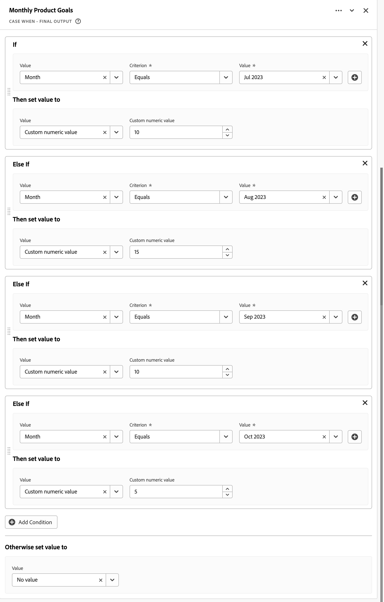
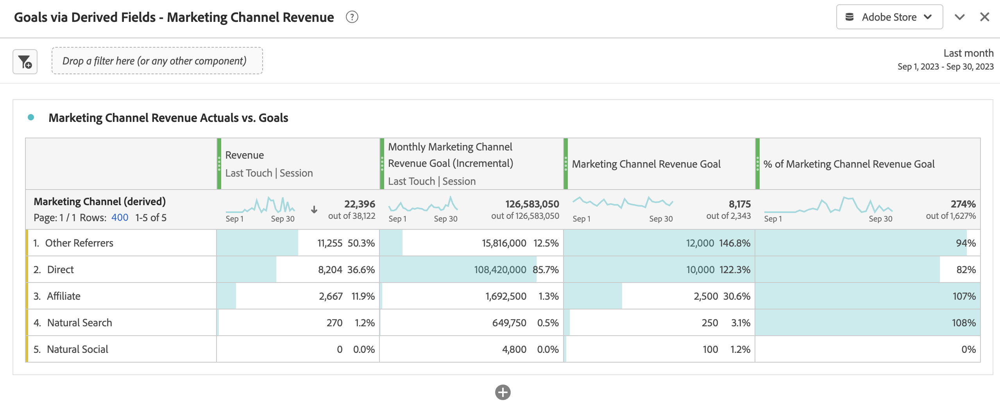

# 派生フィールドを使用した目標に関するレポート

このユースケースでは、派生フィールドの力を使用して特定のディメンションの目標を設定し、これらの目標をWorkspace プロジェクトで使用する方法について説明します。

派生フィールドについて詳しくない場合は、[ チュートリアル ](https://experienceleague.adobe.com/docs/customer-journey-analytics-learn/tutorials/data-views/derived-fields-in-cja.html?lang=ja)および[ ドキュメント ](/help/data-views/derived-fields/derived-fields.md)を参照して、概要を確認してください。

## 目標の定義

目標を定義するには、新しい派生フィールドを作成します。このフィールドでは、派生フィールド定義の早い段階のルールから得られる値を使用して、カスタム数値を直接または間接的に明示的に設定します。

### 毎月のギフト券の注文目標

2023年7月から2023年10月までの4か月間のギフト券の注文の目標を明示的に設定します。 次に手順を示します。

1. `Monthly Gift Certificate Orders Goal (Incremental)`という名前の新しい派生フィールドを作成します。

1. CASE WHEN ルールを使用して、毎月&#x200B;**[!UICONTROL カスタム数値]**&#x200B;を設定して静的値を設定します。 以下の月間製品目標ルールを参照してください。

   

### マーケティングチャネルの売上目標

各マーケティングチャネルの月間売上目標を設定します。 次に手順を示します。

1. `Monthly Marketing Channel Revenue Goal (Incremental)`という名前の[ マーケティングチャネル関数テンプレート ](/help/data-views/derived-fields/derived-fields.md#marketing-channels)を使用して、新しい派生フィールドを作成します。

1. URL PARSE ルールとCASE WHEN ルールの組み合わせに基づいて、各マーケティングチャネルを適切に識別するためのすべてのルールを定義します。 次に例を示します。

   

1. **[!UICONTROL カスタム数値]**&#x200B;を設定することで、最終的なCASE WHEN ルールの特定のマーケティングチャネルに対して、毎月の売上目標を表す静的な値を明示的に設定します。 以下の[!DNL Monthly Goal] ルールを参照してください。

   

## 目標の使用

Workspace プロジェクトで目標を使用するには、計算指標の機能を使用して、派生フィールドを元の静的値に「正規化」します。 目標を定義する派生フィールドに設定した静的値は、イベントごとに増分されるため、この正規化は必須です。

### 毎月のギフト券の注文目標

1. `Monthly Gift Certificate Orders Goal`という名前の計算指標フィールドを作成し、次のように定義します。

   

1. 目標に対する実際の進捗状況を示すために、追加の計算フィールド（例：`% of Monthly Gift Certificate Orders Goal`）を作成できます。例：

   

これらの計算指標を使用して、フリーフォームテーブルやビジュアライゼーションの進行状況をレポートできます。 次に例を示します。

マーケティング売上目標を示す

### マーケティングチャネルの売上目標

1. `Marketing Channel Revenue Goal`という名前の計算指標フィールドを作成し、次のように定義します。

   

1. 目標に対する実際の進捗状況を示すために、追加の計算フィールド（例：`% of Marketing Channel Revenue Goal`）を作成できます。例：

   

これらの計算指標を使用して、フリーフォームテーブルやビジュアライゼーションの進行状況をレポートできます。 次に例を示します。

マーケティング売上目標を示す
