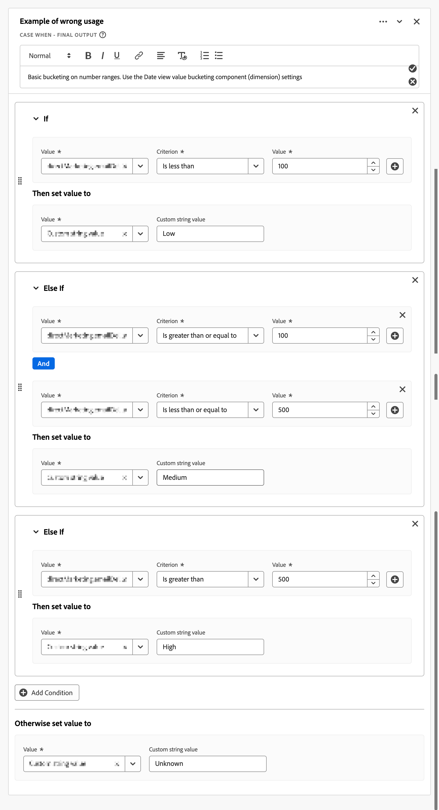

# 派生フィールドガイドライン

Customer Journey Analytics [派生フィールド &#x200B;](/help/data-views/derived-fields/derived-fields.md)を使用すると、ソースデータセットを変更することなく、クエリ時にデータを変換、分類、エンリッチできます。 そうした柔軟性を確保できなければ、複雑さ、パフォーマンスの問題、保守のオーバーヘッドを招く可能性があります。

この記事では、派生フィールドを操作するためのガイドライン（ベストプラクティス、ガードレール、一般的な落とし穴）について説明します。 対象となるオーディエンスは、データアーキテクト、製品管理者、アナリストで、次のことをおこなう必要があります。

* **パフォーマンスを最適化**: クエリの実行を遅らせるパターンやシステム制限に達するパターンを特定して、ジョブに適したツールを選択します。

   * [派生フィールド](/help/data-views/derived-fields/derived-fields.md)
   * [データビュー設定](/help/data-views/component-settings/overview.md)
   * [データ準備](https://experienceleague.adobe.com/ja/docs/experience-platform/data-prep/home)
   * [計算指標](/help/components/calc-metrics/calc-metr-overview.md)
   * [ルックアップデータセット](/help/getting-started/cja-upgrade/cja-upgrade-dataset-lookup.md)

* **メンテナンス性を向上**：明確で、モジュール化され、更新しやすい派生フィールドロジックを構築します。
* **正確性の確保**：分類、属性、データ変換で一般的な論理エラーを回避します。

この記事では、次のテーマに関するセクションを整理します。

* [高基数の派生フィールド](#high-cardinality-derived-fields)
* [ルールチェーンの場合のケースが複雑すぎる](#over-complex-case-when-rule-chains)
* [誤った使用](#wrong-usage)
* [指標とディメンションの誤分類](#misclassifications-of-metrics-and-dimensions)
* [マーケティングチャネルとキャンペーンロジックの落とし穴](#marketing-channel-and-campaign-logic-pitfalls)
* [参照で使用される正規化されていない文字列キー](#non-normalized-string-keys-used-in-lookups)
* [Regexの誤用またはオーバーリーチ](#regex-misuse-or-overreach)
* [派生フィールドの計算指標スタイルロジック](#calculated-metric-style-logic-in-derived-fields)
* [次または前の関数または連続関数の過剰な使用](#over-usage-of-next-or-previous-or-sequential-functions)
* [セッションと個人レベルのコンテキストを無視している](#ignoring-session-and-person-level-context)
* [文書化された関数の制限に近づいているか近づいている](#hitting-or-nearing-documented-function-limits)
* [データビュー固有の最適化ルール](#data-view-specific-optimization-rules)

各セクションには、次のものが含まれます。

* **パターン**&#x200B;を使用して、派生フィールド定義で観測可能なシグナルを検出します。
* **リスク診断**：パターンに問題がある理由 考えられる理由は、**パフォーマンス**、**データ品質**、または&#x200B;**メンテナンス**&#x200B;に対する悪影響です。
* **推奨事項**：実装をリファクタリングまたは改善するための具体的な手順。

これらのガイドラインは、Customer Journey Analyticsの効率的で拡張性の高い、セマンティックに正しい実装を作成するのに役立ちます。 既存のデータビューを監査したり、新しい派生フィールドをデザインしたり、ガバナンスツールを構築したりする際に、これらのガイドラインを適用します。

## 高基数の派生フィールド

この節では、高基数の派生フィールドを参照するデータビューのデフォルトセグメントについて説明します。

**パターン**

* 高カーディナリティディメンション上に構築された派生フィールドを参照するデフォルトセグメント（約100万以上の異なる値）。 例：完全ページ URL。
* [Lowercase](/help/data-views/derived-fields/derived-fields.md#lowercase)、[Trim](/help/data-views/derived-fields/derived-fields.md#trim)、[Case When](/help/data-views/derived-fields/derived-fields.md#case-when)などの単純な操作は、カーディナリティの低いフィールドの同じロジックよりもコストがかかることが多いです。

**リスク診断：パフォーマンス**

* ページ URLやその他の基数の高いディメンションに接する派生フィールドでフィルタリングされるデフォルトセグメントは、データビューに対するすべてのクエリに遅延を追加します。

**レコメンデーション**

* ページ全体のURLや、同様にカーディナリティの高いコンポーネントを、データビューのデフォルトセグメントで直接参照することを避ける。 重いURL ロジック（複雑な[&#x200B; ケース When](/help/data-views/derived-fields/derived-fields.md#case-when)、[正規表現Replace](/help/data-views/derived-fields/derived-fields.md#regex-replace)、複数の文字列関数）を[&#x200B; データ準備](https://experienceleague.adobe.com/ja/docs/experience-platform/data-prep/home)または[&#x200B; ルックアップデータセット &#x200B;](/help/getting-started/cja-upgrade/cja-upgrade-dataset-lookup.md)にプッシュすると、結果として得られる分類は、よりシンプルで基数の低い次元に到達します。
* 正規化されたページ名、サイトセクション、事前分類されたURL グループなど、基数の低いキーを優先する。
* 既存のデータビューのデフォルトセグメントと派生フィールドを定期的に監査して、基数の高いディメンション（ページ URL、キャンペーン ID、生のクエリ文字列）への参照を確認し、正規化またはグループ化されたキーにリファクタリングします。

## ルールチェーンの場合のケースが複雑すぎる

この節では、[Case When](/help/data-views/derived-fields/derived-fields.md#case-when)規則の複雑すぎるチェーンについて説明します。

Customer Journey Analyticsでは、派生フィールドごとに明示的な[関数および演算子制限](/help/data-views/derived-fields/derived-fields.md#limitations)が適用されます（例えば、演算子の最大数、型ごとの関数の最大数）。 関数内の複雑な関数とチェーンは、維持が困難で、エラーが発生しやすくなります。

**パターン**

* 非常に大きな[Case When](/help/data-views/derived-fields/derived-fields.md#case-when)は、複雑な&#x200B;**[!UICONTROL If]**&#x200B;および&#x200B;**[!UICONTROL Else If]** チェーンで機能します。
   * 多くの条件（例：20を超える演算子）またはディープネスティング（ネストされた[&#x200B; ケースの3または4 レベルを超える ケース When](/help/data-views/derived-fields/derived-fields.md#case-when) **[!UICONTROL If]**&#x200B;および&#x200B;**[!UICONTROL その他If]** ロジック）。
   * 同じフィールドで異なる値を持つ条件を繰り返しました。
* 定数文字列のマッチングを繰り返しました。

  +++ 例

  

  +++

**リスク診断：パフォーマンス、データ品質、高いメンテナンス**

* メンテナンス性とエラーのリスク：モノリシックルールブロックとしてエンコードされたロジックは、デバッグと更新が困難です。
* 潜在的なパフォーマンスと制限のリスク：[演算子または関数の制限](/help/data-views/derived-fields/derived-fields.md#limitations)をヒットまたはアプローチする可能性があります。特に、分類のようなパターンの場合です。

**レコメンデーション**

* 複数の派生フィールドに分割する： 例えば、すべてを1つの巨大なルールにまとめるのではなく、*キャンペーン正規化* （一貫性のないキャンペーン識別子を規範的な値にマッピング）をチャネルグループ化から分離します。
* ルックアップデータセットの使用： 多くの&#x200B;**[!UICONTROL If Value _value_条件&#x200B;_criterion_次に、_value_をvalue]**&#x200B;に設定します。この条件は、長い[Case When](/help/getting-started/cja-upgrade/cja-upgrade-dataset-lookup.md) チェーンを使用する代わりに、[Lookup](/help/data-views/derived-fields/derived-fields.md#lookup)関数と組み合わせた[&#x200B; ルックアップデータセット &#x200B;](/help/data-views/derived-fields/derived-fields.md#case-when)としてより適切に実装されます。
* データビューコンポーネントフィルターを使用します。 ロジックの一部が単純に不正な値を除外する場合は、そのロジックを派生フィールドに埋め込む代わりに、データビューコンポーネントレベルで[include exclude](/help/data-views/component-settings/include-exclude-values.md)を使用します。

## 誤った使用

この節では、派生フィールドの誤った使用について説明します。 特に、代替案がより良い解決策である場合。

>[!NOTE]
>
>派生フィールドからデータビューコンポーネント設定にロジックを移動しても、それ自体ではクエリのパフォーマンスが向上するわけではありません。 両方のアプローチは、同じ基本派生ロジックにコンパイルされます。 このセクションの推奨事項は、スピードではなく、明瞭性、ガバナンス、再利用に関するものです。

**パターン**

* 派生フィールドは、コンポーネント設定で既に使用可能な動作をレプリケートします。
   * ケースの正規化、トリミング、または単純なフィルタリング（例：`unknown`、`undefined`または`null`を除く）で、追加の複雑さはありません。
   * 数値範囲の基本的なグループ化。

     +++ 例

     

     +++

     代わりに、データビューのディメンションで[値のグループ化](/help/data-views/component-settings/value-bucketing.md)を使用してください。
   * [次または前](/help/data-views/derived-fields/derived-fields.md#next-or-previous)でコーディングされた永続性またはアトリビューションロジック、またはデータビュー[&#x200B; アトリビューション &#x200B;](/help/data-views/component-settings/attribution.md)と[有効期限](/help/data-views/component-settings/persistence.md)の設定で十分な手動シーケンスロジック。
   * 条件の下にある既存の指標を単純にカウントする派生指標。

     +++ 例

     

     +++

     このアプローチは、フィルタリングされた指標または[除外値を含める](/help/data-views/component-settings/include-exclude-values.md)が達成できる指標を再現します。

**リスク診断：データ品質、高いメンテナンス**

* 冗長な複雑さ：派生フィールドは、よりシンプルな組み込みのデータビュー機能が存在する場合に使用されます。
* ガバナンスリスク：他のユーザーは、ネイティブ設定ではなく派生フィールドが存在する理由を理解できない場合があります。 このパターンは、派生フィールドの管理における混乱を増加させます。
* 再利用性の低下：条件付きフラグを派生フィールドとしてエンコードすると、プロジェクトをまたいで異なるフィルターを使用したベース指標の再利用が難しくなります。

**レコメンデーション**

* トリミング/小文字：マルチステップの変換を組み合わせる必要がない限り、[部分文字列](/help/data-views/component-settings/substring.md)および[&#x200B; ビヘイビアー](/help/data-views/component-settings/behavior.md) コンポーネントの設定を使用します。
* 値の除外：派生フィールドではなく、データビューコンポーネントレベルの指標またはディメンション値に[除外値を含める](/help/data-views/component-settings/include-exclude-values.md)を使用します。
* 属性と永続性：[次または前](/help/data-views/component-settings/persistence.md)またはその他のシーケンシャルロジックを使用して派生フィールドでディメンションをシミュレートする代わりに、データビュー&#x200B;**[!UICONTROL 永続性]**&#x200B;設定（**[!UICONTROL 配分モデル]**&#x200B;および[有効期限](/help/data-views/derived-fields/derived-fields.md#next-or-previous)）を使用します。
* 数値のグループ化：派生フィールドを数値のままにし、データビューで、[Case When](/help/data-views/derived-fields/derived-fields.md#case-when) チェーンのハードコーディング範囲ラベルではなく、上部にグループ化されたディメンションを作成できるようにします。
* 条件付きロジック：単純な0または1のフラグロジックを次のいずれかに変換します。
   * Analysis Workspaceで適用される「値を含める」または「値を除外」フィルターロジックを含む元の指標。
   * データビューコンポーネント設定の設定を使用したフィルタリングされた指標。

## 指標とディメンションの誤分類

この節では、指標とディメンションの誤分類について説明します。

**パターン**

* 派生フィールドは、次の要素を明確に生成します。
   * 数値の出力（カウント、比率、または算術）ですが、コンポーネントはディメンションとして設定されます。
   * カテゴリ出力（ラベルまたは文字列）ですが、コンポーネントは指標として設定されます。
* 派生フィールドは、0/1 フラグを文字列としてエンコードします。

Customer Journey Analyticsでは、データビューレベルで数値フィールドをディメンションに、文字列フィールドを指標に変換することができますが、不整合があると混乱を招くレポートが作成される可能性があります。

**リスク診断：データ品質**

* セマンティックの不一致：コンポーネントタイプが派生結果の性質と一致しないため、コンポーネントタイプの分析や集計が困難になります。

**レコメンデーション**

* 出力が数値の場合：
   * データビューでコンポーネントタイプを&#x200B;**[!UICONTROL 指標]**&#x200B;に設定します。
   * コンポーネントがサブセット指標（例：**[!UICONTROL チェックアウトページビュー]**）を表す場合は、派生文字列と計算指標を上部に追加する代わりに、データビュー内でフィルタリングされた指標を使用します。
* 出力がラベルの場合：
   * コンポーネントタイプを&#x200B;**[!UICONTROL Dimension]**&#x200B;に設定し、それに応じて[永続性](/help/data-views/component-settings/persistence.md)設定（**[!UICONTROL 配分モデル]**&#x200B;および&#x200B;**[!UICONTROL 有効期限]**）を設定します。

## マーケティングチャネルとキャンペーンロジックの落とし穴

このセクションでは、マーケティングチャネルとキャンペーンロジックの落とし穴について説明します。

>[!NOTE]
>
>上流の簡素化を検討する：[&#x200B; データ準備](https://experienceleague.adobe.com/ja/docs/experience-platform/data-prep/home)、[&#x200B; ルックアップデータセット &#x200B;](/help/getting-started/cja-upgrade/cja-upgrade-dataset-lookup.md)、または[分類](/help/data-views/derived-fields/derived-fields.md#classify)などの派生フィールド関数を使用して、類似のマーケティングチャネルルールを統合し、[&#x200B; ケース When](/help/data-views/derived-fields/derived-fields.md#case-when) ロジックの演算子の数を減らします。 また、チャネル分類ロジックで参照される基数の高いフィールドの数を制限します（例：多くの異なるクエリパラメーターキー）。これらのフィールドでは、基数とクエリコストの両方が増加します。

**パターン**

* Customer Journey Analyticsのマーケティングチャネルは、多くの場合、派生フィールドを使用して実装されます。

   * URL パラメーター、リファラー、ランディングページなどにもとづいて、マーケティングチャネルやキャンペーンのバケット化を実装する派生フィールド。
   * 不審な順序：より特定のルールを適用する前に、汎用的なキャッチオールルールが表示されます。
   * 考えられるすべてのオプションの処理が不完全です。**[!UICONTROL 参照ドメインの明示的なブランチが設定されていません]**、または&#x200B;**[!UICONTROL クエリパラメーターが設定されていません]**。

**リスク診断：データ品質**

* ロジック順序付けエラー：特定のチャネルを上書きし、トラフィックが誤って分類される可能性があるチェーン内の後のルール。
* 直接トラフィックのラベル付けミス：一致しないトラフィックが意図しないチャネルに入るか、`Other`というラベルが付けられます。

**レコメンデーション**

* トップダウンの優先順位付けを実施。 最も強いシグナルを最初に配置します（例：有料キャンペーンのパラメーターを除外する内部ドメイン）。
* 最終的な明示的な&#x200B;**[!UICONTROL を含めます。それ以外の場合は、値を]** ケースに設定します。 フォールバックを&#x200B;**[!UICONTROL No value]**&#x200B;に設定して、以前のチャネルを上書きしないようにします。 このキャッチオール手順では、値を&#x200B;**[!UICONTROL カスタム文字列値]**&#x200B;に設定し、次に&#x200B;**[!UICONTROL カスタム文字列値]**&#x200B;を`Direct`、`None`または`Unclassified`に設定しないでください。
* テンプレートの利用： 可能な場合は、マーケティングチャネルの派生フィールドテンプレートを活用します。 Adobeの推奨マーケティングチャネルのベストプラクティスにロジックを合わせることもできます。

## 参照で使用される正規化されていない文字列キー

この節では、ルックアップでの正規化されていない文字列キーの使用について説明します。

**パターン**

* ルックアップデータセットをフィードするイベントまたはプロファイルフィールドに対する[&#x200B; ルックアップ &#x200B;](/help/data-views/derived-fields/derived-fields.md#lookup)関数。
* 前の[小文字](/help/data-views/derived-fields/derived-fields.md#lowercase)、[&#x200B; トリム &#x200B;](/help/data-views/derived-fields/derived-fields.md#trim)、または[正規表現の置換](/help/data-views/derived-fields/derived-fields.md#regex-replace)は、キーを標準化しません。
* 共通の候補：URL、キャンペーン ID、メール、アカウント ID。

**リスク診断：データ品質、高いメンテナンス**

* データ品質のリスク：キーの大文字と空白がルックアップテーブルと異なると、ルックアップが失敗し、*一致しない*&#x200B;値とレポートのギャップが発生します。

**レコメンデーション**

* 大文字または小文字を保持する文書化された理由がない限り、[&#x200B; ルックアップ &#x200B;](/help/data-views/derived-fields/derived-fields.md#lowercase)関数の前に[小文字](/help/data-views/derived-fields/derived-fields.md#trim)関数と[&#x200B; トリム &#x200B;](/help/data-views/derived-fields/derived-fields.md#lookup)関数を追加します。
* 複数の変換が既に連結されている場合は、その順序を確認します。まず正規化してから検索します。

## Regexの誤用またはオーバーリーチ

この節では、派生フィールドの正規表現機能の誤用またはオーバーリーチについて説明します。

**パターン**

* [正規表現の置換](/help/data-views/derived-fields/derived-fields.md#regex-replace)または正規表現ベースの条件では、幅広いパターンが使用されます。単純な[&#x200B; ケース &#x200B;](/help/data-views/derived-fields/derived-fields.md#case-when)関数の&#x200B;**[!UICONTROL 次が]**&#x200B;または&#x200B;**[!UICONTROL 次で始まる]**&#x200B;の方が良い代替案です。

  +++ 例

  

  

  +++

* 複数の正規表現条件が重複または競合しています。
* [URL解析](/help/data-views/derived-fields/derived-fields.md#url-parse)関数を使用する代わりに、URLを解析するための多量の正規表現の使用。

**リスク診断：パフォーマンス、データ品質、高いメンテナンス**

* パフォーマンスとメンテナンス性に関するリスク：複雑な正規表現パターンはデバッグが困難で、動作が遅くなる可能性があります。
* 正確性リスク：過度に広い正規表現は、意図しない値をキャプチャする可能性があります。

**レコメンデーション**

* [正規表現](/help/data-views/derived-fields/derived-fields.md#url-parse)ではなく、標準URL要素（ドメイン、パス、クエリパラメーター）に[URL解析](/help/data-views/derived-fields/derived-fields.md#regex-replace)を使用します。
* 単純なパターンチェックの場合は、[正規表現](/help/data-views/derived-fields/derived-fields.md#case-when)の代わりに、**[!UICONTROL Contains]**&#x200B;の&#x200B;**[!UICONTROL 、]** Starts with **[!UICONTROL または]** Ends with[&#x200B; logicを使用して](/help/data-views/derived-fields/derived-fields.md#regex-replace)Case Whenを使用します。
* 単純なパターンに対して、複数のネストされたグループまたは代替を使用する正規表現にフラグを付けます。 派生フィールド文字列関数を使用して置き換えることができる正規表現などがあります。

## 派生フィールドの計算指標スタイルロジック

この節では、派生フィールドでの計算スタイルロジックの使用について説明します。

>[!NOTE]
>
>派生フィールドは集計前のイベント（行）レベルで評価されますが、Analysis Workspaceの計算指標は集計済みの値で動作します。 したがって、比率、平均、および個別スタイルの計算は、これらの計算が派生フィールドとして実装されているか、または計算指標として実装されているかに応じて、異なる結果を生成できます。 評価の粒子が答えを変えるので、算術が住んでいる場所について慎重に検討してください。

**パターン**

* 計算指標のように見える、派生フィールド（合計、減算、除算）内の数値フィールドに対する純算術。

  +++ 例

  

  。

  +++

* 文字列操作や分類は使用されません。ロジックは純粋に数値です。

**リスク診断：データ品質**

* ガバナンスとデザインに関する質問：算術演算は、次のように配置する方が適しています。
   * 派生フィールド指標（派生フィールドをすべてのユーザーの管理された標準指標として使用する場合）。
   * Analysis Workspaceの計算指標（計算指標が分析固有の場合）。

**レコメンデーション**

* 算術結果がユーザーやプロジェクト全体で一般的に有用な場合は、結果を派生フィールド指標として保持します。 コンポーネントタイプが指標であり、書式（通貨、パーセント）がデータビューレベルで設定されていることを確認します。
* 結果がニッチまたはアナリスト固有の場合は、結果を計算指標に移動し、データビューを簡素化します。

## 次または前の関数または連続関数の過剰な使用

この節では、[NextまたはPrevious](/help/data-views/derived-fields/derived-fields.md#next-or-previous)または連続関数の過剰な使用について説明します。

**パターン**

* 派生フィールドでは、[次または前の](/help/data-views/derived-fields/derived-fields.md#next-or-previous)個の関数を複数回使用します（ドキュメントに記載されているフィールドごとの制限に近い）。
* [次または前](/help/data-views/derived-fields/derived-fields.md#next-or-previous)は、データビューの永続性を使用する代わりに、永続性に似たロジック（キャンペーンの転送など）を実装するために使用されます。

**リスク診断：データ品質、高いメンテナンス**

* 複雑さと脆弱性：重いシーケンシャルロジックは理由を考えるのが難しく、セッション化のルールや順序の変更が発生すると壊れる可能性があります。
* ディメンションの永続性を持つ冗長性：ディメンションのデータビュー[永続性](/help/data-views/component-settings/persistence.md)設定（配分モデル）は、一部のユースケース（セッションのラストタッチチャネルなど）をより効果的にカバーします。

**レコメンデーション**

* 標準の永続性に類似するパターン（例えば、セッションや人物に値を転送する）の場合は、[次または前](/help/data-views/component-settings/persistence.md)でパターンをシミュレートする代わりに、ディメンションの&#x200B;**[!UICONTROL 永続性]**&#x200B;設定（**[!UICONTROL 配分モデル]**&#x200B;および[有効期限](/help/data-views/derived-fields/derived-fields.md#next-or-previous)）をデータビューで使用します。
* ディメンションの永続性だけでは達成できない高度なマルチステップのパスまたはfunnelのラベル付けに対して[次または前の](/help/data-views/derived-fields/derived-fields.md#next-or-previous)を予約します（例：チャネルシーケンスの連結）。

## セッションと個人レベルのコンテキストを無視している

この節では、派生フィールドを定義する際のセッションおよび個人レベルのコンテキストの無視について説明します。

>[!NOTE]
>
>場合によっては、Analysis Workspaceのセッションレベルまたは個人レベルでスコープを設定したセグメントは、派生フィールドよりも単純にビヘイビアーをモデル化できます。 必要に応じて、複雑なクロススコープの派生フィールドではなく、セグメントを使用することを検討してください。

**パターン**

* 派生フィールドは、特定の[&#x200B; コンテナレベル &#x200B;](/help/getting-started/cja-b2b-concepts-features.md#containers) （イベント、セッション、またはユーザー）を暗黙的に想定していますが、

   * 派生フィールドは、セッションまたは個人レベルの属性を参照しません。
   * データ ビューのセッション設定が、意図したロジックと競合しています。

**リスク診断：データ品質**

* 概念の不一致：派生フィールドのセマンティクスは、アナリストが期待する集計レベルと一致しない可能性があります（例：イベントごとに変更できるペルソナベースのフィールド）。

**レコメンデーション**

* ロジックがセッションレベルを意図している場合：[session settings](/help/data-views/session-settings.md)が適切に設定されていることを確認し、Analysis Workspaceまたは[統合BI ツール &#x200B;](/help/data-views/bi-extension.md)でセッションスコープのコンポーネントまたはサマリーを使用することを検討します。
* ロジックが個人レベルを対象としている場合：プロファイルデータセットまたはルックアップデータセットを使用し、派生フィールド内でこれらのデータセットを参照します。
* Analysis Workspaceのセッションスコープのセグメントと個人スコープのセグメントのどちらが、派生フィールドよりも単純に同じ結果を得られるかを評価します。

## 文書化された関数の制限に近づいているか近づいている

この節では、文書化された派生フィールド関数の制限を達成または近づくことの意味について説明します。

>[!NOTE]
>
>可能であれば、複雑な派生フィールド内の基数の高いフィールドへの依存を減らします（例：正規化されたキーまたはグループ化された分類を使用）。クエリのコストと[演算子または関数の制限](/help/data-views/derived-fields/derived-fields.md#limitations)に達する可能性を制限します。

カスタム顧客ジャーニー分析[&#x200B; ドキュメント &#x200B;](/help/data-views/derived-fields/derived-fields.md#limitations)派生フィールドごとの最大関数と演算子（関数タイプごとの制限を含む）**

* 派生フィールドは、多くの[Lookup](/help/data-views/derived-fields/derived-fields.md#lookup)、[Math](/help/data-views/derived-fields/derived-fields.md#math)操作、[Split](/help/data-views/derived-fields/derived-fields.md#split)またはその他の関数を使用します。
* 演算子の数は[文書化された制限](/help/data-views/derived-fields/derived-fields.md#limitations)に近いです（例：許可されたカウントの70% ～ 80%以上）。

**リスク診断：パフォーマンス、高いメンテナンス**

* スケーラビリティリスク：フィールドが関数制限に達した場合、将来の追加が失敗したり、予期しない動作したりする可能性があります。

**レコメンデーション**

* 使用状況がしきい値を超えた場合（例：関数または演算子の制限の70%を超える場合）にプロアクティブにフラグを付けます。
* ロジックを、連結された複数の派生フィールドに分割します（例：検索キーを正規化する派生フィールド A、正規化された検索キーを使用してラベルを検索する派生フィールド B）。
* 特に大規模な分類が必要な場合は、外部データ準備またはルックアップデータセットを使用します。

## データビュー固有の最適化ルール

この節では、派生フィールドのデータビュー固有の最適化ルールについて説明します。

また、派生コンポーネントごとにデータビュー設定を確認します。

**パターン**

* 派生ディメンションにはデフォルトの属性（例：セッションの有効期限を含むラストタッチ）がありますが、派生フィールド名は別のセマンティックを意味します（例：`First Campaign of Visit`、`Original Source`）。
* 派生ディメンションにはデフォルトの[永続性](/help/data-views/component-settings/persistence.md)設定（例：**[!UICONTROL 最新]**&#x200B;の割り当て、有効期限&#x200B;**[!UICONTROL セッション]**）がありますが、派生ディメンションの名前は別のセマンティック（`First Campaign of Visit`または`Original Source`）を意味します。

**リスク診断：データ品質**

* セマンティックミスマッチ：ディメンションのラベルは、実際に設定されているものとは異なる割り当てや有効期限の動作（例えば、元の割り当てや人物レベルの有効期限）を示します。
* この不一致により、アナリストがレポートを誤って解釈したり、名前は似ていますが異なる割り当てモデルを使用するコンポーネントを比較したりするリスクが高まります。

**レコメンデーション**

* そのディメンションの[配分モデルと有効期限](/help/data-views/component-settings/persistence.md)を調整して、名前と動作を調整します。 例えば、`Original Source`という名前の派生フィールドディメンションでは、有効期限がPersonに設定されたファーストタッチアトリビューションを使用する必要があります。
* ディメンションの&#x200B;**[!UICONTROL 永続性]**&#x200B;設定の&#x200B;**[!UICONTROL 配分モデル]**&#x200B;と[有効期限](/help/data-views/component-settings/persistence.md)を調整して、名前と動作を調整します。 例えば、`Original Source`では、**[!UICONTROL 配分モデル]**&#x200B;を&#x200B;**[!UICONTROL 元]**&#x200B;に設定し、**[!UICONTROL 有効期限]**&#x200B;を&#x200B;**[!UICONTROL 人物]**&#x200B;に設定する必要があります。
