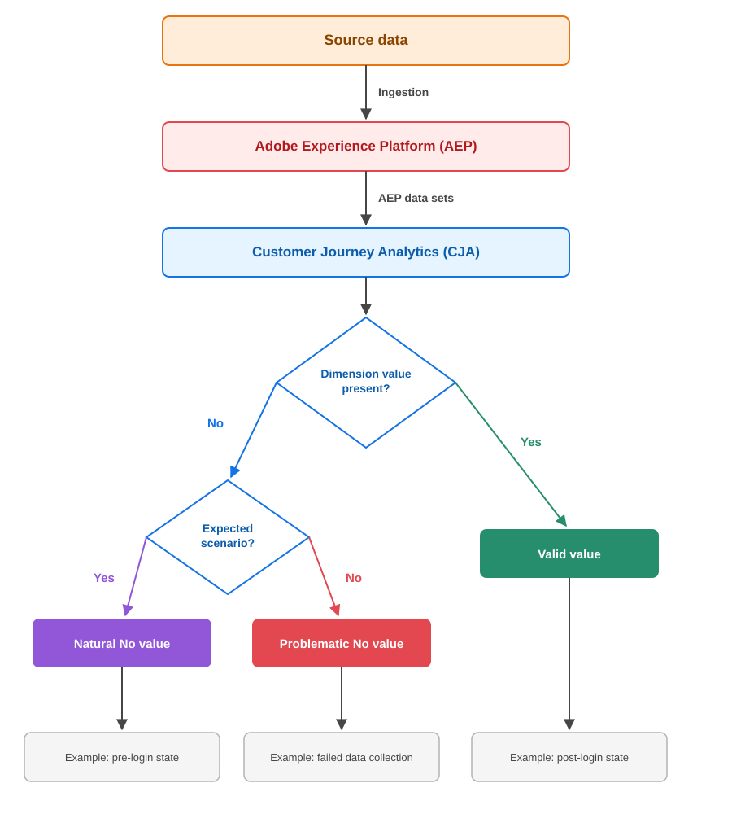
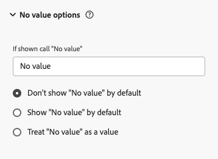

# 値なしの処理方法

Customer Journey Analyticsを使用する場合、レポートとダッシュボードで&#x200B;**[!UICONTROL 値なし]**&#x200B;のエントリが発生すると、データの品質、収集方法、レポートの正確性に関する重要な疑問が生じます。 こうした事例では、データ収集の隠れたギャップが明らかになるため、注意深く監視する必要があります。 課題は、次の2つのシナリオを区別することです。**[!UICONTROL 値なし]** エントリがデータソースプロバイダーによる調査を必要とする場合と、**[!UICONTROL 値なし]** エントリがCustomer Journey Analyticsへのデータの自然な流れを反映する場合です。 この違いを理解することは、効率的な分析業務を維持するために重要です。 このガイドでは、Customer Journey Analyticsの実装における&#x200B;**[!UICONTROL No value]**&#x200B;の表示について、情報に基づいた意思決定を行う際に役立ちます。

## 値を理解しない

ディメンションに指標を含むイベントに対応する値がない場合、**[!UICONTROL 値が表示されません]**。 レポートで&#x200B;**[!UICONTROL 値なし]**&#x200B;を確認することは、必ずしも問題ではありません。 多くの場合、データセットの期待される構造が反映されます。

Dimensionの商品は、次の3つのカテゴリーのいずれかに分類されます。

* **期待される[!UICONTROL 値がありません]**：まだサインインしていない訪問者や、すべてのイベントに適用されないディメンションなど、ユーザーがデータをどのように移動するかについての自然な結果
* **問題のある[!UICONTROL 値がありません]**：データ収集に失敗したか、実装エラーの結果です。値は存在しますが、見つかりません
* **有効な値**: ディメンションは値を正常に取得しました

次の図は、データがソースからAdobe Experience Platformに移動する際に、Customer Journey Analyticsがこれらの各カテゴリにどのように到達するかを示しています。

フローチャートは、Customer Journey Analyticsの評価で最初に値の存在を確認し、欠落している値が想定されるか問題があるかを判断することで、受信データに注目する方法を示しています。 この明確な評価により、管理者とアナリストは、ソース調査を必要とする&#x200B;**[!UICONTROL 値なし]**&#x200B;のケースと、通常の操作を表すケースを区別できます。

## 値が期待されない場合

レポートに&#x200B;**[!UICONTROL 値が]**&#x200B;表示されない一般的な予期される理由は次のとおりです。

* ディメンションは、トラフィックソースやデバイスタイプなどの特定のシナリオにのみ適用されます
* 初回訪問者はまだIDが割り当てられていません
* 訪問者がログイン前の状態で、ユーザー情報を提供していない
* 機能や製品とのやり取りは、特定のユーザージャーニーには適用されません
* クロスデバイスシナリオでは、デバイス間でディメンション値が移動しません

このような場合、以下に示すように、未識別の状態から識別された状態への移行中に、ユーザーが認証ジャーニーのどの段階にいるのかを&#x200B;**[!UICONTROL 値なし]**&#x200B;で示します。

## 値に注意が必要ない場合

次のいずれかの結果が&#x200B;**[!UICONTROL 値なし]** エントリを調査します。

**データソースでの実装の問題：**

* データ要素またはnull値がありません
* 変数マッピングが正しくない
* 不適切に設定されたデータレイヤー
* 失敗したデータ収集
* 入力データと定義されたスキーマの間に不一致がある

**データ品質の問題：**

* 壊れたトラッキングコード
* 不完全なデータ収集
* 統合エラー
* データ変換中に発生するエラー
* データパイプラインの混乱

## データビュー設定で値を管理しない

データビューの設定により、**[!UICONTROL No value]**&#x200B;項目がレポートに表示される方法を制御できます。これには、ラベルの名前の変更、デフォルトでの項目の表示または非表示、**[!UICONTROL No value]**&#x200B;を正当な文字列値として扱うことなどが含まれます。 設定の完全なリストと、それらがパーセンテージ分布、フィルタリング、およびセグメント化にどのように影響するかについては、[値オプションコンポーネント設定なし](/help/data-views/component-settings/no-value-options.md)を参照してください。

これらの設定を設定する際には、レポート要件を評価し、**[!UICONTROL 値なし]**&#x200B;の存在が分析に与える影響を評価します。 データの可視性に対する直接的な影響と、トレンド分析とレポートの一貫性に対する長期的な影響の両方を検討します。 適切に選択された設定により、レポートに&#x200B;**[!UICONTROL No value]** エントリが表示される方法に関係なく、ビジネスインサイトをアクセス可能かつ実用的に保ちながら、データの明確性が向上します。 理想的な設定は、データ表現と実用的な分析ニーズのバランスをとることで、**[!UICONTROL 値が]** データが存在しない場合でも、正確で有意義なインサイトを提供するレポート環境を構築します。

次の表に、使用可能な様々な設定の概要を示します。

<table>
<thead>
<tr>
<th>カテゴリ</th>
<th>設定</th>
<th>機能</th>
<th>影響</th>
</tr>
</thead>
<tbody>
<tr>
<td rowspan="2">オプションを表示</td>
<td></td>
<td rowspan="2">フリーフォームテーブル検索フィルター内のチェックボックス選択を使用して含めることも除外することもできます。</td>
<td rowspan="2">視認性</td>
</tr>
<tr>
<td></td>
</tr>
<tr>
<td rowspan="2">カスタム命名</td>
<td></td>
<td rowspan="2">レポート ディメンションの値の表示と、値の統合および指標の集計の可能性に影響します。</td>
<td rowspan="2">命名</td>
</tr>
<tr>
<td></td>
</tr>
<tr>
<td rowspan="3">処理オプション</td>
<td></td>
<td>数値以外のディメンションにのみ適用されます。
フリーフォームテーブル検索フィルターのアトリビューションとインクルード **[!UICONTROL No value]** オプションの両方に影響します。</td>
<td>値の処理と可視化</td>
</tr>
<tr>
<td rowspan="2">数値ディメンションのサポート：  </td>
<td rowspan="2">フリーフォームテーブル検索フィルター内のチェックボックス選択を介して含めることも除外することもできます</td>
<td rowspan="2">視認性</td>
</tr>
<tr>
</tr>
</tbody>
</table>

### 表示された場合は、「値なし」と呼びます

この設定を使用すると、**[!UICONTROL 値なし]**&#x200B;行をレポートに表示する方法をカスタマイズできます。 テキストフィールドに&#x200B;**[!UICONTROL 値なし]** ディメンション項目のカスタム名を入力できます。**[!UICONTROL 表示されている場合は、「値なし」]**&#x200B;と呼ぶことで、より意味のあるコンテキストを提供します。 `No value`ではなく、ビジネスに適した明確な用語を使用すると、レポート値をより深く理解できます。 **[!UICONTROL 値なし]**&#x200B;をセグメント内の文字列として直接使用することはできませんが、**[!UICONTROL 存在しない]**&#x200B;演算子を使用すると、同じ効果を得ることができます。

`No value`は、認証状態の場合は`Pre-login User`、層のない顧客の場合は`No Customer Tier`、未特定のマーケティングソースの場合は`No Tracked Marketing Channel`などの説明的な用語に置き換えることができます。 これにより、より直感的なレポートが作成されます。 `Pre-login User`は顧客がジャーニーのどの段階にいるのかを明確に示し、`No Customer Tier`は特定のコンテキストを提供します。 選択した説明は、そのディメンションの&#x200B;**[!UICONTROL No value]** インスタンスすべてに適用されるので、ディメンション値が存在しないすべてのシナリオを正確に反映する用語を選択してください。

### デフォルトで「値なし」を表示しない

この設定は、レポートでデフォルトで&#x200B;**[!UICONTROL No value]**&#x200B;行を非表示にするかどうかを決定します。 有効にすると、これらの行は最初にフィルタリングされますが、フリーフォームテーブル検索フィルター内のチェックボックス選択によって必要に応じてフリーフォームテーブル内に表示できます。 **[!UICONTROL 値なし]**&#x200B;行を非表示にすると、残りの値のパーセンテージ分布に影響します。パーセンテージは、表示されている項目のみに基づいて再計算されます。

### デフォルトで値を表示しない

この設定は、**[!UICONTROL 値なし]**&#x200B;をレポートにデフォルトで表示するかどうかを制御します。 有効にすると、**[!UICONTROL 値]**&#x200B;のエントリは表示されませんが、ユーザーはフリーフォームテーブル検索フィルターのチェックボックスを使用してそれらを除外できます。 **[!UICONTROL 値を含める、または除外する]**&#x200B;行は、表示可能な項目のみに基づいてパーセンテージが計算されるため、パーセンテージ分布に影響します。

### No valueを値として扱う

この設定では、**[!UICONTROL 値なし]**&#x200B;を文字列値（数値ディメンションを除く）として扱い、ディメンション値として表現をカスタマイズできます。 このカスタマイズは、アトリビューションと、フリーフォームテーブル検索フィルターの&#x200B;**[!UICONTROL 値を含まない]** オプションの両方に影響します。 カスタム文字列値を割り当てる場合、データセット内のすべての一致する値は、同じディメンション文字列値に統合されることに注意してください。

「**[!UICONTROL 値なし」を値]**&#x200B;として扱う設定は、デフォルトで「**[!UICONTROL 値なし]**」を表示する場合とは異なる目的を果たします。 デフォルトでは表示のみが制御されますが、値として扱うと、Customer Journey Analyticsがこれらのエントリを論理的に処理する方法が変わります。 この区別が重要な理由は次のとおりです。

* これにより、フィルタリングとセグメント化をより詳細に制御できるようになり、**[!UICONTROL No value]**&#x200B;が明確で実用的なディメンション値になります。
* アトリビューションモデルとビジュアライゼーションの両方において、**[!UICONTROL No value]**&#x200B;を正当なディメンション値として扱うことで、分析を通じて一貫したアトリビューションと表現を維持します。

次の場合は、**[!UICONTROL 値なし]**&#x200B;を値として扱います。

* データそのものが存在しない場合は、分析に意味があります（ログイン前の状態や属性のないトラフィックなど）。
* このようなケースをターゲットまたは除外するセグメントや計算指標を作成する必要があります。

対照的に、デフォルトで&#x200B;**[!UICONTROL 値なし]**&#x200B;を表示する方が、データを値として扱う際に追加のロジックや属性が複雑にならずに、欠落しているデータを基本的に可視化する必要がある場合に適しています。

### 数値ディメンションの値サポートがありません

数値ディメンションの場合は、いくつかの設定オプションを使用できます。 データビューのディメンション設定では、**[!UICONTROL 値を除くすべての**&#x200B;[!UICONTROL &#x200B;値なし&#x200B;]&#x200B;**オプションを設定できます。「値なし」を値]**&#x200B;として扱います。 また、フリーフォームテーブル検索フィルター内のチェックボックスの選択により、数値ディメンションの&#x200B;**[!UICONTROL 値を含めずに]**&#x200B;を管理することもできます。 セグメントを作成する際は、**[!UICONTROL exists]**&#x200B;または&#x200B;**[!UICONTROL not exist]**&#x200B;演算子を使用して、数値ディメンションを使用できます。

### 値およびアイテムレベルのディメンションがありません

一部のディメンションは、イベントの最上位レベルではなく、配列内のアイテムレベルに適用されます。 例えば、`productListItems.SKU`は、そのイベントの製品リスト項目が存在する場合にのみ値を持ちます。 このデータ粒子の違いは、**[!UICONTROL 値なし]**&#x200B;の動作を変えます。

標準の最上位ディメンションの場合、ディメンションが見つからないか、指標を保持するイベントにnull値がある場合は、Customer Journey Analyticsで&#x200B;**[!UICONTROL No value]** バケットに指標を配置できます。 アイテムレベルのディメンションは、最初に存在するアイテムによって異なります。 イベントに指標が含まれているが、商品リストの項目が不足している場合、Customer Journey Analyticsには、その指標をデータに添付したり、データを&#x200B;**[!UICONTROL 値なし]**&#x200B;としてマークしたりする行がありません。

Customer Journey Analyticsでは、見つからない配列や空の配列に対してプレースホルダーや空の行は作成されません。 その結果、**[!UICONTROL 値なし]**&#x200B;のデータビュー設定を正しく設定しても、SKU内訳などのアイテムレベルのレポートに&#x200B;**[!UICONTROL 値なし]** エントリが表示されない場合があります。 エントリの欠落は、データの粒度の違いであり、設定の問題ではありません。 **[!UICONTROL 値なし]**&#x200B;設定は、既存の行の表示方法を制御します。空の配列は、そのデータの精度レベルに行が存在しないことを意味します。

アイテムレベル **[!UICONTROL 値なし]** カウントが予想よりも少ない場合は、データ表示設定を調整する必要があると仮定する前に、欠落している配列データがギャップを説明しているかどうかを確認してください。

## ベストプラクティス

問題のある&#x200B;**[!UICONTROL No value]** インスタンスを特定したら、改善戦略を策定して実装する必要があります。 この修正は、次の2つの方法で実行できます。

* データビューコンポーネント **[!UICONTROL 値なし]** オプション設定を調整するか、または
* データ収集ソースの問題を修正します。

各パスは、迅速な修正と長期的なデータ品質の両方に異なる影響を与えるため、慎重にアプローチを選択してください。 現在の問題を解決しながら、将来の問題を防ぐための体系的なプロセスに従って導入します。 成功は、計画、体系的な実行、継続的なモニタリングにかかっています。

是正計画に対する重要な戦略的考慮事項は次のとおりです。

### 値のない問題を防ぐ

* データを処理する前に検証する
* 適切な場所にデフォルトのディメンション値を設定します（人物IDには適用されません）
* **[!UICONTROL 値が期待されない]** シナリオを文書化します
* データ収集ポイントに品質チェックを追加する
* データモデルのコンプライアンスを監視する
* データ収集中のログエラー
* 実装に自動テストを追加する
* 値が常に存在するスキーマフィールドを必須にする

### レポートに値がないことを検証

* **[!UICONTROL 値なし]** パターンを分離するセグメントを作成します
* **[!UICONTROL 値なし]**&#x200B;のトレンドを経時的に監視するQA ダッシュボードを作成します
* **[!UICONTROL 値なし]** ボリュームの変更を追跡するアラートを設定します
* 重要なパターンの変化をハイライトする自動レポートを生成します
* 関連するディメンション間で相互参照&#x200B;**[!UICONTROL 値なし]** パターン
* データビュー設定を定期的に監査する
* **[!UICONTROL 値なし]**&#x200B;戦略への変更の変更ログを管理する
* ステークホルダー向けの標準的な操作手順とドキュメントテンプレートの作成

## まとめ

すべての&#x200B;**[!UICONTROL 値なし]** エントリが問題を示すわけではありません。 **[!UICONTROL 値なし]**&#x200B;を正しく解釈するには、Adobe Experience PlatformとCustomer Journey Analyticsのデータアーキテクチャ、および利用者が製品やサイトをどのように移動するかを理解する必要があります。 **[!UICONTROL No value]**&#x200B;のすべてのインスタンスを削除しようとするのではなく、独自のユーザージャーニーとビジネスケースに基づいて、想定される&#x200B;**[!UICONTROL No value]**&#x200B;を問題のある&#x200B;**[!UICONTROL No value]**&#x200B;と区別する、組織全体の文書化されたルールを確立します。

>[!MORELIKETHIS]
>
>[Adobe Customer Journey Analyticsで&#x200B;**[!UICONTROL 値なし]**&#x200B;を処理するための完全なプレイブック &#x200B;](https://experienceleaguecommunities.adobe.com/adobe-analytics-3/the-complete-playbook-for-handling-no-value-in-adobe-cja-12769?profile.language=ja)
