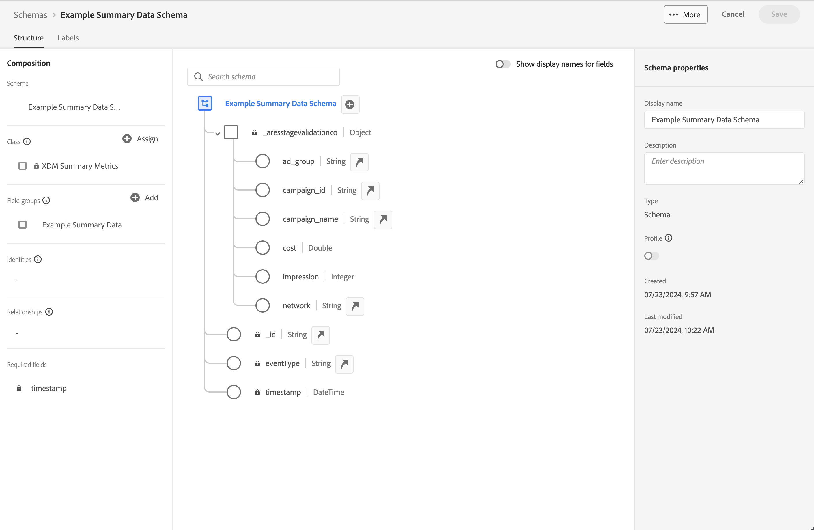
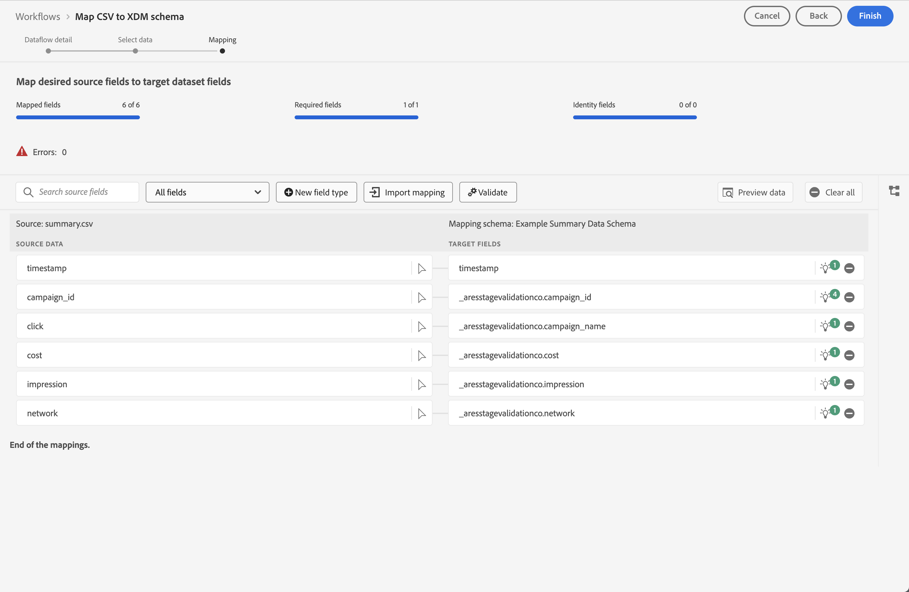
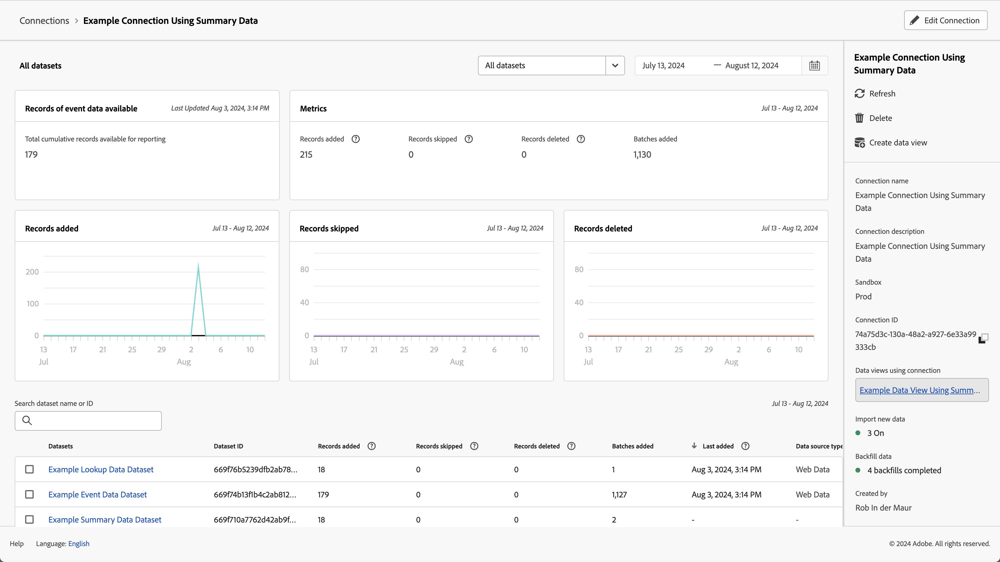
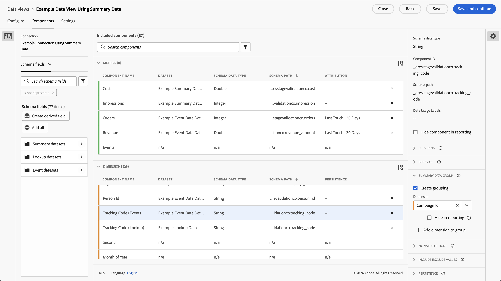
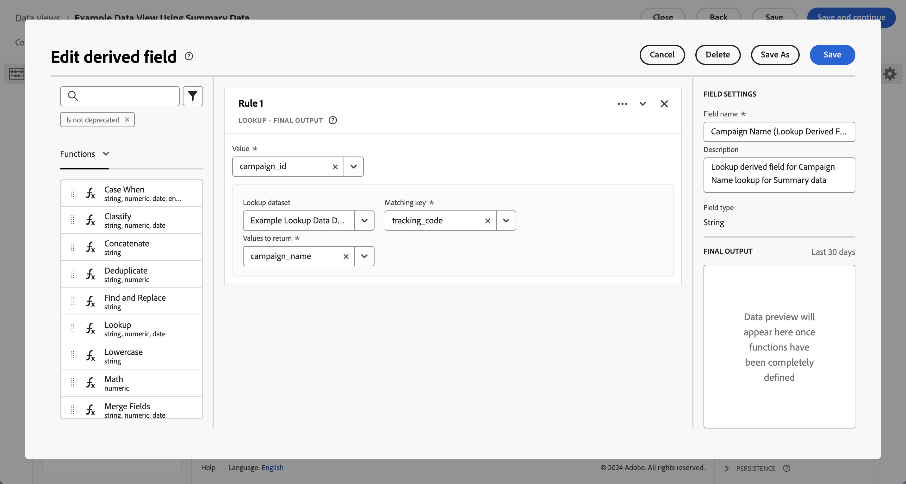
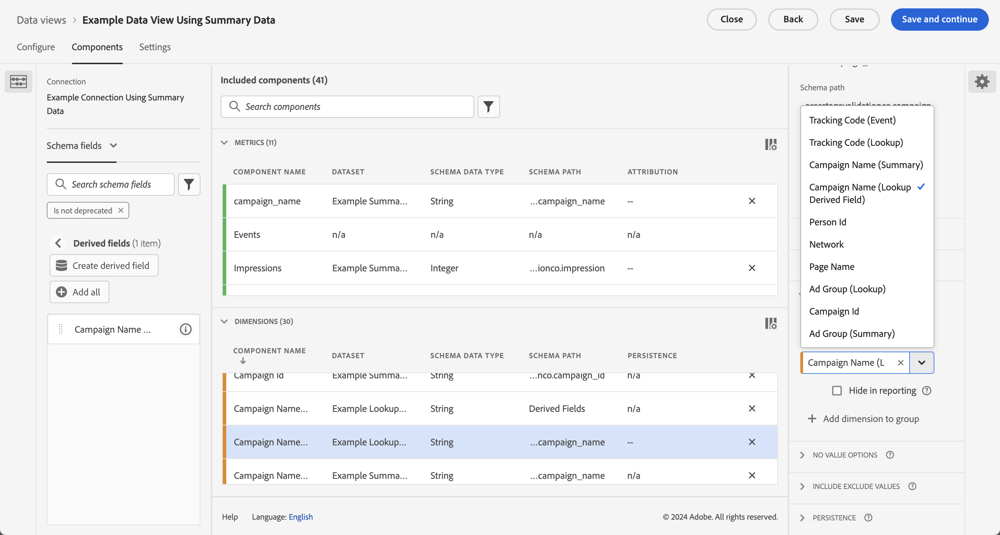
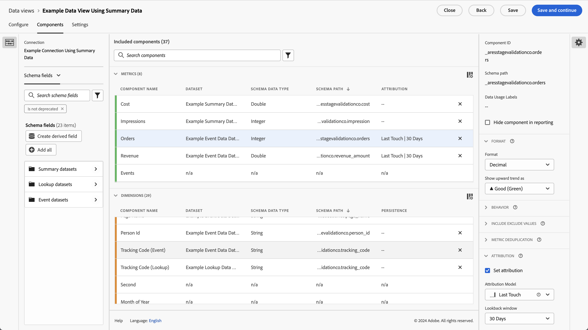
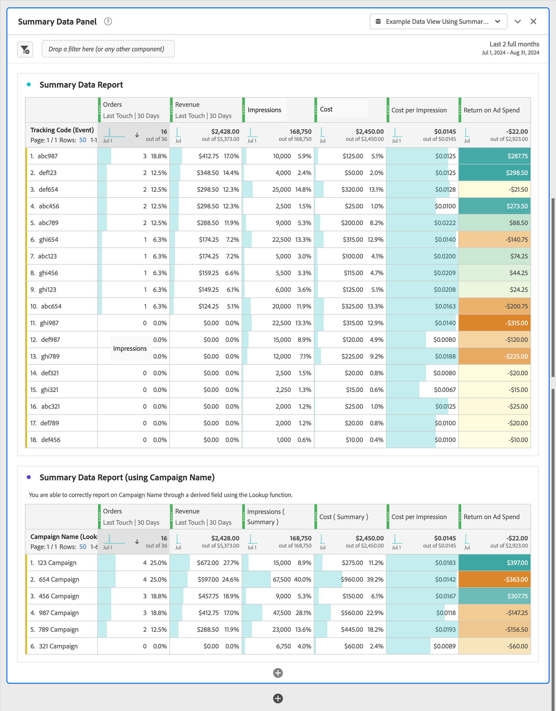

# 概要データの使用

このユースケースは、レポートと分析で概要データを使用する方法を理解するのに役立ちます。 ユースケースでは、Customer Journey Analyticsで概要データを使用するために必要なすべての手順について詳しく説明します。

- [Experience Platformに概要データやその他のデータソースを](#ingest)取り込みます。
- 概要データおよびその他のデータソース用に[接続](#connection)を設定します。
- データソースを結合するように[&#x200B; データビュー](#data-view)を設定します。
- 組み合わせたデータを[Workspace](#workspace)でレポートし、分析します。

ユースケースは、サマリーデータ、イベントデータ、ルックアップデータのサンプルデータを提供します。 すべてのデータにはランダムな値が含まれています。

## 取り込み

このユースケースでは、Facebookでキャンペーンを実行するための概要データを示す次のサンプル概要データを使用します。

+++概要データ

| _id | campaign_name | コスト | インプレッション | campaign_id | réseau | ad_group | タイムスタンプ |
|---|---|---:|---:|---|---|---|---|
| 1 | 123 キャンペーン | 100 | 5,000 | abc123 | facebook | abc-adgroup | 2024-07-18T18:20:39.000Z |
| 2 | 123 キャンペーン | 50 | 4000 | def123 | facebook | def-adgroup | 2024-07-18T18:20:39.000Z |
| 3 | 123 キャンペーン | 125 | 6000 | ghi123 | facebook | ghi-adgroup | 2024-07-18T18:20:39.000Z |
| 4 | 456 キャンペーン | 25 | 2500 | abc456 | facebook | abc-adgroup | 2024-07-18T18:20:39.000Z |
| 5 | 456 キャンペーン | 10 | 1000 | def456 | facebook | def-adgroup | 2024-07-18T18:20:39.000Z |
| 6 | 456 キャンペーン | 115 | 5500 | ghi456 | facebook | ghi-adgroup | 2024-07-18T18:20:39.000Z |
| 7 | 789 キャンペーン | 200 | 9000 | abc789 | facebook | abc-adgroup | 2024-07-18T18:20:39.000Z |
| 8 | 789 キャンペーン | 20 | 2,000 | def789 | facebook | def-adgroup | 2024-07-18T18:20:39.000Z |
| 9 | 789 キャンペーン | 225 | 12000 | ghi789 | facebook | ghi-adgroup | 2024-07-18T18:20:39.000Z |
| 10 | 987 キャンペーン | 125 | 10000 | abc987 | facebook | abc-adgroup | 2024-07-18T18:20:39.000Z |
| 11 | 987 キャンペーン | 120 | 15000 | def987 | facebook | def-adgroup | 2024-07-18T18:20:39.000Z |
| 12 | 987 キャンペーン | 315 | 22500 | ghi987 | facebook | ghi-adgroup | 2024-07-18T18:20:39.000Z |
| 13 | 654 キャンペーン | 325 | 20000 | abc654 | facebook | abc-adgroup | 2024-07-18T18:20:39.000Z |
| 14 | 654 キャンペーン | 320 | 25000 | def654 | facebook | def-adgroup | 2024-07-18T18:20:39.000Z |
| 15 | 654 キャンペーン | 315 | 22500 | ghi654 | facebook | ghi-adgroup | 2024-07-18T18:20:39.000Z |
| 16 | 321 キャンペーン | 25 | 2,000 | abc321 | facebook | abc-adgroup | 2024-07-18T18:20:39.000Z |
| 17 | 321 キャンペーン | 20 | 2500 | def321 | facebook | def-adgroup | 2024-07-18T18:20:39.000Z |
| 18 | 321 キャンペーン | 15 | 2250 | ghi321 | facebook | ghi-adgroup | 2024-07-18T18:20:39.000Z |

[![DataDownload] （/help/assets/icons/DataDownload.svg）](./assets/summary-data.csv)

+++

Customer Journey Analyticsで概要データを使用するには、レポートで、またはWorkspaceでのデータ分析の一環として、次の操作を行う必要があります

- Experience Platformのサマリースキーマは，
- Experience Platformのサマリーデータセットは，
- サマリーデータセットを使用するように設定された，
- Customer Journey Analyticsのデータビュー。サマリーデータの指標とディメンションで正しく設定されています。

この概要データを、イベントデータのデータセットおよびルックアップデータのデータセットと組み合わせて使用します。

+++イベントデータ

イベントデータは、イベントデータデータセットの例で利用できます。 サンプルデータは次のようになります。

| タイムスタンプ | _id | page_name | person_id | tracking_code | 注文件数 | revenue_amount |
|---|---:|---|---|---|---:|---:|
| 2024-07-18T19:15:39+00:00 | 1 | ホームページ | person-1abc123 | abc123 |  |  |
| 2024-07-18T19:15:39+00:00 | 2 | 確認ページ | person-1abc123 |  | 1 | 174.25 |
| 2024-07-18T19:15:39+00:00 | 3 | ホームページ | person-2def123 | def123 |  |  |
| 2024-07-18T19:15:39+00:00 | 4 | ホームページ | person-3ghi123 | ghi123 |  |  |
| 2024-07-18T19:15:39+00:00 | 5 | 確認ページ | person-3ghi123 |  | 1 | 149.25 |
| 2024-07-18T19:15:39+00:00 | 6 | ホームページ | person-4abc456 | abc456 |  |  |
| 2024-07-18T19:15:39+00:00 | 7 | ホームページ | person-5def456 | def456 |  |  |
| 2024-07-18T19:15:39+00:00 | 8 | ホームページ | person-6ghi456 | ghi456 |  |  |
| 2024-07-18T19:15:39+00:00 | 9 | 確認ページ | person-6ghi456 |  | 1 | 159.25 |
| 2024-07-18T19:15:39+00:00 | 10 | ホームページ | person-7abc789 | abc789 |  |  |
| 2024-07-18T19:15:39+00:00 | 11 | ホームページ | person-8def789 | def789 |  |  |
| 2024-07-18T19:15:39+00:00 | 12 | ホームページ | person-9ghi789 | ghi789 |  |  |
| 2024-07-18T19:15:39+00:00 | 13 | 確認ページ | person-9ghi789 |  | 1 | 124.25 |
| 2024-07-18T19:15:39+00:00 | 14 | ホームページ | person-10abc987 | abc987 |  |  |
| 2024-07-18T19:15:39+00:00 | 15 | ホームページ | person-11def987 | def987 |  |  |
| 2024-07-18T19:15:39+00:00 | 16 | ホームページ | person-12ghi987 | ghi987 |  |  |
| 2024-07-18T19:15:39+00:00 | 17 | ホームページ | person-13abc654 | abc654 |  |  |
| 2024-07-18T19:15:39+00:00 | 18 | ホームページ | person-14def654 | def654 |  |  |
| 2024-07-18T19:15:39+00:00 | 19 | ホームページ | person-15ghi654 | ghi654 |  |  |
| 2024-07-18T19:15:39+00:00 | 20 | 確認ページ | person-15ghi654 |  | 1 | 174.25 |
| 2024-07-18T19:15:39+00:00 | 21 | ホームページ | person-16abc321 | abc321 |  |  |
| 2024-07-18T19:15:39+00:00 | 22 | ホームページ | person-17def321 | def321 |  |  |
| 2024-07-18T19:15:39+00:00 | 23 | ホームページ | person-18ghi321 | ghi321 |  |  |
| 2024-07-18T19:15:39+00:00 | 24 | ホームページ | person-19abc123 | abc123 |  |  |
| 2024-07-18T19:15:39+00:00 | 25 | ホームページ | person-20def123 | def123 |  |  |
| 2024-07-18T19:15:39+00:00 | 26 | ホームページ | person-21ghi123 | ghi123 |  |  |
| 2024-07-18T19:15:39+00:00 | 27 | 確認ページ | person-21ghi123 |  | 1 | 149.25 |
| 2024-07-18T19:15:39+00:00 | 28 | ホームページ | person-22abc456 | abc456 |  |  |
| 2024-07-18T19:15:39+00:00 | 29 | ホームページ | person-23def456 | def456 |  |  |
| 2024-07-18T19:15:39+00:00 | 30 | ホームページ | person-24ghi456 | ghi456 |  |  |
| 2024-07-18T19:15:39+00:00 | 31 | ホームページ | person-25abc789 | abc789 |  |  |
| 2024-07-18T19:15:39+00:00 | 32 | 確認ページ | person-25abc789 |  | 1 | 139.25 |
| 2024-07-18T19:15:39+00:00 | 33 | ホームページ | person-26abc987 | abc987 |  |  |
| 2024-07-18T19:15:39+00:00 | 34 | ホームページ | person-27def987 | def987 |  |  |
| 2024-07-18T19:15:39+00:00 | 35 | ホームページ | person-28ghi987 | ghi987 |  |  |
| 2024-07-18T19:15:39+00:00 | 36 | ホームページ | person-29abc654 | abc654 |  |  |
| 2024-07-18T19:15:39+00:00 | 37 | 確認ページ | person-29abc654 |  | 1 | 124.25 |
| 2024-07-18T19:15:39+00:00 | 38 | ホームページ | person-30def654 | def654 |  |  |
| 2024-07-18T19:15:39+00:00 | 39 | ホームページ | person-31ghi654 | ghi654 |  |  |
| 2024-07-18T19:15:39+00:00 | 40 | ホームページ | person-32abc321 | abc321 |  |  |
| 2024-07-18T19:15:39+00:00 | 41 | ホームページ | person-33ghi456 | ghi456 |  |  |
| 2024-07-18T19:15:39+00:00 | 42 | 確認ページ | person-33ghi456 |  | 1 | 174.25 |
| 2024-07-18T19:15:39+00:00 | 43 | ホームページ | person-34abc789 | abc789 |  |  |
| 2024-07-18T19:15:39+00:00 | 44 | ホームページ | person-35def789 | def789 |  |  |
| 2024-07-18T19:15:39+00:00 | 45 | ホームページ | person-36ghi789 | ghi789 |  |  |
| 2024-07-18T19:15:39+00:00 | 46 | 確認ページ | person-36ghi789 |  | 1 | 149.25 |
| 2024-07-18T19:15:39+00:00 | 47 | ホームページ | person-37abc987 | abc987 |  |  |
| 2024-07-18T19:15:39+00:00 | 48 | ホームページ | person-38def987 | def987 |  |  |
| 2024-07-18T19:15:39+00:00 | 49 | ホームページ | person-39ghi987 | ghi987 |  |  |
| 2024-07-18T19:15:39+00:00 | 50 | ホームページ | person-40abc654 | abc654 |  |  |
| 2024-07-18T19:15:39+00:00 | 51 | 確認ページ | person-40abc654 |  | 1 | 124.25 |
| 2024-07-18T19:15:39+00:00 | 52 | ホームページ | person-41def654 | def654 |  |  |
| 2024-07-18T19:15:39+00:00 | 53 | ホームページ | person-42ghi654 | ghi654 |  |  |
| 2024-07-18T19:15:39+00:00 | 54 | ホームページ | person-43abc321 | abc321 |  |  |
| 2024-07-18T19:15:39+00:00 | 55 | ホームページ | person-44def321 | def321 |  |  |
| 2024-07-18T19:15:39+00:00 | 56 | ホームページ | person-45ghi321 | ghi321 |  |  |
| 2024-07-18T19:15:39+00:00 | 57 | ホームページ | person-46abc123 | abc123 |  |  |
| 2024-07-18T19:15:39+00:00 | 58 | 確認ページ | person-46abc123 |  | 1 | 174.25 |
| 2024-07-18T19:15:39+00:00 | 59 | ホームページ | person-47def123 | def123 |  |  |
| 2024-07-18T19:15:39+00:00 | 60 | ホームページ | person-48ghi123 | ghi123 |  |  |
| 2024-07-18T19:15:39+00:00 | 61 | ホームページ | person-49abc456 | abc456 |  |  |
| 2024-07-18T19:15:39+00:00 | 62 | ホームページ | person-50def456 | def456 |  |  |
| 2024-07-18T19:15:39+00:00 | 63 | ホームページ | person-51ghi456 | ghi456 |  |  |
| 2024-07-18T19:15:39+00:00 | 64 | ホームページ | person-52abc789 | abc789 |  |  |
| 2024-07-18T19:15:39+00:00 | 65 | 確認ページ | person-52abc789 |  | 1 | 149.25 |
| 2024-07-18T19:15:39+00:00 | 66 | ホームページ | person-53abc987 | abc987 |  |  |
| 2024-07-18T19:15:39+00:00 | 67 | ホームページ | person-54def987 | def987 |  |  |
| 2024-07-18T19:15:39+00:00 | 68 | ホームページ | person-55ghi987 | ghi987 |  |  |
| 2024-07-18T19:15:39+00:00 | 69 | 確認ページ | person-55ghi987 |  | 1 | 124.25 |
| 2024-07-18T19:15:39+00:00 | 70 | ホームページ | person-56abc123 | abc123 |  |  |
| 2024-07-18T19:15:39+00:00 | 71 | ホームページ | person-57def123 | def123 |  |  |
| 2024-07-18T19:15:39+00:00 | 72 | 確認ページ | person-57def123 |  | 1 | 174.25 |
| 2024-07-18T19:15:39+00:00 | 73 | ホームページ | person-58ghi123 | ghi123 |  |  |
| 2024-07-18T19:15:39+00:00 | 74 | ホームページ | person-59abc456 | abc456 |  |  |
| 2024-07-18T19:15:39+00:00 | 75 | 確認ページ | person-59abc456 |  | 1 | 149.25 |
| 2024-07-18T19:15:39+00:00 | 76 | ホームページ | person-60def456 | def456 |  |  |
| 2024-07-18T19:15:39+00:00 | 77 | ホームページ | person-61ghi456 | ghi456 |  |  |
| 2024-07-18T19:15:39+00:00 | 78 | ホームページ | person-62abc789 | abc789 |  |  |
| 2024-07-18T19:15:39+00:00 | 79 | 確認ページ | person-62abc789 |  | 1 | 159.25 |
| 2024-07-18T19:15:39+00:00 | 80 | ホームページ | person-63def789 | def789 |  |  |
| 2024-07-18T19:15:39+00:00 | 81 | ホームページ | person-64ghi789 | ghi789 |  |  |
| 2024-07-18T19:15:39+00:00 | 82 | ホームページ | person-65abc987 | abc987 |  |  |
| 2024-07-18T19:15:39+00:00 | 83 | 確認ページ | person-65abc987 |  | 1 | 124.25 |
| 2024-07-18T19:15:39+00:00 | 84 | ホームページ | person-66def987 | def987 |  |  |
| 2024-07-18T19:15:39+00:00 | 85 | ホームページ | person-67ghi987 | ghi987 |  |  |
| 2024-07-18T19:15:39+00:00 | 86 | ホームページ | person-68abc654 | abc654 |  |  |
| 2024-07-18T19:15:39+00:00 | 87 | ホームページ | person-69def654 | def654 |  |  |
| 2024-07-18T19:15:39+00:00 | 88 | ホームページ | person-70ghi654 | ghi654 |  |  |
| 2024-07-18T19:15:39+00:00 | 89 | ホームページ | person-71abc321 | abc321 |  |  |
| 2024-07-18T19:15:39+00:00 | 90 | 確認ページ | person-71abc321 |  | 1 | 174.25 |
| 2024-07-18T19:15:39+00:00 | 91 | ホームページ | person-72def321 | def321 |  |  |
| 2024-07-18T19:15:39+00:00 | 92 | ホームページ | person-73ghi321 | ghi321 |  |  |
| 2024-07-18T19:15:39+00:00 | 93 | ホームページ | person-74abc123 | abc123 |  |  |
| 2024-07-18T19:15:39+00:00 | 94 | ホームページ | person-75def123 | def123 |  |  |
| 2024-07-18T19:15:39+00:00 | 95 | ホームページ | person-76ghi123 | ghi123 |  |  |
| 2024-07-18T19:15:39+00:00 | 96 | ホームページ | person-77abc456 | abc456 |  |  |
| 2024-07-18T19:15:39+00:00 | 97 | 確認ページ | person-77abc456 |  | 1 | 149.25 |
| 2024-07-18T19:15:39+00:00 | 98 | ホームページ | person-78def456 | def456 |  |  |
| 2024-07-18T19:15:39+00:00 | 99 | ホームページ | person-79ghi456 | ghi456 |  |  |
| 2024-07-18T19:15:39+00:00 | 100 | ホームページ | person-80abc789 | abc789 |  |  |
| 2024-07-18T19:15:39+00:00 | 101 | ホームページ | person-81abc987 | abc987 |  |  |
| 2024-07-18T19:15:39+00:00 | 102 | 確認ページ | person-81abc987 |  | 1 | 139.25 |
| 2024-07-18T19:15:39+00:00 | 103 | ホームページ | person-82def987 | def987 |  |  |
| 2024-07-18T19:15:39+00:00 | 104 | ホームページ | person-83ghi987 | ghi987 |  |  |
| 2024-07-18T19:15:39+00:00 | 105 | ホームページ | person-84abc654 | abc654 |  |  |
| 2024-07-18T19:15:39+00:00 | 106 | ホームページ | person-85def654 | def654 |  |  |
| 2024-07-18T19:15:39+00:00 | 107 | 確認ページ | person-85def654 |  | 1 | 124.25 |
| 2024-07-18T19:15:39+00:00 | 108 | ホームページ | person-86ghi654 | ghi654 |  |  |
| 2024-07-18T19:15:39+00:00 | 109 | ホームページ | person-87abc321 | abc321 |  |  |
| 2024-07-18T19:15:39+00:00 | 110 | ホームページ | person-88ghi456 | ghi456 |  |  |
| 2024-07-18T19:15:39+00:00 | 111 | ホームページ | person-89abc789 | abc789 |  |  |
| 2024-07-18T19:15:39+00:00 | 112 | 確認ページ | person-89abc789 |  | 1 | 174.25 |
| 2024-07-18T19:15:39+00:00 | 113 | ホームページ | person-90def789 | def789 |  |  |
| 2024-07-18T19:15:39+00:00 | 114 | ホームページ | person-91ghi789 | ghi789 |  |  |
| 2024-07-18T19:15:39+00:00 | 115 | ホームページ | person-92abc987 | abc987 |  |  |
| 2024-07-18T19:15:39+00:00 | 116 | 確認ページ | person-92abc987 |  | 1 | 149.25 |
| 2024-07-18T19:15:39+00:00 | 117 | ホームページ | person-93def987 | def987 |  |  |
| 2024-07-18T19:15:39+00:00 | 118 | ホームページ | person-94ghi987 | ghi987 |  |  |
| 2024-07-18T19:15:39+00:00 | 119 | ホームページ | person-95abc654 | abc654 |  |  |
| 2024-07-18T19:15:39+00:00 | 120 | ホームページ | person-96def654 | def654 |  |  |
| 2024-07-18T19:15:39+00:00 | 121 | 確認ページ | person-96def654 |  | 1 | 124.25 |
| 2024-07-18T19:15:39+00:00 | 122 | ホームページ | person-97ghi654 | ghi654 |  |  |
| 2024-07-18T19:15:39+00:00 | 123 | ホームページ | person-98abc321 | abc321 |  |  |
| 2024-07-18T19:15:39+00:00 | 124 | ホームページ | person-99def321 | def321 |  |  |
| 2024-07-18T19:15:39+00:00 | 125 | ホームページ | person-100ghi321 | ghi321 |  |  |
| 2024-07-18T19:15:39+00:00 | 126 | ホームページ | person-101abc123 | abc123 |  |  |
| 2024-07-18T19:15:39+00:00 | 127 | ホームページ | person-102def123 | def123 |  |  |
| 2024-07-18T19:15:39+00:00 | 128 | 確認ページ | person-102def123 |  | 1 | 174.25 |
| 2024-07-18T19:15:39+00:00 | 129 | ホームページ | person-103ghi123 | ghi123 |  |  |
| 2024-07-18T19:15:39+00:00 | 130 | ホームページ | person-104abc456 | abc456 |  |  |
| 2024-07-18T19:15:39+00:00 | 131 | ホームページ | person-105def456 | def456 |  |  |
| 2024-07-18T19:15:39+00:00 | 132 | ホームページ | person-106ghi456 | ghi456 |  |  |
| 2024-07-18T19:15:39+00:00 | 133 | ホームページ | person-107abc789 | abc789 |  |  |
| 2024-07-18T19:15:39+00:00 | 134 | ホームページ | person-108abc987 | abc987 |  |  |
| 2024-07-18T19:15:39+00:00 | 135 | 確認ページ | person-108abc987 |  | 1 | 149.25 |
| 2024-07-18T19:15:39+00:00 | 136 | ホームページ | person-109def987 | def987 |  |  |
| 2024-07-18T19:15:39+00:00 | 137 | ホームページ | person-110ghi987 | ghi987 |  |  |
| 2024-07-18T19:15:39+00:00 | 138 | 確認ページ | person-110ghi987 |  |  |  |
| 2024-07-18T19:15:39+00:00 | 139 | ホームページ | person-111def987 | def987 |  |  |
| 2024-07-18T19:15:39+00:00 | 140 | ホームページ | person-112def987 |  | 1 | 124.25 |
| 2024-07-18T19:15:39+00:00 | 141 | 確認ページ | person-112def987 |  | 1 | 149.25 |
| 2024-07-18T19:15:39+00:00 | 142 | ホームページ | person-113ghi987 | ghi987 |  |  |
| 2024-07-18T19:15:39+00:00 | 143 | ホームページ | person-114abc654 | abc654 |  |  |
| 2024-07-18T19:15:39+00:00 | 144 | ホームページ | person-115def654 | def654 |  |  |
| 2024-07-18T19:15:39+00:00 | 145 | 確認ページ | person-115def654 |  | 1 | 159.25 |
| 2024-07-18T19:15:39+00:00 | 146 | ホームページ | person-116ghi654 | ghi654 |  |  |
| 2024-07-18T19:15:39+00:00 | 147 | ホームページ | person-117abc321 | abc321 |  |  |
| 2024-07-18T19:15:39+00:00 | 148 | ホームページ | person-118def321 | def321 |  |  |
| 2024-07-18T19:15:39+00:00 | 149 | 確認ページ | person-118def321 |  | 1 | 124.25 |
| 2024-07-18T19:15:39+00:00 | 150 | ホームページ | person-119ghi321 | ghi321 |  |  |
| 2024-07-18T19:15:39+00:00 | 151 | ホームページ | person-120abc123 | abc123 |  |  |
| 2024-07-18T19:15:39+00:00 | 152 | ホームページ | person-121def123 | def123 |  |  |
| 2024-07-18T19:15:39+00:00 | 153 | ホームページ | person-122ghi123 | ghi123 |  |  |
| 2024-07-18T19:15:39+00:00 | 154 | ホームページ | person-123abc456 | abc456 |  |  |
| 2024-07-18T19:15:39+00:00 | 155 | ホームページ | person-124def456 | def456 |  |  |
| 2024-07-18T19:15:39+00:00 | 156 | 確認ページ | person-124def456 |  | 1 | 174.25 |
| 2024-07-18T19:15:39+00:00 | 157 | ホームページ | person-125ghi456 | ghi456 |  |  |
| 2024-07-18T19:15:39+00:00 | 158 | ホームページ | person-126abc789 | abc789 |  |  |
| 2024-07-18T19:15:39+00:00 | 159 | ホームページ | person-127abc987 | abc987 |  |  |
| 2024-07-18T19:15:39+00:00 | 160 | ホームページ | person-128def987 | def987 |  |  |
| 2024-07-18T19:15:39+00:00 | 161 | ホームページ | person-129ghi987 | ghi987 |  |  |
| 2024-07-18T19:15:39+00:00 | 162 | ホームページ | person-130abc654 | abc654 |  |  |
| 2024-07-18T19:15:39+00:00 | 163 | 確認ページ | person-130abc654 |  | 1 | 149.25 |
| 2024-07-18T19:15:39+00:00 | 164 | ホームページ | person-131def654 | def654 |  |  |
| 2024-07-18T19:15:39+00:00 | 165 | ホームページ | person-132ghi654 | ghi654 |  |  |
| 2024-07-18T19:15:39+00:00 | 166 | ホームページ | person-133abc321 | abc321 |  |  |
| 2024-07-18T19:15:39+00:00 | 167 | ホームページ | person-134ghi456 | ghi456 |  |  |
| 2024-07-18T19:15:39+00:00 | 168 | 確認ページ | person-134ghi456 |  | 1 | 139.25 |
| 2024-07-18T19:15:39+00:00 | 169 | ホームページ | person-135abc789 | abc789 |  |  |
| 2024-07-18T19:15:39+00:00 | 170 | ホームページ | person-136def789 | def789 |  |  |
| 2024-07-18T19:15:39+00:00 | 171 | ホームページ | person-137ghi789 | ghi789 |  |  |
| 2024-07-18T19:15:39+00:00 | 172 | ホームページ | person-138abc987 | abc987 |  |  |
| 2024-07-18T19:15:39+00:00 | 173 | 確認ページ | person-138abc987 |  | 1 | 124.25 |
| 2024-07-18T19:15:39+00:00 | 174 | ホームページ | person-139def987 | def987 |  |  |
| 2024-07-18T19:15:39+00:00 | 175 | ホームページ | person-140ghi987 | ghi987 |  |  |
| 2024-07-18T19:15:39+00:00 | 176 | ホームページ | person-141abc654 | abc654 |  |  |
| 2024-07-18T19:15:39+00:00 | 177 | ホームページ | person-142def654 | def654 |  |  |
| 2024-07-18T19:15:39+00:00 | 178 | 確認ページ | person-142def654 |  | 1 | 174.25 |
| 2024-07-18T19:15:39+00:00 | 179 | ホームページ | person-143ghi654 | ghi654 |  |  |

[![DataDownload] （/help/assets/icons/DataDownload.svg）](./assets/event-data.csv)

+++

+++ ルックアップデータ

ルックアップデータは、ルックアップデータデータセットの例で使用できます。 サンプルデータは次のようになります。

| _id | tracking_code | ad_group | campaign_name |
|---|---|---|---|
| 1 | abc123 | abc-adgroup | 123 キャンペーン |
| 2 | def123 | def-adgroup | 123 キャンペーン |
| 3 | ghi123 | ghi-adgroup | 123 キャンペーン |
| 4 | abc456 | abc-adgroup | 456 キャンペーン |
| 5 | def456 | def-adgroup | 456 キャンペーン |
| 6 | ghi456 | ghi-adgroup | 456 キャンペーン |
| 7 | abc789 | abc-adgroup | 789 キャンペーン |
| 8 | def789 | def-adgroup | 789 キャンペーン |
| 9 | ghi789 | ghi-adgroup | 789 キャンペーン |
| 10 | abc987 | abc-adgroup | 987 キャンペーン |
| 11 | def987 | def-adgroup | 987 キャンペーン |
| 12 | ghi987 | ghi-adgroup | 987 キャンペーン |
| 13 | abc654 | abc-adgroup | 654 キャンペーン |
| 14 | def654 | def-adgroup | 654 キャンペーン |
| 15 | ghi654 | ghi-adgroup | 654 キャンペーン |
| 16 | abc321 | abc-adgroup | 321 キャンペーン |
| 17 | def321 | def-adgroup | 321 キャンペーン |
| 18 | ghi321 | ghi-adgroup | 321 キャンペーン |

[![DataDownload] （/help/assets/icons/DataDownload.svg）](./assets/lookup-data.csv)
+++

>[!INFO]
>
>イベントとルックアップデータのスキーマとデータセットの設定に関する詳細は提供されていません。 この設定は一般的な知識と見なされ、ルックアップデータと同じ手順に従います。
>

### 概要スキーマ

概要データには、Experience Platformの概要スキーマが必要です。 概要スキーマは、XDM サマリーメトリクスを基本クラスとして使用するスキーマです。

Experience Platformでサマリースキーマを作成するには：

1. 「**[!UICONTROL Experience Platform]**」を「      アプリスイッチャー：
1. 左側のパネルから「**[!UICONTROL スキーマ]**」を選択します。
1.  **[!UICONTROL スキーマの作成]**&#x200B;を選択します。
1. 「**[!UICONTROL スキーマを作成]**」ダイアログで「**[!UICONTROL 手動]**」を選択します。 次に、**[!UICONTROL Select]**&#x200B;を使用して続行します。
1. **[!UICONTROL スキーマ]** > **[!UICONTROL スキーマ]**&#x200B;を作成ウィザードの&#x200B;**[!UICONTROL クラスを選択]**&#x200B;手順で、**[!UICONTROL このスキーマの基本クラスを選択]** オプションから&#x200B;**[!UICONTROL その他]**&#x200B;を選択します。
1. リストから、**[!UICONTROL XDM概要指標]**&#x200B;を選択し（または フィールドを使用して検索）、**[!UICONTROL 次へ]**&#x200B;を選択します。
1. **[!UICONTROL スキーマ]** > **[!UICONTROL スキーマ]**&#x200B;を作成ウィザードの&#x200B;**[!UICONTROL 名前とレビュー]**&#x200B;手順で、**[!UICONTROL スキーマ表示名]**&#x200B;を入力します（例：`Example Summary Data Schema`）とオプションの説明を入力します。 「**[!UICONTROL 完了]**」を選択して、この手順を終了します。

基本サマリースキーマの構造が表示され、サマリーデータのフィールドで強化する準備が整います。 フィールドグループを使用して、スキーマにフィールドを追加します。

サンプルデータのフィールドを含むフィールドグループを追加するには：

1. の&#x200B;**[!UICONTROL AddCircle]** **[!UICONTROL Add]**&#x200B;を選択します。
1. **[!UICONTROL フィールドグループを追加]** ダイアログで、**[!UICONTROL 新しいフィールドグループを作成]**&#x200B;を選択します。
1. フィールドグループの&#x200B;**[!UICONTROL 表示名]**&#x200B;を入力します（例：`Example Summary Data`）。 オプションで説明を入力します。
1. 「**[!UICONTROL フィールドグループを追加]**」を選択します。
1. スキーマ構造のユーザーインターフェイスに戻ります。 **[!UICONTROL フィールドグループ]**&#x200B;の新しい&#x200B;**[!UICONTROL 概要データの例]**&#x200B;を選択します。
1. スキーマ名の横にある&#x200B;**[!UICONTROL AddCircle]**&#x200B;を選択します。 **[!UICONTROL フィールドプロパティ]** パネルが開き、フィールドの詳細を追加できます。
   1. **[!UICONTROL フィールド名]**&#x200B;を入力：`campaign_id`
   1. **[!UICONTROL 表示名]**&#x200B;を入力：`campaign_id`
   1. 「**[!UICONTROL データタイプを選択]**」ドロップダウンメニューから&#x200B;**[!UICONTROL タイプ]**&#x200B;を選択します：**[!UICONTROL 文字列]**
   1. **[!UICONTROL 割り当て]** **[!UICONTROL フィールドグループ]**&#x200B;が選択されていることを確認し、ドロップダウンメニューから&#x200B;**[!UICONTROL 概要データの例]**&#x200B;を選択します。
   1. 一番下までスクロールし、**[!UICONTROL 適用]**&#x200B;を選択します。
1. 概要データの他のフィールドに対して、前の手順を繰り返します。 正しい値については、以下の表を参照してください。

   | フィールド名 | 表示名 | タイプ | フィールドグループ |
   |---|---|---|---|
   | `ad_group` | `ad_group` | 文字列 | 概要データの例 |
   | `campaign_name` | `campaign_name` | 文字列 | 概要データの例 |
   | `cost` | `cost` | Double | 概要データの例 |
   | `impression` | `impression` | 整数 | 概要データの例 |
   | `network` | `network` | 文字列 | 概要データの例 |

1. **[!UICONTROL 概要データの例]** フィールドグループをスキーマの一部として保存するには、**[!UICONTROL 保存]**&#x200B;を選択します。 スキーマが正常に保存されたときに確認が表示されます。

これで、概要データのモデルの詳細を示すスキーマを定義しました。 下の画像と同じです。

### 概要データセット

Experience Platformに概要データを保存するには、まずデータセットを作成し、そのデータセットに概要データをアップロードする必要があります。

データセットを作成するには：

1. 「**[!UICONTROL Experience Platform]**」を「      アプリスイッチャー：
1. 左側のパネルから「**[!UICONTROL データセット]**」を選択します。
1.  **[!UICONTROL データセットを作成]**&#x200B;を選択します。
1. **[!UICONTROL データセット]**/**[!UICONTROL データセットを作成]**&#x200B;画面で、**[!UICONTROL スキーマからデータセットを作成]**&#x200B;を選択します。
1. **[!UICONTROL ワークフロー]** > **[!UICONTROL スキーマからデータセットを作成]** ウィザードの&#x200B;**[!UICONTROL スキーマを選択]**&#x200B;手順で、で&#x200B;**[!UICONTROL 概要データスキーマの例]**&#x200B;を検索して選択します。
1. 「**[!UICONTROL 次へ]**」を選択します。
1. **[!UICONTROL ワークフロー]** > **[!UICONTROL スキーマ]**&#x200B;からデータセットを作成ウィザードの&#x200B;**[!UICONTROL データセットを設定]**&#x200B;手順で：
   1. データセットの&#x200B;**[!UICONTROL 名前]**&#x200B;を入力します（例：`Example Summary Data Dataset`）。 オプションで説明を入力します。
   1. 「**[!UICONTROL 完了]**」を選択します。

新しいデータセットの詳細が表示される画面が表示されます。

このデータセットにサンプルデータをアップロードするには：

1. 「**[!UICONTROL Experience Platform]**」を「      アプリスイッチャー：
1. 左側のパネルから「**[!UICONTROL ワークフロー]**」を選択します。
   1. **[!UICONTROL ワークフロー]**&#x200B;画面の&#x200B;**[!UICONTROL データ取り込み]** オプションから&#x200B;**[!UICONTROL CSVをXDM スキーマ]**&#x200B;にマッピングを選択します。
   1. 「**[!UICONTROL CSVをXDM スキーマにマッピング]**」パネルから「**[!UICONTROL Launch]**」を選択します。
1. **[!UICONTROL ワークフロー]** > **[!UICONTROL CSVをXDM スキーマにマッピング]** ウィザードの&#x200B;**[!UICONTROL データフローの詳細]** ステップで、次の操作を行います。
   1. **[!UICONTROL ターゲットデータセット]**&#x200B;の&#x200B;**[!UICONTROL 既存のデータセット]**&#x200B;を選択します。
   1. ドロップダウンメニューから「**[!UICONTROL 概要データデータセットの例]**」を選択します。
   1. 「**[!UICONTROL 次へ]**」を選択します。
1. **[!UICONTROL ワークフロー]**/**[!UICONTROL CSVをXDM スキーマにマッピング]** ウィザードの&#x200B;**[!UICONTROL データを選択]**&#x200B;手順で：
   1. CSV形式の概要データを含むファイルを&#x200B;**[!UICONTROL ファイルをドラッグ&amp;ドロップ]**&#x200B;します。 または、**[!UICONTROL ファイルを選択]**&#x200B;してファイルを選択します。
   1. **[!UICONTROL データ形式]**&#x200B;と&#x200B;**[!UICONTROL 区切り]**&#x200B;がサンプルデータに正しい値を持っていることを確認します。 例えば、**[!UICONTROL 区切り]**&#x200B;を&#x200B;**[!UICONTROL データ形式]**&#x200B;として、**[!UICONTROL ,]**&#x200B;を&#x200B;**[!UICONTROL 区切り]**&#x200B;として指定します。
   1. 概要データのサンプル （10 レコード）が&#x200B;**[!UICONTROL サンプルデータ]**&#x200B;に表示されます。
   1. 「**[!UICONTROL 次へ]**」を選択します。
1. **[!UICONTROL ワークフロー]**/**[!UICONTROL CSVをXDM スキーマにマッピング]** ウィザードの&#x200B;**[!UICONTROL マッピング]**&#x200B;手順で次の操作を行います。
   
   1. **[!UICONTROL Source Data]**&#x200B;のすべてのデータフィールドが、スキーマ内の対応する&#x200B;**[!UICONTROL ターゲットフィールド]**&#x200B;に正しくマッピングされているかどうかを確認します。 サンプルデータの場合、スキーマのフィールドにサンプルデータのフィールド名と同様の名前を付けたため、エラーはレポートされません。 それ以外の場合は、この画面を使用してマッピングを修正できます。
   1. オプションで、 **[!UICONTROL 検証]**&#x200B;を選択して、データを（もう1回検証）できます。
   1. 必要に応じて、 **[!UICONTROL データのプレビュー]**&#x200B;を選択して、データセットに読み込まれたデータのプレビューを含むダイアログを開くことができます。
   1. 「**[!UICONTROL 完了]**」を選択します。

**[!UICONTROL Sources]** > **[!UICONTROL Dataflow - XX/XX/XXXX, XX:XX XX]**&#x200B;では、アップロードのステータスが表示されます。 更新して、アップロードの更新を確認します。 成功すると、サンプルデータがExperience Platformに読み込まれます。

## 接続

Customer Journey Analyticsでサンプルデータを使用するには、Experience Platformのサンプルサマリーデータデータセットを含むコネクションを作成します。

1. 「**[!UICONTROL Customer Journey Analytics]**」を「      アプリスイッチャー：
1. 上部メニューの&#x200B;**[!UICONTROL 接続]**&#x200B;を選択し、オプションで&#x200B;**[!UICONTROL データ管理]**&#x200B;から選択します。
1. 「**[!UICONTROL 新しい接続を作成]**」を選択します。
1. **[!UICONTROL 接続]** > **[!UICONTROL 名称未設定の接続]**&#x200B;で：
   1. **[!UICONTROL 接続名]**&#x200B;を入力します（例：`Example Connection Using Summary Data`）。
   1. 作成したデータセットと、その他のデータセットを含めるサンドボックスをサンドボックスドロップダウンメニューから選択します。
   1. 「**[!UICONTROL 日次イベントの平均数]**」ドロップダウンメニューから「**[!UICONTROL 100万未満]**」を選択します。
   1. 「**[!UICONTROL データセットを追加]**」を選択します。
   1. **[!UICONTROL データセットを追加]** ウィザードの&#x200B;**[!UICONTROL データセットを選択]**&#x200B;手順で、次の操作を行います。
      1. を検索し、**[!UICONTROL 概要データデータセットの例]**、**[!UICONTROL イベントデータデータセットの例]**、**[!UICONTROL 参照データデータセットの例]**&#x200B;を選択します。
      1. 「**[!UICONTROL 次へ]**」を選択します。
   1. **[!UICONTROL データセットの追加]** ウィザードの&#x200B;**[!UICONTROL データセット設定]**&#x200B;手順で、次の操作を行います。

      1. **[!UICONTROL イベントデータデータセット例]**&#x200B;の場合：

         1. **[!UICONTROL ユーザーID]** （`person_id`）と&#x200B;**[!UICONTROL タイムスタンプ]**&#x200B;の選択項目が正しいことを確認してください。
         1. **[!UICONTROL データソースタイプ]**&#x200B;から&#x200B;**[!UICONTROL Web データ]**&#x200B;を選択します。
         1. **[!UICONTROL すべての新しいデータの読み込み]**&#x200B;を有効にします。
         1. **[!UICONTROL 既存のすべてのデータのバックフィル]**&#x200B;を有効にします。

      1. **[!UICONTROL 例のルックアップデータデータセット]**&#x200B;の場合：

         1. **[!UICONTROL tracking_code]**&#x200B;を&#x200B;**[!UICONTROL Key]**&#x200B;として、**[!UICONTROL tracking_code （イベントデータセット）]**&#x200B;を&#x200B;**[!UICONTROL Matching]** Keyとして選択します。
         1. **[!UICONTROL データソースタイプ]**&#x200B;から&#x200B;**[!UICONTROL Web データ]**&#x200B;を選択します。
         1. **[!UICONTROL すべての新しいデータの読み込み]**&#x200B;を有効にします。
         1. **[!UICONTROL 既存のすべてのデータのバックフィル]**&#x200B;を有効にします。

      1. **[!UICONTROL 概要データデータセットの例]**&#x200B;の場合：

         1. **[!UICONTROL タイムスタンプ]**&#x200B;および&#x200B;**[!UICONTROL タイムゾーン]**&#x200B;の選択項目が正しいことを確認してください。
         1. **[!UICONTROL すべての新しいデータの読み込み]**&#x200B;を有効にします。
         1. **[!UICONTROL 既存のすべてのデータのバックフィル]**&#x200B;を有効にします。

      1. 「**[!UICONTROL データセットを追加]**」を選択します。

1. **[!UICONTROL 接続]** > **[!UICONTROL 概要データを使用した接続例]**&#x200B;の接続画面で、**[!UICONTROL 保存]**&#x200B;を選択して接続を保存します。

データセットのデータがCustomer Journey Analyticsに追加されますが、これには数時間かかる場合があります。 どうか、先に進む前に辛抱してください。

しばらくしたら、データセットのデータがCustomer Journey Analyticsに正しく読み込まれていることを確認します。

1. 「**[!UICONTROL Customer Journey Analytics]**」を「      アプリスイッチャー：
1. 上部メニューの&#x200B;**[!UICONTROL 接続]**&#x200B;を選択し、オプションで&#x200B;**[!UICONTROL データ管理]**&#x200B;から選択します。
1. 接続を選択します。例：**[!UICONTROL 概要データを使用した接続例]**。
1. **[!UICONTROL 接続]** > **[!UICONTROL 概要データを使用した接続の例]**&#x200B;の詳細で、適切な日付範囲を選択します。
   1. を選択し、**[!UICONTROL 過去7日間]**&#x200B;を選択します。
   1. 「**[!UICONTROL 適用]**」を選択します。

**[!UICONTROL データセット]**&#x200B;のリストで、**[!UICONTROL 追加されたレコード]**&#x200B;列の値は、データセットのデータがCustomer Journey Analyticsの一部であることを確認する必要があります。

## データビュー

Workspaceで正しいデータをレポートできるようにするには、関連する指標とディメンションを含むデータビューを作成します。

1. 「**[!UICONTROL Customer Journey Analytics]**」を「      アプリスイッチャー：
1. 上部メニューで「**[!UICONTROL データビュー]**」を選択し、オプションで「**[!UICONTROL データ管理]**」から選択します。
1. 「**[!UICONTROL 新しいデータ表示を作成]**」を選択します。
1. **[!UICONTROL データビュー]**&#x200B;で、ウィザード画面を開いてデータビューを設定します。
   1. **[!UICONTROL データビュー]**&#x200B;の&#x200B;**[!UICONTROL 設定]** ステップで：
      1. **[!UICONTROL 設定]** | **[!UICONTROL 接続]**&#x200B;から接続を選択します。 例：**[!UICONTROL 概要データを使用した接続の例]**。
      1. データビューの&#x200B;**[!UICONTROL 名前]**&#x200B;を入力します（例：`Example Data View Using Summary Data`）。
      1. その他の設定は残します。
      1. 「**[!UICONTROL 保存して続行]**」を選択します。
   1. **[!UICONTROL データビュー]**/**[!UICONTROL 概要データを使用したデータビューの例]**&#x200B;の&#x200B;**[!UICONTROL コンポーネント]**&#x200B;の手順で：
      1. ディメンションと指標リストに次のコンポーネントを追加します。 わかりやすくするために、コンポーネントパネル（右側）の&#x200B;**[!UICONTROL コンポーネント設定]**&#x200B;の&#x200B;**[!UICONTROL コンポーネント名]**&#x200B;を使用して、コンポーネント名がデフォルト名から変更されています。

         **指標**

         | コンポーネント名 | データセット | スキーマデータタイプ | スキーマパス |
         |---|---|---|---|
         | コスト | 概要データデータセットの例 | Double | *_tenant*.cost |
         | インプレッション数 | 概要データデータセットの例 | 整数 | *_tenant*.impression |
         | 注文件数 | イベントデータデータセットの例 | 整数 | *_tenant*.orders |
         | 売上高 | イベントデータデータセットの例 | Double | *_tenant*.revenue_amount |

         **ディメンション**

         | コンポーネント名 | データセット | スキーマデータタイプ | スキーマパス |
         |---|---|---|---|
         | 広告グループ （ルックアップ） | 参照データデータセットの例 | 文字列 | *_tenant*.ad_group |
         | 広告グループ | 概要データデータセットの例 | 文字列 | *_tenant*.ad_group |
         | キャンペーン Id | 概要データデータセットの例 | 文字列 | *_tenant*.campaign_id |
         | キャンペーン名（ルックアップ） | 参照データデータセットの例 | 文字列 | *_tenant*.campaign_name |
         | キャンペーン名 | 概要データデータセットの例 | 文字列 | *_tenant*.campaign_name |
         | ネットワーク | 概要データデータセットの例 | 文字列 | *_tenant*.network |
         | ページ名 | イベントデータデータセットの例 | 文字列 | *_tenant*.page_name |
         | ユーザー ID | イベントデータデータセットの例 | 文字列 | *_tenant*.person_id |
         | トラッキングコード （イベント） | イベントデータデータセットの例 | 文字列 | *_tenant*.tracking_code |
         | トラッキングコード （ルックアップ） | 参照データデータセットの例 | 文字列 | *_tenant*.tracking_code |

      1. 「**[!UICONTROL ディメンション]**」リストで「**[!UICONTROL トラッキングコード（イベント）]**」ディメンションを選択します。 コンポーネントパネルで、次の操作を行います。

         
         1. 展開 **[!UICONTROL 概要データグループ]**。
         1. **[!UICONTROL グループ化を作成]**&#x200B;を有効にします。
         1. 「**[!UICONTROL Dimension]**」ドロップダウンメニューから「**[!UICONTROL Campaign Id]**」を選択します。 このステップにより、イベントデータと概要データがレポート用に適切に組み合わされます。
         1. 必要に応じて、レポート **[!UICONTROL で]**&#x200B;非表示を有効にできます。 [!UICONTROL &#x200B; レポートで非表示]すると、選択したディメンション （[!UICONTROL &#x200B; キャンペーン Id]）がAnalysis Workspaceやその他のCustomer Journey Analytics レポートツールで非表示になります。 このオプションを有効にしている場合は、次のオプションを確認できます。
            1. **[!UICONTROL ディメンション]** リストで&#x200B;**[!UICONTROL キャンペーン ID]** ディメンションを選択します。
            1. **[!UICONTROL コンポーネント設定]**&#x200B;のレポート **[!UICONTROL の]**&#x200B;非表示コンポーネントが自動的に有効になりました。

      1. 新しい派生フィールド（例：`Campaign Name (Lookup Derived Field)`）を作成して、サンプル検索データデータセットのCampaign Name （Lookup） ディメンションを使用してWorkspaceでレポートできることを確認します。

         の派生フィールド

         1. **[!UICONTROL 値]**&#x200B;の&#x200B;**[!UICONTROL campaign_id]**&#x200B;を選択します。
         1. 「**[!UICONTROL ルックアップデータセット]**」ドロップダウンメニューから「**[!UICONTROL ルックアップデータデータセットの例]**」を選択します。
         1. 「**[!UICONTROL 一致するキー]**」ドロップダウンメニューから「**[!UICONTROL トラッキングコード]**」を選択します。
         1. 「**[!UICONTROL 値を返す]**」ドロップダウンメニューから「**[!UICONTROL campaign_name]**」を選択します。
         1. 「**[!UICONTROL 保存]**」を選択します。

      1. 新しく作成した派生フィールド **[!UICONTROL Campaign Name （Lookup Derived Field）]**&#x200B;を&#x200B;**[!UICONTROL ディメンション]** コンポーネントリストに追加します。

      1. **[!UICONTROL ディメンション]** リストで&#x200B;**[!UICONTROL キャンペーン名（ルックアップ）]** ディメンションを選択します。 コンポーネントパネルで、次の操作を行います。

         

         1. 展開 **[!UICONTROL 概要データグループ]**。
         1. **[!UICONTROL グループ化を作成]**&#x200B;を有効にします。
         1. 「**[!UICONTROL Dimension]**」ドロップダウンメニューから「**[!UICONTROL キャンペーン名（ルックアップ派生フィールド）]**」を選択します。 この手順により、サンプル ルックアップ データ データセットのキャンペーン名（ルックアップ）をレポートで安全に使用できるようになります（[Workspace](#workspace)を参照）。

      1. **[!UICONTROL 指標]** リストから&#x200B;**[!UICONTROL 収益]**&#x200B;指標を選択します。 コンポーネントパネルで、次の操作を行います。

         
         1. 展開 **[!UICONTROL 属性]**。
            1.  ドロップダウンメニューから&#x200B;**[!UICONTROL AttributeLastTouch]** **[!UICONTROL Last Touch]**&#x200B;を選択します。
            1. 「**[!UICONTROL ルックバックウィンドウ]**」ドロップダウンメニューから「**[!UICONTROL 30日]**」を選択します。
         1. 展開 **形式**。
            1. 「**[!UICONTROL 形式]**」ドロップダウンメニューから「**[!UICONTROL 通貨]**」を選択します。
            1. **[!UICONTROL 小数点以下桁]** ドロップダウンメニューから&#x200B;**[!UICONTROL 2]**&#x200B;を選択します。

      1. **[!UICONTROL 指標]** リストから&#x200B;**[!UICONTROL 注文数]**&#x200B;指標を選択します。 コンポーネントパネルで、次の操作を行います。

         
         1. 展開 **[!UICONTROL 属性]**。
            1.  ドロップダウンメニューから&#x200B;**[!UICONTROL AttributeLastTouch]** **[!UICONTROL Last Touch]**&#x200B;を選択します。
            1. 「**[!UICONTROL ルックバックウィンドウ]**」ドロップダウンメニューから「**[!UICONTROL 30日]**」を選択します。
         1. 展開 **[!UICONTROL 形式]**。
            1. **[!UICONTROL 形式]** ドロップダウンメニューから&#x200B;**[!UICONTROL 小数]**&#x200B;を選択します。
            1. **[!UICONTROL ▲上昇傾向を]**&#x200B;として表示ドロップダウンメニューから&#x200B;**[!UICONTROL 良い（緑）]**&#x200B;を選択します。

      1. 「**[!UICONTROL 保存して続行]**」を選択します。

   1. **[!UICONTROL データビュー]**&#x200B;の&#x200B;**[!UICONTROL 設定]** ステップで：
      1. すべての設定をデフォルトのままにします。
      1. **[!UICONTROL 保存して終了を選択します。]**

これで、概要データに関する適切なレポート用にデータビューを設定しました。

## Workspace

概要データをレポートするには、Analysis Workspaceで新しいプロジェクトを作成します。

1. 「**[!UICONTROL Customer Journey Analytics]**」を「      アプリスイッチャー：
1. 上部メニューから「**[!UICONTROL Workspace]**」を選択します。
1. 「**[!UICONTROL プロジェクトを作成]**」を選択します。
1. ダイアログから「**[!UICONTROL 空白のWorkspace プロジェクト]**」を選択して、空白のWorkspace プロジェクトを作成します。
1. 「**[!UICONTROL 作成]**」を選択します。

空のカンバスが表示され、[!UICONTROL &#x200B; フリーフォーム &#x200B;] パネルが表示されます。空の[!UICONTROL &#x200B; フリーフォームテーブル &#x200B;]で構成されています。

1. パネルで選択したデータビューが、サマリーデータの設定を含むデータビューを参照していることを確認します。 例：**[!UICONTROL 概要データを使用したデータビューの例。]**
1. 日付範囲が、レポート対象のデータに対して有効であることを確認します。 例：**[!UICONTROL 過去2か月]**。
1. **[!UICONTROL ディメンション]**&#x200B;から&#x200B;**[!UICONTROL トラッキングコード（イベント）]**&#x200B;をドラッグし、ディメンションを空のフリーフォームテーブルにドロップします。
1. **[!UICONTROL 指標]**&#x200B;から&#x200B;**[!UICONTROL 注文]**&#x200B;をドラッグし、指標を&#x200B;**[!UICONTROL イベント]**&#x200B;列にドロップして、フリーフォームテーブルの列を置き換えます。
1. **[!UICONTROL 指標]**&#x200B;から&#x200B;**[!UICONTROL 収益]**&#x200B;をドラッグし、指標を追加の列としてフリーフォームテーブルに追加します。
1. **[!UICONTROL 指標]**&#x200B;から&#x200B;**[!UICONTROL インプレッション]**&#x200B;をドラッグし、指標を追加の列としてフリーフォームテーブルに追加します。
1. **[!UICONTROL 指標]**&#x200B;から&#x200B;**[!UICONTROL コスト]**&#x200B;をドラッグし、指標を追加の列としてフリーフォームテーブルに追加します。
1. プロジェクトを保存するには、**[!UICONTROL プロジェクト]**/**[!UICONTROL 保存]**&#x200B;を選択し、プロジェクトの名前を指定します。 例：`Example Project Using Summary Data`。

サマリーデータのレポート機能や、インプレッション単価や広告費用対効果（ROAS）のレポート機能を利用する場合に最適です。 これらの指標についてレポートするには、2つの計算指標を作成する必要があります。

1. **[!UICONTROL コンポーネント]**/**[!UICONTROL 計算指標]**&#x200B;を選択します。
1.  **[!UICONTROL Add]**&#x200B;を選択して、新しい計算指標を追加します。
   1. `Cost per Impression`Name **[!UICONTROL に]**&#x200B;を指定します。
   1. **[!UICONTROL 形式]**&#x200B;の&#x200B;**[!UICONTROL 通貨]**&#x200B;を選択します。
   1. `4`小数点以下桁&#x200B;**[!UICONTROL の]**&#x200B;を指定してください。
   1.  **[!UICONTROL コスト]** **[!UICONTROL ÷]** **[!UICONTROL インプレッション]**&#x200B;を&#x200B;**[!UICONTROL 定義]**&#x200B;として使用します。
   1. 「**[!UICONTROL 保存]**」を選択します。
1.  **[!UICONTROL Add]**&#x200B;を選択して、別の新しい計算指標を追加します。
   1. `Return on Ad Spend`Name **[!UICONTROL に]**&#x200B;を指定します。
   1. **[!UICONTROL 形式]**&#x200B;の&#x200B;**[!UICONTROL 通貨]**&#x200B;を選択します。
   1. `2`小数点以下桁&#x200B;**[!UICONTROL の]**&#x200B;を選択します。
   1.  **[!UICONTROL 収益（ラストタッチ | 30日間）]** **[!UICONTROL −]**  **[!UICONTROL コスト]**&#x200B;を&#x200B;**[!UICONTROL 定義]**&#x200B;として使用します。
   1. 「**[!UICONTROL 保存]**」を選択します。

計算指標をレポートに追加します。

1. **[!UICONTROL インプレッションあたりのコスト]** を&#x200B;**[!UICONTROL 指標]**&#x200B;からドラッグし、指標を追加の列としてフリーフォームテーブルに追加します。
   1. 列の設定を選択します。
      1. **[!UICONTROL パーセント]**&#x200B;を無効にします。
1. **[!UICONTROL 広告費用対効果]** を&#x200B;**[!UICONTROL 指標]**&#x200B;からドラッグし、指標を追加の列としてフリーフォームテーブルに追加します。
   1. 列の設定を選択します。
      1. **[!UICONTROL パーセント]**&#x200B;を無効にします。
      1. **[!UICONTROL 条件付き書式]**&#x200B;を有効にします。
         1. **[!UICONTROL 自動生成]**&#x200B;を選択します。
         1. 優先する&#x200B;**[!UICONTROL 条件付き書式パレット]**&#x200B;を選択します。
   1. 「**[!UICONTROL 保存]**」を選択しプロジェクトを保存します。

トラッキングコード（イベント）ではなくキャンペーン名でレポートする場合は、次の手順を実行します。

1. **[!UICONTROL 概要データレポート]**&#x200B;のフリーフォームテーブルのビジュアライゼーションを複製します。
1. 複製されたビジュアライゼーションの名前を`Summary Data Report (using Campaign Name)`に変更します。
1. 、**[!UICONTROL トラッキングコード （イベント）]** ディメンションを&#x200B;**[!UICONTROL キャンペーン名（ルックアップ）]** ディメンションに置き換えます。

作成した派生フィールドと、キャンペーン名（ルックアップ）の概要データグループコンポーネント設定により、キャンペーン名（ルックアップ）で正しくレポートできます。 [&#x200B; データビュー](#data-view)を参照してください。

最終的なプロジェクトは、次のようになります。

>[!MORELIKETHIS]
>
>[概要データ](/help/data-views/summary-data.md)
>[概要データ グループ コンポーネント設定](/help/data-views/component-settings/summary-data-group.md)
