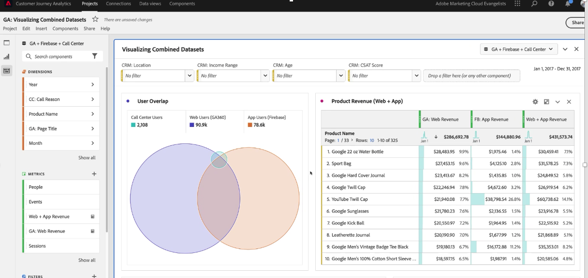

# Customer Journey Analytics での Google Analytics データに関するレポート

[Google Analytics データを Experience Platform と Customer Journey Analytics（CJA）に取り込んだ](/help/use-cases/ga-to-cja.md)ので、そのデータのレポートに役立つシナリオをいくつか示します。

## web データとアプリデータをデータセットとして組み合わせた視覚化

次のベン図は、Web サイトのユーザー数（Google Analytics データから）、モバイルアプリのユーザー数（Firebase データから）およびコールセンターからのユーザー数の重複を示しています。 また、web だけでなくモバイルアプリでも売れ筋商品を確認することができます。 計算指標を使用して、両方の売上高の合計を取得することもできます。 総売上高を見ると、トップ商品が物語るストーリーがいかに異なるかがわかります。統合データセットがなければ、「ツイルキャップ」がこれほど強力なパフォーマンスを発揮したことは知らなかったはずです。

## 通話理由の特定と通話量の削減

多くの通話を受けてきたことを確認するには、過去 2 か月間にコールセンターが費やした時間のトレンドを分析します。 増加傾向は簡単に確認できます。 コールセンターの担当者が電話に出るたびにお金がかかるので、これは気がかりです。 これは確実に収益に影響を与えます。

コールセンターへの電話が増加する主な理由を見てみましょう。 「クレジットカードの拒否」、「クレジットカードの削除依頼」、「製品の破損」が主な理由です。 これは、オンラインでのエクスペリエンスを改善する方法を既に示唆しています。 また、これらの問い合わせ理由のトレンドを分析し、全体的なスパイクに最も貢献した理由を確認することもできます。 「製品の破損」を理由とする顧客が、1 回の通話で 3 分以上費やしているのは興味深いことです。

詳しく調べて、どの製品がコールセンターへのほとんどの通話の原因となっているか、そして何人の顧客が通話を行ったかを確認しましょう。 バブルチャートでは、2 万人が電話をかけ、4 時間 30 分以上を費やし、33 枚の「メンズ半袖 T シャツ」を返品したことを示しています。

このインサイトを分類し、「通話理由」ディメンション内でドラッグすることで製品の返却理由を確認できます。 ご覧のとおり、この製品に関する電話の回数が非常に多いのは、「製品の破損」が原因です。 次のステップは、品質管理部門に連絡し、破損した T シャツを顧客が受け取った理由を確認することです。

どの web サイトのページがコールセンターでの着信電話の原因となったのかを見てみましょう。 これにより、パフォーマンスの低いエクスペリエンスが web サイト上のどこにあるかを把握し、プロダクトマネージャーがそれらの課題を解決するのに役立ちます。

これを行うには、

* 計算指標を使用して、コールセンターへの通話で終了したセッションのデータだけを取り出します。
* CJA の [Attribution IQ](https://experienceleague.adobe.com/docs/analytics-platform/using/cja-workspace/attribution/models.html?lang=ja#cja-workspace) の「パーティシペーション」モデルを使用します。

通話で終了するセッションに最も頻繁に関与しているページを簡単に確認できます。 「買い物かご」ページと「チェックアウト情報」ページが、ほとんどの通話を促進していることがわかります。 また、Firebase モバイルアプリデータも組み込んでいるので、通話の原因となったページエラーやアプリのクラッシュさえ確認できます。 これは、優れた web およびモバイルアプリエクスペリエンスを提供する場合に、非常に重要なデータポイントになります。

最後に、Analysis Workspace のコホートテーブルを使用すると、ユーザーが web サイトを訪問した後でコールセンターに電話をするまでに通常かかる時間を簡単に確認できます。 平均時間は 3 ～ 4 週間であることがわかります。

## 高度なマーケティングアトリビューションの使用

CJA を使用すると、クロスチャネルデータに対して高度なアトリビューションモデルを使用できます。 次の例では、売上高のラストタッチ、ファーストタッチ、U 字型、アルゴリズムアトリビューションを Google Analytics のチャネルグループディメンションに適用した結果の比較を確認できます。

計算指標を使用すると、そのアトリビューションを web の売上高やモバイルアプリの売上高に適用でき、さらには製品の返品数を削除することもできます。 その結果、マーケティングチャネルごとの真の純売上高を確認できます。

また、Attribution IQ を使用すると、データを簡単にフィルタリングできます。 複数のデバイスを使用しているユーザーなど、特定のユーザーの集合に対してのみアトリビューションを表示できます。

最後に、web やアプリの売上高に対する Google 広告コンテンツの効果を分析することもできます。 オンラインの Google 広告で促進されるモバイルアプリの売上高は、web からの売上高よりも多いことに気づくでしょう。 広告を web やアプリの売上高で並べ替えると、パフォーマンスが最も高い Google 広告の様相が非常に異なることがわかります。

CJA がなければ、オンライン広告がモバイルアプリで購入した製品に影響を与えていたことはわかりませんでした。 これで、Google Ads から得られるモバイルアプリの売上高は、web だけの売上高に比べて 5,000～14,000 ドル増加していることがわかります。

