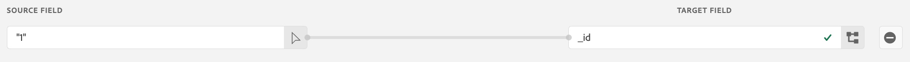

# Google Analytics 履歴データの Adobe Experience Platform への取り込み

このページでは、Google Analytics の履歴データをデータセットとして Adobe Experience Platform に取り込み、Customer Journey Analytics 内のデータビューでそのデータセットを参照できるようにする方法について重点的に説明します。このページの手順を、繰り返しデータセットの生成について説明した[ライブ Google Analytics の実装の設定](streaming.md)のページと組み合わせることができます。この履歴データセットを現在の実装環境のデータセットと組み合わせることで、Customer Journey Analytics に現在のデータとバックフィルされたデータの両方をシームレスに表示して確認できます。

## 前提条件

これらのタスクを遂行するには、次のアクセスと権限が必要です。

* Adobe Experience Platform へのアクセス
* Google Analytics（GA スタンダード版または GA 360）へのアクセス権限
* Customer Journey Analytics への[管理者アクセス権限](/help/admin/cja-access-control.md)

## BigQuery エクスポートの設定

ユニバーサルアナリティクスのプロパティのデータ構造は、Google Analytics 4 のプロパティのデータ構造とは異なります。データをエクスポートするプロパティタイプに基づいて、BigQuery エクスポートを設定します。

* [ユニバーサルアナリティクスのプロパティ用に BigQuery エクスポートを設定する](https://support.google.com/analytics/answer/3416092)
* [Google Analytics 4 プロパティ用に BigQuery エクスポートを設定する](https://support.google.com/analytics/answer/9823238)

### ユニバーサルアナリティクスのプロパティに関するその他の要件

>[!NOTE]
>
>この節は、ユニバーサルアナリティクスのプロパティにのみ適用されます。GA4 プロパティからエクスポートする場合は、[Google Cloud Platform へのデータのエクスポート](#export-gcp)の節に進んでください。

ユニバーサルアナリティクスのプロパティは、各レコードを、個々のイベントではなくユーザーのセッションとしてデータに保存します。ユニバーサルアナリティクスデータを Adobe Experience Platform と互換性のある形式に変換する SQL クエリが必要です。GA スキーマで `UNNEST` 関数を `hits` フィールドに適用し、BigQuery テーブルとして保存します。

>[!VIDEO](https://video.tv.adobe.com/v/332634)

```sql
SELECT
   *,
   timestamp_seconds(`visitStartTime` + hit.time) AS `timestamp` 
FROM
   (
      SELECT
         fullVisitorId,
         visitNumber,
         visitId,
         visitStartTime,
         trafficSource,
         socialEngagementType,
         channelGrouping,
         device,
         geoNetwork,
         hit 
      FROM
         `example_bq_table_*`,
         UNNEST(hits) AS hit 
   )
```

## Google Cloud Platform へのデータのエクスポート {#export-gcp}

Google Cloud Platform で、**エクスポート／GCS にエクスポート**&#x200B;に移動します。データが Google Cloud Storage に取り込まれたら、Adobe Experience Platform に取り込む準備が整いました。

## Google Cloud Storage から Experience Platform へのデータのインポート

1. Adobe Experience Platform で、左側の「**[!UICONTROL ソース]**」を選択します。
1. カタログの下で、「**[!UICONTROL Google Cloud Storage]**」オプションを見つけます。 「**[!UICONTROL データを追加]**」をクリックします。

>[!VIDEO](https://video.tv.adobe.com/v/332676)

>[!TIP]
>
>Google Analytics の履歴データとライブストリーミングデータの両方をインポートする場合は、必ず両方のデータセットで同じスキーマを使用してください。 [結合されたデータセット](/help/connections/combined-dataset.md)を使用して、データセットを CJA に結合できます。

選択した XDM スキーマを使用して、GA イベントデータを作成済みの既存データセットにマッピングしたり、データセットを作成したりできます。 スキーマを選択すると、Experience Platform は機械学習を適用して、Google Analytics データの各フィールドを自動的に [XDM スキーマ](https://experienceleague.adobe.com/docs/experience-platform/xdm/home.html?lang=ja#ui)に事前マッピングします。


フィールドから XDM スキーマへのマッピングが完了したら、このインポートを繰り返しスケジュールしたり、取り込みプロセス中にエラー検証を適用したりできます。 この検証により、インポートしたデータに関する問題が生じなくなります。

## 必須の XDM フィールド

データを正しく処理するために、Platform の特定の XDM フィールドには正しい形式が必要です。

* **`timestamp`**：Experience Platform スキーマ UI で特別な計算フィールドを作成します。 「**[!UICONTROL 計算フィールドを追加]**」をクリックして、次のように `timestamp` 文字列を `date` 関数に含めます。

   `date(timestamp, "yyyy-MM-dd HH:mm:ssZ")`

   計算フィールドをスキーマのタイムスタンプデータ構造に保存します。

   

* **`_id`**：このフィールドには値が必要です。どのような値でも構いません。 フィールドに「1」を追加できます。

   

## 次の手順

* Adobe Experience Platform にストリーミングする現在のデータがある場合は、[Google Analytics データのストリーミング設定](streaming.md)を参照してください。
* バックフィルしたデータのレポートを開始する場合は、[接続の作成](/help/connections/create-connection.md)を参照してください。
