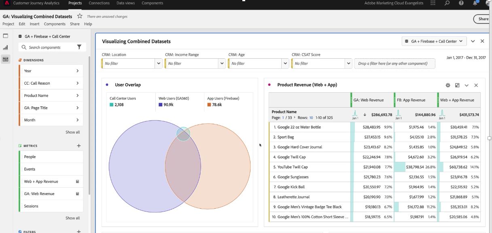

# Customer Journey Analytics での Google Analytics データに関するレポート

Customer Journey Analytics でデータを取得したら、そのデータをレポートする際に役立つシナリオを次の例で示します。

## web データとアプリデータをデータセットとして組み合わせた視覚化

次のベン図は、Web サイトのユーザー数（Google Analytics データから）、モバイルアプリのユーザー数（Firebase データから）およびコールセンターからのユーザー数の重複を示しています。 また、web だけでなくモバイルアプリでも売れ筋商品を確認することができます。 計算指標を使用して、両方の売上高の合計を取得することもできます。総売上高を見ると、トップ商品が物語るストーリーがいかに異なるかがわかります。統合データセットがなければ、「ツイルキャップ」がこれほど強力なパフォーマンスを発揮したことは知らなかったはずです。

## 通話理由の特定と通話量の削減

過去 2 か月間のコールセンターに費やした時間のトレンドを確認すると、通話量を判断できます。次の例では、過去 2 か月間のデータのトレンドを示しています。次の例では、組織のコストに影響を与える可能性のある増加トレンドを示しています。

「通話理由」ディメンションを使用すると、Web エクスペリエンスを改善する方法をヒントでき、ユーザーがそもそもを呼び出すのを防ぐことができます。 上記の例では、「製品を損傷」の平均通話時間は 1 回の通話あたり約 3 分であることを示しています。これにより、カスタマーエクスペリエンスを改善し、コールセンターのコストを削減するための正確な方法が組織に提供されます。

コールセンターへの通話の大部分を引き起こす製品と、その通話を行った顧客の数を表示できます。バブルチャートでは、2 万人が電話をかけ、4 時間 30 分以上を費やし、33 枚の「メンズ半袖 T シャツ」が返品されたことを示しています。

「通話理由」のディメンション分類を適用すると、この例では、「損傷した製品」ディメンション項目が示されます。次のステップは、品質管理部門に連絡し、破損した T シャツを顧客が受け取った理由を確認することです。

コールセンターへの通話につながった web サイトのページを確認できます。このレポートにより、最適ではないエクスペリエンスが web サイト上のどこにあるかを把握し、製品マネージャーが課題を解決するのに役立ちます。次の例では、パーティシペーションアトリビューションモデルを持つ計算指標を使用して、コールセンター呼び出しで終わったセッションのみにデータをフィルタリングします。

次の例では、「買い物かご」ページと「チェックアウト情報」ページが、ほとんどの通話を促進していることを示しています。

コホートテーブルを使用すると、ユーザーが web サイトにアクセスしてからコールセンターに通話するまでに通常かかる時間を確認できます。次の例では、この例のデータセットの平均時間が 3～4 週間であることを示しています。

## 高度なマーケティングアトリビューションの使用

CJA を使用すると、クロスチャネルデータに対して高度なアトリビューションモデルを使用できます。次の例では、売上高のラストタッチ、ファーストタッチ、U 字型、アルゴリズムアトリビューションを Google Analytics のチャネルグループディメンションに適用した結果の比較を確認できます。

計算指標を使用すると、そのアトリビューションを web の売上高やモバイルアプリの売上高に適用でき、さらには製品の返品数を削除することもできます。 その結果、マーケティングチャネルごとの真の純売上高を確認できます。

Attribution IQ では、データをフィルタリングすることもできます。複数のデバイスを使用しているユーザーなど、特定のユーザーの集合に対してのみアトリビューションを表示できます。

Web やアプリの売上高に対する Google 広告コンテンツの効果を分析することもできます。このデータセットの例では、web よりもオンラインの Google 広告によってモバイルアプリから多くの売上高を得ています。広告を web やアプリの売上高で並べ替えると、パフォーマンスが最も高い Google 広告の様相が異なることがわかります。

CJA でデータセットを組み合わせると、この例では、オンライン広告がモバイルアプリで購入した製品に何らかの影響を与えていることがわかります。次のビジュアライゼーションでは、Google 広告から得られるモバイルアプリの売上高が、web だけの売上高に比べて 14,000～15,000 ドル増加していることを示しています。

