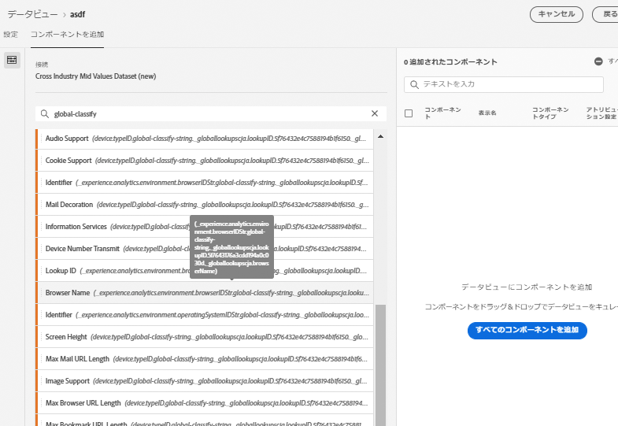
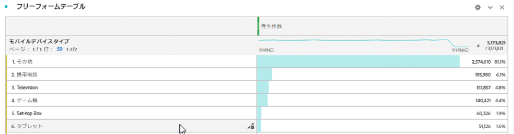

# データセットへのグローバル検索の追加

グローバル検索を使用すると、Customer Journey Analytics の機能が強化され、単体では役に立たないけれど他のデータと結合すると便利なディメンションや属性の一部を報告できるようになります。例としては、モバイルデバイスの属性、OS ディメンションとブラウザーディメンションの属性（ブラウザーのバージョン番号など）があります。「グローバル検索」は、検索データセット（従来の Adobe Analytics では分類と呼ばれています）と非常に似ていますが、グローバル検索は Experience Cloud の組織全体に適用できます。グローバル検索は、特定の XDM スキーマフィールドを含むすべてのイベントデータセットに自動的に適用されます（各フィールドについては、以下を参照してください）。
分類されるスキーマの各場所に、グローバル検索データセットがあります。グローバル検索データセットは、Analytics Source コネクタで使用することも、グローバル検索データセットを受け入れる他のカスタムデータセットで使用することもできます。

従来の Adobe Analytics では、これらのディメンションは単独で表示されます。一方、CJA では、データビューを作成する際に、これらのディメンションを積極的に含める必要があります。接続ワークフローで、グローバル検索のキーを持つデータセットとしてフラグ付けされたデータセットを選択すると、すべてのグローバル検索ディメンションがレポートに使用可能なものとしてデータビューの UI に含まれます。データビューワークフローでは、これらのグローバル検索ディメンションが含まれ、データビューに使用できます。すべての地域およびすべてのアカウントにおいて、検索ファイルは自動的に最新の状態に保たれ、使用可能になります。これらは、顧客に関連付けられた地域固有の組織に保存されます。

## Adobe Data Connector データセットでグローバル検索を使用する

グローバル検索データセットは、レポート時に自動的に適用されます。[Analytics Data Connector](https://experienceleague.adobe.com/docs/experience-platform/sources/connectors/adobe-applications/analytics.html?lang=ja-JP#connectors) を使用している場合、グローバル検索が提供されているディメンションを取り込むと、このグローバル検索が自動的に適用されます。イベントデータセットに [XDM](https://experienceleague.adobe.com/docs/experience-platform/xdm/home.html?lang=ja-JP) フィールドが含まれている場合は、それに対してグローバル検索を適用できます。

## 使用可能なグローバル検索フィールド

* `browser`
   * `browser`、`group_id`、`id`
* `browser_group`
   * `browser_group`、`id`
* `os`
   * `os`、`group_id`、`id`
* `os_group`
   * `os_group`、`id`
* `mobile_audio_support - multi`
* `mobile_color_depth`
* `mobile_cookie_support`
* `mobile_device_name`
* `mobile_device_number_transmit`
* `mobile_device_type`
* `mobile_drm - multi`
* `mobile_image_support - multi`
* `mobile_information_services`
* `mobile_java_vm - multi`
* `mobile_mail_decoration`
* `mobile_manufacturer`
* `mobile_max_bookmark_url_length`
* `mobile_max_browser_url_length`
* `mobile_max_mail_url_length`
* `mobile_net_protocols - multi`
* `mobile_os`
* `mobile_push_to_talk`
* `mobile_screen_height`
* `mobile_screen_size`
* `mobile_screen_width`
* `mobile_video_support - multi`

## グローバル検索ディメンションに関する報告

グローバル検索ディメンションについて報告するには、Customer Journey Analytics でデータビューを作成する際にそれらのディメンションを追加する必要があります。

これで、Workspace で検索データを確認できます。

