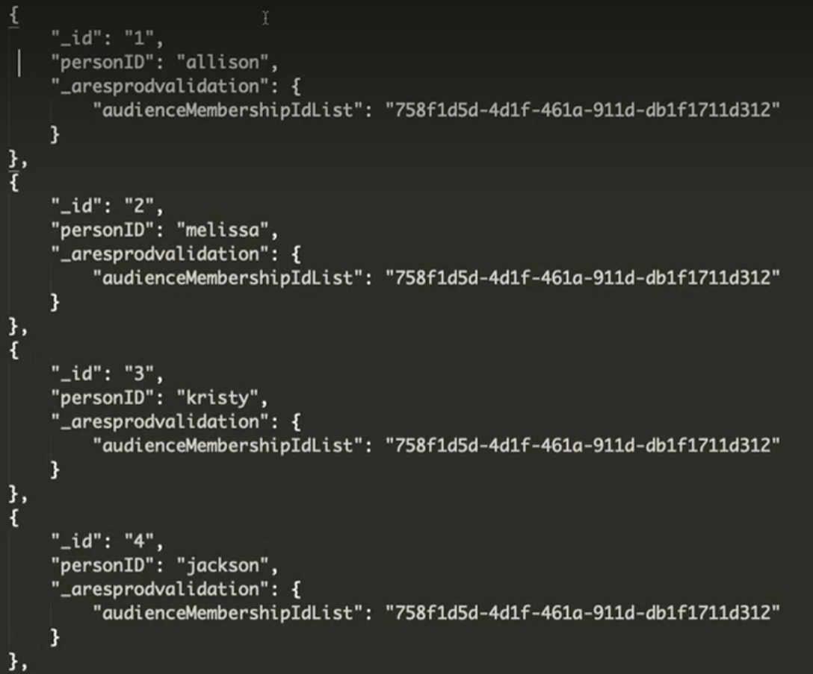

# AEP オーディエンスのCustomer Journey Analyticsへの取り込み (CJA)

(AEP ドキュメントマネージャーによると、Brandon、fyi、「統合プロファイル」は、「リアルタイム顧客プロファイル」の古い用語です。 AEP ドキュメントセット内に UP 上のドキュメントは見つかりません。)

この使用例では、Adobe Experience Platform(AEP) オーディエンスを CJA に導く中間的で手動の方法を調べます。 これらのオーディエンスは、AEP Segment Builder、Adobe Audience Manager、またはその他のツールで作成され、リアルタイム顧客プロファイル (RTCP) に保存されている場合があります。 オーディエンスは、ユーザー ID、プロファイル ID などのリストで構成されます。 CJA Workspace に取り込んで分析を行います。

## 前提条件

* Adobe Experience Platform(AEP)、特にリアルタイム顧客プロファイルへのアクセス
* Customer Journey Analyticsへのアクセス
* カスタムコードを記述する機能
* 他に何か。

## 手順 1:リアルタイム顧客プロファイルでのオーディエンスの選択 {#audience}

Adobe Experience Platform [リアルタイム顧客プロファイル](https://experienceleague.adobe.com/docs/experience-platform/profile/home.html?lang=ja) (RTCP) を使用すると、オンライン、オフライン、CRM、サードパーティなど、複数のチャネルからのデータを組み合わせることで、各顧客の全体像を確認できます。 RTCP には、様々なソースから来た可能性のあるオーディエンスが既に存在する可能性があります。 1 つ以上のオーディエンスを選択します。

## 手順 2:エクスポート用のプロファイル和集合データセットの作成

オーディエンスをデータセットに書き出して CJA に接続するには、スキーマがプロファイルのデータセットを作成する必要があります [和集合スキーマ](https://experienceleague.adobe.com/docs/experience-platform/profile/union-schemas/union-schema.html?lang=en#understanding-union-schemas).
和集合スキーマは、同じクラスを共有し、プロファイルに対して有効にされた複数のスキーマで構成されます。 和集合スキーマを使用すると、同じクラスを共有するスキーマ内に含まれるすべてのフィールドの統合を表示できます。 リアルタイム顧客プロファイルは、和集合スキーマを使用して、各顧客の全体像を作成します。

## 手順 3:API 呼び出しを使用してオーディエンスをデータセットに書き出す {#export}

オーディエンスを CJA に取り込む前に、AEP のデータセットに書き出す必要があります。 これは、Segmentation API、特に [書き出しジョブ API エンドポイント](https://experienceleague.adobe.com/docs/experience-platform/segmentation/api/export-jobs.html?lang=en). 書き出しジョブを作成し、その結果を手順 2 で作成したプロファイル和集合 AEP データセットに保存できます。

## 手順 4:書き出し出力の編集

オーディエンスの書き出しジョブを作成する場合、CJA でのレポートを実行するには、ユーザー ID とオーディエンス ID のみが必要です。 ただし、標準のエクスポートジョブには、より多くのデータが含まれているので、この出力を編集して不要なデータを削除する必要があります。

次に、プロファイル和集合データセットの書き出し出力の例を示します。 **前** 任意の編集：

以下のことに注意してください。

* オーディエンス ID は、 `segmentmembership.ups.xxxxxxxx-xxxx-xxxx-xxxx-xxxxxxxxxxxx.status`.
* ステータスは、「適合」または「入口」である必要がありますが、「出口」ではありません。 &quot;exited&quot;を&quot;blank&quot;に置き換えます。

これは、CJA に送信できるプロファイルデータセットの形式です。

存在する必要があるデータ要素を次に示します。

* `_aresprodvalidation`:組織 ID を参照します。 君のは違う。
* `personID`:この場合は、わかりやすい名前にします。
* `audienceMembershipIdList` 文字列フィールド：オーディエンス ID
* オーディエンスのわかりやすい名前を追加します (`audienceMembershipIdName`など )

   

## 手順 5:CJA でこのプロファイルデータセットへの接続を作成する

[接続の作成](/help/connections/create-connection.md)

## 手順 6:データビューの作成

追加 `audienceMembershipIdName` および `personID` をデータビューに追加します。

## 手順 7:Workspace のレポート

次の項目に関するレポートが作成されました： `audienceMembershipIdName` および `personID` Workspace で使用できます。
スクリーンショットは良いです。

手順は次のとおりです。

複数のオーディエンスのメンバーである人を扱う場合は、の手順を詳しく説明します。

