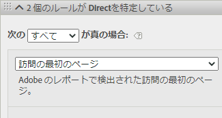
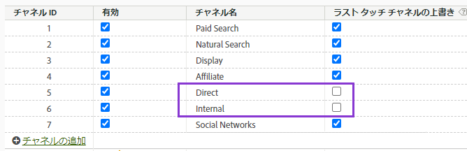
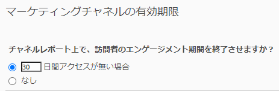

# Adobe Experience Platform でのマーケティングチャネルディメンションの使用

組織が [Analytics ソースコネクタ](https://experienceleague.adobe.com/docs/experience-platform/sources/connectors/adobe-applications/analytics.html?lang=ja) レポートスイートデータを CJA に取り込むには、CJA で接続を設定して、マーケティングチャネルディメンションに関するレポートを作成します。

## 前提条件

* レポートスイートデータは、既に [Analytics ソースコネクタ](https://experienceleague.adobe.com/docs/experience-platform/sources/connectors/adobe-applications/analytics.html). 他のデータソースはサポートされません。これは、マーケティングチャネルが Analytics レポートスイートの処理ルールに依存しているためです。
* マーケティングチャネルの処理ルールは、事前に設定しておく必要があります。従来の Analytics コンポーネントガイドの「[マーケティングチャネルの処理ルール](https://experienceleague.adobe.com/docs/analytics/components/marketing-channels/c-rules.html?lang=ja)」を参照してください。

## マーケティングチャネルのスキーマ要素

目的のレポートスイートに Analytics ソースコネクタを確立すると、XDM スキーマが作成されます。 このスキーマには、すべての Analytics ディメンションと指標が生データとして含まれています。この生データには、アトリビューションや永続性は含まれていません。代わりに、各イベントはマーケティングチャネルの処理ルールを確認し、最初に一致したルールを記録します。アトリビューションと永続性は、CJA でデータビューを作成する際に指定します。

1. [接続の作成](/help/connections/create-connection.md) Analytics ソースコネクタに基づくデータセットを含む
2. 次のディメンションを含む[データビューを作成](/help/data-views/create-dataview.md)します。
   * **`channel.typeAtSource`**：[マーケティングチャネル](https://experienceleague.adobe.com/docs/analytics/components/dimensions/marketing-channel.html?lang=ja)に相当します。
   * **`channel._id`**：[マーケティングチャネルの詳細](https://experienceleague.adobe.com/docs/analytics/components/dimensions/marketing-detail.html?lang=ja)に相当します。
3. 各ディメンションに、目的のアトリビューションモデルと永続性を指定します。ファーストタッチディメンションとラストタッチディメンションの両方が必要な場合は、各マーケティングチャネルのディメンションをコンポーネント領域に複数回ドラッグします。各ディメンションに、目的のアトリビューションモデルと永続性を指定します。ワークスペースで使いやすくするために、各ディメンションに表示名を付けることもお勧めします。
4. データビューを作成します。

これで、マーケティングチャネルのディメンションを Analysis Workspace で使用できるようになります。

## 処理とアーキテクチャの違い

>[!IMPORTANT]
>
>基本的に、レポートスイートデータと Platform データにはいくつかの違いがあります。Platform で適切なデータを容易に収集できるように、レポートスイートのマーケティングチャネルの処理ルールを調整しておくことを強くお勧めします。

>[!NOTE]
>
>Attribution IQ と Customer Journey Analytics に対するマーケティングチャネルの効果を最大限に高めるために、[改訂されたベストプラクティス](https://experienceleague.adobe.com/docs/analytics/components/marketing-channels/mchannel-best-practices.html?lang=ja)を公開しました。

マーケティングチャネルの設定の動作は、Platform データとレポートスイートデータで異なります。CJA 用のマーケティングチャネルを設定する際には、次の相違点を考慮してください。

* **訪問の最初のページ**：このルール条件は、複数のデフォルトのマーケティングチャネル定義に共通しています。この条件を含む処理ルールは、Platform では無視されます（同じルール内の他の条件は引き続き適用されます）。セッションは、データ収集時ではなくデータクエリ時に決定されます。このため、Platform でこの特定のルール条件の使用を回避できます。アドビでは、「訪問の最初のページ」条件を含むマーケティングチャネル処理ルールを再評価して、目標を達成する別のアプローチを選択することをお勧めします。

   

* **ラストタッチチャネルの上書き**：マーケティングチャネルマネージャでこのオプションを設定すると、通常は、特定のチャネルがラストタッチチャネルのクレジットを受け取るのを回避できます。Platform ではこの設定が無視されるため、「ダイレクト」や「内部」などの幅広いチャネルが、潜在的に好ましくない方法で指標の影響を受けます。「ラストタッチチャネルの上書き」をオフにしているチャネルを削除することをお勧めします。
   * マーケティングチャネルマネージャで「ダイレクト」マーケティングチャネルを削除して、そのチャネルの代わりに CJA の「値なし」ディメンション項目を使用できます。また、データビューを設定する際に、このディメンション項目の名前を「ダイレクト」に変更したり、ディメンション項目を完全に除外したりすることもできます。
   * また、マーケティングチャネルの分類を作成し、CJA で除外するチャネル以外に、それぞれの各値を分類することもできます。その後、データビューを作成する際に、`channel.typeAtSource` の代わりに、この分類ディメンションを使用できます。

   

* **マーケティングチャネルの期限**：このエンゲージメント期間の設定に従い、所定の時間何も操作がなければ、訪問者はレポートスイートデータで新しいファーストタッチチャネルを取得できます。Platform は独自のアトリビューション設定を使用するので、この設定は CJA では完全に無視されます。

   

## CJAと 従来の Analytics のデータの比較

Adobe Experience Platform のアーキテクチャは、従来の Analytics レポートスイートとは異なるので、結果が一致するかどうかは保証されません。ただし、次のヒントを参考にすると、データの比較が容易になります。

* 上記のアーキテクチャの違いが比較に影響しないことを確認します。これには、ラストタッチチャネルを上書きしないチャネルの削除や、訪問（セッション）の初回ヒットというルール条件の削除が含まれます。
* 接続で、従来の Analytics と同じレポートスイートが使用されていることを再確認します。CJA 接続に、独自のマーケティングチャネル処理ルールを持つ複数のレポートスイートが含まれる場合、従来の Analytics と比較するのは容易ではありません。 データを比較するには、各レポートスイートに対して個別に接続を作成する必要があります。
* 同じ日付範囲を比較すること、およびデータビューのタイムゾーン設定がレポートスイートのタイムゾーンと同じであることを確認してください。
* レポートスイートデータを表示する際には、カスタムアトリビューションモデルを使用します。例えば、デフォルト以外のアトリビューションモデルを使用する指標を含む[マーケティングチャネル](https://experienceleague.adobe.com/docs/analytics/components/dimensions/marketing-channel.html)ディメンションを使用します。デフォルトのディメンションである[ファーストタッチチャネル](https://experienceleague.adobe.com/docs/analytics/components/dimensions/first-touch-channel.html?lang=ja)または[ラストタッチチャネル](https://experienceleague.adobe.com/docs/analytics/components/dimensions/last-touch-channel.html?lang=ja)に対する比較は行わないことをお勧めします。これは、これらがレポートスイートで収集されるアトリビューションに依存しているためです。CJA は、レポートスイートのアトリビューションデータに依存しません。代わりに、CJA レポートを実行したときに計算されます。
* レポートスイートデータと Platform データのアーキテクチャの違いにより、一部の指標は適切に比較されません。例えば、訪問回数/セッション、訪問者数/人、回数/イベントなどは適切に比較されません。
