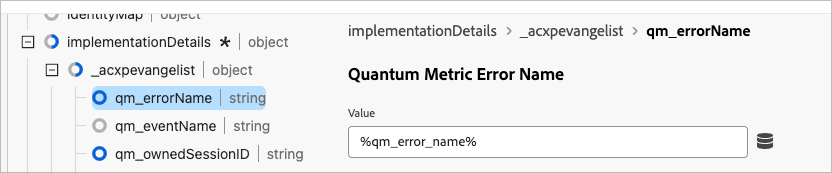

# Quantum Metric friction イベントのCustomer Journey Analyticsへの追加

Quantum Metric は、ページ読み込み速度の低下、ページ読み込みエラー、レイジクリック数などの摩擦イベントを収集します。 これらのイベントは、ユーザージャーニーで補完的なイベントとしてCustomer Journey Analyticsに渡すことができます。 この結合データを使用すると、ダウンストリーム指標に対する摩擦の影響をより深く理解できます。

## 前提条件：

このユースケースには次の 2 つの要件があります。

* Quantum Metric の **Dev Ops** パッケージを利用できる権限が必要です。
* Adobe Experience Platform Data Collection でタグを使用する必要があります。

## 手順 1:Quantum Metric の摩擦イベントに対応するスキーマフィールドの作成

このユースケースでは、データの送信先となる専用のスキーマフィールドが必要です。 このフィールドは、スキーマ内の任意の場所に作成し、好きな名前を付けることができます。 組織が名前や場所を好まない場合は、値の例を指定します。

1. [experience.adobe.com](https://experience.adobe.com) にログインします。
1. **[!UICONTROL データ収集]**/**[!UICONTROL スキーマ]** に移動します。
1. リストから目的のスキーマを選択します。
1. 目的のオブジェクトの横にある  アイコンを選択します。 例えば、`Implementation Details` の隣です。
1. 右側で、目的の [!UICONTROL &#x200B; 名前 &#x200B;] を入力します。 例：`qmErrorName`。
1. 目的の [!UICONTROL &#x200B; 表示名 &#x200B;] を入力します。 例：`Quantum Metric error name`。
1. [!UICONTROL &#x200B; タイプ &#x200B;] を **[!UICONTROL 文字列]** として選択します。
1. 「**[!UICONTROL 保存]**」を選択します。

## 手順 2:Quantum Metric タグ拡張機能を使用して摩擦イベントをキャプチャする

Quantum Metric データを含めるようにタグを設定する方法については、Adobe Experience Platform宛先ガイドの [Quantum Metric 拡張機能 ](https://experienceleague.adobe.com/en/docs/experience-platform/destinations/catalog/analytics/quantum-metric) を参照してください。 この拡張機能を使用すると、既存のデータセットに行が渡されます。

Adobe Experience Platform Data Collection のタグを使用して、摩擦イベントの名前を手動で設定し、XDM オブジェクトに含めて分析できるようにします。 これを行う 1 つの方法は、ルールのカスタムコードです。

```js
_satellite.setVar('qm_error_name','error rage click');
return true;
```

次に、動的に設定されるデータ要素を XDM オブジェクトに追加します。



## 手順 3:Customer Journey Analyticsのデータビューへの 1 つ以上のディメンションと指標の追加

既存のデータビューを編集し、セッション ID をCustomer Journey Analyticsで使用可能なディメンションとして追加します。

1. [experience.adobe.com](https://experience.adobe.com) にログインします。
1. Customer Journey Analyticsに移動し、必要に応じて **データ管理** から **[!UICONTROL データビュー]** を選択します。
1. 目的の既存のデータビューを選択します。
1. 左側の量子指標の摩擦イベントフィールドリストを見つけて、中央の指標領域にドラッグします。
1. 右側のペインで、「[ 値を含める/除外 ](/help/data-views/component-settings/include-exclude-values.md)」設定を、追跡する摩擦イベントに設定します。 複数の摩擦イベントを同じ指標に追加して、それらを組み合わせることができます。 また、摩擦イベントフィールドの別のコピーを指標領域にドラッグして、他の摩擦イベントを別の指標として追跡することもできます。
1. 必要なディメンションと指標をすべて作成したら、「**[!UICONTROL 保存]**」をクリックします。
1. エラーイベントの完全なリストについては、Quantum Metric のドキュメントを参照してください。 その他の質問がある場合は、Quantum Metric カスタマーサポート担当者にお問い合わせいただくか、[Quantum Metric カスタマーリクエストポータル ](https://community.quantummetric.com/s/public-support-page) を通じてリクエストを送信してください。

## 手順 4:Analysis Workspaceで、残りのデータと共にディメンションおよび指標を使用する

残りの訪問者データと共に収集された Quantum Metric friction event データを使用すると、Customer Journey Analyticsの他のディメンションや指標とまったく同じように使用できます。

1. [experience.adobe.com](https://experience.adobe.com) にログインします。
1. Customer Journey Analyticsに移動し、上部のメニューで **0&rbrace;Workspace&rbrace; を選択します。**
1. 既存のプロジェクトを選択するか、プロジェクトを作成します。
1. [ フリーフォームテーブル ](/help/analysis-workspace/visualizations/freeform-table/freeform-table.md) を作成します。
1. 分析に必要なディメンションと指標をWorkspace キャンバスにドラッグします。


考えられる分析のアイデアは次のとおりです。

* 摩擦イベントデータの経時的なトレンド
* フォールアウトまたはファネルビジュアライゼーションで、Customer Journey Analytics イベントを一部のステップとして追加し、Quantum Metric friction イベントを他のステップとして追加します。 このレポートを使用すると、訪問者が最も頻繁にトラブルに巻き込まれる場所を確認できます。
* 摩擦イベントが発生した訪問者のセグメントを作成および適用して、より深く分析できます
