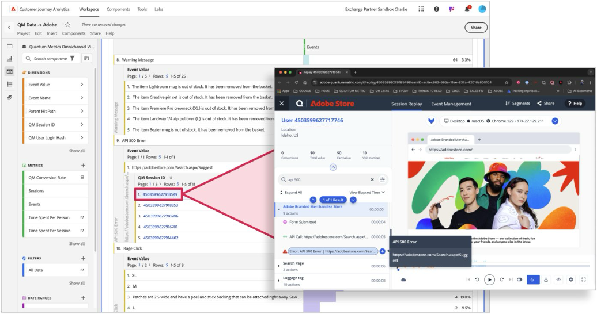

# 量子指標セッションをCustomer Journey Analyticsのデータにリプレイする場合

量子メトリックのセッション再生をCJAデータとリンクすることで、お客様は「何が」の背後にある「なぜ」をより深く理解できます。  Workspaceを使用してフリクションを伴うセッションを発見し、ハイパーリンクされたセッション IDをクリックしてQuantum Metricでのセッション再生を確認できます。  このデータにより、セッション内で行動を確認し、消費者の摩擦の要因をより深く理解することができます。  CJAでセッションを再生することで、エクスペリエンスにおける顧客の行動に関する重要なコンテキストを把握できます。

## 前提条件

これらの手順では、Adobe Experience Platform Data Collectionでタグを使用することを前提としています。 タグを使用しない場合は、これらのデータ収集方法をWeb SDKの手動実装に合わせて調整できます。

詳しくは、[量子指標タグ拡張機能](https://experienceleague.adobe.com/en/docs/experience-platform/destinations/catalog/analytics/quantum-metric)のドキュメントを参照してください。

## 手順1：量子指標セッション IDに対応するスキーマフィールドを作成する

このユースケースでは、データを送信するための専用のスキーマフィールドが必要です。 このフィールドをスキーマ内の任意の場所に作成し、好きな名前を付けることができます。 組織で名前または場所に関する環境設定がない場合は、値の例が提供されます。

1. [experience.adobe.com](https://experience.adobe.com)にログインします。
1. **[!UICONTROL データ収集]** > **[!UICONTROL スキーマ]**&#x200B;に移動します。
1. リストから目的のスキーマを選択します。
1. 目的のオブジェクトの横にある「を選択します。 例えば、`Implementation Details`の横です。
1. 右側に、必要な[!UICONTROL 名前]を入力します。 例：`qmSessionId`。
1. 目的の[!UICONTROL 表示名]を入力します。 例：`Quantum Metric session ID`。
1. [!UICONTROL Type]を&#x200B;**[!UICONTROL String]**&#x200B;として選択します。
1. 「**[!UICONTROL 保存]**」を選択します。

## ステップ 2：量子指標タグ拡張機能を使用して量子指標セッション IDをキャプチャする

Adobe Experience Platformに送信するデータに量子指標セッション IDを追加するには、次の手順に従います。

1. [experience.adobe.com](https://experience.adobe.com)にログインします。
1. **[!UICONTROL データ収集]** > **[!UICONTROL タグ]**&#x200B;に移動します。
1. 目的のタグプロパティを選択します。
1. 「**[!UICONTROL データ要素]**」を選択し、「**[!UICONTROL データ要素を追加]**」を選択します。
1. 次の設定を設定します。
   * **[!UICONTROL 名前]**: `Quantum Metric session ID`
   * **[!UICONTROL 拡張機能]**: [!UICONTROL Core]
   * **[!UICONTROL データ要素タイプ]**: [!UICONTROL &#x200B; カスタムコード &#x200B;]
1. 「**[!UICONTROL エディターを開く]**」ボタンを選択し、次のコードを貼り付けます。

   ```js
   // Check for the presence of the Quantum Metric session ID cookie
   const qmCookie = _satellite.cookie.get("QuantumMetricSessionID");
   if(qmCookie != null) return qmCookie;
   // If a cookie is not set, check local storage
   const qmLocalStorage = JSON.parse(localStorage.getItem("QM_S") || "{}");
   if (qmLocalStorage?.s != null) return qmLocalStorage.s;
   ```

1. 「**[!UICONTROL 保存]**」を選択します。

## 手順3：データ要素を目的のXDM スキーマフィールドにマッピングする

データ要素に目的の値を取得するロジックが含まれているので、データ要素をXDM オブジェクトにマッピングします。

1. タグプロパティ内で、**[!UICONTROL データ要素]**&#x200B;を選択し、XDM オブジェクトを格納するデータ要素を選択します。
1. このデータ要素の右側の列で、スキーマフィールドの作成時に確立されたパスに移動します。
1. パーセント記号で囲まれたデータ要素の名前に値を設定します。 例：`%Quantum Metric session ID%`。
1. 「**[!UICONTROL 保存]**」を選択します。
1. ライブラリを追加してから、実稼動環境に変更を公開します。

XDM オブジェクトが既に送信イベントアクション設定に含まれている場合、変更が公開されるとデータが表示されます。

>[!NOTE]
>
>Web SDKは、量子指標コードよりも高速に実行されることがあります。 この場合、セッション IDは後続のヒット時に送信されます。 訪問者がバウンスした場合、これらのインスタンスではセッション IDは収集されません。

## 手順3：量子指標セッション IDを使用可能なディメンションとして追加する

上記の変更が実装に公開されたら、既存のデータビューを編集して、セッション IDをCustomer Journey Analyticsで使用可能なディメンションとして追加します。

1. [experience.adobe.com](https://experience.adobe.com)にログインします。
1. Customer Journey Analyticsに移動し、上部メニューの「**[!UICONTROL データビュー]**」を選択します。
1. 目的の既存のデータビューを選択します。
1. 左側の「量子指標セッション ID」フィールドを見つけて、中央のディメンション領域にドラッグします。
1. 右側のペインで、[永続性](/help/data-views/component-settings/persistence.md)設定を`Session`に設定します。
1. 「**[!UICONTROL 保存]**」を選択します。

## 手順4：セッション ID ディメンションに対応するようにAnalysis Workspaceを設定する

Workspaceでフリーフォームテーブルを作成し、セッション ID値がQuantum Metricに直接リンクするように設定します。

1. [experience.adobe.com](https://experience.adobe.com)にログインします。
1. Customer Journey Analyticsに移動し、上部メニューの&#x200B;**[!UICONTROL Workspace]**&#x200B;を選択します。
1. 既存のプロジェクトを選択するか、プロジェクトを作成します。
1. [&#x200B; フリーフォームテーブル &#x200B;](/help/analysis-workspace/visualizations/freeform-table/freeform-table.md)を作成します。
1. セッション ID ディメンションをWorkspace キャンバスにドラッグします。
1. ディメンション列ヘッダーを右クリックし、**[!UICONTROL すべてのディメンション項目のハイパーリンクを作成]**&#x200B;を選択します。
1. **[!UICONTROL カスタム URLを作成]**&#x200B;を選択します。
1. 次のURL構造を貼り付けます。

   ```
   https://adobe.quantummetric.com/#/replay/cookie:$value
   ```

1. 「**[!UICONTROL 作成]**」をクリックします。

各セッション IDはクリック可能なリンクになっています。 Analysis Workspace ディメンション項目へのハイパーリンクの追加について詳しくは、[&#x200B; フリーフォームテーブルでのハイパーリンクの作成](/help/analysis-workspace/visualizations/freeform-table/freeform-table-hyperlinks.md)を参照してください。



## ステップ 5: Customer Journey Analyticsからセッションを表示する

セッションのリプレイを調べたい興味深いセグメントを見つけたら、セッション ID リンクを含むパネルに適用できます。 このテーブルは、そのセグメント内のすべてのセッションを返し、いずれかのセッションをクリックすると、量子指標をさらに調べることができます。

詳しくは、[Quantum Metricに関するセッション再生](https://www.quantummetric.com/resources/ebook/the-enterprise-guide-to-session-replay)のエンタープライズガイドを参照してください。 また、Quantum Metric カスタマーサポート担当者にお問い合わせいただくか、[Quantum Metric カスタマーリクエストポータル &#x200B;](https://community.quantummetric.com/s/public-support-page)からリクエストを送信することもできます。
